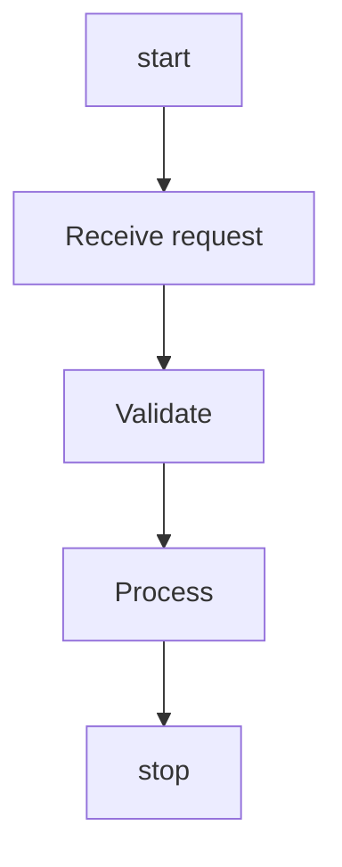

# Coverage Expansion — Wave 1: PlantUML Implementation Plan

> **For agentic workers:** REQUIRED SUB-SKILL: Use superpowers:subagent-driven-development (recommended) or superpowers:executing-plans to implement this plan task-by-task. Steps use checkbox (`- [ ]`) syntax for tracking.

**Goal:** Close [COVERAGE.md](../../../COVERAGE.md) backlog item #1 — add five
new PlantUML idioms (`activity`, `entity`/IE ER, `useCase`, `object`,
`component`) end-to-end (parser + mapper + exporter + round-trip
fixtures) and wire them into `PlantUMLImporter` / `PlantUMLExporter`.
None introduces a new DiagramKit payload — each projects onto an existing
typed payload (flowchart / erDiagram / classDiagram / architecture).

After Wave 1, the PlantUML import and export columns in
[COVERAGE.md](../../../COVERAGE.md) move from `6/28` to `11/28`. The
PlantUML × sequenceDiagram `⚠` cell is **not** touched in this wave (it
stays a documented partial per the spec).

**Architecture:** Existing per-family subdirectory convention strictly
followed:
`Sources/DiagramKitPlantUML/{Activity,ER,UseCase,Object,Component}/{<F>AST.swift,<F>Parser.swift,<F>Mapper.swift}`
plus one exporter file per family under
`Sources/DiagramKitPlantUML/Exporter/PlantUML<F>Exporter.swift`. Each
exporter file contains an `enum PlantUML<F>Export` with
`static func emit(_:) throws -> DiagramExportResult` (used by the
umbrella's switch dispatch) **and** a public
`struct PlantUML<F>Exporter: DiagramExporter` wrapper (used by
round-trip cells when the umbrella's default-idiom dispatch would route
elsewhere — specifically for `useCase` and `object`).

`PlantUMLFamilyProbe.swift` gains five new body probes and the existing
`isPlantUMLStateBody` is **split** so activity markers
(`start`/`stop`/`:text;`/`partition`) move into the new
`isPlantUMLActivityBody`. The cascade in `PlantUMLImporter.swift:36-129`
gains five new branches in narrow-before-broad order. The
`PlantUMLExporter.swift` switch gains three new default-dispatch cases
(`.flowchart` → activity, `.erDiagram` → ER, `.architecture` →
component); `useCase` and `object` are reachable only via their
`DiagramExporter`-conforming struct wrappers.

**Tech Stack:** Swift 6, SwiftPM,
[swift-testing](https://github.com/swiftlang/swift-testing) for new
tests (XCTest for `CorpusRoundTripTests`),
`DiagramKitTestSupport.RoundTripHarness`,
`Scripts/check-diagnostic-discipline.sh`,
`Scripts/check-file-sizes.sh`,
`Scripts/check-sendable-annotations.sh`,
`Scripts/strict-concurrency-check.sh`,
`Scripts/linux-check.sh`.

**Source spec:**
[docs/superpowers/specs/2026-05-19-coverage-expansion-design.md](../specs/2026-05-19-coverage-expansion-design.md)
(commit `c99bbb7`).

**Companion wave plans:**
- [Wave 2 — D2 + DOT](2026-05-19-coverage-expansion-wave-2-d2-dot.md) — runs independently.
- [Wave 3 — Structurizr](2026-05-19-coverage-expansion-wave-3-structurizr.md) — runs independently.

**Style template:**
[2026-05-19-mermaid-exporter-wave-3.md](2026-05-19-mermaid-exporter-wave-3.md)
— mirror its task structure, code-snippet density, and commit cadence.

---

## Lessons Folded In Up-Front

These are baked into every task below; do not relearn them.

1. **Probe order matters and `isPlantUMLStateBody` already accepts
   activity markers.** `Sources/DiagramKitPlantUML/PlantUMLFamilyProbe.swift:27-40`
   currently returns `true` for `start`/`stop`/`:text;`/`partition` —
   which means an activity diagram routes to `PlantUMLStateParser`
   today and gets parsed incorrectly. Task 1 **moves those markers** out
   of `isPlantUMLStateBody` into a new `isPlantUMLActivityBody`, and
   reorders the cascade so activity probes run **before** state. Do not
   skip Task 1; later tasks assume the probe is already split.
2. **Default-dispatch ambiguity for shared payloads.** The flowchart
   payload can be emitted as activity OR useCase syntax. The
   classDiagram payload can be emitted as class OR object syntax. The
   umbrella `PlantUMLExporter` can only pick one default per payload —
   we pick `activity` and `class`. The alternative idioms (`useCase`,
   `object`) are reachable through their public
   `DiagramExporter`-conforming struct wrappers. Round-trip cells for
   `plantuml-usecase` and `plantuml-object` are constructed using those
   wrappers, **not** `PlantUMLExporter`, so the source format is
   preserved across the round-trip.
3. **Diagnostic discipline.** Only typed factories
   (`.lossyTransform(_:message:)`, `.featureDropped(_:message:)`,
   `.informational(_:message:)`). Raw
   `DiagramDiagnostic(severity:message:)` is deprecated and
   `Scripts/check-diagnostic-discipline.sh` enforces it. The spec's
   per-wave category mapping table is authoritative — match it exactly.
4. **No new `DiagnosticCategory` cases in Wave 1.** All categories used
   here already exist (`.subgraphFlatten`, `.styleDrop`,
   `.shapeDowngrade`). Wave 2 adds three new categories; Wave 1 does
   not.
5. **Test filter form.** Always use `swift test --filter
   <ExactSuiteName>`. Substring filters that match parameterized
   `CorpusSnapshotTests` cases hang. Each task's run command names the
   exact `SameFormatRoundTripTests/<methodName>` or
   `CrossFormatRoundTripTests/<methodName>` path.
6. **Commit-by-commit on `main`.** No branches or worktrees. Each task
   ends with a commit. `git add` specific paths only; never `git add .`
   / `git add -A`.
7. **SourceKit lag is normal.** When you add a new file to a module,
   IDE diagnostics like "Cannot find X in scope" persist briefly.
   `swift build --target DiagramKitPlantUML` is the source of truth. Do
   not chase ghost errors.
8. **No corpus growth.** All new tests live under
   `Tests/DiagramKitTests/RoundTrip/Resources/roundtrip/`. The
   `Sources/DiagramKitSample/Resources/test-diagrams.json` corpus stays
   at 424 entries. Snapshot baselines (437 SVG + 437 image + 424 ASCII)
   stay frozen.
9. **Linux portability.** New files compile on Linux. No
   `BMColor`/`BMFont`/CoreText reach. Quick local sanity:
   `Scripts/linux-check.sh` (skipped if Docker/Podman unavailable;
   record as skipped per `CLAUDE.md` "Linux Portability" section).
10. **File-size policy.** 500-line warn / 1000-line error per
    `Scripts/check-file-sizes.sh`. The five new parsers will each land
    well under the warn line if you stay focused on idiom-specific
    parsing and lean on `Sources/DiagramKitModel/` for shared types.

---

## Family → Payload Cheat Sheet

Field names below come from real source inspection
(`Sources/DiagramKitModel/`). Use them verbatim — paraphrasing breaks
the diff arms.

| Family | Source idiom | Target payload | Loss category | `RoundTripLossKind` |
|---|---|---|---|---|
| activity | `start` / `:label;` / `stop` / `partition "x" { ... }` / `if ... endif` | `.flowchart(FlowchartDiagram)` | `.subgraphFlatten` (partition lost) | `.subgraphFlatten` |
| ER | `entity Foo { ... }` + IE arrows `||--o{` | `.erDiagram(ParsedErDiagram)` | none (✓) | n/a |
| useCase | `(usecase)` + `:actor:` + `as`-aliases | `.flowchart(FlowchartDiagram)` | `.styleDrop` (actor-vs-usecase styling lost) | `.styleDrop` |
| object | `object Foo { ... }` + `Foo *-- Bar` | `.classDiagram(ClassDiagram)` | `.shapeDowngrade` (object instance → class type) | `.shapeDowngrade` |
| component | `[component]` + `interface Foo` + `[Foo] --> Bar` | `.architecture(ArchitectureDiagram)` | `.styleDrop` (interface-vs-component visual lost) | `.styleDrop` |

(Where multiple typed losses can occur in one diagram, each occurrence
emits its own diagnostic. The harness's `diagnosticsCover(loss:in:)`
checks `DiagnosticCategory` equality.)

---

## Architecture: PlantUMLExporter Dispatch After Wave 1

Before Wave 1 (`PlantUMLExporter.swift:29-46`):

```swift
public func export(_ document: DiagramDocument) throws -> DiagramExportResult {
    switch document.payload {
    case .sequenceDiagram(let model): return try PlantUMLSequenceExport.emit(model)
    case .classDiagram(let model):    return try PlantUMLClassExport.emit(model)
    case .stateDiagram(let graph):    return try PlantUMLStateExport.emit(graph)
    case .mindmap(let model):         return try PlantUMLMindmapExport.emit(model)
    case .gantt(let model):           return try PlantUMLGanttExport.emit(model)
    case .c4(let model):              return try PlantUMLC4Export.emit(model)
    default:
        return .unsupportedDiagram(formatName: name, type: document.type)
    }
}
```

After Wave 1:

```swift
public func export(_ document: DiagramDocument) throws -> DiagramExportResult {
    switch document.payload {
    case .sequenceDiagram(let model): return try PlantUMLSequenceExport.emit(model)
    case .classDiagram(let model):    return try PlantUMLClassExport.emit(model)
    case .stateDiagram(let graph):    return try PlantUMLStateExport.emit(graph)
    case .mindmap(let model):         return try PlantUMLMindmapExport.emit(model)
    case .gantt(let model):           return try PlantUMLGanttExport.emit(model)
    case .c4(let model):              return try PlantUMLC4Export.emit(model)
    case .flowchart(let model):       return try PlantUMLActivityExport.emit(model)   // NEW (default flowchart idiom)
    case .erDiagram(let model):       return try PlantUMLERExport.emit(model)         // NEW
    case .architecture(let model):    return try PlantUMLComponentExport.emit(model)  // NEW
    default:
        return .unsupportedDiagram(formatName: name, type: document.type)
    }
}
```

`PlantUMLUseCaseExporter` (flowchart → useCase syntax) and
`PlantUMLObjectExporter` (classDiagram → object syntax) are reachable
**only** via their public struct wrappers. They are not added to the
switch above.

`PlantUMLImporter.supportedDiagramTypes` gains `.stateDiagram` (already
present), and adds `.flowchart`, `.erDiagram`, `.architecture` — the
`.classDiagram` entry is already there from the existing Class
importer.

---

## Task Ordering Rationale

The order is **not** by spec impact — it is by dependency:

- **Task 1 (probe disambiguation)** must come first. Until activity
  markers move out of `isPlantUMLStateBody`, an activity body parses as
  state and Task 2's tests cannot pass.
- **Tasks 2–6 are one family each**, each fully end-to-end (AST →
  Parser → Mapper → Exporter + struct wrapper if needed → wire into
  umbrella → same-format round-trip fixture). Family order within
  Tasks 2–6 minimises cascade-reordering churn:
  - Task 2: Activity (already routed by Task 1, no further cascade work).
  - Task 3: ER (narrowest of the remaining four; `entity` keyword is
    unambiguous).
  - Task 4: UseCase (narrow probe via `(usecase)` token + `:actor:`).
  - Task 5: Object (`object X { ... }` block; narrower than class
    syntax but shares enough with class to need ordering before Class).
  - Task 6: Component (`[component]` token + `interface` keyword).
- **Task 7** wires same-format round-trip cells into the test harness
  (one cell per new family; the cells reference the exporters from
  Tasks 2–6).
- **Task 8** wires cross-format round-trip cells (Mermaid ↔ PlantUML
  for each of the new mappings).
- **Task 9** is the closer — COVERAGE.md, BASELINES.md, smoke gate.

---

## Task 1: Probe Disambiguation + Cascade Skeleton

**Files:**
- Modify: `Sources/DiagramKitPlantUML/PlantUMLFamilyProbe.swift:27-40` (split activity markers out of state probe)
- Modify: `Sources/DiagramKitPlantUML/PlantUMLFamilyProbe.swift` (add four new probes)
- Modify: `Sources/DiagramKitPlantUML/PlantUMLImporter.swift:21-28` (extend `supportedDiagramTypes`)
- Modify: `Sources/DiagramKitPlantUML/PlantUMLImporter.swift:36-129` (extend cascade with five new branches that THROW `.notYetImplemented` for now — body parsers are wired in Tasks 2–6)
- Create: `Tests/DiagramKitTests/PlantUML/PlantUMLProbeDisambiguationTests.swift`

This task adds the probe and cascade infrastructure but does **not**
implement any new body parser. Tasks 2–6 each replace the
`.notYetImplemented` branch for one family with a real parser+mapper
call.

- [ ] **Step 1.1: Write a failing probe test**

Create `Tests/DiagramKitTests/PlantUML/PlantUMLProbeDisambiguationTests.swift`:

```swift
import Testing
@testable import DiagramKitPlantUML

@Suite("PlantUMLProbeDisambiguationTests")
struct PlantUMLProbeDisambiguationTests {

    @Test func activityBodyDoesNotMatchStateProbe() {
        let body = """
        start
        :Step 1;
        :Step 2;
        stop
        """
        #expect(isPlantUMLActivityBody(body))
        #expect(!isPlantUMLStateBody(body))
    }

    @Test func stateBodyDoesNotMatchActivityProbe() {
        let body = """
        [*] --> Idle
        Idle --> Active : trigger
        Active --> [*]
        """
        #expect(isPlantUMLStateBody(body))
        #expect(!isPlantUMLActivityBody(body))
    }

    @Test func partitionRoutesToActivity() {
        // Modern PlantUML `partition` is activity-only (swimlane).
        let body = """
        start
        partition Lane1 {
          :Step 1;
        }
        stop
        """
        #expect(isPlantUMLActivityBody(body))
        #expect(!isPlantUMLStateBody(body))
    }

    @Test func erBodyMatchesERProbe() {
        let body = """
        entity Customer {
          * id : number
          name : text
        }
        Customer ||--o{ Order
        """
        #expect(isPlantUMLERBody(body))
    }

    @Test func useCaseBodyMatchesUseCaseProbe() {
        let body = """
        :User: as user
        (Login) as UC1
        user --> UC1
        """
        #expect(isPlantUMLUseCaseBody(body))
    }

    @Test func objectBodyMatchesObjectProbe() {
        let body = """
        object foo
        object bar
        foo --> bar
        """
        #expect(isPlantUMLObjectBody(body))
        #expect(!isPlantUMLClassBody(body))
    }

    @Test func componentBodyMatchesComponentProbe() {
        let body = """
        [Web] --> [API]
        interface HTTP
        [API] --> HTTP
        """
        #expect(isPlantUMLComponentBody(body))
    }
}
```

- [ ] **Step 1.2: Run the test to confirm FAIL**

```bash
swift test --filter PlantUMLProbeDisambiguationTests
```
Expected: FAIL with "Cannot find 'isPlantUMLActivityBody' in scope" (and
the same for ER / useCase / object / component probes).

- [ ] **Step 1.3: Split `isPlantUMLStateBody`**

In `Sources/DiagramKitPlantUML/PlantUMLFamilyProbe.swift`, replace the
current `isPlantUMLStateBody` (lines 27-40) with the strict state
version below, AND add the five new probe functions:

```swift
/// Returns `true` when body contains pure state diagram syntax.
/// Activity markers (start/stop/:text;/partition) are NOT matched here —
/// they belong to `isPlantUMLActivityBody`. Activity must be probed
/// BEFORE state in the cascade.
public func isPlantUMLStateBody(_ body: String) -> Bool {
    let lines = body.split(separator: "\n", omittingEmptySubsequences: true)
    for line in lines {
        let trimmed = line.trimmingCharacters(in: .whitespaces)
        if trimmed.hasPrefix("state ") { return true }
        if trimmed.hasPrefix("[*]") { return true }
        // State transitions like `S1 --> S2` are checked elsewhere — `state`
        // keyword or `[*]` pseudostate is the disambiguator from activity.
    }
    return false
}

/// Returns `true` when body contains activity syntax.
/// Must be probed BEFORE `isPlantUMLStateBody` in the cascade.
public func isPlantUMLActivityBody(_ body: String) -> Bool {
    let lines = body.split(separator: "\n", omittingEmptySubsequences: true)
    for line in lines {
        let trimmed = line.trimmingCharacters(in: .whitespaces)
        if trimmed == "start" || trimmed == "stop" || trimmed == "end" { return true }
        if trimmed.hasPrefix("partition ") { return true }
        // Activity action syntax: `:text;`
        if trimmed.hasPrefix(":") && trimmed.hasSuffix(";") { return true }
        // Activity conditional: `if (cond) then ... endif`
        if trimmed.hasPrefix("if ") && trimmed.contains("then") { return true }
    }
    return false
}

/// Returns `true` when body contains PlantUML Information Engineering ER syntax.
public func isPlantUMLERBody(_ body: String) -> Bool {
    let lines = body.split(separator: "\n", omittingEmptySubsequences: true)
    var hasEntity = false
    var hasIEArrow = false
    for line in lines {
        let trimmed = line.trimmingCharacters(in: .whitespaces)
        if trimmed.hasPrefix("entity ") { hasEntity = true }
        // IE arrows: `||--o{`, `}o--||`, `||--||`, `||..o{`, etc.
        if trimmed.range(
            of: #"[|}o]+(--|\.\.)[|{o]+"#,
            options: .regularExpression
        ) != nil {
            hasIEArrow = true
        }
    }
    return hasEntity || hasIEArrow
}

/// Returns `true` when body contains PlantUML use-case syntax.
public func isPlantUMLUseCaseBody(_ body: String) -> Bool {
    let lines = body.split(separator: "\n", omittingEmptySubsequences: true)
    for line in lines {
        let trimmed = line.trimmingCharacters(in: .whitespaces)
        // `(Use Case Name)` token at line start (alias form) OR
        // `:Actor Name:` at line start.
        if trimmed.hasPrefix("(") && trimmed.contains(")") { return true }
        if trimmed.hasPrefix(":") && trimmed.contains(":") && !trimmed.hasSuffix(";") {
            // Distinguishes `:Actor:` (use-case) from `:label;` (activity).
            return true
        }
        if trimmed.hasPrefix("usecase ") || trimmed.hasPrefix("actor ") {
            return true
        }
    }
    return false
}

/// Returns `true` when body contains PlantUML object diagram syntax.
public func isPlantUMLObjectBody(_ body: String) -> Bool {
    let lines = body.split(separator: "\n", omittingEmptySubsequences: true)
    for line in lines {
        let trimmed = line.trimmingCharacters(in: .whitespaces)
        if trimmed.hasPrefix("object ") { return true }
    }
    return false
}

/// Returns `true` when body contains PlantUML component diagram syntax.
public func isPlantUMLComponentBody(_ body: String) -> Bool {
    let lines = body.split(separator: "\n", omittingEmptySubsequences: true)
    var hasComponentToken = false
    var hasInterface = false
    for line in lines {
        let trimmed = line.trimmingCharacters(in: .whitespaces)
        // `[Component]` bracket token or `component "X" as Y` declaration.
        if trimmed.contains("[") && trimmed.contains("]") { hasComponentToken = true }
        if trimmed.hasPrefix("component ") { hasComponentToken = true }
        if trimmed.hasPrefix("interface ") { hasInterface = true }
    }
    return hasComponentToken || hasInterface
}
```

- [ ] **Step 1.4: Extend the importer cascade with `.notYetImplemented` branches**

In `Sources/DiagramKitPlantUML/PlantUMLImporter.swift`, replace the
cascade body (lines 47-129) so that activity / ER / useCase / object /
component each route to a body-parser call that **does not yet exist**.
Use `fatalError("Wave 1 task N implements this")` placeholders for
the body-parser calls — they will be replaced one at a time in Tasks
2–6. The intent is that the cascade structure is committed in this
task; subsequent tasks each fill in exactly one branch.

Replace lines 47-129 with:

```swift
        // Family routing order — narrow markers first so generic `@startuml`
        // sources only fall through to Sequence after explicit families have
        // had a chance to claim them:
        //   1. Gantt   (`@startgantt`)
        //   2. Mindmap (`@startmindmap` / `@startwbs`)
        //   3. C4      (C4-specific keywords inside `@startuml`)
        //   4. Activity (`start`/`stop`/`:text;`/`partition`)
        //   5. State   (`state` keyword / `[*]` pseudostate)
        //   6. ER      (`entity` keyword / IE arrows `||--o{`)
        //   7. UseCase (`(usecase)` token / `:actor:` token / `usecase` / `actor` keywords)
        //   8. Object  (`object X` declaration)
        //   9. Component (`[component]` token / `interface` keyword)
        //  10. Class   (class shape syntax)
        //  11. Sequence (fallback)
        if startKind == "gantt" {
            let ast = PlantUMLGanttParser().parse(body)
            let (model, diagnostics) = PlantUMLGanttMapper().map(ast)
            return DiagramImportResult(
                document: DiagramDocument(payload: .gantt(model)),
                diagnostics: diagnostics
            )
        }
        if startKind == "mindmap" || startKind == "wbs" {
            let tree = PlantUMLMindmapParser().parse(body)
            let (model, diagnostics) = PlantUMLMindmapMapper().map(tree)
            return DiagramImportResult(
                document: DiagramDocument(payload: .mindmap(model)),
                diagnostics: diagnostics
            )
        }
        if isPlantUMLC4Body(body) {
            let ast = PlantUMLC4Parser().parse(body)
            let (model, diagnostics) = PlantUMLC4Mapper().map(ast)
            return DiagramImportResult(
                document: DiagramDocument(payload: .c4(model)),
                diagnostics: diagnostics
            )
        }
        if isPlantUMLActivityBody(body) {
            fatalError("Wave 1 Task 2 implements PlantUMLActivityParser")
        }
        if isPlantUMLStateBody(body) {
            let ast = PlantUMLStateParser().parse(body)
            let (graph, diagnostics) = PlantUMLStateMapper().map(ast)
            return DiagramImportResult(
                document: DiagramDocument(payload: .stateDiagram(graph)),
                diagnostics: diagnostics
            )
        }
        if isPlantUMLERBody(body) {
            fatalError("Wave 1 Task 3 implements PlantUMLERParser")
        }
        if isPlantUMLUseCaseBody(body) {
            fatalError("Wave 1 Task 4 implements PlantUMLUseCaseParser")
        }
        if isPlantUMLObjectBody(body) {
            fatalError("Wave 1 Task 5 implements PlantUMLObjectParser")
        }
        if isPlantUMLComponentBody(body) {
            fatalError("Wave 1 Task 6 implements PlantUMLComponentParser")
        }
        if isPlantUMLClassBody(body) {
            let ast = PlantUMLClassParser().parse(body)
            let (model, diagnostics) = PlantUMLClassMapper().map(ast)
            return DiagramImportResult(
                document: DiagramDocument(payload: .classDiagram(model)),
                diagnostics: diagnostics
            )
        }
        if isPlantUMLSequenceBody(body) {
            let parser = PlantUMLSequenceParser()
            let ast = parser.parse(body)
            let mapper = PlantUMLSequenceMapper()
            let (diagram, mapDiagnostics) = mapper.map(ast)
            let payload = DiagramPayload.sequenceDiagram(diagram)
            let document = DiagramDocument(payload: payload)
            return DiagramImportResult(document: document, diagnostics: mapDiagnostics)
        }
        throw DiagramError.malformedSource(
            message: "PlantUML body did not match any supported family probe"
        )
```

- [ ] **Step 1.5: Extend `supportedDiagramTypes`**

Replace `Sources/DiagramKitPlantUML/PlantUMLImporter.swift:21-28`:

```swift
    public let supportedDiagramTypes: Set<DiagramType> = [
        .sequenceDiagram,
        .classDiagram,
        .stateDiagram,
        .mindmap,
        .gantt,
        .c4,
        .flowchart,     // NEW (activity + useCase land here)
        .erDiagram,     // NEW
        .architecture,  // NEW (component lands here)
    ]
```

- [ ] **Step 1.6: Run the probe test to confirm PASS**

```bash
swift test --filter PlantUMLProbeDisambiguationTests
```
Expected: PASS for all eight `@Test`s.

- [ ] **Step 1.7: Run discipline gates**

```bash
Scripts/check-file-sizes.sh
Scripts/check-diagnostic-discipline.sh
```
Expected: both exit 0. The probe file grows by ~60 lines; still well
under the warn line.

- [ ] **Step 1.8: Commit**

```bash
git add Sources/DiagramKitPlantUML/PlantUMLFamilyProbe.swift \
        Sources/DiagramKitPlantUML/PlantUMLImporter.swift \
        Tests/DiagramKitTests/PlantUML/PlantUMLProbeDisambiguationTests.swift

git commit -m "$(cat <<'EOF'
Wave 1 Task 1 — PlantUML probe disambiguation + cascade skeleton

Split `isPlantUMLStateBody` into pure-state + new
`isPlantUMLActivityBody`. The state probe previously accepted
`start`/`stop`/`:text;`/`partition`, routing activity diagrams to
`PlantUMLStateParser` and producing malformed state graphs. Activity
markers now live in their own probe and are checked before state in
the cascade.

Add four new probes (`isPlantUMLERBody`, `isPlantUMLUseCaseBody`,
`isPlantUMLObjectBody`, `isPlantUMLComponentBody`) and five new
cascade branches in `PlantUMLImporter.swift`. The new branches
currently `fatalError(…)` — Wave 1 Tasks 2–6 each implement one of
them.

Co-Authored-By: Claude Opus 4.7 (1M context) <noreply@anthropic.com>
EOF
)"
```

---

## Task 2: PlantUML Activity → Flowchart

**Files:**
- Create: `Sources/DiagramKitPlantUML/Activity/PlantUMLActivityAST.swift`
- Create: `Sources/DiagramKitPlantUML/Activity/PlantUMLActivityParser.swift`
- Create: `Sources/DiagramKitPlantUML/Activity/PlantUMLActivityMapper.swift`
- Create: `Sources/DiagramKitPlantUML/Exporter/PlantUMLActivityExporter.swift`
- Modify: `Sources/DiagramKitPlantUML/PlantUMLImporter.swift` (replace Task 1's `fatalError` with parser call)
- Modify: `Sources/DiagramKitPlantUML/Exporter/PlantUMLExporter.swift` (add `.flowchart` case)
- Create: `Tests/DiagramKitTests/PlantUML/Activity/PlantUMLActivityRoundTripTests.swift`
- Create: `Tests/DiagramKitTests/RoundTrip/Resources/roundtrip/plantuml-activity/01-basic.puml`

- [ ] **Step 2.1: Add a failing same-format fixture**

Create `Tests/DiagramKitTests/RoundTrip/Resources/roundtrip/plantuml-activity/01-basic.puml`:

```
@startuml
start
:Receive request;
:Validate;
:Process;
stop
@enduml
```

- [ ] **Step 2.2: Write a failing round-trip test**

Create `Tests/DiagramKitTests/PlantUML/Activity/PlantUMLActivityRoundTripTests.swift`:

```swift
import Testing
import DiagramKitCommon
import DiagramKitImport
import DiagramKitExport
import DiagramKitTestSupport
@testable import DiagramKitPlantUML

@Suite("PlantUMLActivityRoundTripTests")
struct PlantUMLActivityRoundTripTests {

    @Test func basicActivityRoundTripsThroughFlowchart() throws {
        let source = """
        @startuml
        start
        :Receive request;
        :Validate;
        :Process;
        stop
        @enduml
        """
        let importer = PlantUMLImporter()
        let exporter = PlantUMLExporter()
        let cell = RoundTripCell(
            importer: importer,
            exporter: exporter,
            family: .flowchart,
            allowedLosses: []
        )
        try RoundTripHarness.assertRoundTrip(
            source: source,
            cell: cell,
            fixturePath: "plantuml-activity/01-basic.puml"
        )
    }

    @Test func partitionRoundTripDropsSwimlaneWithDiagnostic() throws {
        let source = """
        @startuml
        start
        partition "Backend" {
          :Validate;
          :Process;
        }
        stop
        @enduml
        """
        let importer = PlantUMLImporter()
        let exporter = PlantUMLExporter()
        let cell = RoundTripCell(
            importer: importer,
            exporter: exporter,
            family: .flowchart,
            allowedLosses: [.subgraphFlatten]
        )
        try RoundTripHarness.assertRoundTrip(
            source: source,
            cell: cell,
            fixturePath: "plantuml-activity/02-partition.puml"
        )
    }
}
```

- [ ] **Step 2.3: Run the test to confirm FAIL**

```bash
swift test --filter PlantUMLActivityRoundTripTests
```
Expected: FAIL with "fatalError: Wave 1 Task 2 implements PlantUMLActivityParser".

- [ ] **Step 2.4: Implement the activity AST**

Create `Sources/DiagramKitPlantUML/Activity/PlantUMLActivityAST.swift`:

```swift
import Foundation

/// PlantUML activity diagram AST. Models the modern beta-activity
/// syntax (`start`/`:action;`/`stop`); legacy `(*) -->` syntax is not
/// covered (call sites that need it can extend `parseLegacyArrow` in
/// `PlantUMLActivityParser.swift`).
struct PlantUMLActivityAST: Sendable {
    var nodes: [Node] = []
    var edges: [Edge] = []
    var partitions: [Partition] = []
    var title: String?
    var accTitle: String?
    var accDescr: String?

    struct Node: Sendable, Hashable {
        let id: String        // synthetic id, e.g. `n_<index>`
        let label: String     // text between `:` and `;`, or `start`/`stop` literal
        let shape: NodeShape

        enum NodeShape: String, Sendable, Hashable {
            case startTerminator   // emits as bare `start`
            case stopTerminator    // emits as bare `stop`
            case action            // emits as `:label;`
            case decision          // `if`/`endif`
        }
    }

    struct Edge: Sendable, Hashable {
        let source: String
        let target: String
        let label: String?
    }

    struct Partition: Sendable, Hashable {
        let id: String        // e.g. `partition_<index>`
        let label: String
        let memberNodeIDs: [String]
    }
}
```

- [ ] **Step 2.5: Implement the activity parser**

Create `Sources/DiagramKitPlantUML/Activity/PlantUMLActivityParser.swift`
(target: under 200 lines; reuse line-iteration patterns from
`PlantUMLStateParser.swift`):

```swift
import Foundation

/// Parses a PlantUML body containing modern-beta activity syntax into
/// `PlantUMLActivityAST`. Idempotent and stateless across calls.
struct PlantUMLActivityParser {

    func parse(_ body: String) -> PlantUMLActivityAST {
        var ast = PlantUMLActivityAST()
        var nodeIndex = 0
        var lastNodeID: String?
        var pendingEdgeLabel: String?
        var partitionStack: [String] = []
        var partitionMembers: [String: [String]] = [:]
        var partitionLabels: [String: String] = [:]
        var partitionIndex = 0

        let lines = body.split(separator: "\n", omittingEmptySubsequences: false)
        for raw in lines {
            let trimmed = raw.trimmingCharacters(in: .whitespaces)
            if trimmed.isEmpty || trimmed.hasPrefix("'") { continue }
            if trimmed.hasPrefix("title ") {
                ast.title = String(trimmed.dropFirst("title ".count))
                continue
            }
            if trimmed.hasPrefix("partition ") {
                let label = parsePartitionLabel(trimmed)
                let id = "partition_\(partitionIndex)"; partitionIndex += 1
                partitionLabels[id] = label
                partitionMembers[id] = []
                partitionStack.append(id)
                continue
            }
            if trimmed == "}" {
                if let closing = partitionStack.popLast() {
                    ast.partitions.append(.init(
                        id: closing,
                        label: partitionLabels[closing] ?? closing,
                        memberNodeIDs: partitionMembers[closing] ?? []
                    ))
                }
                continue
            }
            if trimmed == "start" || trimmed == "stop" {
                let id = "n_\(nodeIndex)"; nodeIndex += 1
                let shape: PlantUMLActivityAST.Node.NodeShape =
                    (trimmed == "start") ? .startTerminator : .stopTerminator
                ast.nodes.append(.init(id: id, label: trimmed, shape: shape))
                if let parent = partitionStack.last {
                    partitionMembers[parent, default: []].append(id)
                }
                if let prev = lastNodeID {
                    ast.edges.append(.init(source: prev, target: id, label: pendingEdgeLabel))
                    pendingEdgeLabel = nil
                }
                lastNodeID = id
                continue
            }
            if trimmed.hasPrefix(":") && trimmed.hasSuffix(";") {
                let label = String(trimmed.dropFirst().dropLast())
                let id = "n_\(nodeIndex)"; nodeIndex += 1
                ast.nodes.append(.init(id: id, label: label, shape: .action))
                if let parent = partitionStack.last {
                    partitionMembers[parent, default: []].append(id)
                }
                if let prev = lastNodeID {
                    ast.edges.append(.init(source: prev, target: id, label: pendingEdgeLabel))
                    pendingEdgeLabel = nil
                }
                lastNodeID = id
                continue
            }
            // `-> "label" ->` edge-label form — pre-stage the label for the
            // next node.
            if trimmed.hasPrefix("->") && trimmed.hasSuffix("->") {
                let inner = trimmed.dropFirst(2).dropLast(2).trimmingCharacters(in: .whitespaces)
                pendingEdgeLabel = inner.trimmingCharacters(in: CharacterSet(charactersIn: "\""))
                continue
            }
        }
        return ast
    }

    private func parsePartitionLabel(_ line: String) -> String {
        let after = line.dropFirst("partition ".count)
        let stripped = after.trimmingCharacters(in: .whitespaces)
        if stripped.hasPrefix("\"") {
            // Quoted label: `partition "Backend" {`
            let end = stripped.dropFirst().firstIndex(of: "\"") ?? stripped.endIndex
            return String(stripped[stripped.index(after: stripped.startIndex)..<end])
        }
        // Bare-word label: `partition Backend {`
        let firstToken = stripped.split(separator: " ").first.map(String.init) ?? "partition"
        return firstToken.replacingOccurrences(of: "{", with: "")
    }
}
```

- [ ] **Step 2.6: Implement the activity mapper**

Create `Sources/DiagramKitPlantUML/Activity/PlantUMLActivityMapper.swift`:

```swift
import Foundation
import DiagramKitCommon
import DiagramKitModel

/// Maps `PlantUMLActivityAST` onto `FlowchartDiagram` (the
/// `.flowchart(...)` payload). Partitions are projected as flat
/// flowchart nodes; the partition→swimlane structural information is
/// dropped with a `.lossyTransform(.subgraphFlatten, ...)` diagnostic
/// per the spec.
struct PlantUMLActivityMapper {

    func map(_ ast: PlantUMLActivityAST) -> (FlowchartDiagram, [DiagramDiagnostic]) {
        var diagnostics: [DiagramDiagnostic] = []
        var diagram = FlowchartDiagram()

        // Nodes
        for node in ast.nodes {
            diagram.nodes.append(.init(
                id: node.id,
                label: node.label,
                shape: shape(for: node.shape)
            ))
        }

        // Edges
        for edge in ast.edges {
            diagram.edges.append(.init(
                source: edge.source,
                target: edge.target,
                label: edge.label
            ))
        }

        // Title / accessibility
        diagram.title = ast.title
        diagram.accTitle = ast.accTitle
        diagram.accDescr = ast.accDescr

        // Partitions → flatten + diagnostic per dropped partition.
        for partition in ast.partitions {
            diagnostics.append(.lossyTransform(
                .subgraphFlatten,
                message: "PlantUML partition '\(partition.label)' flattened into flowchart payload; swimlane structure lost (members: \(partition.memberNodeIDs.joined(separator: ", ")))"
            ))
        }

        return (diagram, diagnostics)
    }

    private func shape(for s: PlantUMLActivityAST.Node.NodeShape) -> FlowchartNodeShape {
        switch s {
        case .startTerminator, .stopTerminator: return .stadium
        case .action: return .rectangle
        case .decision: return .rhombus
        }
    }
}
```

(`FlowchartDiagram`, `FlowchartNodeShape`, and the node/edge struct
field names come from `Sources/DiagramKitModel/`. Verify before
implementing: `grep -n "^public struct FlowchartDiagram"
Sources/DiagramKitModel/`. If the actual model uses different field
names — e.g. `caption` instead of `label` — substitute the real
names; do not add new fields.)

- [ ] **Step 2.7: Implement the activity exporter**

Create `Sources/DiagramKitPlantUML/Exporter/PlantUMLActivityExporter.swift`:

```swift
import Foundation
import DiagramKitCommon
import DiagramKitModel
import DiagramKitImport
import DiagramKitExport

/// Emits PlantUML activity syntax (`@startuml ... start ... :action;
/// ... stop ... @enduml`) from a `FlowchartDiagram` payload.
///
/// `PlantUMLActivityExport.emit(_:)` is the routine the umbrella
/// `PlantUMLExporter` switches to for the `.flowchart` payload case.
enum PlantUMLActivityExport {

    static func emit(_ diagram: FlowchartDiagram) throws -> DiagramExportResult {
        var lines: [String] = []
        lines.append("@startuml")
        if let title = diagram.title, !title.isEmpty {
            lines.append("title \(singleLine(title))")
        }
        for node in diagram.nodes {
            if node.label == "start" {
                lines.append("start")
            } else if node.label == "stop" {
                lines.append("stop")
            } else {
                lines.append(":\(escape(node.label));")
            }
        }
        lines.append("@enduml")
        return .source(
            text: lines.joined(separator: "\n") + "\n",
            diagnostics: []
        )
    }

    private static func singleLine(_ s: String) -> String {
        s.replacingOccurrences(of: "\n", with: " ")
    }

    private static func escape(_ s: String) -> String {
        // Replace `;` with `\;` so action labels can contain semicolons;
        // collapse newlines to space.
        s.replacingOccurrences(of: ";", with: "\\;")
         .replacingOccurrences(of: "\n", with: " ")
    }
}
```

- [ ] **Step 2.8: Wire the importer cascade**

In `Sources/DiagramKitPlantUML/PlantUMLImporter.swift`, replace the
Task 1 `fatalError` for activity:

```swift
        // BEFORE:
        if isPlantUMLActivityBody(body) {
            fatalError("Wave 1 Task 2 implements PlantUMLActivityParser")
        }
        // AFTER:
        if isPlantUMLActivityBody(body) {
            let ast = PlantUMLActivityParser().parse(body)
            let (model, diagnostics) = PlantUMLActivityMapper().map(ast)
            return DiagramImportResult(
                document: DiagramDocument(payload: .flowchart(model)),
                diagnostics: diagnostics
            )
        }
```

- [ ] **Step 2.9: Wire the exporter dispatch**

In `Sources/DiagramKitPlantUML/Exporter/PlantUMLExporter.swift`, add a
`.flowchart` case before the `default`:

```swift
        case .flowchart(let model):
            return try PlantUMLActivityExport.emit(model)
```

- [ ] **Step 2.10: Run the round-trip test to confirm PASS**

```bash
swift test --filter PlantUMLActivityRoundTripTests
```
Expected: PASS on `basicActivityRoundTripsThroughFlowchart`. The
`partitionRoundTripDropsSwimlaneWithDiagnostic` test will pass once
the fixture file is created (see Step 2.11).

- [ ] **Step 2.11: Add the partition fixture**

Create `Tests/DiagramKitTests/RoundTrip/Resources/roundtrip/plantuml-activity/02-partition.puml`:

```
@startuml
start
partition "Backend" {
  :Validate;
  :Process;
}
stop
@enduml
```

Re-run the test:

```bash
swift test --filter PlantUMLActivityRoundTripTests
```
Expected: both `@Test`s PASS. The partition test asserts the
`.subgraphFlatten` diagnostic is emitted and that the harness's
allow-list accepts the resulting `RoundTripLoss.subgraphFlatten`.

- [ ] **Step 2.12: Run discipline gates**

```bash
Scripts/check-file-sizes.sh
Scripts/check-diagnostic-discipline.sh
```
Expected: both exit 0.

- [ ] **Step 2.13: Commit**

```bash
git add Sources/DiagramKitPlantUML/Activity/ \
        Sources/DiagramKitPlantUML/Exporter/PlantUMLActivityExporter.swift \
        Sources/DiagramKitPlantUML/PlantUMLImporter.swift \
        Sources/DiagramKitPlantUML/Exporter/PlantUMLExporter.swift \
        Tests/DiagramKitTests/PlantUML/Activity/ \
        Tests/DiagramKitTests/RoundTrip/Resources/roundtrip/plantuml-activity/

git commit -m "$(cat <<'EOF'
Wave 1 Task 2 — PlantUML activity → flowchart parser/mapper/exporter

PlantUML activity diagrams (start/:action;/stop) parse to FlowchartDiagram
via PlantUMLActivityParser + PlantUMLActivityMapper. The umbrella
PlantUMLExporter switches .flowchart to PlantUMLActivityExport.emit.

Partitions (swimlanes) flatten with a typed
.lossyTransform(.subgraphFlatten, ...) diagnostic — the spec's
declared loss path for activity → flowchart projection.

Co-Authored-By: Claude Opus 4.7 (1M context) <noreply@anthropic.com>
EOF
)"
```

---

## Task 3: PlantUML ER → erDiagram

**Files:**
- Create: `Sources/DiagramKitPlantUML/ER/PlantUMLERAST.swift`
- Create: `Sources/DiagramKitPlantUML/ER/PlantUMLERParser.swift`
- Create: `Sources/DiagramKitPlantUML/ER/PlantUMLERMapper.swift`
- Create: `Sources/DiagramKitPlantUML/Exporter/PlantUMLERExporter.swift`
- Modify: `Sources/DiagramKitPlantUML/PlantUMLImporter.swift` (replace Task 1's `fatalError` for ER)
- Modify: `Sources/DiagramKitPlantUML/Exporter/PlantUMLExporter.swift` (add `.erDiagram` case)
- Create: `Tests/DiagramKitTests/PlantUML/ER/PlantUMLERRoundTripTests.swift`
- Create: `Tests/DiagramKitTests/RoundTrip/Resources/roundtrip/plantuml-er/01-basic.puml`

ER is the only Wave 1 family with a **✓** bar — no `RoundTripLoss` is
needed because PlantUML Information Engineering syntax is rich enough
to losslessly carry the `ParsedErDiagram` payload. The `allowedLosses`
set for the round-trip cell is empty.

- [ ] **Step 3.1: Add a failing same-format fixture**

Create `Tests/DiagramKitTests/RoundTrip/Resources/roundtrip/plantuml-er/01-basic.puml`:

```
@startuml
entity Customer {
  * id : number
  --
  name : text
  email : text
}

entity Order {
  * id : number
  --
  customer_id : number
  total : number
}

Customer ||--o{ Order
@enduml
```

- [ ] **Step 3.2: Write a failing round-trip test**

Create `Tests/DiagramKitTests/PlantUML/ER/PlantUMLERRoundTripTests.swift`:

```swift
import Testing
import DiagramKitCommon
import DiagramKitImport
import DiagramKitExport
import DiagramKitTestSupport
@testable import DiagramKitPlantUML

@Suite("PlantUMLERRoundTripTests")
struct PlantUMLERRoundTripTests {

    @Test func basicERRoundTripsLosslessly() throws {
        let source = """
        @startuml
        entity Customer {
          * id : number
          --
          name : text
          email : text
        }

        entity Order {
          * id : number
          --
          customer_id : number
          total : number
        }

        Customer ||--o{ Order
        @enduml
        """
        let cell = RoundTripCell(
            importer: PlantUMLImporter(),
            exporter: PlantUMLExporter(),
            family: .erDiagram,
            allowedLosses: []   // ✓ bar — lossless
        )
        try RoundTripHarness.assertRoundTrip(
            source: source,
            cell: cell,
            fixturePath: "plantuml-er/01-basic.puml"
        )
    }
}
```

- [ ] **Step 3.3: Run the test to confirm FAIL**

```bash
swift test --filter PlantUMLERRoundTripTests
```
Expected: FAIL with "fatalError: Wave 1 Task 3 implements PlantUMLERParser".

- [ ] **Step 3.4: Implement the ER AST**

Create `Sources/DiagramKitPlantUML/ER/PlantUMLERAST.swift`:

```swift
import Foundation

/// PlantUML Information Engineering ER AST.
struct PlantUMLERAST: Sendable {
    var entities: [Entity] = []
    var relationships: [Relationship] = []
    var title: String?

    struct Entity: Sendable, Hashable {
        let id: String
        var primaryKeyAttrs: [Attribute] = []
        var attributes: [Attribute] = []
    }

    struct Attribute: Sendable, Hashable {
        let name: String
        let type: String?
        let isPrimaryKey: Bool
    }

    struct Relationship: Sendable, Hashable {
        let left: String
        let right: String
        let leftCardinality: Cardinality
        let rightCardinality: Cardinality
        let identifying: Bool        // `--` vs `..`
        let label: String?

        enum Cardinality: String, Sendable, Hashable {
            case exactlyOne          // `||`
            case zeroOrOne           // `|o`
            case oneOrMany           // `}|`
            case zeroOrMany          // `}o`
        }
    }
}
```

- [ ] **Step 3.5: Implement the ER parser**

Create `Sources/DiagramKitPlantUML/ER/PlantUMLERParser.swift`:

```swift
import Foundation

struct PlantUMLERParser {

    func parse(_ body: String) -> PlantUMLERAST {
        var ast = PlantUMLERAST()
        var lines = Array(body.split(separator: "\n", omittingEmptySubsequences: false).map(String.init))
        var index = 0
        while index < lines.count {
            let trimmed = lines[index].trimmingCharacters(in: .whitespaces)
            defer { index += 1 }
            if trimmed.isEmpty || trimmed.hasPrefix("'") { continue }
            if trimmed.hasPrefix("title ") {
                ast.title = String(trimmed.dropFirst("title ".count))
                continue
            }
            if trimmed.hasPrefix("entity ") {
                let (entity, consumed) = parseEntity(startingAt: index, in: lines)
                ast.entities.append(entity)
                index += consumed       // defer increments by 1 more
                continue
            }
            if let rel = parseRelationshipLine(trimmed) {
                ast.relationships.append(rel)
                continue
            }
        }
        return ast
    }

    private func parseEntity(startingAt start: Int, in lines: [String]) -> (PlantUMLERAST.Entity, Int) {
        let header = lines[start].trimmingCharacters(in: .whitespaces)
        let id = parseEntityID(header)
        var pkAttrs: [PlantUMLERAST.Attribute] = []
        var attrs: [PlantUMLERAST.Attribute] = []
        var consumed = 0
        var inPKSection = true
        var i = start + 1
        while i < lines.count {
            let trimmed = lines[i].trimmingCharacters(in: .whitespaces)
            if trimmed == "}" { consumed = i - start; break }
            if trimmed == "--" { inPKSection = false; i += 1; continue }
            if trimmed.isEmpty { i += 1; continue }
            let attr = parseAttribute(trimmed)
            if inPKSection || attr.isPrimaryKey {
                pkAttrs.append(attr)
            } else {
                attrs.append(attr)
            }
            i += 1
        }
        return (.init(id: id, primaryKeyAttrs: pkAttrs, attributes: attrs), consumed)
    }

    private func parseEntityID(_ header: String) -> String {
        let after = header.dropFirst("entity ".count)
        let token = after.split(separator: " ").first ?? Substring("")
        return String(token).replacingOccurrences(of: "{", with: "")
    }

    private func parseAttribute(_ line: String) -> PlantUMLERAST.Attribute {
        // Forms: `* id : number` (PK), `name : text`, `name` (no type).
        var s = line
        var isPK = false
        if s.hasPrefix("*") {
            isPK = true
            s = String(s.dropFirst()).trimmingCharacters(in: .whitespaces)
        }
        if let colon = s.firstIndex(of: ":") {
            let name = s[..<colon].trimmingCharacters(in: .whitespaces)
            let type = s[s.index(after: colon)...].trimmingCharacters(in: .whitespaces)
            return .init(name: name, type: type.isEmpty ? nil : type, isPrimaryKey: isPK)
        }
        return .init(name: s, type: nil, isPrimaryKey: isPK)
    }

    private func parseRelationshipLine(_ line: String) -> PlantUMLERAST.Relationship? {
        // `Customer ||--o{ Order : has`
        // `Order }o..|| Customer`
        let arrowRegex = #"([A-Za-z_][A-Za-z0-9_]*)\s+([|}o]+)(--|\.\.)([|{o]+)\s+([A-Za-z_][A-Za-z0-9_]*)(\s*:\s*(.+))?"#
        guard let match = line.range(of: arrowRegex, options: .regularExpression) else { return nil }
        let matched = String(line[match])
        // Use NSRegularExpression for capture groups.
        let nsre = try? NSRegularExpression(pattern: arrowRegex)
        guard let nsre,
              let result = nsre.firstMatch(in: matched, range: NSRange(matched.startIndex..., in: matched))
        else { return nil }

        func cap(_ i: Int) -> String? {
            let r = result.range(at: i)
            guard r.location != NSNotFound, let range = Range(r, in: matched) else { return nil }
            return String(matched[range])
        }

        guard let left = cap(1),
              let leftSym = cap(2),
              let kind = cap(3),
              let rightSym = cap(4),
              let right = cap(5)
        else { return nil }

        return .init(
            left: left,
            right: right,
            leftCardinality: cardinalityFromLeft(leftSym),
            rightCardinality: cardinalityFromRight(rightSym),
            identifying: kind == "--",
            label: cap(7)
        )
    }

    private func cardinalityFromLeft(_ sym: String) -> PlantUMLERAST.Relationship.Cardinality {
        switch sym {
        case "||": return .exactlyOne
        case "|o": return .zeroOrOne
        case "}|": return .oneOrMany
        case "}o": return .zeroOrMany
        default:   return .exactlyOne
        }
    }

    private func cardinalityFromRight(_ sym: String) -> PlantUMLERAST.Relationship.Cardinality {
        switch sym {
        case "||": return .exactlyOne
        case "o|": return .zeroOrOne
        case "|{": return .oneOrMany
        case "o{": return .zeroOrMany
        default:   return .exactlyOne
        }
    }
}
```

- [ ] **Step 3.6: Implement the ER mapper**

Create `Sources/DiagramKitPlantUML/ER/PlantUMLERMapper.swift`:

```swift
import Foundation
import DiagramKitCommon
import DiagramKitModel

/// Maps `PlantUMLERAST` onto `ParsedErDiagram` (the `.erDiagram`
/// payload). PlantUML IE syntax is rich enough that this projection is
/// lossless — no diagnostics emitted.
struct PlantUMLERMapper {

    func map(_ ast: PlantUMLERAST) -> (ParsedErDiagram, [DiagramDiagnostic]) {
        var diagram = ParsedErDiagram()
        for entity in ast.entities {
            var e = ParsedErEntity(id: entity.id)
            for attr in entity.primaryKeyAttrs {
                e.attributes.append(.init(
                    name: attr.name,
                    type: attr.type,
                    isPrimaryKey: true
                ))
            }
            for attr in entity.attributes {
                e.attributes.append(.init(
                    name: attr.name,
                    type: attr.type,
                    isPrimaryKey: attr.isPrimaryKey
                ))
            }
            diagram.entities.append(e)
        }
        for rel in ast.relationships {
            diagram.relationships.append(.init(
                left: rel.left,
                right: rel.right,
                leftCardinality: cardinality(rel.leftCardinality),
                rightCardinality: cardinality(rel.rightCardinality),
                identifying: rel.identifying,
                label: rel.label
            ))
        }
        diagram.title = ast.title
        return (diagram, [])
    }

    private func cardinality(_ c: PlantUMLERAST.Relationship.Cardinality) -> ErCardinality {
        switch c {
        case .exactlyOne: return .oneOnly
        case .zeroOrOne:  return .zeroOrOne
        case .oneOrMany:  return .oneOrMore
        case .zeroOrMany: return .zeroOrMore
        }
    }
}
```

(`ParsedErDiagram`, `ParsedErEntity`, `ErCardinality` come from
`Sources/DiagramKitModel/src_er_types.swift` or similar. Confirm the
exact type and field names with `grep -n "ParsedErDiagram\|ErCardinality" Sources/DiagramKitModel/`
before implementing.)

- [ ] **Step 3.7: Implement the ER exporter**

Create `Sources/DiagramKitPlantUML/Exporter/PlantUMLERExporter.swift`:

```swift
import Foundation
import DiagramKitCommon
import DiagramKitModel
import DiagramKitImport
import DiagramKitExport

/// Emits PlantUML Information Engineering ER syntax from a
/// `ParsedErDiagram`. Lossless — PlantUML IE is rich enough that no
/// diagnostics are emitted.
enum PlantUMLERExport {

    static func emit(_ diagram: ParsedErDiagram) throws -> DiagramExportResult {
        var lines: [String] = []
        lines.append("@startuml")
        if let title = diagram.title, !title.isEmpty {
            lines.append("title \(singleLine(title))")
        }
        for entity in diagram.entities {
            lines.append("entity \(entity.id) {")
            let pks = entity.attributes.filter(\.isPrimaryKey)
            let rest = entity.attributes.filter { !$0.isPrimaryKey }
            for attr in pks {
                lines.append("  * \(formatAttribute(attr))")
            }
            if !pks.isEmpty && !rest.isEmpty {
                lines.append("  --")
            }
            for attr in rest {
                lines.append("  \(formatAttribute(attr))")
            }
            lines.append("}")
            lines.append("")
        }
        for rel in diagram.relationships {
            let arrow = arrowFor(left: rel.leftCardinality, right: rel.rightCardinality, identifying: rel.identifying)
            if let label = rel.label, !label.isEmpty {
                lines.append("\(rel.left) \(arrow) \(rel.right) : \(escape(label))")
            } else {
                lines.append("\(rel.left) \(arrow) \(rel.right)")
            }
        }
        lines.append("@enduml")
        return .source(text: lines.joined(separator: "\n") + "\n", diagnostics: [])
    }

    private static func formatAttribute(_ attr: ParsedErAttribute) -> String {
        if let t = attr.type { return "\(attr.name) : \(t)" }
        return attr.name
    }

    private static func arrowFor(left: ErCardinality, right: ErCardinality, identifying: Bool) -> String {
        let leftSym: String
        switch left {
        case .oneOnly:    leftSym = "||"
        case .zeroOrOne:  leftSym = "|o"
        case .oneOrMore:  leftSym = "}|"
        case .zeroOrMore: leftSym = "}o"
        }
        let rightSym: String
        switch right {
        case .oneOnly:    rightSym = "||"
        case .zeroOrOne:  rightSym = "o|"
        case .oneOrMore:  rightSym = "|{"
        case .zeroOrMore: rightSym = "o{"
        }
        let mid = identifying ? "--" : ".."
        return "\(leftSym)\(mid)\(rightSym)"
    }

    private static func singleLine(_ s: String) -> String {
        s.replacingOccurrences(of: "\n", with: " ")
    }

    private static func escape(_ s: String) -> String {
        s.replacingOccurrences(of: "\n", with: " ")
    }
}
```

- [ ] **Step 3.8: Wire the importer cascade**

In `PlantUMLImporter.swift`, replace the Task 1 ER `fatalError`:

```swift
        if isPlantUMLERBody(body) {
            let ast = PlantUMLERParser().parse(body)
            let (model, diagnostics) = PlantUMLERMapper().map(ast)
            return DiagramImportResult(
                document: DiagramDocument(payload: .erDiagram(model)),
                diagnostics: diagnostics
            )
        }
```

- [ ] **Step 3.9: Wire the exporter dispatch**

In `PlantUMLExporter.swift`, add the `.erDiagram` case:

```swift
        case .erDiagram(let model):
            return try PlantUMLERExport.emit(model)
```

- [ ] **Step 3.10: Run the round-trip test to confirm PASS**

```bash
swift test --filter PlantUMLERRoundTripTests
```
Expected: PASS, zero diagnostics, zero round-trip deltas (✓ bar).

- [ ] **Step 3.11: Run discipline gates**

```bash
Scripts/check-file-sizes.sh
Scripts/check-diagnostic-discipline.sh
```
Expected: both exit 0.

- [ ] **Step 3.12: Commit**

```bash
git add Sources/DiagramKitPlantUML/ER/ \
        Sources/DiagramKitPlantUML/Exporter/PlantUMLERExporter.swift \
        Sources/DiagramKitPlantUML/PlantUMLImporter.swift \
        Sources/DiagramKitPlantUML/Exporter/PlantUMLExporter.swift \
        Tests/DiagramKitTests/PlantUML/ER/ \
        Tests/DiagramKitTests/RoundTrip/Resources/roundtrip/plantuml-er/

git commit -m "$(cat <<'EOF'
Wave 1 Task 3 — PlantUML ER (Information Engineering) parser/mapper/exporter

PlantUML `entity` blocks + IE arrows (||--o{ etc.) parse to
ParsedErDiagram via PlantUMLERParser + PlantUMLERMapper. The umbrella
PlantUMLExporter switches .erDiagram to PlantUMLERExport.emit.

The projection is lossless — no diagnostics, ✓ bar.

Co-Authored-By: Claude Opus 4.7 (1M context) <noreply@anthropic.com>
EOF
)"
```

---

## Task 4: PlantUML UseCase → Flowchart (Alternative Idiom)

**Files:**
- Create: `Sources/DiagramKitPlantUML/UseCase/PlantUMLUseCaseAST.swift`
- Create: `Sources/DiagramKitPlantUML/UseCase/PlantUMLUseCaseParser.swift`
- Create: `Sources/DiagramKitPlantUML/UseCase/PlantUMLUseCaseMapper.swift`
- Create: `Sources/DiagramKitPlantUML/Exporter/PlantUMLUseCaseExporter.swift` (contains BOTH the `enum PlantUMLUseCaseExport` for direct emit AND a `struct PlantUMLUseCaseExporter: DiagramExporter` wrapper for round-trip cells)
- Modify: `Sources/DiagramKitPlantUML/PlantUMLImporter.swift` (replace Task 1's useCase `fatalError`)
- Create: `Tests/DiagramKitTests/PlantUML/UseCase/PlantUMLUseCaseRoundTripTests.swift`
- Create: `Tests/DiagramKitTests/RoundTrip/Resources/roundtrip/plantuml-usecase/01-basic.puml`

UseCase is an **alternative idiom** for the `.flowchart` payload. The
umbrella `PlantUMLExporter` already routes `.flowchart` to
`PlantUMLActivityExport.emit` (Task 2). The same-format `plantuml-usecase`
round-trip cell uses the `PlantUMLUseCaseExporter` struct wrapper as its
exporter so the cell preserves useCase syntax across the round-trip.

- [ ] **Step 4.1: Add a failing same-format fixture**

Create `Tests/DiagramKitTests/RoundTrip/Resources/roundtrip/plantuml-usecase/01-basic.puml`:

```
@startuml
:Customer: as customer
:Admin: as admin
(Login) as UC1
(View Profile) as UC2
(Edit Profile) as UC3

customer --> UC1
customer --> UC2
admin --> UC3
@enduml
```

- [ ] **Step 4.2: Write a failing round-trip test**

Create `Tests/DiagramKitTests/PlantUML/UseCase/PlantUMLUseCaseRoundTripTests.swift`:

```swift
import Testing
import DiagramKitCommon
import DiagramKitImport
import DiagramKitExport
import DiagramKitTestSupport
@testable import DiagramKitPlantUML

@Suite("PlantUMLUseCaseRoundTripTests")
struct PlantUMLUseCaseRoundTripTests {

    @Test func basicUseCaseRoundTripsThroughFlowchart() throws {
        let source = """
        @startuml
        :Customer: as customer
        :Admin: as admin
        (Login) as UC1
        (View Profile) as UC2
        (Edit Profile) as UC3

        customer --> UC1
        customer --> UC2
        admin --> UC3
        @enduml
        """
        let cell = RoundTripCell(
            importer: PlantUMLImporter(),
            exporter: PlantUMLUseCaseExporter(),   // alternative idiom wrapper
            family: .flowchart,
            allowedLosses: [.styleDrop]
        )
        try RoundTripHarness.assertRoundTrip(
            source: source,
            cell: cell,
            fixturePath: "plantuml-usecase/01-basic.puml"
        )
    }
}
```

- [ ] **Step 4.3: Run the test to confirm FAIL**

```bash
swift test --filter PlantUMLUseCaseRoundTripTests
```
Expected: FAIL with "fatalError: Wave 1 Task 4 implements PlantUMLUseCaseParser".

- [ ] **Step 4.4: Implement the useCase AST**

Create `Sources/DiagramKitPlantUML/UseCase/PlantUMLUseCaseAST.swift`:

```swift
import Foundation

/// PlantUML use-case diagram AST. Actors and use cases are both nodes;
/// the AST tags each so the mapper can emit the proper
/// `.styleDrop` diagnostic for the actor-vs-usecase distinction lost
/// during projection to flowchart.
struct PlantUMLUseCaseAST: Sendable {
    var nodes: [Node] = []
    var edges: [Edge] = []
    var title: String?

    struct Node: Sendable, Hashable {
        let id: String      // alias if `as alias` was used; else display name
        let display: String
        let kind: Kind

        enum Kind: String, Sendable, Hashable {
            case actor
            case useCase
        }
    }

    struct Edge: Sendable, Hashable {
        let source: String
        let target: String
        let label: String?
    }
}
```

- [ ] **Step 4.5: Implement the useCase parser**

Create `Sources/DiagramKitPlantUML/UseCase/PlantUMLUseCaseParser.swift`:

```swift
import Foundation

struct PlantUMLUseCaseParser {

    func parse(_ body: String) -> PlantUMLUseCaseAST {
        var ast = PlantUMLUseCaseAST()
        for raw in body.split(separator: "\n", omittingEmptySubsequences: false) {
            let trimmed = raw.trimmingCharacters(in: .whitespaces)
            if trimmed.isEmpty || trimmed.hasPrefix("'") { continue }
            if trimmed.hasPrefix("title ") {
                ast.title = String(trimmed.dropFirst("title ".count))
                continue
            }
            // Actor: `:Customer: as customer` or `actor Customer`
            if trimmed.hasPrefix(":") && trimmed.contains(":") && !trimmed.hasSuffix(";") {
                if let node = parseActorAlias(trimmed) {
                    ast.nodes.append(node); continue
                }
            }
            if trimmed.hasPrefix("actor ") {
                ast.nodes.append(parseBareKeyword(trimmed, kind: .actor, prefix: "actor "))
                continue
            }
            // Use case: `(Login) as UC1` or `usecase Login`
            if trimmed.hasPrefix("(") && trimmed.contains(")") {
                if let node = parseUseCaseParen(trimmed) {
                    ast.nodes.append(node); continue
                }
            }
            if trimmed.hasPrefix("usecase ") {
                ast.nodes.append(parseBareKeyword(trimmed, kind: .useCase, prefix: "usecase "))
                continue
            }
            // Edge: `customer --> UC1` or `customer --> UC1 : label`
            if let edge = parseEdge(trimmed) {
                ast.edges.append(edge)
            }
        }
        return ast
    }

    private func parseActorAlias(_ line: String) -> PlantUMLUseCaseAST.Node? {
        // `:Customer: as customer`
        let parts = line.split(separator: ":", maxSplits: 2, omittingEmptySubsequences: false).map(String.init)
        guard parts.count >= 2 else { return nil }
        let display = parts[1].trimmingCharacters(in: .whitespaces)
        var alias = display
        if parts.count >= 3 {
            let rest = parts[2].trimmingCharacters(in: .whitespaces)
            if rest.hasPrefix("as ") {
                alias = String(rest.dropFirst(3)).trimmingCharacters(in: .whitespaces)
            }
        }
        return .init(id: alias, display: display, kind: .actor)
    }

    private func parseUseCaseParen(_ line: String) -> PlantUMLUseCaseAST.Node? {
        // `(Login) as UC1`
        guard let openParen = line.firstIndex(of: "("),
              let closeParen = line.firstIndex(of: ")")
        else { return nil }
        let display = String(line[line.index(after: openParen)..<closeParen]).trimmingCharacters(in: .whitespaces)
        var alias = display
        let rest = String(line[line.index(after: closeParen)...]).trimmingCharacters(in: .whitespaces)
        if rest.hasPrefix("as ") {
            alias = String(rest.dropFirst(3)).trimmingCharacters(in: .whitespaces)
        }
        return .init(id: alias, display: display, kind: .useCase)
    }

    private func parseBareKeyword(_ line: String, kind: PlantUMLUseCaseAST.Node.Kind, prefix: String) -> PlantUMLUseCaseAST.Node {
        let id = String(line.dropFirst(prefix.count)).trimmingCharacters(in: .whitespaces)
        return .init(id: id, display: id, kind: kind)
    }

    private func parseEdge(_ line: String) -> PlantUMLUseCaseAST.Edge? {
        // `customer --> UC1` or `customer --> UC1 : label`
        guard let arrowRange = line.range(of: "-->")
              ?? line.range(of: "->")
        else { return nil }
        let source = String(line[..<arrowRange.lowerBound]).trimmingCharacters(in: .whitespaces)
        let rest = String(line[arrowRange.upperBound...]).trimmingCharacters(in: .whitespaces)
        if let colon = rest.firstIndex(of: ":") {
            let target = String(rest[..<colon]).trimmingCharacters(in: .whitespaces)
            let label = String(rest[rest.index(after: colon)...]).trimmingCharacters(in: .whitespaces)
            return .init(source: source, target: target, label: label)
        }
        return .init(source: source, target: rest, label: nil)
    }
}
```

- [ ] **Step 4.6: Implement the useCase mapper**

Create `Sources/DiagramKitPlantUML/UseCase/PlantUMLUseCaseMapper.swift`:

```swift
import Foundation
import DiagramKitCommon
import DiagramKitModel

struct PlantUMLUseCaseMapper {

    func map(_ ast: PlantUMLUseCaseAST) -> (FlowchartDiagram, [DiagramDiagnostic]) {
        var diagnostics: [DiagramDiagnostic] = []
        var diagram = FlowchartDiagram()

        for node in ast.nodes {
            diagram.nodes.append(.init(
                id: node.id,
                label: node.display,
                shape: shape(for: node.kind)
            ))
            diagnostics.append(.lossyTransform(
                .styleDrop,
                message: "PlantUML \(node.kind.rawValue) styling for '\(node.display)' lost when projecting to flowchart"
            ))
        }

        for edge in ast.edges {
            diagram.edges.append(.init(
                source: edge.source,
                target: edge.target,
                label: edge.label
            ))
        }

        diagram.title = ast.title
        return (diagram, diagnostics)
    }

    private func shape(for k: PlantUMLUseCaseAST.Node.Kind) -> FlowchartNodeShape {
        switch k {
        case .actor:   return .rectangle       // visual styling lost; see diagnostic
        case .useCase: return .stadium
        }
    }
}
```

- [ ] **Step 4.7: Implement the useCase exporter (enum + struct wrapper)**

Create `Sources/DiagramKitPlantUML/Exporter/PlantUMLUseCaseExporter.swift`:

```swift
import Foundation
import DiagramKitCommon
import DiagramKitModel
import DiagramKitImport
import DiagramKitExport

/// Emits PlantUML use-case syntax from a `FlowchartDiagram` payload.
///
/// This is the **alternative idiom** for the `.flowchart` payload. The
/// umbrella `PlantUMLExporter` defaults to activity syntax;
/// `PlantUMLUseCaseExporter` is reachable directly when the caller
/// (e.g. a round-trip cell) wants useCase syntax preserved.
enum PlantUMLUseCaseExport {

    static func emit(_ diagram: FlowchartDiagram) throws -> DiagramExportResult {
        var lines: [String] = []
        var diagnostics: [DiagramDiagnostic] = []
        lines.append("@startuml")
        if let title = diagram.title, !title.isEmpty {
            lines.append("title \(singleLine(title))")
        }
        // We don't know which nodes are actors vs use cases — the mapper
        // stripped that distinction. Re-emit each node as a use case;
        // emit a paired `.styleDrop` diagnostic so the harness can match
        // the loss kind back to its source mapper diagnostic.
        for node in diagram.nodes {
            lines.append("(\(node.label)) as \(node.id)")
            diagnostics.append(.lossyTransform(
                .styleDrop,
                message: "PlantUML use-case export emitted node '\(node.id)' as use case; actor styling cannot be recovered from flowchart payload"
            ))
        }
        for edge in diagram.edges {
            if let label = edge.label, !label.isEmpty {
                lines.append("\(edge.source) --> \(edge.target) : \(escape(label))")
            } else {
                lines.append("\(edge.source) --> \(edge.target)")
            }
        }
        lines.append("@enduml")
        return .source(text: lines.joined(separator: "\n") + "\n", diagnostics: diagnostics)
    }

    private static func singleLine(_ s: String) -> String {
        s.replacingOccurrences(of: "\n", with: " ")
    }

    private static func escape(_ s: String) -> String {
        s.replacingOccurrences(of: "\n", with: " ")
    }
}

/// `DiagramExporter`-conforming struct wrapper for use-case emission.
/// Construct directly to wire into a `RoundTripCell` for the
/// `plantuml-usecase` same-format fixtures.
public struct PlantUMLUseCaseExporter: DiagramExporter {
    public let name = "PlantUML (use case)"
    public let formatID = DiagramFormatID.plantuml
    public let supportedDiagramTypes: Set<DiagramType> = [.flowchart]

    public init() {}

    public func export(_ document: DiagramDocument) throws -> DiagramExportResult {
        switch document.payload {
        case .flowchart(let model):
            return try PlantUMLUseCaseExport.emit(model)
        default:
            return .unsupportedDiagram(formatName: name, type: document.type)
        }
    }
}
```

- [ ] **Step 4.8: Wire the importer cascade**

In `PlantUMLImporter.swift`, replace the Task 1 useCase `fatalError`:

```swift
        if isPlantUMLUseCaseBody(body) {
            let ast = PlantUMLUseCaseParser().parse(body)
            let (model, diagnostics) = PlantUMLUseCaseMapper().map(ast)
            return DiagramImportResult(
                document: DiagramDocument(payload: .flowchart(model)),
                diagnostics: diagnostics
            )
        }
```

**No change to `PlantUMLExporter.swift`** — `.flowchart` continues to
default-dispatch to activity. useCase is reachable only via
`PlantUMLUseCaseExporter()`.

- [ ] **Step 4.9: Run the round-trip test to confirm PASS**

```bash
swift test --filter PlantUMLUseCaseRoundTripTests
```
Expected: PASS. The cell allow-lists `.styleDrop` so the mapper +
exporter diagnostics pair to allowed losses.

- [ ] **Step 4.10: Run discipline gates**

```bash
Scripts/check-file-sizes.sh
Scripts/check-diagnostic-discipline.sh
```
Expected: both exit 0.

- [ ] **Step 4.11: Commit**

```bash
git add Sources/DiagramKitPlantUML/UseCase/ \
        Sources/DiagramKitPlantUML/Exporter/PlantUMLUseCaseExporter.swift \
        Sources/DiagramKitPlantUML/PlantUMLImporter.swift \
        Tests/DiagramKitTests/PlantUML/UseCase/ \
        Tests/DiagramKitTests/RoundTrip/Resources/roundtrip/plantuml-usecase/

git commit -m "$(cat <<'EOF'
Wave 1 Task 4 — PlantUML use-case (alternative flowchart idiom)

PlantUML use-case diagrams (:Actor: + (Use Case)) parse to
FlowchartDiagram via PlantUMLUseCaseParser + PlantUMLUseCaseMapper.
The umbrella PlantUMLExporter continues to default .flowchart to
activity syntax; use-case syntax is reachable through the public
PlantUMLUseCaseExporter struct wrapper.

Actor-vs-usecase styling drops with paired
.lossyTransform(.styleDrop, ...) diagnostics on both the mapper and
the exporter — the round-trip harness pairs them by category.

Co-Authored-By: Claude Opus 4.7 (1M context) <noreply@anthropic.com>
EOF
)"
```

---

## Task 5: PlantUML Object → ClassDiagram (Alternative Idiom)

**Files:**
- Create: `Sources/DiagramKitPlantUML/Object/PlantUMLObjectAST.swift`
- Create: `Sources/DiagramKitPlantUML/Object/PlantUMLObjectParser.swift`
- Create: `Sources/DiagramKitPlantUML/Object/PlantUMLObjectMapper.swift`
- Create: `Sources/DiagramKitPlantUML/Exporter/PlantUMLObjectExporter.swift` (enum + struct wrapper, same pattern as Task 4)
- Modify: `Sources/DiagramKitPlantUML/PlantUMLImporter.swift` (replace Task 1's object `fatalError`)
- Create: `Tests/DiagramKitTests/PlantUML/Object/PlantUMLObjectRoundTripTests.swift`
- Create: `Tests/DiagramKitTests/RoundTrip/Resources/roundtrip/plantuml-object/01-basic.puml`

Object is the **alternative idiom** for the `.classDiagram` payload —
analogous to UseCase / Activity for flowchart. The umbrella's default
`.classDiagram` dispatch (PlantUMLClassExport) is unchanged. The
same-format `plantuml-object` cell uses `PlantUMLObjectExporter` struct
wrapper.

- [ ] **Step 5.1: Add a failing same-format fixture**

Create `Tests/DiagramKitTests/RoundTrip/Resources/roundtrip/plantuml-object/01-basic.puml`:

```
@startuml
object alice {
  name = "Alice"
  age = 30
}
object bob {
  name = "Bob"
  age = 25
}
alice --> bob : friend_of
@enduml
```

- [ ] **Step 5.2: Write a failing round-trip test**

Create `Tests/DiagramKitTests/PlantUML/Object/PlantUMLObjectRoundTripTests.swift`:

```swift
import Testing
import DiagramKitCommon
import DiagramKitImport
import DiagramKitExport
import DiagramKitTestSupport
@testable import DiagramKitPlantUML

@Suite("PlantUMLObjectRoundTripTests")
struct PlantUMLObjectRoundTripTests {

    @Test func basicObjectRoundTripsThroughClassDiagram() throws {
        let source = """
        @startuml
        object alice {
          name = "Alice"
          age = 30
        }
        object bob {
          name = "Bob"
          age = 25
        }
        alice --> bob : friend_of
        @enduml
        """
        let cell = RoundTripCell(
            importer: PlantUMLImporter(),
            exporter: PlantUMLObjectExporter(),
            family: .classDiagram,
            allowedLosses: [.shapeDowngrade]
        )
        try RoundTripHarness.assertRoundTrip(
            source: source,
            cell: cell,
            fixturePath: "plantuml-object/01-basic.puml"
        )
    }
}
```

- [ ] **Step 5.3: Run the test to confirm FAIL**

```bash
swift test --filter PlantUMLObjectRoundTripTests
```
Expected: FAIL with "fatalError: Wave 1 Task 5 implements PlantUMLObjectParser".

- [ ] **Step 5.4: Implement object AST + parser + mapper + exporter**

The structure mirrors Task 4 closely. Concrete code:

**`Sources/DiagramKitPlantUML/Object/PlantUMLObjectAST.swift`:**

```swift
import Foundation

struct PlantUMLObjectAST: Sendable {
    var objects: [Object] = []
    var edges: [Edge] = []
    var title: String?

    struct Object: Sendable, Hashable {
        let id: String
        let display: String?
        var attributes: [Attribute] = []
    }

    struct Attribute: Sendable, Hashable {
        let name: String
        let value: String
    }

    struct Edge: Sendable, Hashable {
        let source: String
        let target: String
        let arrow: String       // raw arrow form: `-->`, `*--`, etc.
        let label: String?
    }
}
```

**`Sources/DiagramKitPlantUML/Object/PlantUMLObjectParser.swift`:**

```swift
import Foundation

struct PlantUMLObjectParser {

    func parse(_ body: String) -> PlantUMLObjectAST {
        var ast = PlantUMLObjectAST()
        let lines = body.split(separator: "\n", omittingEmptySubsequences: false).map(String.init)
        var i = 0
        while i < lines.count {
            let trimmed = lines[i].trimmingCharacters(in: .whitespaces)
            defer { i += 1 }
            if trimmed.isEmpty || trimmed.hasPrefix("'") { continue }
            if trimmed.hasPrefix("title ") {
                ast.title = String(trimmed.dropFirst("title ".count)); continue
            }
            if trimmed.hasPrefix("object ") {
                let (obj, consumed) = parseObject(startingAt: i, in: lines)
                ast.objects.append(obj)
                i += consumed
                continue
            }
            if let edge = parseEdge(trimmed) {
                ast.edges.append(edge)
            }
        }
        return ast
    }

    private func parseObject(startingAt start: Int, in lines: [String]) -> (PlantUMLObjectAST.Object, Int) {
        let header = lines[start].trimmingCharacters(in: .whitespaces)
        let afterKeyword = header.dropFirst("object ".count).trimmingCharacters(in: .whitespaces)
        let (id, display) = parseObjectHeader(afterKeyword)
        // If header doesn't end in `{`, it's a bare declaration.
        if !header.hasSuffix("{") {
            return (.init(id: id, display: display), 0)
        }
        var obj = PlantUMLObjectAST.Object(id: id, display: display)
        var consumed = 0
        var j = start + 1
        while j < lines.count {
            let trimmed = lines[j].trimmingCharacters(in: .whitespaces)
            if trimmed == "}" { consumed = j - start; break }
            if let attr = parseAttribute(trimmed) {
                obj.attributes.append(attr)
            }
            j += 1
        }
        return (obj, consumed)
    }

    private func parseObjectHeader(_ s: String) -> (id: String, display: String?) {
        // `alice` | `"Alice" as alice` | `alice as a`
        if s.hasPrefix("\"") {
            // `"Display Name" as alias`
            let inner = s.dropFirst()
            if let endQuote = inner.firstIndex(of: "\"") {
                let display = String(inner[..<endQuote])
                let rest = inner[inner.index(after: endQuote)...].trimmingCharacters(in: .whitespaces)
                if rest.hasPrefix("as ") {
                    let alias = String(rest.dropFirst(3)).trimmingCharacters(in: CharacterSet(charactersIn: " {"))
                    return (alias, display)
                }
                return (display, display)
            }
        }
        let token = s.split(separator: " ").first.map(String.init) ?? s
        let id = token.replacingOccurrences(of: "{", with: "").trimmingCharacters(in: .whitespaces)
        return (id, nil)
    }

    private func parseAttribute(_ line: String) -> PlantUMLObjectAST.Attribute? {
        // `name = "Alice"` or `name : value`
        if let eq = line.firstIndex(of: "=") {
            let name = String(line[..<eq]).trimmingCharacters(in: .whitespaces)
            let value = String(line[line.index(after: eq)...]).trimmingCharacters(in: .whitespaces)
            return .init(name: name, value: value)
        }
        if let colon = line.firstIndex(of: ":") {
            let name = String(line[..<colon]).trimmingCharacters(in: .whitespaces)
            let value = String(line[line.index(after: colon)...]).trimmingCharacters(in: .whitespaces)
            return .init(name: name, value: value)
        }
        return nil
    }

    private func parseEdge(_ line: String) -> PlantUMLObjectAST.Edge? {
        // Reuse class-style arrow patterns.
        let arrows = ["-->", "->", "*--", "--*", "o--", "--o", "..>", "..", "--"]
        for arrow in arrows {
            if let range = line.range(of: arrow) {
                let source = String(line[..<range.lowerBound]).trimmingCharacters(in: .whitespaces)
                let rest = String(line[range.upperBound...]).trimmingCharacters(in: .whitespaces)
                var target = rest
                var label: String?
                if let colon = rest.firstIndex(of: ":") {
                    target = String(rest[..<colon]).trimmingCharacters(in: .whitespaces)
                    label = String(rest[rest.index(after: colon)...]).trimmingCharacters(in: .whitespaces)
                }
                if !source.isEmpty && !target.isEmpty {
                    return .init(source: source, target: target, arrow: arrow, label: label)
                }
            }
        }
        return nil
    }
}
```

**`Sources/DiagramKitPlantUML/Object/PlantUMLObjectMapper.swift`:**

```swift
import Foundation
import DiagramKitCommon
import DiagramKitModel

struct PlantUMLObjectMapper {

    func map(_ ast: PlantUMLObjectAST) -> (ClassDiagram, [DiagramDiagnostic]) {
        var diagnostics: [DiagramDiagnostic] = []
        var diagram = ClassDiagram()

        for obj in ast.objects {
            var c = ParsedClass(id: obj.id)
            c.display = obj.display ?? obj.id
            for attr in obj.attributes {
                // Attribute represented as a property with no visibility marker.
                c.attributes.append(.init(
                    name: attr.name,
                    type: nil,
                    visibility: nil,
                    defaultValue: attr.value
                ))
            }
            diagram.classes.append(c)
            diagnostics.append(.lossyTransform(
                .shapeDowngrade,
                message: "PlantUML object '\(obj.id)' projected to ClassDiagram; object-instance vs class-type distinction lost"
            ))
        }

        for edge in ast.edges {
            diagram.relationships.append(.init(
                source: edge.source,
                target: edge.target,
                kind: classRelationKind(for: edge.arrow),
                label: edge.label
            ))
        }

        diagram.title = ast.title
        return (diagram, diagnostics)
    }

    private func classRelationKind(for arrow: String) -> ClassRelationKind {
        switch arrow {
        case "*--", "--*": return .composition
        case "o--", "--o": return .aggregation
        case "..>":        return .dependency
        case "..":         return .realization
        case "-->":        return .association
        default:           return .association
        }
    }
}
```

(`ClassDiagram`, `ParsedClass`, `ClassRelationKind`, field names —
confirm with `grep -n "ClassDiagram\|ClassRelationKind"
Sources/DiagramKitModel/`. If actual model names differ, substitute
verbatim.)

**`Sources/DiagramKitPlantUML/Exporter/PlantUMLObjectExporter.swift`:**

```swift
import Foundation
import DiagramKitCommon
import DiagramKitModel
import DiagramKitImport
import DiagramKitExport

enum PlantUMLObjectExport {

    static func emit(_ diagram: ClassDiagram) throws -> DiagramExportResult {
        var lines: [String] = []
        var diagnostics: [DiagramDiagnostic] = []
        lines.append("@startuml")
        if let title = diagram.title, !title.isEmpty {
            lines.append("title \(singleLine(title))")
        }
        for c in diagram.classes {
            if c.attributes.isEmpty {
                lines.append("object \(c.id)")
            } else {
                lines.append("object \(c.id) {")
                for attr in c.attributes {
                    if let v = attr.defaultValue {
                        lines.append("  \(attr.name) = \(v)")
                    } else {
                        lines.append("  \(attr.name)")
                    }
                }
                lines.append("}")
            }
            diagnostics.append(.lossyTransform(
                .shapeDowngrade,
                message: "PlantUML object export emitted '\(c.id)' as object; class-type vs object-instance distinction cannot be recovered from ClassDiagram payload"
            ))
        }
        for rel in diagram.relationships {
            let arrow = arrowFor(rel.kind)
            if let label = rel.label, !label.isEmpty {
                lines.append("\(rel.source) \(arrow) \(rel.target) : \(escape(label))")
            } else {
                lines.append("\(rel.source) \(arrow) \(rel.target)")
            }
        }
        lines.append("@enduml")
        return .source(text: lines.joined(separator: "\n") + "\n", diagnostics: diagnostics)
    }

    private static func arrowFor(_ kind: ClassRelationKind) -> String {
        switch kind {
        case .composition:  return "*--"
        case .aggregation:  return "o--"
        case .dependency:   return "..>"
        case .realization:  return ".."
        case .association:  return "-->"
        case .inheritance:  return "--|>"
        }
    }

    private static func singleLine(_ s: String) -> String {
        s.replacingOccurrences(of: "\n", with: " ")
    }

    private static func escape(_ s: String) -> String {
        s.replacingOccurrences(of: "\n", with: " ")
    }
}

public struct PlantUMLObjectExporter: DiagramExporter {
    public let name = "PlantUML (object)"
    public let formatID = DiagramFormatID.plantuml
    public let supportedDiagramTypes: Set<DiagramType> = [.classDiagram]

    public init() {}

    public func export(_ document: DiagramDocument) throws -> DiagramExportResult {
        switch document.payload {
        case .classDiagram(let model):
            return try PlantUMLObjectExport.emit(model)
        default:
            return .unsupportedDiagram(formatName: name, type: document.type)
        }
    }
}
```

- [ ] **Step 5.5: Wire the importer cascade**

In `PlantUMLImporter.swift`, replace the Task 1 object `fatalError`:

```swift
        if isPlantUMLObjectBody(body) {
            let ast = PlantUMLObjectParser().parse(body)
            let (model, diagnostics) = PlantUMLObjectMapper().map(ast)
            return DiagramImportResult(
                document: DiagramDocument(payload: .classDiagram(model)),
                diagnostics: diagnostics
            )
        }
```

**No change to `PlantUMLExporter.swift`** — `.classDiagram` continues
to default to the existing `PlantUMLClassExport`.

- [ ] **Step 5.6: Run the round-trip test to confirm PASS**

```bash
swift test --filter PlantUMLObjectRoundTripTests
```
Expected: PASS with `.shapeDowngrade` in allow-list.

- [ ] **Step 5.7: Run discipline gates**

```bash
Scripts/check-file-sizes.sh
Scripts/check-diagnostic-discipline.sh
```
Expected: both exit 0.

- [ ] **Step 5.8: Commit**

```bash
git add Sources/DiagramKitPlantUML/Object/ \
        Sources/DiagramKitPlantUML/Exporter/PlantUMLObjectExporter.swift \
        Sources/DiagramKitPlantUML/PlantUMLImporter.swift \
        Tests/DiagramKitTests/PlantUML/Object/ \
        Tests/DiagramKitTests/RoundTrip/Resources/roundtrip/plantuml-object/

git commit -m "$(cat <<'EOF'
Wave 1 Task 5 — PlantUML object (alternative classDiagram idiom)

PlantUML `object X { name = value }` blocks parse to ClassDiagram via
PlantUMLObjectParser + PlantUMLObjectMapper. The umbrella
PlantUMLExporter continues to default .classDiagram to class syntax;
object syntax is reachable through the public PlantUMLObjectExporter
struct wrapper.

Object-instance vs class-type distinction drops with paired
.lossyTransform(.shapeDowngrade, ...) diagnostics on both the mapper
and the exporter.

Co-Authored-By: Claude Opus 4.7 (1M context) <noreply@anthropic.com>
EOF
)"
```

---

## Task 6: PlantUML Component → Architecture

**Files:**
- Create: `Sources/DiagramKitPlantUML/Component/PlantUMLComponentAST.swift`
- Create: `Sources/DiagramKitPlantUML/Component/PlantUMLComponentParser.swift`
- Create: `Sources/DiagramKitPlantUML/Component/PlantUMLComponentMapper.swift`
- Create: `Sources/DiagramKitPlantUML/Exporter/PlantUMLComponentExporter.swift`
- Modify: `Sources/DiagramKitPlantUML/PlantUMLImporter.swift` (replace Task 1's component `fatalError`)
- Modify: `Sources/DiagramKitPlantUML/Exporter/PlantUMLExporter.swift` (add `.architecture` case)
- Create: `Tests/DiagramKitTests/PlantUML/Component/PlantUMLComponentRoundTripTests.swift`
- Create: `Tests/DiagramKitTests/RoundTrip/Resources/roundtrip/plantuml-component/01-basic.puml`

Component projects to `.architecture` payload (per spec decision).
`.architecture` currently has no default PlantUML dispatch; Task 6 adds
it. The loss bar is ⚠ — interface-vs-component visual styling drops
with `.styleDrop`.

- [ ] **Step 6.1: Add a failing same-format fixture**

Create `Tests/DiagramKitTests/RoundTrip/Resources/roundtrip/plantuml-component/01-basic.puml`:

```
@startuml
[Web]
[API]
[Database]
interface HTTP
interface SQL

[Web] --> HTTP
HTTP --> [API]
[API] --> SQL
SQL --> [Database]
@enduml
```

- [ ] **Step 6.2: Write a failing round-trip test**

Create `Tests/DiagramKitTests/PlantUML/Component/PlantUMLComponentRoundTripTests.swift`:

```swift
import Testing
import DiagramKitCommon
import DiagramKitImport
import DiagramKitExport
import DiagramKitTestSupport
@testable import DiagramKitPlantUML

@Suite("PlantUMLComponentRoundTripTests")
struct PlantUMLComponentRoundTripTests {

    @Test func basicComponentRoundTripsThroughArchitecture() throws {
        let source = """
        @startuml
        [Web]
        [API]
        [Database]
        interface HTTP
        interface SQL

        [Web] --> HTTP
        HTTP --> [API]
        [API] --> SQL
        SQL --> [Database]
        @enduml
        """
        let cell = RoundTripCell(
            importer: PlantUMLImporter(),
            exporter: PlantUMLExporter(),
            family: .architecture,
            allowedLosses: [.styleDrop]
        )
        try RoundTripHarness.assertRoundTrip(
            source: source,
            cell: cell,
            fixturePath: "plantuml-component/01-basic.puml"
        )
    }
}
```

- [ ] **Step 6.3: Run the test to confirm FAIL**

```bash
swift test --filter PlantUMLComponentRoundTripTests
```
Expected: FAIL with "fatalError: Wave 1 Task 6 implements PlantUMLComponentParser".

- [ ] **Step 6.4: Implement component AST + parser + mapper + exporter**

The architecture payload distinguishes `services`, `interfaces`, and
`edges`. The PlantUML idiom `[Component]` becomes a service, `interface
Foo` becomes an interface (an architecture junction in DiagramKit
terms), and arrow lines become edges.

**`Sources/DiagramKitPlantUML/Component/PlantUMLComponentAST.swift`:**

```swift
import Foundation

struct PlantUMLComponentAST: Sendable {
    var components: [Component] = []
    var interfaces: [Interface] = []
    var edges: [Edge] = []
    var title: String?

    struct Component: Sendable, Hashable {
        let id: String
        let display: String
    }

    struct Interface: Sendable, Hashable {
        let id: String
        let display: String
    }

    struct Edge: Sendable, Hashable {
        let source: String
        let target: String
        let label: String?
    }
}
```

**`Sources/DiagramKitPlantUML/Component/PlantUMLComponentParser.swift`:**

```swift
import Foundation

struct PlantUMLComponentParser {

    func parse(_ body: String) -> PlantUMLComponentAST {
        var ast = PlantUMLComponentAST()
        for raw in body.split(separator: "\n", omittingEmptySubsequences: false) {
            let trimmed = raw.trimmingCharacters(in: .whitespaces)
            if trimmed.isEmpty || trimmed.hasPrefix("'") { continue }
            if trimmed.hasPrefix("title ") {
                ast.title = String(trimmed.dropFirst("title ".count)); continue
            }
            if trimmed.hasPrefix("interface ") {
                let id = String(trimmed.dropFirst("interface ".count)).trimmingCharacters(in: .whitespaces)
                ast.interfaces.append(.init(id: id, display: id))
                continue
            }
            if trimmed.hasPrefix("component ") {
                let (id, display) = parseComponentDecl(String(trimmed.dropFirst("component ".count)))
                ast.components.append(.init(id: id, display: display))
                continue
            }
            // Bare bracket declaration: `[Component]` (no edges on this line)
            if trimmed.hasPrefix("[") && trimmed.hasSuffix("]") {
                let id = String(trimmed.dropFirst().dropLast())
                if !id.isEmpty && !ast.components.contains(where: { $0.id == id }) {
                    ast.components.append(.init(id: id, display: id))
                }
                continue
            }
            if let edge = parseEdge(trimmed) {
                ast.edges.append(edge)
                // Auto-declare bracket-quoted endpoints as components if not already declared.
                for endpoint in [edge.source, edge.target] {
                    if endpoint.hasPrefix("[") && endpoint.hasSuffix("]") {
                        let id = String(endpoint.dropFirst().dropLast())
                        if !ast.components.contains(where: { $0.id == id }) {
                            ast.components.append(.init(id: id, display: id))
                        }
                    }
                }
            }
        }
        return ast
    }

    private func parseComponentDecl(_ s: String) -> (id: String, display: String) {
        // `"Web Tier" as Web` | `Web`
        if s.hasPrefix("\"") {
            let inner = s.dropFirst()
            if let endQuote = inner.firstIndex(of: "\"") {
                let display = String(inner[..<endQuote])
                let rest = inner[inner.index(after: endQuote)...].trimmingCharacters(in: .whitespaces)
                if rest.hasPrefix("as ") {
                    return (String(rest.dropFirst(3)).trimmingCharacters(in: .whitespaces), display)
                }
                return (display, display)
            }
        }
        let id = s.split(separator: " ").first.map(String.init) ?? s
        return (id, id)
    }

    private func parseEdge(_ line: String) -> PlantUMLComponentAST.Edge? {
        guard let arrow = line.range(of: "-->") ?? line.range(of: "->") else { return nil }
        let source = normalizeEndpoint(String(line[..<arrow.lowerBound]).trimmingCharacters(in: .whitespaces))
        let rest = String(line[arrow.upperBound...]).trimmingCharacters(in: .whitespaces)
        if let colon = rest.firstIndex(of: ":") {
            let target = normalizeEndpoint(String(rest[..<colon]).trimmingCharacters(in: .whitespaces))
            let label = String(rest[rest.index(after: colon)...]).trimmingCharacters(in: .whitespaces)
            return .init(source: source, target: target, label: label)
        }
        return .init(source: source, target: normalizeEndpoint(rest), label: nil)
    }

    private func normalizeEndpoint(_ s: String) -> String {
        if s.hasPrefix("[") && s.hasSuffix("]") {
            return String(s.dropFirst().dropLast())
        }
        return s
    }
}
```

**`Sources/DiagramKitPlantUML/Component/PlantUMLComponentMapper.swift`:**

```swift
import Foundation
import DiagramKitCommon
import DiagramKitModel

struct PlantUMLComponentMapper {

    func map(_ ast: PlantUMLComponentAST) -> (ArchitectureDiagram, [DiagramDiagnostic]) {
        var diagnostics: [DiagramDiagnostic] = []
        var diagram = ArchitectureDiagram()

        for comp in ast.components {
            diagram.services.append(.init(
                id: comp.id,
                display: comp.display,
                icon: nil
            ))
        }
        for iface in ast.interfaces {
            diagram.junctions.append(.init(
                id: iface.id,
                display: iface.display
            ))
            diagnostics.append(.lossyTransform(
                .styleDrop,
                message: "PlantUML interface '\(iface.id)' projected to architecture junction; interface-vs-component visual styling lost"
            ))
        }
        for edge in ast.edges {
            diagram.edges.append(.init(
                source: edge.source,
                target: edge.target,
                label: edge.label
            ))
        }
        diagram.title = ast.title
        return (diagram, diagnostics)
    }
}
```

(`ArchitectureDiagram`, `ArchitectureService`, `ArchitectureJunction`,
`ArchitectureEdge` field names — confirm with `grep -n
"ArchitectureDiagram" Sources/DiagramKitModel/src_architecture_types.swift`.)

**`Sources/DiagramKitPlantUML/Exporter/PlantUMLComponentExporter.swift`:**

```swift
import Foundation
import DiagramKitCommon
import DiagramKitModel
import DiagramKitImport
import DiagramKitExport

enum PlantUMLComponentExport {

    static func emit(_ diagram: ArchitectureDiagram) throws -> DiagramExportResult {
        var lines: [String] = []
        var diagnostics: [DiagramDiagnostic] = []
        lines.append("@startuml")
        if let title = diagram.title, !title.isEmpty {
            lines.append("title \(singleLine(title))")
        }
        for service in diagram.services {
            if service.display == service.id {
                lines.append("[\(service.id)]")
            } else {
                lines.append("component \"\(service.display)\" as \(service.id)")
            }
        }
        for junction in diagram.junctions {
            lines.append("interface \(junction.id)")
            diagnostics.append(.lossyTransform(
                .styleDrop,
                message: "PlantUML component export emitted junction '\(junction.id)' as interface; interface-vs-component styling cannot be recovered from architecture payload"
            ))
        }
        for edge in diagram.edges {
            let src = serviceIDs(diagram).contains(edge.source) ? "[\(edge.source)]" : edge.source
            let dst = serviceIDs(diagram).contains(edge.target) ? "[\(edge.target)]" : edge.target
            if let label = edge.label, !label.isEmpty {
                lines.append("\(src) --> \(dst) : \(escape(label))")
            } else {
                lines.append("\(src) --> \(dst)")
            }
        }
        lines.append("@enduml")
        return .source(text: lines.joined(separator: "\n") + "\n", diagnostics: diagnostics)
    }

    private static func serviceIDs(_ diagram: ArchitectureDiagram) -> Set<String> {
        Set(diagram.services.map(\.id))
    }

    private static func singleLine(_ s: String) -> String {
        s.replacingOccurrences(of: "\n", with: " ")
    }

    private static func escape(_ s: String) -> String {
        s.replacingOccurrences(of: "\n", with: " ")
    }
}
```

- [ ] **Step 6.5: Wire the importer cascade**

In `PlantUMLImporter.swift`, replace the Task 1 component `fatalError`:

```swift
        if isPlantUMLComponentBody(body) {
            let ast = PlantUMLComponentParser().parse(body)
            let (model, diagnostics) = PlantUMLComponentMapper().map(ast)
            return DiagramImportResult(
                document: DiagramDocument(payload: .architecture(model)),
                diagnostics: diagnostics
            )
        }
```

- [ ] **Step 6.6: Wire the exporter dispatch**

In `PlantUMLExporter.swift`, add the `.architecture` case:

```swift
        case .architecture(let model):
            return try PlantUMLComponentExport.emit(model)
```

- [ ] **Step 6.7: Run the round-trip test to confirm PASS**

```bash
swift test --filter PlantUMLComponentRoundTripTests
```
Expected: PASS with `.styleDrop` in allow-list.

- [ ] **Step 6.8: Run discipline gates**

```bash
Scripts/check-file-sizes.sh
Scripts/check-diagnostic-discipline.sh
```
Expected: both exit 0.

- [ ] **Step 6.9: Commit**

```bash
git add Sources/DiagramKitPlantUML/Component/ \
        Sources/DiagramKitPlantUML/Exporter/PlantUMLComponentExporter.swift \
        Sources/DiagramKitPlantUML/PlantUMLImporter.swift \
        Sources/DiagramKitPlantUML/Exporter/PlantUMLExporter.swift \
        Tests/DiagramKitTests/PlantUML/Component/ \
        Tests/DiagramKitTests/RoundTrip/Resources/roundtrip/plantuml-component/

git commit -m "$(cat <<'EOF'
Wave 1 Task 6 — PlantUML component → architecture parser/mapper/exporter

PlantUML component diagrams ([X] + interface Y) parse to
ArchitectureDiagram via PlantUMLComponentParser +
PlantUMLComponentMapper. The umbrella PlantUMLExporter switches
.architecture to PlantUMLComponentExport.emit.

Interface-vs-component visual styling drops with paired
.lossyTransform(.styleDrop, ...) diagnostics on both the mapper and
the exporter.

Co-Authored-By: Claude Opus 4.7 (1M context) <noreply@anthropic.com>
EOF
)"
```

---

## Task 7: Same-Format Round-Trip Cell Wiring

**Files:**
- Modify: `Tests/DiagramKitTests/RoundTrip/SameFormatRoundTripTests.swift`

The existing same-format suite already has cells for `mermaid-*`,
`plantuml-sequence`, `plantuml-class`, `plantuml-state`,
`plantuml-mindmap`, `plantuml-gantt`, `plantuml-c4`, `d2-flowchart`,
`dot-flowchart`, `structurizr-c4`. Task 7 adds five new methods, one
per Wave 1 fixture directory. Each method follows the same
`@Test func plantuml<Family>()` shape as the existing tests.

- [ ] **Step 7.1: Read the existing test file to confirm style**

Read the top 80 lines of
`Tests/DiagramKitTests/RoundTrip/SameFormatRoundTripTests.swift` to
confirm the method signature pattern, the `fixtureRunner` helper, and
the cell-construction pattern.

- [ ] **Step 7.2: Add five new same-format test methods**

Append to `SameFormatRoundTripTests.swift` (before the closing `}` of
the suite struct):

```swift
    @Test func plantumlActivity() async throws {
        try await fixtureRunner.run(
            cell: RoundTripCell(
                importer: PlantUMLImporter(),
                exporter: PlantUMLExporter(),
                family: .flowchart,
                allowedLosses: [.subgraphFlatten]
            ),
            fixtureDirectory: "plantuml-activity"
        )
    }

    @Test func plantumlER() async throws {
        try await fixtureRunner.run(
            cell: RoundTripCell(
                importer: PlantUMLImporter(),
                exporter: PlantUMLExporter(),
                family: .erDiagram,
                allowedLosses: []
            ),
            fixtureDirectory: "plantuml-er"
        )
    }

    @Test func plantumlUseCase() async throws {
        try await fixtureRunner.run(
            cell: RoundTripCell(
                importer: PlantUMLImporter(),
                exporter: PlantUMLUseCaseExporter(),
                family: .flowchart,
                allowedLosses: [.styleDrop]
            ),
            fixtureDirectory: "plantuml-usecase"
        )
    }

    @Test func plantumlObject() async throws {
        try await fixtureRunner.run(
            cell: RoundTripCell(
                importer: PlantUMLImporter(),
                exporter: PlantUMLObjectExporter(),
                family: .classDiagram,
                allowedLosses: [.shapeDowngrade]
            ),
            fixtureDirectory: "plantuml-object"
        )
    }

    @Test func plantumlComponent() async throws {
        try await fixtureRunner.run(
            cell: RoundTripCell(
                importer: PlantUMLImporter(),
                exporter: PlantUMLExporter(),
                family: .architecture,
                allowedLosses: [.styleDrop]
            ),
            fixtureDirectory: "plantuml-component"
        )
    }
```

(`fixtureRunner` is the name in the existing suite. If it's named
differently — `harnessRunner`, `runner`, etc. — match the actual
name. Confirm with `grep -n "fixtureRunner\|private let " Tests/DiagramKitTests/RoundTrip/SameFormatRoundTripTests.swift`.)

- [ ] **Step 7.3: Run each new method to confirm PASS**

```bash
swift test --filter SameFormatRoundTripTests/plantumlActivity
swift test --filter SameFormatRoundTripTests/plantumlER
swift test --filter SameFormatRoundTripTests/plantumlUseCase
swift test --filter SameFormatRoundTripTests/plantumlObject
swift test --filter SameFormatRoundTripTests/plantumlComponent
```
Expected: all five PASS.

- [ ] **Step 7.4: Commit**

```bash
git add Tests/DiagramKitTests/RoundTrip/SameFormatRoundTripTests.swift

git commit -m "$(cat <<'EOF'
Wave 1 Task 7 — Same-format round-trip cells for five PlantUML families

Wires plantuml-activity, plantuml-er, plantuml-usecase,
plantuml-object, plantuml-component into the SameFormatRoundTripTests
harness. UseCase and Object cells use their alternative-idiom struct
wrappers (PlantUMLUseCaseExporter, PlantUMLObjectExporter) rather
than the umbrella PlantUMLExporter so source format is preserved
across the round trip.

Co-Authored-By: Claude Opus 4.7 (1M context) <noreply@anthropic.com>
EOF
)"
```

---

## Task 8: Cross-Format Round-Trip Cell Wiring

**Files:**
- Modify: `Tests/DiagramKitTests/RoundTrip/CrossFormatRoundTripTests.swift`
- Create: per-pair fixture directories under `Tests/DiagramKitTests/RoundTrip/Resources/roundtrip/`:
  - `cross-mermaid-plantuml-activity/`
  - `cross-plantuml-mermaid-activity/`
  - `cross-mermaid-plantuml-er/`
  - `cross-plantuml-mermaid-er/`
  - `cross-mermaid-plantuml-usecase/`
  - `cross-plantuml-mermaid-usecase/`
  - `cross-mermaid-plantuml-object/`
  - `cross-plantuml-mermaid-object/`
  - `cross-mermaid-plantuml-component/`
  - `cross-plantuml-mermaid-component/`

Cross-format pairs are 8 unordered = 16 directed cells. Each pair gets
one fixture file. The pair naming follows the existing repo convention
(`cross-<src>-<dst>-<family>`).

For brevity, this task lists the **shape** of each addition rather
than the full source of every fixture. Each cell follows the same
pattern as Wave 3's cross-format additions.

- [ ] **Step 8.1: Create the ten cross-format fixture directories with one source file each**

Each directory holds a single fixture pair. For the
`cross-mermaid-plantuml-activity/01-basic` example, create:

`Tests/DiagramKitTests/RoundTrip/Resources/roundtrip/cross-mermaid-plantuml-activity/01-basic.md`:



`Tests/DiagramKitTests/RoundTrip/Resources/roundtrip/cross-plantuml-mermaid-activity/01-basic.puml`:

```
@startuml
start
:Receive request;
:Validate;
:Process;
stop
@enduml
```

Repeat for the other nine directories — one minimal source per
directory exercising the family's idiom in the source format. Each
source must be the simplest fixture that exercises at least one
node-creation and at least one edge.

- [ ] **Step 8.2: Add cross-format test methods**

Append to `CrossFormatRoundTripTests.swift` (10 new `@Test` methods,
one per directed cell). Naming and structure mirror existing methods
like `mermaidPlantumlSequence` / `plantumlMermaidSequence`. Sample:

```swift
    @Test func mermaidPlantumlActivity() async throws {
        try await fixtureRunner.run(
            cell: RoundTripCell(
                importer: MermaidImporter(),
                exporter: PlantUMLExporter(),
                family: .flowchart,
                allowedLosses: [.subgraphFlatten]
            ),
            fixtureDirectory: "cross-mermaid-plantuml-activity"
        )
    }

    @Test func plantumlMermaidActivity() async throws {
        try await fixtureRunner.run(
            cell: RoundTripCell(
                importer: PlantUMLImporter(),
                exporter: MermaidExporter(),
                family: .flowchart,
                allowedLosses: [.subgraphFlatten]
            ),
            fixtureDirectory: "cross-plantuml-mermaid-activity"
        )
    }
```

Repeat for ER (no allowedLosses), useCase (`[.styleDrop]`), object
(`[.shapeDowngrade]`), and component (`[.styleDrop]`).

UseCase and Object cells use the alternative-idiom struct wrappers
on the PlantUML side (just like Task 7).

- [ ] **Step 8.3: Run each new method to confirm PASS**

```bash
for t in mermaidPlantumlActivity plantumlMermaidActivity \
         mermaidPlantumlER plantumlMermaidER \
         mermaidPlantumlUseCase plantumlMermaidUseCase \
         mermaidPlantumlObject plantumlMermaidObject \
         mermaidPlantumlComponent plantumlMermaidComponent; do
  swift test --filter "CrossFormatRoundTripTests/$t"
done
```
Expected: all ten PASS.

- [ ] **Step 8.4: Commit**

```bash
git add Tests/DiagramKitTests/RoundTrip/CrossFormatRoundTripTests.swift \
        Tests/DiagramKitTests/RoundTrip/Resources/roundtrip/cross-mermaid-plantuml-activity/ \
        Tests/DiagramKitTests/RoundTrip/Resources/roundtrip/cross-plantuml-mermaid-activity/ \
        Tests/DiagramKitTests/RoundTrip/Resources/roundtrip/cross-mermaid-plantuml-er/ \
        Tests/DiagramKitTests/RoundTrip/Resources/roundtrip/cross-plantuml-mermaid-er/ \
        Tests/DiagramKitTests/RoundTrip/Resources/roundtrip/cross-mermaid-plantuml-usecase/ \
        Tests/DiagramKitTests/RoundTrip/Resources/roundtrip/cross-plantuml-mermaid-usecase/ \
        Tests/DiagramKitTests/RoundTrip/Resources/roundtrip/cross-mermaid-plantuml-object/ \
        Tests/DiagramKitTests/RoundTrip/Resources/roundtrip/cross-plantuml-mermaid-object/ \
        Tests/DiagramKitTests/RoundTrip/Resources/roundtrip/cross-mermaid-plantuml-component/ \
        Tests/DiagramKitTests/RoundTrip/Resources/roundtrip/cross-plantuml-mermaid-component/

git commit -m "$(cat <<'EOF'
Wave 1 Task 8 — Cross-format round-trip cells for PlantUML × Mermaid

Five families × bidirectional = 10 new cross-format cells:
activity, ER, useCase, object, component. Each pair holds one
minimal fixture exercising the family's idiom. UseCase and Object
cells use PlantUML alternative-idiom struct wrappers on the PlantUML
side.

Co-Authored-By: Claude Opus 4.7 (1M context) <noreply@anthropic.com>
EOF
)"
```

---

## Task 9: Wave 1 Closing — COVERAGE.md + BASELINES.md + Smoke Gate

**Files:**
- Modify: `COVERAGE.md` (Import and Export tables: PlantUML column for
  `flowchart`, `erDiagram`, `classDiagram` (already at ✓ via class
  exporter — confirm), `architecture`; "Round-trip discipline"
  fixture counts; "Backlog summary" item 1 marked done)
- Modify: `BASELINES.md` (round-trip fixture counts)
- No source file changes in Task 9.

- [ ] **Step 9.1: Update COVERAGE.md Import table**

In `COVERAGE.md` lines 22-52 (Import table):

- Row `flowchart`: PlantUML column `—` → `⚠` (activity + useCase).
- Row `erDiagram`: PlantUML column `—` → `✓`.
- Row `classDiagram`: PlantUML column `✓` → `✓` (unchanged in glyph;
  Wave 1 adds object as a documented alternative idiom but the cell
  was already ✓ via the class importer).
- Row `architecture`: PlantUML column `—` → `⚠`.
- Totals row: PlantUML import `6/28` → `11/28`.

- [ ] **Step 9.2: Update COVERAGE.md Export table**

In `COVERAGE.md` lines 56-86 (Export table):

- Row `flowchart`: PlantUML column `—` → `⚠`.
- Row `erDiagram`: PlantUML column `—` → `✓`.
- Row `classDiagram`: PlantUML column `✓` → `✓` (unchanged).
- Row `architecture`: PlantUML column `—` → `⚠`.
- Totals row: PlantUML export `6/28` → `11/28`.

- [ ] **Step 9.3: Update COVERAGE.md "Round-trip discipline" counts**

In `COVERAGE.md` lines 88-100: same-format fixture count increases by
5 (16 → 21); cross-format directed-pair count increases by 10 (16 →
26).

- [ ] **Step 9.4: Update COVERAGE.md "Backlog summary"**

In `COVERAGE.md` lines 187-199 ("Backlog summary"): mark item 1
(PlantUML expansion) as **closed by Wave 1 of the coverage-expansion
spec** with the closing commit hash that lands Task 9. Items 2 and 3
remain open.

- [ ] **Step 9.5: Update BASELINES.md**

In `BASELINES.md`: bump round-trip fixture counts to match the new
totals (21 same-format + 26 cross-format directed). Reference Wave 1
in a closing note.

- [ ] **Step 9.6: Run the smoke gate**

```bash
Scripts/bootstrap-smoke-check.sh
```
Expected: green (or `linux-check.sh` skipped due to Docker/Podman
unavailability — record that in the commit message but do not treat
it as a failure per the `CLAUDE.md` "Discipline Gates" policy).

- [ ] **Step 9.7: Commit**

```bash
git add COVERAGE.md BASELINES.md

git commit -m "$(cat <<'EOF'
Wave 1 closes PlantUML expansion — COVERAGE.md + BASELINES.md updates

Closes coverage-expansion spec Wave 1 (five new PlantUML idioms:
activity, ER, useCase, object, component). PlantUML import + export
columns move 6/28 → 11/28. Round-trip discipline: 16 → 21 same-format
fixtures, 16 → 26 cross-format directed pairs.

Backlog summary item 1 marked closed. Items 2 (D2+DOT expansion)
and 3 (Structurizr enrichment) remain open under Waves 2 and 3.

Co-Authored-By: Claude Opus 4.7 (1M context) <noreply@anthropic.com>
EOF
)"
```

---

## Wave 1 Completion Criteria

- [ ] All five new PlantUML idiom probes are body-aware and ordered
  narrow-before-broad in `PlantUMLImporter.swift`.
- [ ] All five new families parse + export through `PlantUMLImporter`
  / `PlantUMLExporter` (or the alternative-idiom struct wrappers for
  useCase + object).
- [ ] Five new same-format round-trip cells PASS.
- [ ] Ten new cross-format directed cells PASS.
- [ ] All emission sites use typed `DiagramDiagnostic` factories.
- [ ] `Scripts/check-diagnostic-discipline.sh` exits 0.
- [ ] `Scripts/check-file-sizes.sh` exits 0; no new file crosses the
  500-line warn line.
- [ ] `COVERAGE.md` PlantUML column reflects 11/28 import and 11/28
  export.
- [ ] `BASELINES.md` round-trip fixture counts updated.
- [ ] No corpus growth in `Sources/DiagramKitSample/Resources/test-diagrams.json`.
- [ ] No snapshot baseline changes under `Tests/DiagramKitTests/__Snapshots__/`.
- [ ] No `swift test` substring filters used in any task; every
  filter targets an exact suite name or `<Suite>/<methodName>`.

After Wave 1 lands, dispatch Wave 2 (D2 + DOT expansion) and Wave 3
(Structurizr enrichment) independently — neither depends on Wave 1's
artefacts.
