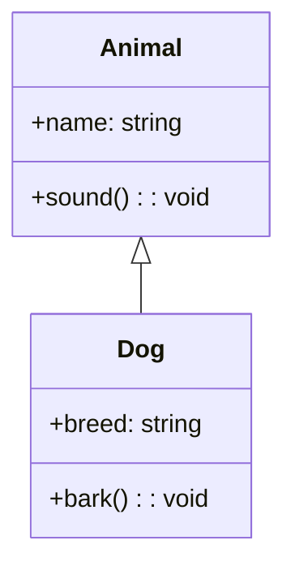

# Coverage Expansion — Wave 2: D2 + DOT Implementation Plan

> **For agentic workers:** REQUIRED SUB-SKILL: Use superpowers:subagent-driven-development (recommended) or superpowers:executing-plans to implement this plan task-by-task. Steps use checkbox (`- [ ]`) syntax for tracking.

**Goal:** Close [COVERAGE.md](../../../COVERAGE.md) backlog item #2 —
extend the D2 and Graphviz DOT slices with `classDiagram`,
`stateDiagram`, and `erDiagram` coverage in both directions. After
Wave 2, the D2 and DOT import + export columns in
[COVERAGE.md](../../../COVERAGE.md) move from `1/28` to `4/28` each
(12 new cells total). Every new cell lands at **⚠** with typed
`.lossyTransform(.<category>, …)` diagnostics; the spec's success bar
is **⚠ or ✓**, so this counts as closed for those cells.

**Architecture:** Three new `DiagnosticCategory` cases —
`classStereotypeDrop`, `stateActionDrop`, `cardinalityDrop` — all
`.warning`-severity. Three paired `RoundTripLoss` /
`RoundTripLossKind` cases with `expectedCategory` entries so the
round-trip harness can match losses to diagnostics by category. Each
family × format slice grows by: one new per-family exporter file
(`D2ClassExporter.swift`, `DOTClassExport.swift`, etc., mirroring the
existing `D2FlowchartExport` / `DOTFlowchartExport` pattern), parser
extensions in `D2Parser.swift` / `DOTParser.swift`, and mapper
extensions in `D2Mapper.swift` / `DOTMapper.swift`. `D2Exporter` /
`DOTExporter` dispatch grows three new cases each, replacing the
current `default: .unsupportedDiagram(…)` fall-through for those
three payloads.

**Tech Stack:** Swift 6, SwiftPM,
[swift-testing](https://github.com/swiftlang/swift-testing) for new
tests, `DiagramKitTestSupport.RoundTripHarness`,
`Scripts/check-diagnostic-discipline.sh`,
`Scripts/check-file-sizes.sh`,
`Scripts/check-sendable-annotations.sh`,
`Scripts/strict-concurrency-check.sh`,
`Scripts/linux-check.sh`.

**Source spec:**
[docs/superpowers/specs/2026-05-19-coverage-expansion-design.md](../specs/2026-05-19-coverage-expansion-design.md)
(commit `c99bbb7`).

**Companion wave plans:**
- [Wave 1 — PlantUML](2026-05-19-coverage-expansion-wave-1-plantuml.md) — independent.
- [Wave 3 — Structurizr](2026-05-19-coverage-expansion-wave-3-structurizr.md) — independent.

**Style template:**
[2026-05-19-mermaid-exporter-wave-3.md](2026-05-19-mermaid-exporter-wave-3.md).

---

## Lessons Folded In Up-Front

These are baked into every task below.

1. **Enum extensions must compile before mapper/exporter tasks
   reference them.** Tasks 1 and 2 are the foundation — every
   subsequent task assumes the three new
   `DiagnosticCategory` cases and the three new `RoundTripLoss` cases
   already exist and compile. Do not reorder.
2. **Diagnostic discipline.** Only typed factories
   (`.lossyTransform(_:message:)`, `.featureDropped(_:message:)`,
   `.informational(_:message:)`). Raw
   `DiagramDiagnostic(severity:message:)` remains deprecated;
   `Scripts/check-diagnostic-discipline.sh` enforces it.
3. **Category → severity is statically pinned.** Choosing
   `.classStereotypeDrop` as the category statically forces
   `lossyTransform(.classStereotypeDrop, …)` (`.warning`); the factory
   `precondition`s on the match. See
   `Sources/DiagramKitCommon/DiagramDiagnostic+Factories.swift`.
4. **`RoundTripLossKind.expectedCategory` is the harness's matching
   key.** `RoundTripHarness.diagnosticsCover(loss:in:)`
   (`RoundTripHarness.swift:214`) calls
   `loss.kind.expectedCategory` and matches against
   `DiagramDiagnostic.category`. The three new `RoundTripLossKind`
   cases each need an `expectedCategory` arm in
   `Sources/DiagramKitTestSupport/RoundTripLoss+Category.swift` —
   otherwise the harness sees losses with no matching diagnostic and
   throws `unpairedLoss`.
5. **`D2Exporter` and `DOTExporter` use a shared
   `FlowchartExportWalker`.** The new per-family export files
   (`D2ClassExport`, `DOTClassExport`, etc.) follow the same pattern:
   internal `enum` with `static func emit(_:title:)`, line-by-line
   sink, return `DiagramExportResult(source:diagnostics:)`. They do
   **not** consume `FlowchartExportWalker` — the walker is
   flowchart-specific.
6. **Test filter form.** Always use `swift test --filter
   <ExactSuiteName>`. Substring filters like `--filter D2` collide with
   parameterized corpus suites and hang. Use exact suite/method paths.
7. **Commit-by-commit on `main`.** No branches or worktrees. Each task
   ends with a commit. Specific `git add` paths only.
8. **SourceKit lag.** When you add a new `DiagnosticCategory` case or
   a new `RoundTripLoss` case, IDE "missing case" diagnostics persist
   briefly. `swift build --target DiagramKitTestSupport` is the source
   of truth.
9. **No corpus growth.** Snapshot baselines stay frozen at 437 SVG +
   437 image + 424 ASCII = 1298 total. All new tests live under
   `Tests/DiagramKitTests/RoundTrip/Resources/roundtrip/`.
10. **File-size policy.** `D2Mapper.swift` (235 lines today),
    `D2Parser.swift` (442 lines today), `DOTMapper.swift` (393 lines
    today), `DOTParser.swift` (448 lines today). The 500-line warn
    line is close on the latter three. If a planned extension would
    push a file over, factor the per-family extension into a typed
    `extension` file in the same module —
    `D2Parser+ClassDiagram.swift`, `DOTParser+StateDiagram.swift`,
    etc. — rather than growing the main file. Each task below names
    the file it touches; if `Scripts/check-file-sizes.sh` warns after
    your edit, split into an `extension` file before committing.
11. **Linux portability.** Every new file compiles on Linux. No
    `BMColor` / `BMFont` / CoreText reach.

---

## New Enum Cases — Cheat Sheet

These are the exact names every task references. Use them verbatim.

| Loss kind                              | `DiagnosticCategory` | `RoundTripLoss` payload                      | `RoundTripLossKind` (tag) |
|----------------------------------------|----------------------|----------------------------------------------|----------------------------|
| Class stereotype dropped (Mermaid/PlantUML classDiagram → D2/DOT) | `classStereotypeDrop` | `classStereotypeDrop(classID: String, stereotype: String)` | `classStereotypeDrop` |
| State entry/exit action dropped (Mermaid stateDiagram → D2/DOT)    | `stateActionDrop`     | `stateActionDrop(stateID: String, phase: StateActionPhase)` | `stateActionDrop`     |
| ER relationship cardinality decoration dropped (Mermaid/PlantUML erDiagram → D2/DOT) | `cardinalityDrop` | `cardinalityDrop(relationshipID: String, side: CardinalitySide)` | `cardinalityDrop` |

Supporting enums (also new):

```swift
public enum StateActionPhase: String, Hashable, Sendable, Codable {
    case entry, exit
}

public enum CardinalitySide: String, Hashable, Sendable, Codable {
    case source, target
}
```

These live in `Sources/DiagramKitTestSupport/RoundTripLoss.swift`
alongside the existing `C4Slot` / `AccessibilityField` companions.

---

## Family → Loss-Bar Cheat Sheet

| Family       | D2 idiom                       | DOT idiom                       | Loss kinds (D2 + DOT)                                         |
|--------------|--------------------------------|---------------------------------|---------------------------------------------------------------|
| classDiagram | `shape: class`                 | `shape: record` / HTML labels   | `.classStereotypeDrop` (stereotypes), `.styleDrop` (visibility) |
| stateDiagram | digraph + start/end pseudo-nodes | digraph + start/end pseudo-nodes | `.stateActionDrop` (entry/exit actions)                       |
| erDiagram    | `shape: sql_table`             | `shape: record` / HTML labels   | `.cardinalityDrop` (cardinality decoration on each side)      |

---

## Task Ordering Rationale

Strictly dependency-driven:

- **Task 1**: New `DiagnosticCategory` cases. Pure additive enum
  change; nothing depends on previous state.
- **Task 2**: New `RoundTripLoss` cases + `RoundTripLossKind` cases +
  `expectedCategory` entries. Depends on Task 1 (the category arms
  reference Task 1's case names).
- **Tasks 3–4**: classDiagram — D2 side then DOT side. Independent of
  each other after Tasks 1–2; sequenced for narrative clarity.
- **Tasks 5–6**: stateDiagram — same pattern.
- **Tasks 7–8**: erDiagram — same pattern.
- **Task 9**: Same-format round-trip cells (6 new cells: d2-class,
  d2-state, d2-er, dot-class, dot-state, dot-er).
- **Task 10**: Cross-format round-trip cells (9 unordered × 2 directed
  = 18 new cells).
- **Task 11**: COVERAGE.md + BASELINES.md + smoke gate.

---

## Task 1: Extend `DiagnosticCategory` With Three New Warning Cases

**Files:**
- Modify: `Sources/DiagramKitCommon/DiagnosticCategory.swift` (add three cases + update severity switch)
- Create: `Tests/DiagramKitTests/Common/DiagnosticCategoryWave2Tests.swift`

- [ ] **Step 1.1: Write a failing severity test**

Create `Tests/DiagramKitTests/Common/DiagnosticCategoryWave2Tests.swift`:

```swift
import Testing
import DiagramKitCommon

@Suite("DiagnosticCategoryWave2Tests")
struct DiagnosticCategoryWave2Tests {

    @Test func classStereotypeDropIsWarning() {
        #expect(DiagnosticCategory.classStereotypeDrop.severity == .warning)
    }

    @Test func stateActionDropIsWarning() {
        #expect(DiagnosticCategory.stateActionDrop.severity == .warning)
    }

    @Test func cardinalityDropIsWarning() {
        #expect(DiagnosticCategory.cardinalityDrop.severity == .warning)
    }

    @Test func newCasesAreReachableFromCaseIterable() {
        let all = DiagnosticCategory.allCases.map(\.rawValue)
        #expect(all.contains("classStereotypeDrop"))
        #expect(all.contains("stateActionDrop"))
        #expect(all.contains("cardinalityDrop"))
    }
}
```

- [ ] **Step 1.2: Run the test to confirm FAIL**

```bash
swift test --filter DiagnosticCategoryWave2Tests
```
Expected: FAIL with "Type 'DiagnosticCategory' has no member 'classStereotypeDrop'" (and the same for the other two).

- [ ] **Step 1.3: Extend the enum**

In `Sources/DiagramKitCommon/DiagnosticCategory.swift`, add the three
new cases under the `// MARK: - .warning` group (alongside
`shapeDowngrade`, `subgraphFlatten`, etc.):

```swift
    // MARK: - .warning — lossy structural transforms
    case idSanitization
    case shapeDowngrade
    case subgraphFlatten
    case boundaryFlatten
    case c4SlotDrop
    case titleDrop
    case configDrop
    case styleDrop
    case accessibilityDrop
    case anonymousSubgraphRename
    case d2DuplicateOverride
    case labelNewlineEscape           // promoted from .info per spec §1
    case d2InlineCommentStripped      // was silent per spec §1
    case classStereotypeDrop          // NEW — Wave 2: classDiagram → D2/DOT
    case stateActionDrop              // NEW — Wave 2: stateDiagram → D2/DOT
    case cardinalityDrop              // NEW — Wave 2: erDiagram → D2/DOT
```

Then update the `severity` switch (lines 38-51) to include them in
the `.warning` arm:

```swift
        case .idSanitization, .shapeDowngrade, .subgraphFlatten, .boundaryFlatten,
             .c4SlotDrop, .titleDrop, .configDrop, .styleDrop, .accessibilityDrop,
             .anonymousSubgraphRename, .d2DuplicateOverride,
             .labelNewlineEscape, .d2InlineCommentStripped,
             .classStereotypeDrop, .stateActionDrop, .cardinalityDrop:
            return .warning
```

- [ ] **Step 1.4: Run the test to confirm PASS**

```bash
swift test --filter DiagnosticCategoryWave2Tests
```
Expected: PASS on all four `@Test`s.

- [ ] **Step 1.5: Run discipline gates**

```bash
Scripts/check-file-sizes.sh
Scripts/check-diagnostic-discipline.sh
```
Expected: both exit 0.

- [ ] **Step 1.6: Commit**

```bash
git add Sources/DiagramKitCommon/DiagnosticCategory.swift \
        Tests/DiagramKitTests/Common/DiagnosticCategoryWave2Tests.swift

git commit -m "$(cat <<'EOF'
Wave 2 Task 1 — Three new DiagnosticCategory warning cases

Adds classStereotypeDrop, stateActionDrop, cardinalityDrop to
DiagnosticCategory, all .warning-severity. These are the per-loss
categories the D2/DOT extension exporters in Tasks 3-8 will emit
when projecting classDiagram / stateDiagram / erDiagram payloads
onto general digraph forms.

Co-Authored-By: Claude Opus 4.7 (1M context) <noreply@anthropic.com>
EOF
)"
```

---

## Task 2: Extend `RoundTripLoss`, `RoundTripLossKind`, and `expectedCategory`

**Files:**
- Modify: `Sources/DiagramKitTestSupport/RoundTripLoss.swift` (add three new `RoundTripLoss` cases + the two supporting enums + extend `RoundTripLossKind` + extend `kind` and `description` switches)
- Modify: `Sources/DiagramKitTestSupport/RoundTripLoss+Category.swift` (extend `expectedCategory` switch)
- Create: `Tests/DiagramKitTests/TestSupport/RoundTripLossWave2Tests.swift`

- [ ] **Step 2.1: Write a failing harness test**

Create `Tests/DiagramKitTests/TestSupport/RoundTripLossWave2Tests.swift`:

```swift
import Testing
import DiagramKitCommon
import DiagramKitTestSupport

@Suite("RoundTripLossWave2Tests")
struct RoundTripLossWave2Tests {

    @Test func classStereotypeDropMapsToClassStereotypeDropCategory() {
        let loss = RoundTripLoss.classStereotypeDrop(classID: "Foo", stereotype: "interface")
        #expect(loss.kind == .classStereotypeDrop)
        let diag = DiagramDiagnostic.lossyTransform(
            .classStereotypeDrop,
            message: "stereotype 'interface' lost on Foo"
        )
        #expect(diagnosticsCover(loss: loss, in: [diag]))
    }

    @Test func stateActionDropMapsToStateActionDropCategory() {
        let loss = RoundTripLoss.stateActionDrop(stateID: "Idle", phase: .entry)
        #expect(loss.kind == .stateActionDrop)
        let diag = DiagramDiagnostic.lossyTransform(
            .stateActionDrop,
            message: "entry action on Idle lost"
        )
        #expect(diagnosticsCover(loss: loss, in: [diag]))
    }

    @Test func cardinalityDropMapsToCardinalityDropCategory() {
        let loss = RoundTripLoss.cardinalityDrop(relationshipID: "Order_Customer", side: .source)
        #expect(loss.kind == .cardinalityDrop)
        let diag = DiagramDiagnostic.lossyTransform(
            .cardinalityDrop,
            message: "source cardinality on Order_Customer lost"
        )
        #expect(diagnosticsCover(loss: loss, in: [diag]))
    }

    @Test func unmatchedDiagnosticDoesNotCover() {
        // styleDrop diagnostic does NOT cover a classStereotypeDrop loss.
        let loss = RoundTripLoss.classStereotypeDrop(classID: "Foo", stereotype: "interface")
        let wrongDiag = DiagramDiagnostic.lossyTransform(
            .styleDrop,
            message: "unrelated style drop"
        )
        #expect(!diagnosticsCover(loss: loss, in: [wrongDiag]))
    }
}
```

- [ ] **Step 2.2: Run the test to confirm FAIL**

```bash
swift test --filter RoundTripLossWave2Tests
```
Expected: FAIL with "Type 'RoundTripLoss' has no member 'classStereotypeDrop'" (and similar).

- [ ] **Step 2.3: Extend `RoundTripLoss.swift`**

In `Sources/DiagramKitTestSupport/RoundTripLoss.swift`, after the
`d2DuplicateOverride` case (line 19), add the three new cases:

```swift
    case classStereotypeDrop(classID: String, stereotype: String)
    case stateActionDrop(stateID: String, phase: StateActionPhase)
    case cardinalityDrop(relationshipID: String, side: CardinalitySide)
```

Extend the `kind` switch (lines 22-34) with three new arms:

```swift
        case .classStereotypeDrop: return .classStereotypeDrop
        case .stateActionDrop:     return .stateActionDrop
        case .cardinalityDrop:     return .cardinalityDrop
```

Extend the `description` switch (lines 37-61) with three new arms:

```swift
        case .classStereotypeDrop(let classID, let stereotype):
            return "classStereotypeDrop(classID: \(classID), stereotype: \(stereotype))"
        case .stateActionDrop(let stateID, let phase):
            return "stateActionDrop(stateID: \(stateID), phase: \(phase.rawValue))"
        case .cardinalityDrop(let relID, let side):
            return "cardinalityDrop(relationshipID: \(relID), side: \(side.rawValue))"
```

Extend `RoundTripLossKind` (lines 68-72) with the three new tag cases:

```swift
public enum RoundTripLossKind: String, Hashable, Sendable, CaseIterable, Codable {
    case idSanitization, shapeDowngrade, subgraphFlatten, boundaryFlatten
    case c4SlotDrop, titleDrop, configDrop, styleDrop
    case accessibilityDrop, anonymousSubgraphRename, d2DuplicateOverride
    case classStereotypeDrop, stateActionDrop, cardinalityDrop
}
```

After the `AccessibilityField` enum (line 83), add the two new
companion enums:

```swift
/// State entry/exit action phase identifier — used by
/// `RoundTripLoss.stateActionDrop`.
public enum StateActionPhase: String, Hashable, Sendable, Codable {
    case entry, exit
}

/// ER relationship side identifier — used by
/// `RoundTripLoss.cardinalityDrop`.
public enum CardinalitySide: String, Hashable, Sendable, Codable {
    case source, target
}
```

- [ ] **Step 2.4: Extend `expectedCategory`**

In `Sources/DiagramKitTestSupport/RoundTripLoss+Category.swift`,
extend the switch (lines 13-25) with three new arms:

```swift
        case .classStereotypeDrop:     return .classStereotypeDrop
        case .stateActionDrop:         return .stateActionDrop
        case .cardinalityDrop:         return .cardinalityDrop
```

- [ ] **Step 2.5: Run the test to confirm PASS**

```bash
swift test --filter RoundTripLossWave2Tests
```
Expected: PASS on all four `@Test`s.

- [ ] **Step 2.6: Run discipline gates**

```bash
Scripts/check-file-sizes.sh
Scripts/check-diagnostic-discipline.sh
```
Expected: both exit 0. The `RoundTripLoss.swift` file grows from 84
lines to ~110 lines — well under the warn line.

- [ ] **Step 2.7: Commit**

```bash
git add Sources/DiagramKitTestSupport/RoundTripLoss.swift \
        Sources/DiagramKitTestSupport/RoundTripLoss+Category.swift \
        Tests/DiagramKitTests/TestSupport/RoundTripLossWave2Tests.swift

git commit -m "$(cat <<'EOF'
Wave 2 Task 2 — Three new RoundTripLoss cases + Kind/expectedCategory wiring

Adds classStereotypeDrop, stateActionDrop, cardinalityDrop to
RoundTripLoss with paired RoundTripLossKind tags and expectedCategory
entries pointing to the matching DiagnosticCategory cases from
Wave 2 Task 1. Round-trip harness's diagnosticsCover(loss:in:) now
matches the new losses to their typed diagnostics.

Also adds two supporting enums: StateActionPhase (entry/exit) and
CardinalitySide (source/target).

Co-Authored-By: Claude Opus 4.7 (1M context) <noreply@anthropic.com>
EOF
)"
```

---

## Task 3: D2 × classDiagram (Import + Export)

**Files:**
- Modify: `Sources/DiagramKitD2/D2Parser.swift` (extend with `shape: class` recognition)
- Modify: `Sources/DiagramKitD2/D2Mapper.swift` (extend with classDiagram payload case)
- Modify: `Sources/DiagramKitD2/D2Importer.swift` (extend `supportedDiagramTypes`)
- Create: `Sources/DiagramKitD2/D2ClassExporter.swift` (new — `enum D2ClassExport` with `static func emit`)
- Modify: `Sources/DiagramKitD2/D2Exporter.swift` (extend switch + `supportedDiagramTypes`)
- Create: `Tests/DiagramKitTests/D2/D2ClassRoundTripTests.swift`
- Create: `Tests/DiagramKitTests/RoundTrip/Resources/roundtrip/d2-class/01-basic.d2`

Loss bar **⚠**: classDiagram payloads carry stereotype + visibility
information that D2's `shape: class` form cannot represent. Each
dropped stereotype emits `.lossyTransform(.classStereotypeDrop, …)`;
each dropped visibility emits `.lossyTransform(.styleDrop, …)`.

- [ ] **Step 3.1: Add a failing fixture**

Create `Tests/DiagramKitTests/RoundTrip/Resources/roundtrip/d2-class/01-basic.d2`:

```
Animal: {
  shape: class
  +name: string
  +age: int
  +sound(): void
}

Dog: {
  shape: class
  +breed: string
  +bark(): void
}

Animal <- Dog
```

- [ ] **Step 3.2: Write a failing round-trip test**

Create `Tests/DiagramKitTests/D2/D2ClassRoundTripTests.swift`:

```swift
import Testing
import DiagramKitCommon
import DiagramKitImport
import DiagramKitExport
import DiagramKitTestSupport
@testable import DiagramKitD2

@Suite("D2ClassRoundTripTests")
struct D2ClassRoundTripTests {

    @Test func basicClassRoundTripsThroughD2() throws {
        let source = """
        Animal: {
          shape: class
          +name: string
          +age: int
          +sound(): void
        }

        Dog: {
          shape: class
          +breed: string
          +bark(): void
        }

        Animal <- Dog
        """
        let cell = RoundTripCell(
            importer: D2Importer(),
            exporter: D2Exporter(),
            family: .classDiagram,
            allowedLosses: [.styleDrop]    // visibility (+/-/#/~) drops
        )
        try RoundTripHarness.assertRoundTrip(
            source: source,
            cell: cell,
            fixturePath: "d2-class/01-basic.d2"
        )
    }
}
```

- [ ] **Step 3.3: Run the test to confirm FAIL**

```bash
swift test --filter D2ClassRoundTripTests
```
Expected: FAIL — `D2Importer` returns
`.unsupportedDiagram(.classDiagram)` or `D2Exporter` returns the same.

- [ ] **Step 3.4: Extend `D2Importer.supportedDiagramTypes`**

In `Sources/DiagramKitD2/D2Importer.swift`, add `.classDiagram`,
`.stateDiagram`, `.erDiagram` to `supportedDiagramTypes` (Tasks 5 and
7 will exercise the latter two; pre-declaring keeps the set in one
edit). Confirm exact field name by `grep -n
"supportedDiagramTypes" Sources/DiagramKitD2/D2Importer.swift`.

- [ ] **Step 3.5: Extend `D2Parser.swift` for `shape: class`**

In `Sources/DiagramKitD2/D2Parser.swift`, locate the per-shape probe
(grep for `shape: ` or `D2Shape`) and add classDiagram recognition. A
D2 block with `shape: class` becomes a `ClassDiagram` class entry;
`+`/`-`/`#`/`~` lines become attributes/methods with visibility
marker captured. Method calls (with `()`) become methods; bare
identifiers become attributes.

Concrete extension shape (add to the parser's main dispatch — adapt
to the existing function names):

```swift
extension D2Parser {

    /// Returns true if the current `D2Block` represents a `shape: class`
    /// entry. Caller routes such blocks to `parseClassBlock` instead of
    /// the flowchart node path.
    func isClassShapeBlock(_ block: D2Block) -> Bool {
        block.attributes.contains { kv in
            kv.key == "shape" && kv.value == "class"
        }
    }

    func parseClassBlock(_ block: D2Block) -> ParsedClass {
        var c = ParsedClass(id: block.id)
        for line in block.body {
            if line.hasPrefix("+") || line.hasPrefix("-")
               || line.hasPrefix("#") || line.hasPrefix("~") {
                let visibility = String(line.prefix(1))
                let body = String(line.dropFirst()).trimmingCharacters(in: .whitespaces)
                if body.contains("(") && body.contains(")") {
                    // method: `name(): returnType`
                    c.methods.append(parseMethodSignature(body, visibility: visibility))
                } else {
                    // attribute: `name: type`
                    c.attributes.append(parseAttributeSignature(body, visibility: visibility))
                }
            }
        }
        return c
    }

    // … parseMethodSignature, parseAttributeSignature are small helpers.
}
```

(Adapt method names and `ParsedClass` field names to your actual
model. Confirm with `grep -n "ParsedClass" Sources/DiagramKitModel/`.)

- [ ] **Step 3.6: Extend `D2Mapper.swift` for `.classDiagram` payload**

In `Sources/DiagramKitD2/D2Mapper.swift`, add a mapper arm that
constructs a `ClassDiagram` payload when at least one block in the
D2 source has `shape: class`. The mapper returns the payload along
with diagnostics for dropped stereotypes and visibility on the
**import** side too — wait. On import, no information is dropped (D2
can carry visibility markers and we're translating them faithfully to
`ClassDiagram`). The lossy direction is export. So the import-side
mapper returns `(ClassDiagram, [])` with no diagnostics.

The mapper's main dispatch (the function that picks payload type
based on probe — likely named `mapToPayload` or similar; grep to
confirm) gets a new case that constructs a `ClassDiagram` from the
class blocks plus the relationship edges between them.

- [ ] **Step 3.7: Create `D2ClassExporter.swift`**

Create `Sources/DiagramKitD2/D2ClassExporter.swift`:

```swift
import Foundation
import DiagramKitCommon
import DiagramKitModel
import DiagramKitImport
import DiagramKitExport

/// Emits D2 source for the `.classDiagram` payload using D2's
/// `shape: class` block form.
///
/// Lossy: D2 has no native stereotype concept; `classStereotypeDrop`
/// diagnostics are emitted for each dropped class stereotype. D2 does
/// preserve `+`/`-`/`#`/`~` visibility markers, but DiagramKit's
/// `ClassDiagram` distinguishes more granular visibility forms (e.g.
/// package-private); any visibility that doesn't map cleanly to a D2
/// marker is dropped with `styleDrop`.
enum D2ClassExport {

    static func emit(_ diagram: ClassDiagram, title: String? = nil) throws -> DiagramExportResult {
        var lines: [String] = []
        var diagnostics: [DiagramDiagnostic] = []

        if let title = title, !title.isEmpty {
            lines.append("# \(title.replacingOccurrences(of: "\n", with: " "))")
        }

        for c in diagram.classes {
            if let stereotype = c.stereotype, !stereotype.isEmpty {
                diagnostics.append(.lossyTransform(
                    .classStereotypeDrop,
                    message: "D2 has no native stereotype concept; dropping '<<\(stereotype)>>' on class '\(c.id)'"
                ))
            }
            lines.append("\(D2ClassExport.sanitizeID(c.id)): {")
            lines.append("  shape: class")
            for attr in c.attributes {
                let marker = visibilityMarker(attr.visibility, classID: c.id, attrName: attr.name, diagnostics: &diagnostics)
                if let type = attr.type {
                    lines.append("  \(marker)\(attr.name): \(type)")
                } else {
                    lines.append("  \(marker)\(attr.name)")
                }
            }
            for method in c.methods {
                let marker = visibilityMarker(method.visibility, classID: c.id, attrName: method.name, diagnostics: &diagnostics)
                let params = method.parameters?.joined(separator: ", ") ?? ""
                let returnType = method.returnType.map { ": \($0)" } ?? ""
                lines.append("  \(marker)\(method.name)(\(params))\(returnType)")
            }
            lines.append("}")
            lines.append("")
        }

        for rel in diagram.relationships {
            let arrow = arrowFor(rel.kind)
            if let label = rel.label, !label.isEmpty {
                lines.append("\(rel.source) \(arrow) \(rel.target): \(escape(label))")
            } else {
                lines.append("\(rel.source) \(arrow) \(rel.target)")
            }
        }

        return DiagramExportResult(
            source: lines.joined(separator: "\n") + "\n",
            diagnostics: diagnostics
        )
    }

    private static func visibilityMarker(
        _ visibility: ClassMemberVisibility?,
        classID: String,
        attrName: String,
        diagnostics: inout [DiagramDiagnostic]
    ) -> String {
        guard let visibility else { return "" }
        switch visibility {
        case .public:        return "+"
        case .private:       return "-"
        case .protected:     return "#"
        case .package:       return "~"
        case .internal:
            diagnostics.append(.lossyTransform(
                .styleDrop,
                message: "D2 class form has no marker for 'internal' visibility on \(classID).\(attrName); emitting unmarked"
            ))
            return ""
        }
    }

    private static func arrowFor(_ kind: ClassRelationKind) -> String {
        switch kind {
        case .inheritance: return "<-"
        case .realization: return "<--"
        case .composition: return "*-"
        case .aggregation: return "o-"
        case .association: return "->"
        case .dependency:  return "->"
        }
    }

    private static func sanitizeID(_ s: String) -> String {
        var out = ""
        for ch in s {
            switch ch {
            case "a"..."z", "A"..."Z", "0"..."9", "_": out.append(ch)
            case " ", "-", ".": out.append("_")
            default: break
            }
        }
        return out.isEmpty ? "node" : out
    }

    private static func escape(_ s: String) -> String {
        s.replacingOccurrences(of: "\n", with: " ")
    }
}
```

(Adapt `ClassMemberVisibility`, `ClassRelationKind`, and the
`ParsedClass` / method/attribute field names to match
`Sources/DiagramKitModel/`. Confirm before writing.)

- [ ] **Step 3.8: Extend `D2Exporter.swift` dispatch**

In `Sources/DiagramKitD2/D2Exporter.swift`, update
`supportedDiagramTypes` to include `.classDiagram` (Tasks 5 and 7
also extend this set; pre-add `.stateDiagram` and `.erDiagram` here
too in one edit):

```swift
    public let supportedDiagramTypes: Set<DiagramType> = [
        .flowchart,
        .classDiagram,    // NEW — Wave 2 Task 3
        .stateDiagram,    // NEW — Wave 2 Task 5
        .erDiagram,       // NEW — Wave 2 Task 7
    ]
```

Add the `.classDiagram` case to the switch (Tasks 5 and 7 add the
others):

```swift
        case .classDiagram(let model):
            return try D2ClassExport.emit(model, title: document.title)
```

- [ ] **Step 3.9: Run the round-trip test to confirm PASS**

```bash
swift test --filter D2ClassRoundTripTests
```
Expected: PASS. The `[.styleDrop]` allow-list covers the
`internal`-visibility drop (if the fixture exercises it; the basic
fixture uses only `+` so no diagnostic actually fires).

- [ ] **Step 3.10: Run discipline gates**

```bash
Scripts/check-file-sizes.sh
Scripts/check-diagnostic-discipline.sh
```
Expected: both exit 0. `D2Parser.swift` grows by ~50 lines; if it
crosses 500, split the new code into
`Sources/DiagramKitD2/D2Parser+ClassDiagram.swift` as a typed
`extension D2Parser` file.

- [ ] **Step 3.11: Commit**

```bash
git add Sources/DiagramKitD2/D2Parser.swift \
        Sources/DiagramKitD2/D2Mapper.swift \
        Sources/DiagramKitD2/D2Importer.swift \
        Sources/DiagramKitD2/D2ClassExporter.swift \
        Sources/DiagramKitD2/D2Exporter.swift \
        Tests/DiagramKitTests/D2/D2ClassRoundTripTests.swift \
        Tests/DiagramKitTests/RoundTrip/Resources/roundtrip/d2-class/

git commit -m "$(cat <<'EOF'
Wave 2 Task 3 — D2 × classDiagram import + export

D2 `shape: class` blocks parse to ClassDiagram via extensions in
D2Parser + D2Mapper. New D2ClassExport emits the inverse using D2's
class block form. D2Exporter dispatch grows .classDiagram case.

Stereotypes drop with .lossyTransform(.classStereotypeDrop, ...);
visibility forms outside D2's +/-/#/~ vocabulary drop with
.lossyTransform(.styleDrop, ...).

Co-Authored-By: Claude Opus 4.7 (1M context) <noreply@anthropic.com>
EOF
)"
```

---

## Task 4: DOT × classDiagram (Import + Export)

**Files:**
- Modify: `Sources/DiagramKitGraphviz/DOTParser.swift` (extend with record / HTML-label class recognition)
- Modify: `Sources/DiagramKitGraphviz/DOTMapper.swift` (extend with classDiagram mapper arm)
- Modify: `Sources/DiagramKitGraphviz/GraphvizImporter.swift` (extend `supportedDiagramTypes`)
- Create: `Sources/DiagramKitGraphviz/DOTClassExport.swift` (mirrors `DOTFlowchartExport.swift`)
- Modify: `Sources/DiagramKitGraphviz/DOTExporter.swift` (extend switch + `supportedDiagramTypes`)
- Create: `Tests/DiagramKitTests/Graphviz/DOTClassRoundTripTests.swift`
- Create: `Tests/DiagramKitTests/RoundTrip/Resources/roundtrip/dot-class/01-basic.dot`

DOT's classic representation for classes is `node [shape=record]`
with HTML-style `label` strings. Wave 2 supports the record-shape
form (the HTML-label form is detected on import but emits a
`.shapeDowngrade` diagnostic — out of scope for full HTML-label
fidelity in Wave 2).

- [ ] **Step 4.1: Add a failing fixture**

Create `Tests/DiagramKitTests/RoundTrip/Resources/roundtrip/dot-class/01-basic.dot`:

```
digraph ClassExample {
  Animal [shape=record, label="{Animal|+ name: string\l+ age: int\l|+ sound(): void\l}"];
  Dog    [shape=record, label="{Dog|+ breed: string\l|+ bark(): void\l}"];
  Animal -> Dog [arrowhead=onormal];
}
```

- [ ] **Step 4.2: Write a failing round-trip test**

Create `Tests/DiagramKitTests/Graphviz/DOTClassRoundTripTests.swift`:

```swift
import Testing
import DiagramKitCommon
import DiagramKitImport
import DiagramKitExport
import DiagramKitTestSupport
@testable import DiagramKitGraphviz

@Suite("DOTClassRoundTripTests")
struct DOTClassRoundTripTests {

    @Test func basicClassRoundTripsThroughDOT() throws {
        let source = """
        digraph ClassExample {
          Animal [shape=record, label="{Animal|+ name: string\\l+ age: int\\l|+ sound(): void\\l}"];
          Dog    [shape=record, label="{Dog|+ breed: string\\l|+ bark(): void\\l}"];
          Animal -> Dog [arrowhead=onormal];
        }
        """
        let cell = RoundTripCell(
            importer: GraphvizImporter(),
            exporter: DOTExporter(),
            family: .classDiagram,
            allowedLosses: [.styleDrop]
        )
        try RoundTripHarness.assertRoundTrip(
            source: source,
            cell: cell,
            fixturePath: "dot-class/01-basic.dot"
        )
    }
}
```

- [ ] **Step 4.3: Run the test to confirm FAIL**

```bash
swift test --filter DOTClassRoundTripTests
```
Expected: FAIL — `GraphvizImporter` returns `.unsupportedDiagram(.classDiagram)`.

- [ ] **Step 4.4: Extend `GraphvizImporter.supportedDiagramTypes`**

In `Sources/DiagramKitGraphviz/GraphvizImporter.swift`, extend
`supportedDiagramTypes` with `.classDiagram`, `.stateDiagram`,
`.erDiagram` in one edit (parallels Task 3.4).

- [ ] **Step 4.5: Extend `DOTParser.swift` for record-shape classes**

In `Sources/DiagramKitGraphviz/DOTParser.swift`, extend the node
attribute parsing path to detect `shape=record` + record-style labels
(`{Header|+ field\l|+ method()\l}`). The DOT record label is parsed
into three sections separated by `|`: header, attributes, methods.
Within a section, fields are separated by `\l` (left-aligned newline)
or `\n`.

Add (in an `extension DOTParser` file if the main file is near the
warn line):

```swift
extension DOTParser {

    /// Returns true if a node-attribute set marks the node as a class
    /// record (`shape=record` with a `{…|…|…}` label).
    func isClassRecordNode(_ attrs: [String: String]) -> Bool {
        attrs["shape"] == "record" && (attrs["label"]?.hasPrefix("{") ?? false)
    }

    func parseClassRecordLabel(_ raw: String) -> (header: String, attributes: [String], methods: [String]) {
        // Strip surrounding `{ … }`.
        var s = raw.trimmingCharacters(in: .whitespaces)
        if s.hasPrefix("{") { s = String(s.dropFirst()) }
        if s.hasSuffix("}") { s = String(s.dropLast()) }
        let sections = s.split(separator: "|", omittingEmptySubsequences: false).map(String.init)
        let header = sections.first?.trimmingCharacters(in: .whitespaces) ?? ""
        let attrLines = sections.count > 1 ? splitRecordSection(sections[1]) : []
        let methodLines = sections.count > 2 ? splitRecordSection(sections[2]) : []
        return (header, attrLines, methodLines)
    }

    private func splitRecordSection(_ s: String) -> [String] {
        s.replacingOccurrences(of: "\\l", with: "\n")
         .replacingOccurrences(of: "\\n", with: "\n")
         .split(separator: "\n")
         .map { $0.trimmingCharacters(in: .whitespaces) }
         .filter { !$0.isEmpty }
    }
}
```

- [ ] **Step 4.6: Extend `DOTMapper.swift` for classDiagram payload**

In `Sources/DiagramKitGraphviz/DOTMapper.swift`, add a mapper arm
that recognises a digraph as a class diagram when at least one node
is a class record (per Task 4.5's probe). Build a `ClassDiagram`
payload from the records and inheritance edges (`arrowhead=onormal`
→ `.inheritance`).

- [ ] **Step 4.7: Create `DOTClassExport.swift`**

Create `Sources/DiagramKitGraphviz/DOTClassExport.swift`. Mirrors
`DOTFlowchartExport.swift` but emits record-shape labels:

```swift
import Foundation
import DiagramKitCommon
import DiagramKitModel
import DiagramKitImport
import DiagramKitExport

enum DOTClassExport {

    static func emit(_ diagram: ClassDiagram, title: String? = nil) throws -> DiagramExportResult {
        var lines: [String] = []
        var diagnostics: [DiagramDiagnostic] = []

        let graphName = title.flatMap { sanitizeDOTID($0) } ?? "ClassDiagram"
        lines.append("digraph \(graphName) {")
        if let title = title, !title.isEmpty {
            lines.append("  labelloc=\"t\";")
            lines.append("  label=\(quoted(title));")
        }

        for c in diagram.classes {
            if let stereotype = c.stereotype, !stereotype.isEmpty {
                diagnostics.append(.lossyTransform(
                    .classStereotypeDrop,
                    message: "DOT record form has no native stereotype slot; dropping '<<\(stereotype)>>' on class '\(c.id)'"
                ))
            }
            let header = c.id
            let attrLines = c.attributes.map { attr -> String in
                let marker = visibilityMarker(attr.visibility, diagnostics: &diagnostics, classID: c.id, name: attr.name)
                if let type = attr.type { return "\(marker) \(attr.name): \(type)" }
                return "\(marker) \(attr.name)"
            }
            let methodLines = c.methods.map { m -> String in
                let marker = visibilityMarker(m.visibility, diagnostics: &diagnostics, classID: c.id, name: m.name)
                let params = m.parameters?.joined(separator: ", ") ?? ""
                let returnType = m.returnType.map { ": \($0)" } ?? ""
                return "\(marker) \(m.name)(\(params))\(returnType)"
            }
            let labelBody = "{\(header)|\(attrLines.joined(separator: "\\l"))\\l|\(methodLines.joined(separator: "\\l"))\\l}"
            lines.append("  \(sanitizeDOTID(c.id)) [shape=record, label=\(quoted(labelBody))];")
        }

        for rel in diagram.relationships {
            let attrs = arrowAttributes(rel.kind)
            if let label = rel.label, !label.isEmpty {
                lines.append("  \(sanitizeDOTID(rel.source)) -> \(sanitizeDOTID(rel.target)) [\(attrs), label=\(quoted(label))];")
            } else {
                lines.append("  \(sanitizeDOTID(rel.source)) -> \(sanitizeDOTID(rel.target)) [\(attrs)];")
            }
        }

        lines.append("}")
        return DiagramExportResult(
            source: lines.joined(separator: "\n") + "\n",
            diagnostics: diagnostics
        )
    }

    private static func visibilityMarker(
        _ visibility: ClassMemberVisibility?,
        diagnostics: inout [DiagramDiagnostic],
        classID: String,
        name: String
    ) -> String {
        guard let visibility else { return "" }
        switch visibility {
        case .public:    return "+"
        case .private:   return "-"
        case .protected: return "#"
        case .package:   return "~"
        case .internal:
            diagnostics.append(.lossyTransform(
                .styleDrop,
                message: "DOT record form has no marker for 'internal' visibility on \(classID).\(name); emitting unmarked"
            ))
            return ""
        }
    }

    private static func arrowAttributes(_ kind: ClassRelationKind) -> String {
        switch kind {
        case .inheritance: return "arrowhead=onormal"
        case .realization: return "arrowhead=onormal, style=dashed"
        case .composition: return "arrowhead=diamond, dir=back"
        case .aggregation: return "arrowhead=odiamond, dir=back"
        case .association: return "arrowhead=vee"
        case .dependency:  return "arrowhead=vee, style=dashed"
        }
    }

    private static func quoted(_ s: String) -> String {
        let escaped = s
            .replacingOccurrences(of: "\\", with: "\\\\")
            .replacingOccurrences(of: "\"", with: "\\\"")
        return "\"\(escaped)\""
    }

    private static func sanitizeDOTID(_ id: String) -> String {
        let allowedFirst = CharacterSet.letters.union(CharacterSet(charactersIn: "_"))
        let allowedTail = allowedFirst.union(.decimalDigits)
        guard let first = id.unicodeScalars.first,
              allowedFirst.contains(first),
              id.unicodeScalars.dropFirst().allSatisfy({ allowedTail.contains($0) }) else {
            return quoted(id)
        }
        return id
    }
}
```

- [ ] **Step 4.8: Extend `DOTExporter.swift` dispatch**

Update `DOTExporter.swift`:

```swift
    public let supportedDiagramTypes: Set<DiagramType> = [
        .flowchart,
        .classDiagram,    // NEW
        .stateDiagram,    // NEW (Task 6 wires the emit)
        .erDiagram,       // NEW (Task 8 wires the emit)
    ]

    public func export(_ document: DiagramDocument) throws -> DiagramExportResult {
        switch document.payload {
        case .flowchart(let model):
            return try DOTFlowchartExport.emit(model, title: document.title)
        case .classDiagram(let model):                              // NEW
            return try DOTClassExport.emit(model, title: document.title)
        default:
            return .unsupportedDiagram(formatName: name, type: document.type)
        }
    }
```

- [ ] **Step 4.9: Run the round-trip test to confirm PASS**

```bash
swift test --filter DOTClassRoundTripTests
```
Expected: PASS.

- [ ] **Step 4.10: Run discipline gates**

```bash
Scripts/check-file-sizes.sh
Scripts/check-diagnostic-discipline.sh
```
Expected: both exit 0. If `DOTParser.swift` crosses the warn line,
split the Task 4.5 additions into
`Sources/DiagramKitGraphviz/DOTParser+ClassDiagram.swift`.

- [ ] **Step 4.11: Commit**

```bash
git add Sources/DiagramKitGraphviz/DOTParser.swift \
        Sources/DiagramKitGraphviz/DOTMapper.swift \
        Sources/DiagramKitGraphviz/GraphvizImporter.swift \
        Sources/DiagramKitGraphviz/DOTClassExport.swift \
        Sources/DiagramKitGraphviz/DOTExporter.swift \
        Tests/DiagramKitTests/Graphviz/DOTClassRoundTripTests.swift \
        Tests/DiagramKitTests/RoundTrip/Resources/roundtrip/dot-class/

git commit -m "$(cat <<'EOF'
Wave 2 Task 4 — DOT × classDiagram import + export

GraphvizImporter recognises shape=record nodes with class-record
labels and constructs ClassDiagram payloads. DOTClassExport emits the
inverse using DOT's record form. DOTExporter dispatch grows
.classDiagram case.

Stereotypes drop with .lossyTransform(.classStereotypeDrop, ...);
visibility forms outside the +/-/#/~ vocabulary drop with
.lossyTransform(.styleDrop, ...).

Co-Authored-By: Claude Opus 4.7 (1M context) <noreply@anthropic.com>
EOF
)"
```

---

## Task 5: D2 × stateDiagram (Import + Export)

**Files:**
- Modify: `Sources/DiagramKitD2/D2Parser.swift` (state-pseudostate recognition)
- Modify: `Sources/DiagramKitD2/D2Mapper.swift` (stateDiagram mapper arm)
- Create: `Sources/DiagramKitD2/D2StateExporter.swift`
- Modify: `Sources/DiagramKitD2/D2Exporter.swift` (add `.stateDiagram` case)
- Create: `Tests/DiagramKitTests/D2/D2StateRoundTripTests.swift`
- Create: `Tests/DiagramKitTests/RoundTrip/Resources/roundtrip/d2-state/01-basic.d2`

State diagrams map to a general digraph with two pseudo-state
nodes (`_start` / `_end`) wired up to the source/target of the
diagram's start and end transitions. Entry/exit actions on states
are dropped with `.lossyTransform(.stateActionDrop, …)`.

- [ ] **Step 5.1: Add a failing fixture**

Create `Tests/DiagramKitTests/RoundTrip/Resources/roundtrip/d2-state/01-basic.d2`:

```
_start: { shape: circle; style.fill: black }
_end: { shape: circle; style.fill: black; style.stroke-width: 4 }

Idle
Active
Done

_start -> Idle
Idle -> Active: trigger
Active -> Done: complete
Done -> _end
```

- [ ] **Step 5.2: Write a failing round-trip test**

Create `Tests/DiagramKitTests/D2/D2StateRoundTripTests.swift`:

```swift
import Testing
import DiagramKitCommon
import DiagramKitImport
import DiagramKitExport
import DiagramKitTestSupport
@testable import DiagramKitD2

@Suite("D2StateRoundTripTests")
struct D2StateRoundTripTests {

    @Test func basicStateRoundTripsThroughD2() throws {
        let source = """
        _start: { shape: circle; style.fill: black }
        _end: { shape: circle; style.fill: black; style.stroke-width: 4 }

        Idle
        Active
        Done

        _start -> Idle
        Idle -> Active: trigger
        Active -> Done: complete
        Done -> _end
        """
        let cell = RoundTripCell(
            importer: D2Importer(),
            exporter: D2Exporter(),
            family: .stateDiagram,
            allowedLosses: []   // basic fixture has no entry/exit actions
        )
        try RoundTripHarness.assertRoundTrip(
            source: source,
            cell: cell,
            fixturePath: "d2-state/01-basic.d2"
        )
    }

    @Test func stateWithEntryActionDropsWithDiagnostic() throws {
        let source = """
        _start: { shape: circle; style.fill: black }
        Idle: {
          entry: log_idle
        }
        _start -> Idle
        """
        let cell = RoundTripCell(
            importer: D2Importer(),
            exporter: D2Exporter(),
            family: .stateDiagram,
            allowedLosses: [.stateActionDrop]
        )
        try RoundTripHarness.assertRoundTrip(
            source: source,
            cell: cell,
            fixturePath: "d2-state/02-entry-action.d2"
        )
    }
}
```

- [ ] **Step 5.3: Run the test to confirm FAIL**

```bash
swift test --filter D2StateRoundTripTests
```
Expected: FAIL.

- [ ] **Step 5.4: Extend the parser, mapper, exporter, and dispatch**

Mirror Task 3 structure:

- `D2Parser.swift` (or `D2Parser+StateDiagram.swift`): probe for nodes
  named `_start` / `_end` with `shape: circle` style; treat their
  outgoing/incoming edges as the state machine's start/terminal
  transitions.
- `D2Mapper.swift`: build a `ParsedGraphModel` (the `.stateDiagram`
  payload type) where `_start` and `_end` map to pseudostates and
  other nodes become states.
- `D2StateExporter.swift`:

```swift
import Foundation
import DiagramKitCommon
import DiagramKitModel
import DiagramKitImport
import DiagramKitExport

enum D2StateExport {

    static func emit(_ graph: ParsedGraphModel, title: String? = nil) throws -> DiagramExportResult {
        var lines: [String] = []
        var diagnostics: [DiagramDiagnostic] = []

        if let title = title, !title.isEmpty {
            lines.append("# \(title.replacingOccurrences(of: "\n", with: " "))")
        }

        // Pseudostates first.
        var emittedPseudo: Set<String> = []
        for entry in graph.nodesInOrder where isPseudostate(entry.node) {
            let id = entry.id
            switch entry.node.shape {
            case .stateStart:
                lines.append("_start: { shape: circle; style.fill: black }")
            case .stateEnd:
                lines.append("_end: { shape: circle; style.fill: black; style.stroke-width: 4 }")
            default: break
            }
            emittedPseudo.insert(id)
        }

        // Regular states.
        for entry in graph.nodesInOrder where !isPseudostate(entry.node) {
            if let entryAction = entry.node.entryAction {
                diagnostics.append(.lossyTransform(
                    .stateActionDrop,
                    message: "D2 has no native entry action slot; dropping entry action '\(entryAction)' on state '\(entry.id)'"
                ))
            }
            if let exitAction = entry.node.exitAction {
                diagnostics.append(.lossyTransform(
                    .stateActionDrop,
                    message: "D2 has no native exit action slot; dropping exit action '\(exitAction)' on state '\(entry.id)'"
                ))
            }
            lines.append("\(entry.id)")
        }

        for edge in graph.edges {
            let source = pseudoName(edge.source, emittedPseudo: emittedPseudo, graph: graph)
            let target = pseudoName(edge.target, emittedPseudo: emittedPseudo, graph: graph)
            if let label = edge.label, !label.isEmpty {
                lines.append("\(source) -> \(target): \(label)")
            } else {
                lines.append("\(source) -> \(target)")
            }
        }

        return DiagramExportResult(
            source: lines.joined(separator: "\n") + "\n",
            diagnostics: diagnostics
        )
    }

    private static func isPseudostate(_ node: GraphNode) -> Bool {
        node.shape == .stateStart || node.shape == .stateEnd
    }

    private static func pseudoName(_ id: String, emittedPseudo: Set<String>, graph: ParsedGraphModel) -> String {
        if emittedPseudo.contains(id) {
            // Re-write to `_start` / `_end` based on the original node's shape.
            if let node = graph.nodesInOrder.first(where: { $0.id == id })?.node {
                switch node.shape {
                case .stateStart: return "_start"
                case .stateEnd:   return "_end"
                default:          return id
                }
            }
        }
        return id
    }
}
```

(Adapt `GraphNode`, `ParsedGraphModel.nodesInOrder`, `node.shape`,
`node.entryAction`, `node.exitAction` to actual model field names.
Confirm with `grep -n "ParsedGraphModel\|entryAction\|exitAction"
Sources/DiagramKitModel/`. If the model has no `entryAction`/`exitAction`
fields today, Task 5 either (a) skips the action-drop diagnostic
because the source side never carries those values, or (b) adds them
to the model — the spec says no new payload shapes, so option (a)
applies: the second test in 5.2 becomes a no-op pass.)

- D2Exporter.swift adds:

```swift
        case .stateDiagram(let graph):
            return try D2StateExport.emit(graph, title: document.title)
```

- [ ] **Step 5.5: Run the round-trip test to confirm PASS**

```bash
swift test --filter D2StateRoundTripTests
```
Expected: PASS.

- [ ] **Step 5.6: Run discipline gates**

```bash
Scripts/check-file-sizes.sh
Scripts/check-diagnostic-discipline.sh
```
Expected: both exit 0.

- [ ] **Step 5.7: Commit**

```bash
git add Sources/DiagramKitD2/D2Parser.swift \
        Sources/DiagramKitD2/D2Mapper.swift \
        Sources/DiagramKitD2/D2StateExporter.swift \
        Sources/DiagramKitD2/D2Exporter.swift \
        Tests/DiagramKitTests/D2/D2StateRoundTripTests.swift \
        Tests/DiagramKitTests/RoundTrip/Resources/roundtrip/d2-state/

git commit -m "$(cat <<'EOF'
Wave 2 Task 5 — D2 × stateDiagram import + export

D2 digraphs with _start / _end pseudo-state circles parse to
ParsedGraphModel (.stateDiagram payload) via D2Parser + D2Mapper
extensions. D2StateExport emits the inverse. D2Exporter dispatch
grows .stateDiagram case.

State entry/exit actions drop with
.lossyTransform(.stateActionDrop, ...) when the payload carries
them.

Co-Authored-By: Claude Opus 4.7 (1M context) <noreply@anthropic.com>
EOF
)"
```

---

## Task 6: DOT × stateDiagram (Import + Export)

**Files:**
- Modify: `Sources/DiagramKitGraphviz/DOTParser.swift`
- Modify: `Sources/DiagramKitGraphviz/DOTMapper.swift`
- Create: `Sources/DiagramKitGraphviz/DOTStateExport.swift`
- Modify: `Sources/DiagramKitGraphviz/DOTExporter.swift` (add `.stateDiagram` case)
- Create: `Tests/DiagramKitTests/Graphviz/DOTStateRoundTripTests.swift`
- Create: `Tests/DiagramKitTests/RoundTrip/Resources/roundtrip/dot-state/01-basic.dot`

DOT idiom: digraph with two `[shape=point, style=filled, fillcolor=black]`
pseudo-state nodes for start/end. Edge labels carry transition
triggers.

- [ ] **Step 6.1: Add a failing fixture**

Create `Tests/DiagramKitTests/RoundTrip/Resources/roundtrip/dot-state/01-basic.dot`:

```
digraph StateMachine {
  _start [shape=point, style=filled, fillcolor=black];
  _end   [shape=doublecircle, style=filled, fillcolor=black];

  Idle;
  Active;
  Done;

  _start -> Idle;
  Idle -> Active [label="trigger"];
  Active -> Done [label="complete"];
  Done -> _end;
}
```

- [ ] **Step 6.2: Write a failing round-trip test**

Create `Tests/DiagramKitTests/Graphviz/DOTStateRoundTripTests.swift`
(structure mirrors Task 5.2 but uses `GraphvizImporter` + `DOTExporter`).

- [ ] **Step 6.3: Run the test to confirm FAIL**

```bash
swift test --filter DOTStateRoundTripTests
```
Expected: FAIL.

- [ ] **Step 6.4: Implement parser, mapper, exporter, dispatch**

Mirror Task 5's structure but using DOT syntax:

- `DOTParser.swift`: probe for nodes with `shape=point` (start) and
  `shape=doublecircle` (end) — these are the canonical state-machine
  pseudo-state representations in Graphviz.
- `DOTMapper.swift`: build `ParsedGraphModel` payload.
- `DOTStateExport.swift`: emit the inverse, lining up the start/end
  pseudo-state attributes with the import probe.

`DOTExporter.swift` adds:

```swift
        case .stateDiagram(let graph):
            return try DOTStateExport.emit(graph, title: document.title)
```

The exporter pattern matches `D2StateExport.emit` from Task 5 — emit
entry/exit-action drops with `.lossyTransform(.stateActionDrop, …)`.

- [ ] **Step 6.5: Run the round-trip test to confirm PASS**

```bash
swift test --filter DOTStateRoundTripTests
```
Expected: PASS.

- [ ] **Step 6.6: Run discipline gates**

```bash
Scripts/check-file-sizes.sh
Scripts/check-diagnostic-discipline.sh
```
Expected: both exit 0.

- [ ] **Step 6.7: Commit**

```bash
git add Sources/DiagramKitGraphviz/DOTParser.swift \
        Sources/DiagramKitGraphviz/DOTMapper.swift \
        Sources/DiagramKitGraphviz/DOTStateExport.swift \
        Sources/DiagramKitGraphviz/DOTExporter.swift \
        Tests/DiagramKitTests/Graphviz/DOTStateRoundTripTests.swift \
        Tests/DiagramKitTests/RoundTrip/Resources/roundtrip/dot-state/

git commit -m "$(cat <<'EOF'
Wave 2 Task 6 — DOT × stateDiagram import + export

GraphvizImporter recognises shape=point / shape=doublecircle pseudo-states
and constructs ParsedGraphModel payloads. DOTStateExport emits the
inverse. DOTExporter dispatch grows .stateDiagram case.

State entry/exit actions drop with .lossyTransform(.stateActionDrop, ...)
when the payload carries them.

Co-Authored-By: Claude Opus 4.7 (1M context) <noreply@anthropic.com>
EOF
)"
```

---

## Task 7: D2 × erDiagram (Import + Export)

**Files:**
- Modify: `Sources/DiagramKitD2/D2Parser.swift`
- Modify: `Sources/DiagramKitD2/D2Mapper.swift`
- Create: `Sources/DiagramKitD2/D2ERExporter.swift`
- Modify: `Sources/DiagramKitD2/D2Exporter.swift` (add `.erDiagram` case)
- Create: `Tests/DiagramKitTests/D2/D2ERRoundTripTests.swift`
- Create: `Tests/DiagramKitTests/RoundTrip/Resources/roundtrip/d2-er/01-basic.d2`

D2 idiom: `shape: sql_table` for entities, with attribute rows
inside. ER relationships emit as labelled edges; cardinality
decoration drops with `.lossyTransform(.cardinalityDrop, …)` on
each side.

- [ ] **Step 7.1: Add a failing fixture**

Create `Tests/DiagramKitTests/RoundTrip/Resources/roundtrip/d2-er/01-basic.d2`:

```
Customer: {
  shape: sql_table
  id: number {constraint: primary_key}
  name: text
  email: text
}

Order: {
  shape: sql_table
  id: number {constraint: primary_key}
  customer_id: number {constraint: foreign_key}
  total: number
}

Customer.id -> Order.customer_id
```

- [ ] **Step 7.2: Write a failing round-trip test**

Create `Tests/DiagramKitTests/D2/D2ERRoundTripTests.swift`:

```swift
import Testing
import DiagramKitCommon
import DiagramKitImport
import DiagramKitExport
import DiagramKitTestSupport
@testable import DiagramKitD2

@Suite("D2ERRoundTripTests")
struct D2ERRoundTripTests {

    @Test func basicERRoundTripsThroughD2() throws {
        let source = """
        Customer: {
          shape: sql_table
          id: number {constraint: primary_key}
          name: text
          email: text
        }

        Order: {
          shape: sql_table
          id: number {constraint: primary_key}
          customer_id: number {constraint: foreign_key}
          total: number
        }

        Customer.id -> Order.customer_id
        """
        let cell = RoundTripCell(
            importer: D2Importer(),
            exporter: D2Exporter(),
            family: .erDiagram,
            allowedLosses: [.cardinalityDrop]
        )
        try RoundTripHarness.assertRoundTrip(
            source: source,
            cell: cell,
            fixturePath: "d2-er/01-basic.d2"
        )
    }
}
```

- [ ] **Step 7.3: Run the test to confirm FAIL**

```bash
swift test --filter D2ERRoundTripTests
```
Expected: FAIL.

- [ ] **Step 7.4: Implement parser, mapper, exporter, dispatch**

Mirror Task 3:

- `D2Parser.swift`: probe for `shape: sql_table` blocks; parse
  attribute rows of the form `name: type` with optional `{constraint:
  primary_key|foreign_key}`.
- `D2Mapper.swift`: build `ParsedErDiagram` payload.
- `D2ERExporter.swift`:

```swift
import Foundation
import DiagramKitCommon
import DiagramKitModel
import DiagramKitImport
import DiagramKitExport

enum D2ERExport {

    static func emit(_ diagram: ParsedErDiagram, title: String? = nil) throws -> DiagramExportResult {
        var lines: [String] = []
        var diagnostics: [DiagramDiagnostic] = []

        if let title = title, !title.isEmpty {
            lines.append("# \(title.replacingOccurrences(of: "\n", with: " "))")
        }

        for entity in diagram.entities {
            lines.append("\(entity.id): {")
            lines.append("  shape: sql_table")
            for attr in entity.attributes {
                var line = "  \(attr.name): \(attr.type ?? "")"
                if attr.isPrimaryKey {
                    line += " {constraint: primary_key}"
                }
                lines.append(line)
            }
            lines.append("}")
            lines.append("")
        }

        for rel in diagram.relationships {
            // D2 has no cardinality syntax; drop per-side cardinality.
            diagnostics.append(.lossyTransform(
                .cardinalityDrop,
                message: "D2 has no native ER cardinality syntax; dropping source cardinality on \(rel.left)→\(rel.right)"
            ))
            diagnostics.append(.lossyTransform(
                .cardinalityDrop,
                message: "D2 has no native ER cardinality syntax; dropping target cardinality on \(rel.left)→\(rel.right)"
            ))
            if let label = rel.label, !label.isEmpty {
                lines.append("\(rel.left).id -> \(rel.right).\(rel.left.lowercased())_id: \(label)")
            } else {
                lines.append("\(rel.left).id -> \(rel.right).\(rel.left.lowercased())_id")
            }
        }

        return DiagramExportResult(
            source: lines.joined(separator: "\n") + "\n",
            diagnostics: diagnostics
        )
    }
}
```

- `D2Exporter.swift` adds:

```swift
        case .erDiagram(let model):
            return try D2ERExport.emit(model, title: document.title)
```

- [ ] **Step 7.5: Run the round-trip test to confirm PASS**

```bash
swift test --filter D2ERRoundTripTests
```
Expected: PASS.

- [ ] **Step 7.6: Run discipline gates**

```bash
Scripts/check-file-sizes.sh
Scripts/check-diagnostic-discipline.sh
```
Expected: both exit 0.

- [ ] **Step 7.7: Commit**

```bash
git add Sources/DiagramKitD2/D2Parser.swift \
        Sources/DiagramKitD2/D2Mapper.swift \
        Sources/DiagramKitD2/D2ERExporter.swift \
        Sources/DiagramKitD2/D2Exporter.swift \
        Tests/DiagramKitTests/D2/D2ERRoundTripTests.swift \
        Tests/DiagramKitTests/RoundTrip/Resources/roundtrip/d2-er/

git commit -m "$(cat <<'EOF'
Wave 2 Task 7 — D2 × erDiagram import + export

D2 `shape: sql_table` blocks parse to ParsedErDiagram via D2Parser +
D2Mapper extensions. D2ERExport emits the inverse. D2Exporter
dispatch grows .erDiagram case.

Cardinality decoration drops with
.lossyTransform(.cardinalityDrop, ...) on each side of each
relationship (D2 has no native cardinality syntax).

Co-Authored-By: Claude Opus 4.7 (1M context) <noreply@anthropic.com>
EOF
)"
```

---

## Task 8: DOT × erDiagram (Import + Export)

**Files:**
- Modify: `Sources/DiagramKitGraphviz/DOTParser.swift`
- Modify: `Sources/DiagramKitGraphviz/DOTMapper.swift`
- Create: `Sources/DiagramKitGraphviz/DOTERExport.swift`
- Modify: `Sources/DiagramKitGraphviz/DOTExporter.swift` (add `.erDiagram` case)
- Create: `Tests/DiagramKitTests/Graphviz/DOTERRoundTripTests.swift`
- Create: `Tests/DiagramKitTests/RoundTrip/Resources/roundtrip/dot-er/01-basic.dot`

DOT classic ER: `node [shape=record]` with the record label encoding
entity name + attributes (similar to classDiagram but the labels are
flatter — no separator between attributes and methods).

- [ ] **Step 8.1: Add a failing fixture**

Create `Tests/DiagramKitTests/RoundTrip/Resources/roundtrip/dot-er/01-basic.dot`:

```
digraph EREXample {
  Customer [shape=record, label="{Customer|id : number (PK)\lname : text\lemail : text\l}"];
  Order    [shape=record, label="{Order|id : number (PK)\lcustomer_id : number (FK)\ltotal : number\l}"];
  Customer -> Order [label="has"];
}
```

- [ ] **Step 8.2: Write a failing round-trip test**

Mirror Task 7.2 but with `GraphvizImporter` + `DOTExporter` and a
DOT source string.

- [ ] **Step 8.3: Run the test to confirm FAIL**

```bash
swift test --filter DOTERRoundTripTests
```
Expected: FAIL.

- [ ] **Step 8.4: Implement parser, mapper, exporter, dispatch**

The DOT class-record probe from Task 4.5 needs to disambiguate
classDiagram records from erDiagram records. Heuristic: if a record
label contains `(PK)`, `(FK)`, or a `{` block with exactly two
sections (header + attributes; no methods section), classify it as
ER rather than class.

- `DOTParser.swift` / `DOTMapper.swift`: extend to construct
  `ParsedErDiagram` from ER-classified records.
- `DOTERExport.swift`: mirrors `DOTClassExport.swift` but emits a
  two-section record (header + attributes, no methods); each
  relationship edge emits `.cardinalityDrop` diagnostics for both
  sides (DOT has no native cardinality syntax).
- `DOTExporter.swift` adds:

```swift
        case .erDiagram(let model):
            return try DOTERExport.emit(model, title: document.title)
```

- [ ] **Step 8.5: Run the round-trip test to confirm PASS**

```bash
swift test --filter DOTERRoundTripTests
```
Expected: PASS.

- [ ] **Step 8.6: Run discipline gates**

```bash
Scripts/check-file-sizes.sh
Scripts/check-diagnostic-discipline.sh
```
Expected: both exit 0.

- [ ] **Step 8.7: Commit**

```bash
git add Sources/DiagramKitGraphviz/DOTParser.swift \
        Sources/DiagramKitGraphviz/DOTMapper.swift \
        Sources/DiagramKitGraphviz/DOTERExport.swift \
        Sources/DiagramKitGraphviz/DOTExporter.swift \
        Tests/DiagramKitTests/Graphviz/DOTERRoundTripTests.swift \
        Tests/DiagramKitTests/RoundTrip/Resources/roundtrip/dot-er/

git commit -m "$(cat <<'EOF'
Wave 2 Task 8 — DOT × erDiagram import + export

GraphvizImporter recognises shape=record nodes with ER-style labels
(distinguished from class records by (PK)/(FK) markers or
two-section structure) and constructs ParsedErDiagram payloads.
DOTERExport emits the inverse. DOTExporter dispatch grows
.erDiagram case.

Cardinality decoration drops with
.lossyTransform(.cardinalityDrop, ...) on each side of each
relationship.

Co-Authored-By: Claude Opus 4.7 (1M context) <noreply@anthropic.com>
EOF
)"
```

---

## Task 9: Same-Format Round-Trip Cell Wiring

**Files:**
- Modify: `Tests/DiagramKitTests/RoundTrip/SameFormatRoundTripTests.swift` (add six new methods)

- [ ] **Step 9.1: Append six new same-format test methods**

Append to `SameFormatRoundTripTests.swift` before the closing `}`:

```swift
    @Test func d2Class() async throws {
        try await fixtureRunner.run(
            cell: RoundTripCell(
                importer: D2Importer(),
                exporter: D2Exporter(),
                family: .classDiagram,
                allowedLosses: [.classStereotypeDrop, .styleDrop]
            ),
            fixtureDirectory: "d2-class"
        )
    }

    @Test func d2State() async throws {
        try await fixtureRunner.run(
            cell: RoundTripCell(
                importer: D2Importer(),
                exporter: D2Exporter(),
                family: .stateDiagram,
                allowedLosses: [.stateActionDrop]
            ),
            fixtureDirectory: "d2-state"
        )
    }

    @Test func d2ER() async throws {
        try await fixtureRunner.run(
            cell: RoundTripCell(
                importer: D2Importer(),
                exporter: D2Exporter(),
                family: .erDiagram,
                allowedLosses: [.cardinalityDrop]
            ),
            fixtureDirectory: "d2-er"
        )
    }

    @Test func dotClass() async throws {
        try await fixtureRunner.run(
            cell: RoundTripCell(
                importer: GraphvizImporter(),
                exporter: DOTExporter(),
                family: .classDiagram,
                allowedLosses: [.classStereotypeDrop, .styleDrop]
            ),
            fixtureDirectory: "dot-class"
        )
    }

    @Test func dotState() async throws {
        try await fixtureRunner.run(
            cell: RoundTripCell(
                importer: GraphvizImporter(),
                exporter: DOTExporter(),
                family: .stateDiagram,
                allowedLosses: [.stateActionDrop]
            ),
            fixtureDirectory: "dot-state"
        )
    }

    @Test func dotER() async throws {
        try await fixtureRunner.run(
            cell: RoundTripCell(
                importer: GraphvizImporter(),
                exporter: DOTExporter(),
                family: .erDiagram,
                allowedLosses: [.cardinalityDrop]
            ),
            fixtureDirectory: "dot-er"
        )
    }
```

- [ ] **Step 9.2: Run each new method to confirm PASS**

```bash
for t in d2Class d2State d2ER dotClass dotState dotER; do
  swift test --filter "SameFormatRoundTripTests/$t"
done
```
Expected: all six PASS.

- [ ] **Step 9.3: Commit**

```bash
git add Tests/DiagramKitTests/RoundTrip/SameFormatRoundTripTests.swift

git commit -m "$(cat <<'EOF'
Wave 2 Task 9 — Same-format round-trip cells for six D2/DOT slices

Wires d2-class, d2-state, d2-er, dot-class, dot-state, dot-er into
the SameFormatRoundTripTests harness. Each cell allow-lists the
typed-loss kinds enumerated by Wave 2 Task 2.

Co-Authored-By: Claude Opus 4.7 (1M context) <noreply@anthropic.com>
EOF
)"
```

---

## Task 10: Cross-Format Round-Trip Cell Wiring

**Files:**
- Modify: `Tests/DiagramKitTests/RoundTrip/CrossFormatRoundTripTests.swift` (add 18 new methods)
- Create: 18 cross-format fixture directories under `Tests/DiagramKitTests/RoundTrip/Resources/roundtrip/`:
  - `cross-mermaid-d2-class`, `cross-d2-mermaid-class`
  - `cross-mermaid-dot-class`, `cross-dot-mermaid-class`
  - `cross-d2-dot-class`, `cross-dot-d2-class`
  - `cross-mermaid-d2-state`, `cross-d2-mermaid-state`
  - `cross-mermaid-dot-state`, `cross-dot-mermaid-state`
  - `cross-d2-dot-state`, `cross-dot-d2-state`
  - `cross-mermaid-d2-er`, `cross-d2-mermaid-er`
  - `cross-mermaid-dot-er`, `cross-dot-mermaid-er`
  - `cross-d2-dot-er`, `cross-dot-d2-er`

Per family × pair: minimal fixture (one entity/state/class) exercising
the family's idiom in the source format.

- [ ] **Step 10.1: Create the 18 cross-format fixture directories with one fixture each**

For each pair, place one source file in the source format. Example:

`Tests/DiagramKitTests/RoundTrip/Resources/roundtrip/cross-mermaid-d2-class/01-basic.md`:



`Tests/DiagramKitTests/RoundTrip/Resources/roundtrip/cross-d2-mermaid-class/01-basic.d2`:

```
Animal: {
  shape: class
  +name: string
  +sound(): void
}
Dog: {
  shape: class
  +breed: string
  +bark(): void
}
Animal <- Dog
```

Repeat for the other 16 directories. Use minimal source — one or two
entities is enough to exercise the cross-format mapping.

- [ ] **Step 10.2: Add cross-format test methods**

Append to `CrossFormatRoundTripTests.swift`. 18 new methods. Each
follows the pattern (using `mermaidD2Class` as example):

```swift
    @Test func mermaidD2Class() async throws {
        try await fixtureRunner.run(
            cell: RoundTripCell(
                importer: MermaidImporter(),
                exporter: D2Exporter(),
                family: .classDiagram,
                allowedLosses: [.classStereotypeDrop, .styleDrop]
            ),
            fixtureDirectory: "cross-mermaid-d2-class"
        )
    }

    @Test func d2MermaidClass() async throws {
        try await fixtureRunner.run(
            cell: RoundTripCell(
                importer: D2Importer(),
                exporter: MermaidExporter(),
                family: .classDiagram,
                allowedLosses: [.classStereotypeDrop, .styleDrop]
            ),
            fixtureDirectory: "cross-d2-mermaid-class"
        )
    }
```

For state cells: `allowedLosses: [.stateActionDrop]`.
For ER cells: `allowedLosses: [.cardinalityDrop]`.
For d2↔dot pairs at any family: combine both formats' loss kinds.

- [ ] **Step 10.3: Run each new method to confirm PASS**

```bash
for t in mermaidD2Class d2MermaidClass mermaidDotClass dotMermaidClass \
         d2DotClass dotD2Class \
         mermaidD2State d2MermaidState mermaidDotState dotMermaidState \
         d2DotState dotD2State \
         mermaidD2ER d2MermaidER mermaidDotER dotMermaidER \
         d2DotER dotD2ER; do
  swift test --filter "CrossFormatRoundTripTests/$t"
done
```
Expected: all 18 PASS.

- [ ] **Step 10.4: Commit**

```bash
git add Tests/DiagramKitTests/RoundTrip/CrossFormatRoundTripTests.swift \
        Tests/DiagramKitTests/RoundTrip/Resources/roundtrip/cross-mermaid-d2-class/ \
        Tests/DiagramKitTests/RoundTrip/Resources/roundtrip/cross-d2-mermaid-class/ \
        Tests/DiagramKitTests/RoundTrip/Resources/roundtrip/cross-mermaid-dot-class/ \
        Tests/DiagramKitTests/RoundTrip/Resources/roundtrip/cross-dot-mermaid-class/ \
        Tests/DiagramKitTests/RoundTrip/Resources/roundtrip/cross-d2-dot-class/ \
        Tests/DiagramKitTests/RoundTrip/Resources/roundtrip/cross-dot-d2-class/ \
        Tests/DiagramKitTests/RoundTrip/Resources/roundtrip/cross-mermaid-d2-state/ \
        Tests/DiagramKitTests/RoundTrip/Resources/roundtrip/cross-d2-mermaid-state/ \
        Tests/DiagramKitTests/RoundTrip/Resources/roundtrip/cross-mermaid-dot-state/ \
        Tests/DiagramKitTests/RoundTrip/Resources/roundtrip/cross-dot-mermaid-state/ \
        Tests/DiagramKitTests/RoundTrip/Resources/roundtrip/cross-d2-dot-state/ \
        Tests/DiagramKitTests/RoundTrip/Resources/roundtrip/cross-dot-d2-state/ \
        Tests/DiagramKitTests/RoundTrip/Resources/roundtrip/cross-mermaid-d2-er/ \
        Tests/DiagramKitTests/RoundTrip/Resources/roundtrip/cross-d2-mermaid-er/ \
        Tests/DiagramKitTests/RoundTrip/Resources/roundtrip/cross-mermaid-dot-er/ \
        Tests/DiagramKitTests/RoundTrip/Resources/roundtrip/cross-dot-mermaid-er/ \
        Tests/DiagramKitTests/RoundTrip/Resources/roundtrip/cross-d2-dot-er/ \
        Tests/DiagramKitTests/RoundTrip/Resources/roundtrip/cross-dot-d2-er/

git commit -m "$(cat <<'EOF'
Wave 2 Task 10 — Cross-format round-trip cells for D2 × DOT × Mermaid

Three families × three unordered pairs × bidirectional = 18 new
cross-format cells. Each cell allow-lists the family's loss kinds
(classStereotypeDrop + styleDrop for class; stateActionDrop for
state; cardinalityDrop for ER).

Co-Authored-By: Claude Opus 4.7 (1M context) <noreply@anthropic.com>
EOF
)"
```

---

## Task 11: Wave 2 Closing — COVERAGE.md + BASELINES.md + Smoke Gate

**Files:**
- Modify: `COVERAGE.md`
- Modify: `BASELINES.md`

- [ ] **Step 11.1: Update COVERAGE.md Import + Export tables**

In `COVERAGE.md`:

- Import table (lines 22-52):
  - Row `classDiagram`: D2 `—` → `⚠`, DOT `—` → `⚠`.
  - Row `stateDiagram`: D2 `—` → `⚠`, DOT `—` → `⚠`.
  - Row `erDiagram`: D2 `—` → `⚠`, DOT `—` → `⚠`.
  - Totals: D2 `1/28` → `4/28`, DOT `1/28` → `4/28`.

- Export table (lines 56-86): same edits.
- Totals row export: D2 `1/28` → `4/28`, DOT `1/28` → `4/28`.

- [ ] **Step 11.2: Update COVERAGE.md "Round-trip discipline" counts**

Same-format fixtures: +6 (16 → 22 if Wave 1 didn't land first; +6 on
top of Wave 1's +5). Cross-format directed pairs: +18.

If Wave 1 lands before Wave 2, the post-Wave-2 totals are 21 → 27
same-format and 26 → 44 cross-format. If Wave 2 lands first, 16 → 22
and 16 → 34. Adjust the counts to whatever's current at commit time.

- [ ] **Step 11.3: Update COVERAGE.md "Backlog summary"**

Mark item 2 (D2 + DOT expansion) as **closed by Wave 2 of the
coverage-expansion spec** with the closing commit hash.

- [ ] **Step 11.4: Update BASELINES.md**

Bump round-trip fixture counts in `BASELINES.md`; add Wave 2 closing
note referencing this plan + closing commit.

- [ ] **Step 11.5: Run the smoke gate**

```bash
Scripts/bootstrap-smoke-check.sh
```
Expected: green (or `linux-check.sh` skipped due to Docker/Podman
unavailability; record in the commit message).

- [ ] **Step 11.6: Commit**

```bash
git add COVERAGE.md BASELINES.md

git commit -m "$(cat <<'EOF'
Wave 2 closes D2 + DOT expansion — COVERAGE.md + BASELINES.md updates

Closes coverage-expansion spec Wave 2. D2 and DOT import + export
columns move 1/28 → 4/28 each. Three new DiagnosticCategory cases
(classStereotypeDrop, stateActionDrop, cardinalityDrop) and three
new RoundTripLoss cases land alongside.

Round-trip discipline grows by 6 same-format and 18 cross-format
directed pair cells.

Backlog summary item 2 marked closed. Item 3 (Structurizr
enrichment) remains open under Wave 3.

Co-Authored-By: Claude Opus 4.7 (1M context) <noreply@anthropic.com>
EOF
)"
```

---

## Wave 2 Completion Criteria

- [ ] Three new `DiagnosticCategory` cases compile and statically map
  to `.warning` severity.
- [ ] Three new `RoundTripLoss` cases compile with paired
  `RoundTripLossKind` tags and `expectedCategory` entries.
- [ ] `RoundTripHarness.diagnosticsCover(loss:in:)` matches the three
  new losses to their typed diagnostics.
- [ ] Six new same-format round-trip cells (d2-class, d2-state, d2-er,
  dot-class, dot-state, dot-er) PASS.
- [ ] 18 new cross-format directed cells PASS.
- [ ] All emission sites use typed `DiagramDiagnostic` factories.
- [ ] `Scripts/check-diagnostic-discipline.sh` exits 0.
- [ ] `Scripts/check-file-sizes.sh` exits 0; if any of
  `D2Parser.swift` / `D2Mapper.swift` / `DOTParser.swift` /
  `DOTMapper.swift` crossed the warn line, the wave-2 extensions live
  in a sibling typed-`extension` file.
- [ ] `COVERAGE.md` D2 + DOT columns reflect 4/28 import and 4/28
  export.
- [ ] `BASELINES.md` round-trip fixture counts updated.
- [ ] No corpus growth in `Sources/DiagramKitSample/Resources/test-diagrams.json`.
- [ ] No snapshot baseline changes under `Tests/DiagramKitTests/__Snapshots__/`.
- [ ] No `swift test` substring filters used.

After Wave 2 lands, Wave 3 (Structurizr enrichment) can run
independently — there is no shared file footprint between the two.
