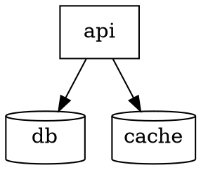
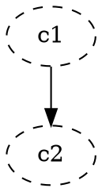
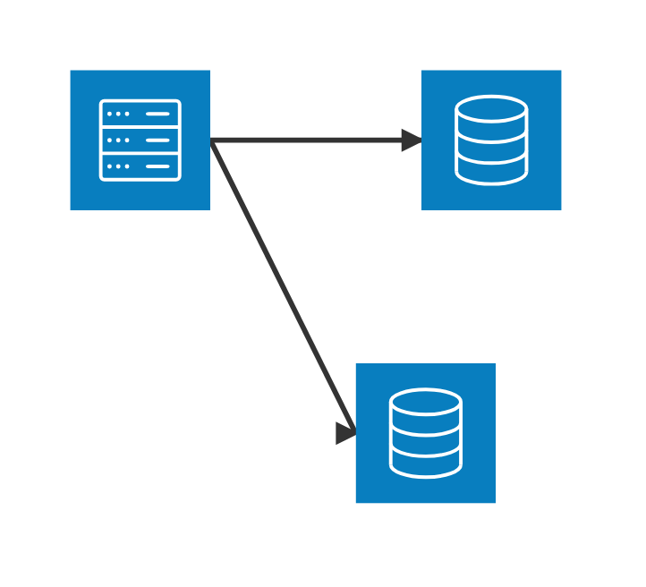
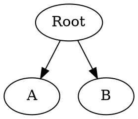
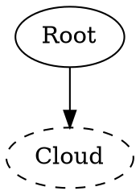
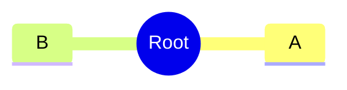
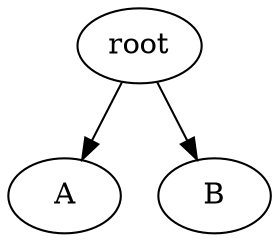
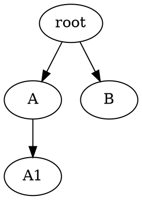

# D2 + DOT Coverage Wave E Implementation Plan

> **For agentic workers:** REQUIRED SUB-SKILL: Use superpowers:subagent-driven-development (recommended) or superpowers:executing-plans to implement this plan task-by-task. Steps use checkbox (`- [ ]`) syntax for tracking.

**Goal:** Add `architecture`, `mindmap`, and `treeView` import + export to D2 and DOT, raising both formats from 4/28 to 7/28 coverage, lossless on same-format round-trip via comment-encoded recovery markers.

**Architecture:** Each new family gets a per-slice `<Family>Mapper` (foreign-doc → typed payload) and `<Family>Exporter`/`<Family>Export` (typed payload → foreign source), mirroring the Wave-2 Class/ER/State layering. Family detection on import extends the existing routing chain (`D2Importer` / `GraphvizImporter`) with new probes; mindmap/treeView are marker-only because they're not structurally distinguishable from a flowchart-shaped tree. Recovery markers (`# diagramkit:*` for D2, `// diagramkit:*` for DOT) carry shape and decoration metadata that has no slot in the foreign format.

**Tech Stack:** Swift 6 strict-concurrency; existing `RecoveryMarkerScanner<Kind>` infrastructure (`Sources/DiagramKitCommon/RecoveryMarker/`); `RoundTripHarness` for round-trip discipline (`Sources/DiagramKitTestSupport/`); swift-testing `@Suite` / `@Test`.

**Spec:** [`docs/superpowers/specs/2026-05-20-d2-dot-coverage-wave-e-design.md`](../specs/2026-05-20-d2-dot-coverage-wave-e-design.md).

**Reusable losses (no new `RoundTripLoss` cases):**
- `RoundTripLoss.idSanitization(original:sanitized:)` — paired to id sanitization on export.
- `RoundTripLoss.deploymentShapeFlattened(serviceID:kindRawValue:)` — paired to architecture shape downgrade on the cross-format direction where the foreign format ignores recovery markers. Reused from the PlantUML deployment spec.

**Diagnostic categories used (no new categories):**
- `.lossyTransform(.shapeDowngrade, …)` — on export when foreign format lacks a native shape and a marker is being emitted alongside for same-format recovery.
- `.informational(.recoveryMarker, …)` — on import when a marker is consumed.

**Deviation from spec (discovered during planning):** The spec's
`tree-collapsed=<id>` marker has no corresponding slot on `TreeViewNode`
(the type has `id: Int`, `level: Int`, `name: String`, `nodeType:
TreeViewNodeType`, `iconId: String?`, `cssClass: String?`,
`description: String?`, `children: [TreeViewNode]` — no `collapsed`
field). Tasks 13-15 omit the `tree-collapsed` marker; treeView
detection is family-marker-only with structural tree projection.
Restoring the `collapsed` flag would require a payload field addition
that is explicitly out of scope.

**Mindmap payload shape:**
- Payload type is `MindmapDiagram` (not `Mindmap`).
- `MindmapNode` fields: `id: Int` (assigned sequentially on import), `nodeId: String` (source identifier — what we use for D2/DOT IDs), `descr: String` (the label), `type: MindmapNodeType` (the shape enum), `children: [MindmapNode]`.
- `MindmapNodeType` is `Int`-backed with cases `.default = 0`, `.roundedRect = 1`, `.rect = 2`, `.circle = 3`, `.cloud = 4`, `.bang = 5`, `.hexagon = 6`. Its `type2Str` property returns the string name we'll use in `mindmap-icon` markers (e.g. `"bang"`, `"rounded-rect"`).

---

## Task 1: D2 ArchitectureMapper (D2Document → ArchitectureDiagram)

**Files:**
- Create: `Sources/DiagramKitD2/D2ArchitectureMapper.swift`
- Test: `Tests/DiagramKitTests/D2ArchitectureMapperTests.swift`

The mapper consumes the existing `D2Document` AST and emits an `ArchitectureDiagram`. Detection signal: ≥2 nodes carry an architecture shape attribute (`shape: cylinder|cloud|queue|page|circle|hexagon`), exposed via `D2ArchitectureProbe.detectsArchitecture(_:)`. Without the marker, mapping is structural; with `# diagramkit:family=architecture`, the threshold is bypassed.

- [ ] **Step 1: Write the failing test**

```swift
// Tests/DiagramKitTests/D2ArchitectureMapperTests.swift
import Testing
import DiagramKitCommon
import DiagramKitModel
@testable import DiagramKitD2

@Suite("D2ArchitectureMapper")
struct D2ArchitectureMapperTests {

    @Test("Detects architecture when two or more nodes carry arch shapes")
    func detectsArchitectureFromShapes() throws {
        let source = """
        api.shape: rectangle
        db.shape: cylinder
        cache.shape: cylinder
        api -> db
        api -> cache
        """
        let parser = D2Parser()
        let (doc, _) = try parser.parse(source)
        #expect(D2ArchitectureProbe.detectsArchitecture(doc))
    }

    @Test("Maps cylinder shape to .database kind")
    func mapsCylinderToDatabase() throws {
        let source = """
        api.shape: rectangle
        db.shape: cylinder
        cache.shape: cylinder
        api -> db
        """
        let parser = D2Parser()
        let (doc, _) = try parser.parse(source)
        let (arch, _) = D2ArchitectureMapper().map(doc, markers: [])
        let db = try #require(arch.services.first(where: { $0.id == "db" }))
        #expect(db.kind == .database)
        let api = try #require(arch.services.first(where: { $0.id == "api" }))
        #expect(api.kind == .service)
    }

    @Test("Container becomes an ArchitectureGroup with parentGroupId set on members")
    func containerBecomesGroup() throws {
        let source = """
        backend: {
          api.shape: rectangle
          db.shape: cylinder
          api -> db
        }
        """
        let parser = D2Parser()
        let (doc, _) = try parser.parse(source)
        let (arch, _) = D2ArchitectureMapper().map(doc, markers: [])
        #expect(arch.groups.count == 1)
        #expect(arch.groups.first?.id == "backend")
        let db = try #require(arch.services.first(where: { $0.id == "db" }))
        #expect(db.parentGroupId == "backend")
    }
}
```

- [ ] **Step 2: Run the test to verify it fails**

Run: `swift test --filter D2ArchitectureMapperTests`
Expected: FAIL with "cannot find type 'D2ArchitectureProbe' in scope" / "cannot find type 'D2ArchitectureMapper' in scope"

- [ ] **Step 3: Implement minimal `D2ArchitectureProbe` + `D2ArchitectureMapper`**

```swift
// Sources/DiagramKitD2/D2ArchitectureMapper.swift
import Foundation
import DiagramKitCommon
import DiagramKitModel

/// Detects whether a `D2Document` should be mapped as an architecture
/// diagram. Returns true when the document contains ≥2 nodes with an
/// architecture-style shape attribute (cylinder, cloud, queue, page,
/// circle, hexagon), biasing toward false negatives so unrelated
/// flowcharts are not misclassified.
public enum D2ArchitectureProbe {
    public static func detectsArchitecture(_ doc: D2Document) -> Bool {
        let archShapes: Set<String> = [
            "cylinder", "cloud", "queue", "page", "circle", "hexagon"
        ]
        var hits = 0
        for stmt in doc.statements {
            guard case .nodeDefinition(let nodeDef) = stmt else { continue }
            if let shape = nodeDef.shape, archShapes.contains(shape) {
                hits += 1
                if hits >= 2 { return true }
            }
        }
        return false
    }
}

public struct D2ArchitectureMapper {
    public init() {}

    public func map(
        _ doc: D2Document,
        markers: [RecoveryMarker<D2RecoveryMarker.Kind>]
    ) -> (ArchitectureDiagram, [DiagramDiagnostic]) {
        var services: [ArchitectureService] = []
        var groups: [ArchitectureGroup] = []
        var edges: [ArchitectureEdge] = []
        var diagnostics: [DiagramDiagnostic] = []
        var containerStack: [String] = []

        for stmt in doc.statements {
            switch stmt {
            case .containerOpen(let open):
                groups.append(ArchitectureGroup(id: open.id, title: open.label, parentGroupId: containerStack.last))
                containerStack.append(open.id)
            case .containerClose:
                if !containerStack.isEmpty { containerStack.removeLast() }
            case .nodeDefinition(let nodeDef):
                let kind = Self.kind(for: nodeDef.shape)
                services.append(ArchitectureService(
                    id: nodeDef.id,
                    title: nodeDef.label ?? nodeDef.id,
                    parentGroupId: containerStack.last,
                    kind: kind
                ))
            case .edgeDefinition(let edgeDef):
                edges.append(ArchitectureEdge(
                    lhsId: edgeDef.source,
                    rhsId: edgeDef.target,
                    lhsDirection: .R,
                    rhsDirection: .L,
                    sourceArrow: edgeDef.sourceArrow,
                    targetArrow: edgeDef.targetArrow,
                    label: edgeDef.label
                ))
            case .direction:
                continue
            }
        }

        applyArchMarkers(services: &services, groups: &groups, markers: markers, diagnostics: &diagnostics)

        return (ArchitectureDiagram(groups: groups, services: services, edges: edges), diagnostics)
    }

    private static func kind(for shape: String?) -> ArchitectureServiceKind {
        switch shape {
        case "cylinder": return .database
        case "cloud":    return .cloud
        case "queue":    return .queue
        case "page":     return .storage
        case "circle":   return .interface
        case "hexagon":  return .component
        default:         return .service
        }
    }

    private func applyArchMarkers(
        services: inout [ArchitectureService],
        groups: inout [ArchitectureGroup],
        markers: [RecoveryMarker<D2RecoveryMarker.Kind>],
        diagnostics: inout [DiagramDiagnostic]
    ) {
        for marker in markers {
            switch marker.kind {
            case .archIcon(let serviceID, let kindRawValue):
                guard let idx = services.firstIndex(where: { $0.id == serviceID }),
                      let restored = ArchitectureServiceKind(rawValue: kindRawValue) else { continue }
                services[idx].kind = restored
                diagnostics.append(.informational(
                    .recoveryMarker,
                    message: "Restored architecture kind '\(kindRawValue)' for service '\(serviceID)' from recovery marker"
                ))
            case .archGroup(let groupID, let parentID):
                guard let idx = groups.firstIndex(where: { $0.id == groupID }) else { continue }
                groups[idx].parentGroupId = parentID.isEmpty ? nil : parentID
            default:
                continue
            }
        }
    }
}
```

Note: This step depends on Task 3 adding `archIcon` and `archGroup` to `D2RecoveryMarker.Kind`. Stub them as unused cases in the marker enum for now — Task 3 will populate the scanner.

- [ ] **Step 4: Run the test to verify it passes**

Run: `swift test --filter D2ArchitectureMapperTests`
Expected: PASS (3 tests)

- [ ] **Step 5: Commit**

```bash
git add Sources/DiagramKitD2/D2ArchitectureMapper.swift Tests/DiagramKitTests/D2ArchitectureMapperTests.swift
git commit -m "$(cat <<'EOF'
Task 1 — D2 architecture mapper: shape→kind, container→group

Adds D2ArchitectureProbe and D2ArchitectureMapper. Probe biases toward
false negatives (≥2 architecture shapes required); marker-driven
escape hatch lives in Task 3. Maps cylinder/cloud/queue/page/circle/
hexagon to the matching ArchitectureServiceKind; D2 containers map to
ArchitectureGroup with parentGroupId carrying the nesting.

Co-Authored-By: Claude Opus 4.7 (1M context) <noreply@anthropic.com>
EOF
)"
```

---

## Task 2: D2 ArchitectureExporter (ArchitectureDiagram → D2 source)

**Files:**
- Create: `Sources/DiagramKitD2/D2ArchitectureExporter.swift`
- Test: `Tests/DiagramKitTests/D2ArchitectureExporterTests.swift`

The exporter emits D2 source from an `ArchitectureDiagram`. Service kinds map back to D2 shape attributes per the table in the spec; kinds outside the D2 shape catalog ride on a `# diagramkit:arch-icon=<rawValue>` marker.

- [ ] **Step 1: Write the failing test**

```swift
// Tests/DiagramKitTests/D2ArchitectureExporterTests.swift
import Testing
import DiagramKitCommon
import DiagramKitModel
import DiagramKitExport
@testable import DiagramKitD2

@Suite("D2ArchitectureExporter")
struct D2ArchitectureExporterTests {

    @Test("Emits shape: cylinder for database kind")
    func emitsCylinderForDatabase() throws {
        let arch = ArchitectureDiagram(
            services: [
                ArchitectureService(id: "api", kind: .service),
                ArchitectureService(id: "db", kind: .database),
            ],
            edges: [
                ArchitectureEdge(lhsId: "api", rhsId: "db",
                                 lhsDirection: .R, rhsDirection: .L,
                                 sourceArrow: false, targetArrow: true)
            ]
        )
        let result = try D2ArchitectureExport.emit(arch, title: nil)
        #expect(result.source.contains("db.shape: cylinder"))
        #expect(result.source.contains("api -> db"))
        // No marker for the database kind — it has a native D2 shape.
        #expect(!result.source.contains("diagramkit:arch-icon=database"))
    }

    @Test("Emits arch-icon marker for kinds without a native D2 shape")
    func emitsMarkerForNonNativeKind() throws {
        let arch = ArchitectureDiagram(
            services: [
                ArchitectureService(id: "n1", kind: .node),
                ArchitectureService(id: "n2", kind: .node),
            ]
        )
        let result = try D2ArchitectureExport.emit(arch, title: nil)
        #expect(result.source.contains("# diagramkit:arch-icon=n1,node"))
        #expect(result.source.contains("# diagramkit:arch-icon=n2,node"))
    }

    @Test("Wraps members in container for group")
    func wrapsGroupAsContainer() throws {
        let arch = ArchitectureDiagram(
            groups: [ArchitectureGroup(id: "backend", title: "Backend")],
            services: [
                ArchitectureService(id: "api", parentGroupId: "backend", kind: .service),
                ArchitectureService(id: "db", parentGroupId: "backend", kind: .database),
            ]
        )
        let result = try D2ArchitectureExport.emit(arch, title: nil)
        #expect(result.source.contains("backend: {"))
        #expect(result.source.contains("api"))
        #expect(result.source.contains("db.shape: cylinder"))
    }
}
```

- [ ] **Step 2: Run the test to verify it fails**

Run: `swift test --filter D2ArchitectureExporterTests`
Expected: FAIL with "cannot find 'D2ArchitectureExport' in scope"

- [ ] **Step 3: Implement `D2ArchitectureExport`**

```swift
// Sources/DiagramKitD2/D2ArchitectureExporter.swift
import Foundation
import DiagramKitCommon
import DiagramKitModel
import DiagramKitExport

enum D2ArchitectureExport {

    static func emit(_ arch: ArchitectureDiagram, title: String?) throws -> DiagramExportResult {
        var lines: [String] = []
        var diagnostics: [DiagramDiagnostic] = []

        if let t = title, !t.isEmpty {
            lines.append("# title: \(D2ArchitectureExport.singleLine(t))")
        }

        // Family marker emitted only when the structural probe alone
        // would not detect architecture (fewer than two arch shapes).
        let nativeArchShapeCount = arch.services.filter { d2ShapeAttr(for: $0.kind) != nil }.count
        if nativeArchShapeCount < 2 {
            lines.append("# diagramkit:family=architecture")
        }

        // Top-level (no parent group) services first.
        for service in arch.services where service.parentGroupId == nil {
            emitService(service, indent: "", lines: &lines, diagnostics: &diagnostics)
        }

        // Groups recursively, depth-first.
        for group in arch.groups where group.parentGroupId == nil {
            emitGroup(group, arch: arch, indent: "", lines: &lines, diagnostics: &diagnostics)
        }

        // Edges last.
        for edge in arch.edges {
            let arrow = edge.sourceArrow && edge.targetArrow
                ? "<->"
                : edge.targetArrow ? "->" : (edge.sourceArrow ? "<-" : "--")
            if let label = edge.label, !label.isEmpty {
                lines.append("\(sanitize(edge.lhsId)) \(arrow) \(sanitize(edge.rhsId)): \"\(escape(label))\"")
            } else {
                lines.append("\(sanitize(edge.lhsId)) \(arrow) \(sanitize(edge.rhsId))")
            }
        }

        return DiagramExportResult(source: lines.joined(separator: "\n") + "\n", diagnostics: diagnostics)
    }

    private static func emitGroup(
        _ group: ArchitectureGroup,
        arch: ArchitectureDiagram,
        indent: String,
        lines: inout [String],
        diagnostics: inout [DiagramDiagnostic]
    ) {
        if let title = group.title, !title.isEmpty {
            lines.append("\(indent)\(sanitize(group.id)): \"\(escape(title))\" {")
        } else {
            lines.append("\(indent)\(sanitize(group.id)): {")
        }
        let inner = indent + "  "
        for service in arch.services where service.parentGroupId == group.id {
            emitService(service, indent: inner, lines: &lines, diagnostics: &diagnostics)
        }
        for child in arch.groups where child.parentGroupId == group.id {
            emitGroup(child, arch: arch, indent: inner, lines: &lines, diagnostics: &diagnostics)
        }
        lines.append("\(indent)}")
    }

    private static func emitService(
        _ service: ArchitectureService,
        indent: String,
        lines: inout [String],
        diagnostics: inout [DiagramDiagnostic]
    ) {
        let id = sanitize(service.id)
        if let title = service.title, !title.isEmpty, title != service.id {
            lines.append("\(indent)\(id): \"\(escape(title))\"")
        } else {
            lines.append("\(indent)\(id)")
        }
        if let shape = d2ShapeAttr(for: service.kind) {
            lines.append("\(indent)\(id).shape: \(shape)")
        } else if service.kind != .service {
            // No native D2 shape — emit recovery marker.
            lines.append("\(indent)\(D2RecoveryMarker.emitArchIcon(serviceID: service.id, kindRawValue: service.kind.rawValue))")
            diagnostics.append(.lossyTransform(
                .shapeDowngrade,
                message: "Service '\(service.id)' kind '\(service.kind.rawValue)' has no native D2 shape; recovery marker carries kind for round-trip"
            ))
        }
    }

    /// Returns the D2 shape name for kinds D2 represents natively, or
    /// `nil` for kinds requiring marker recovery.
    private static func d2ShapeAttr(for kind: ArchitectureServiceKind) -> String? {
        switch kind {
        case .service:   return nil
        case .database:  return "cylinder"
        case .cloud:     return "cloud"
        case .queue:     return "queue"
        case .storage:   return "page"
        case .interface: return "circle"
        case .component: return "hexagon"
        case .node, .artifact, .frame, .folder, .package, .card,
             .stack, .agent, .actor, .boundary:
            return nil
        }
    }

    private static func sanitize(_ raw: String) -> String {
        var out = ""
        for (i, ch) in raw.enumerated() {
            switch ch {
            case "a"..."z", "A"..."Z", "0"..."9", "_":
                if i == 0, ch.isNumber { out.append("_") }
                out.append(ch)
            case " ", "-", ".":
                out.append("_")
            default:
                break
            }
        }
        return out.isEmpty ? "node" : out
    }

    private static func escape(_ s: String) -> String {
        s.replacingOccurrences(of: "\\", with: "\\\\")
         .replacingOccurrences(of: "\"", with: "\\\"")
         .replacingOccurrences(of: "\n", with: "\\n")
         .replacingOccurrences(of: "\r", with: "")
    }

    private static func singleLine(_ s: String) -> String {
        s.replacingOccurrences(of: "\r\n", with: "\n")
         .replacingOccurrences(of: "\r", with: "\n")
         .split(separator: "\n", omittingEmptySubsequences: false)
         .joined(separator: " ")
    }
}
```

This step depends on Task 3 adding `D2RecoveryMarker.emitArchIcon(serviceID:kindRawValue:)`. Stub that emit function inline:

```swift
// add to D2RecoveryMarker temporarily (Task 3 finalizes it):
public static func emitArchIcon(serviceID: String, kindRawValue: String) -> String {
    "# diagramkit:arch-icon=\(serviceID),\(kindRawValue)"
}
```

- [ ] **Step 4: Run the test to verify it passes**

Run: `swift test --filter D2ArchitectureExporterTests`
Expected: PASS (3 tests)

- [ ] **Step 5: Commit**

```bash
git add Sources/DiagramKitD2/D2ArchitectureExporter.swift Sources/DiagramKitD2/D2RecoveryMarker.swift Tests/DiagramKitTests/D2ArchitectureExporterTests.swift
git commit -m "$(cat <<'EOF'
Task 2 — D2 architecture exporter: kind→shape, marker recovery

Emits ArchitectureDiagram as D2 source. Database/cloud/queue/storage/
interface/component kinds map to native D2 shapes; deployment kinds
(node, artifact, frame, …) emit a # diagramkit:arch-icon marker plus a
.lossyTransform(.shapeDowngrade) diagnostic. Containers serialize as
D2 groups with nested member declarations.

Co-Authored-By: Claude Opus 4.7 (1M context) <noreply@anthropic.com>
EOF
)"
```

---

## Task 3: D2RecoveryMarker — register architecture marker kinds + D2Importer/D2Exporter routing

**Files:**
- Modify: `Sources/DiagramKitD2/D2RecoveryMarker.swift`
- Modify: `Sources/DiagramKitD2/D2Importer.swift:11-74`
- Modify: `Sources/DiagramKitD2/D2Exporter.swift:24-37`
- Test: `Tests/DiagramKitTests/D2ArchitectureRoutingTests.swift`

Adds `.archIcon`, `.archGroup`, `.family` cases to `D2RecoveryMarker.Kind`; teaches the scanner to parse them and emit functions to serialize them. Extends `D2Importer.parse(_:)` routing chain to attempt architecture after state and before flowchart fallback. Extends `D2Exporter.export(_:)` to dispatch `.architecture` to `D2ArchitectureExport.emit`.

- [ ] **Step 1: Write the failing routing test**

```swift
// Tests/DiagramKitTests/D2ArchitectureRoutingTests.swift
import Testing
import DiagramKitCommon
import DiagramKitModel
import DiagramKitImport
import DiagramKitExport
@testable import DiagramKitD2

@Suite("D2 architecture routing")
struct D2ArchitectureRoutingTests {

    @Test("Importer routes shape-heavy source to architecture payload")
    func importerRoutesArchitecture() throws {
        let source = """
        api.shape: rectangle
        db.shape: cylinder
        cache.shape: cylinder
        api -> db
        api -> cache
        """
        let result = try D2Importer().parse(source)
        guard case .architecture = result.document.payload else {
            Issue.record("expected architecture payload, got \(result.document.payload)")
            return
        }
    }

    @Test("Importer routes family marker even without ≥2 native shapes")
    func markerForcesArchitecture() throws {
        let source = """
        # diagramkit:family=architecture
        a -> b
        """
        let result = try D2Importer().parse(source)
        guard case .architecture = result.document.payload else {
            Issue.record("expected architecture payload, got \(result.document.payload)")
            return
        }
    }

    @Test("Exporter dispatches architecture payload to D2ArchitectureExport")
    func exporterDispatchesArchitecture() throws {
        let arch = ArchitectureDiagram(
            services: [
                ArchitectureService(id: "api", kind: .service),
                ArchitectureService(id: "db", kind: .database),
            ]
        )
        let document = DiagramDocument(payload: .architecture(arch))
        let result = try D2Exporter().export(document)
        guard case .source(let source, _) = result else {
            Issue.record("expected source result, got unsupported")
            return
        }
        #expect(source.contains("db.shape: cylinder"))
    }
}
```

- [ ] **Step 2: Run the test to verify it fails**

Run: `swift test --filter D2ArchitectureRoutingTests`
Expected: FAIL — importer returns `.flowchart`, exporter returns `.unsupportedDiagram`.

- [ ] **Step 3: Extend `D2RecoveryMarker` with arch kinds**

Replace `D2RecoveryMarker.Kind` and the scanner/emit functions:

```swift
public enum Kind: Sendable, Equatable {
    case classStereotype(className: String, stereotype: String)
    case stateAction(ownerStateId: String, phase: StateActionPhase, label: String)
    case erCardinality(relationshipId: String, source: String, target: String)
    case archIcon(serviceID: String, kindRawValue: String)
    case archGroup(groupID: String, parentGroupID: String)
    case family(name: String)
}

public static let scanner = RecoveryMarkerScanner<Kind>(commentPrefix: "#") { rest in
    parseKind(rest)
}

private static func parseKind(_ rest: String) -> Kind? {
    if let args = stripPrefix("class-stereotype=", rest) {
        let fields = args.split(separator: ",", maxSplits: 1, omittingEmptySubsequences: false)
        guard fields.count == 2 else { return nil }
        return .classStereotype(className: String(fields[0]), stereotype: String(fields[1]))
    }
    if let args = stripPrefix("state-action=", rest) {
        let fields = args.split(separator: ",", maxSplits: 2, omittingEmptySubsequences: false)
        guard fields.count == 3, let phase = StateActionPhase(rawValue: String(fields[1])) else { return nil }
        return .stateAction(ownerStateId: String(fields[0]), phase: phase, label: String(fields[2]))
    }
    if let args = stripPrefix("er-cardinality=", rest) {
        let fields = args.split(separator: ",", maxSplits: 2, omittingEmptySubsequences: false)
        guard fields.count == 3 else { return nil }
        return .erCardinality(relationshipId: String(fields[0]), source: String(fields[1]), target: String(fields[2]))
    }
    if let args = stripPrefix("arch-icon=", rest) {
        let fields = args.split(separator: ",", maxSplits: 1, omittingEmptySubsequences: false)
        guard fields.count == 2 else { return nil }
        return .archIcon(serviceID: String(fields[0]), kindRawValue: String(fields[1]))
    }
    if let args = stripPrefix("arch-group=", rest) {
        let fields = args.split(separator: ",", maxSplits: 1, omittingEmptySubsequences: false)
        guard fields.count == 2 else { return nil }
        return .archGroup(groupID: String(fields[0]), parentGroupID: String(fields[1]))
    }
    if let args = stripPrefix("family=", rest) {
        return .family(name: args)
    }
    return nil
}

public static func emitArchIcon(serviceID: String, kindRawValue: String) -> String {
    "# diagramkit:arch-icon=\(sanitize(serviceID)),\(sanitize(kindRawValue))"
}

public static func emitArchGroup(groupID: String, parentGroupID: String) -> String {
    "# diagramkit:arch-group=\(sanitize(groupID)),\(sanitize(parentGroupID))"
}

public static func emitFamily(_ name: String) -> String {
    "# diagramkit:family=\(name)"
}
```

- [ ] **Step 4: Extend `D2Importer.parse(_:)` routing chain**

Insert immediately before the existing `D2Mapper` fallback (replace the existing `let mapper = D2Mapper()` block start at line 65 with):

```swift
// Marker-forced family takes precedence over structural probes.
let markerFamily = markerScan.markers.compactMap { marker -> String? in
    if case .family(let name) = marker.kind { return name } else { return nil }
}.first

if markerFamily == "architecture" || D2ArchitectureProbe.detectsArchitecture(d2Doc) {
    let (arch, archDiagnostics) = D2ArchitectureMapper().map(d2Doc, markers: markerScan.markers)
    var document = DiagramDocument(payload: .architecture(arch))
    document.title = Self.documentTitleMetadata(in: source)
    return DiagramImportResult(
        document: document,
        diagnostics: parseDiagnostics + archDiagnostics
    )
}

let mapper = D2Mapper()
// … rest unchanged
```

Add `.architecture` to `supportedDiagramTypes` on line 15-20:

```swift
public let supportedDiagramTypes: Set<DiagramType> = [
    .flowchart,
    .classDiagram,
    .stateDiagram,
    .erDiagram,
    .architecture,
]
```

- [ ] **Step 5: Extend `D2Exporter.export(_:)` dispatch**

Replace the `switch document.payload` block (line 25-37) to add the architecture case:

```swift
switch document.payload {
case .flowchart(let model):
    return try D2FlowchartExport.emit(model, title: document.title)
case .classDiagram(let model):
    return try D2ClassExport.emit(model, title: document.title)
case .stateDiagram(let graph):
    return try D2StateExport.emit(graph, title: document.title)
case .erDiagram(let model):
    return try D2ERExport.emit(model, title: document.title)
case .architecture(let arch):
    return try D2ArchitectureExport.emit(arch, title: document.title)
default:
    return .unsupportedDiagram(formatName: name, type: document.type)
}
```

Add `.architecture` to `supportedDiagramTypes` (line 15-20) symmetrically.

- [ ] **Step 6: Run the routing test to verify it passes**

Run: `swift test --filter D2ArchitectureRoutingTests`
Expected: PASS (3 tests)

- [ ] **Step 7: Run the full D2 test suite to verify no regressions**

Run: `swift test --filter D2`
Expected: PASS (existing flowchart/class/state/er tests still pass).

- [ ] **Step 8: Commit**

```bash
git add Sources/DiagramKitD2/D2RecoveryMarker.swift Sources/DiagramKitD2/D2Importer.swift Sources/DiagramKitD2/D2Exporter.swift Tests/DiagramKitTests/D2ArchitectureRoutingTests.swift
git commit -m "$(cat <<'EOF'
Task 3 — D2 architecture routing + recovery markers

Registers archIcon, archGroup, family marker kinds with
D2RecoveryMarker. Extends D2Importer routing chain to attempt
architecture detection (marker-forced or ≥2 native arch shapes) before
the flowchart fallback. D2Exporter dispatches .architecture payloads
to D2ArchitectureExport.

Co-Authored-By: Claude Opus 4.7 (1M context) <noreply@anthropic.com>
EOF
)"
```

---

## Task 4: d2-architecture same-format fixture + harness cell + suite test

**Files:**
- Create: `Tests/DiagramKitTests/RoundTrip/Resources/roundtrip/d2-architecture/01-basic.d2`
- Create: `Tests/DiagramKitTests/RoundTrip/Resources/roundtrip/d2-architecture/02-grouped.d2`
- Modify: `Tests/DiagramKitTests/RoundTrip/RoundTripCellRegistry.swift:265` (after `dotEr`, before `structurizrC4`)
- Modify: `Tests/DiagramKitTests/RoundTrip/SameFormatRoundTripTests.swift` (add new `@Test`)

- [ ] **Step 1: Create the `01-basic.d2` fixture**

```d2
api.shape: rectangle
db.shape: cylinder
cache.shape: cylinder
api -> db
api -> cache
```

- [ ] **Step 2: Create the `02-grouped.d2` fixture**

```d2
backend: "Backend" {
  api
  db.shape: cylinder
  queue1.shape: queue
  api -> db
  api -> queue1
}
frontend: "Frontend" {
  web.shape: rectangle
  web -> backend.api
}
```

- [ ] **Step 3: Register the cell**

Add to `RoundTripCellRegistry.swift` after `dotEr` (line ≈ 269):

```swift
static let d2Architecture = RoundTripCell(
    importer: D2Importer(),
    exporter: D2Exporter(),
    family: DiagramType.architecture,
    allowedLosses: [.idSanitization]
)
```

- [ ] **Step 4: Add the suite test**

Append to `SameFormatRoundTripTests.swift`:

```swift
@Test(
    "D2 architecture round-trip",
    arguments: try fixtures(for: "d2-architecture", fromRoot: roundTripResourcesRoot())
)
func d2Architecture(fixture: RoundTripFixture) throws {
    try runSameFormatRoundTrip(
        cell: RoundTripCellRegistry.d2Architecture,
        fixture: fixture
    )
}
```

- [ ] **Step 5: Run the harness**

Run: `swift test --filter SameFormatRoundTripTests/d2Architecture`
Expected: PASS (2 fixtures).

If failing, the typical causes are (a) the exporter doesn't emit identical structure for the imported source (compare `source` to the second-pass export), or (b) an unallowed loss appears — add it to `allowedLosses` only if it's a known acceptable approximation.

- [ ] **Step 6: Commit**

```bash
git add Tests/DiagramKitTests/RoundTrip/Resources/roundtrip/d2-architecture Tests/DiagramKitTests/RoundTrip/RoundTripCellRegistry.swift Tests/DiagramKitTests/RoundTrip/SameFormatRoundTripTests.swift
git commit -m "$(cat <<'EOF'
Task 4 — d2-architecture same-format round-trip fixture + suite

Adds two fixtures (basic + grouped) and registers d2Architecture cell
with .idSanitization-only allowed losses. Marker recovery handles
kind round-trip transparently so no shape-downgrade loss is observed.

Co-Authored-By: Claude Opus 4.7 (1M context) <noreply@anthropic.com>
EOF
)"
```

---

## Task 5: DOT ArchitectureMapper (DOTDocument → ArchitectureDiagram)

**Files:**
- Create: `Sources/DiagramKitGraphviz/DOTArchitectureMapper.swift`
- Test: `Tests/DiagramKitTests/DOTArchitectureMapperTests.swift`

Mirrors `D2ArchitectureMapper`. Detection signal: ≥2 nodes with `shape=cylinder|component|note|folder|cylinder|circle|hexagon` or explicit marker. `subgraph cluster_X { … }` maps to `ArchitectureGroup`.

- [ ] **Step 1: Write the failing test**

```swift
// Tests/DiagramKitTests/DOTArchitectureMapperTests.swift
import Testing
import DiagramKitCommon
import DiagramKitModel
@testable import DiagramKitGraphviz

@Suite("DOTArchitectureMapper")
struct DOTArchitectureMapperTests {

    @Test("Detects architecture when ≥2 nodes carry arch shape attributes")
    func detectsArchitectureFromShapes() throws {
        let source = """
        digraph G {
          api [shape=box];
          db [shape=cylinder];
          cache [shape=cylinder];
          api -> db;
          api -> cache;
        }
        """
        let parser = DOTParser()
        let (doc, _) = try parser.parse(source)
        #expect(DOTArchitectureProbe.detectsArchitecture(doc))
    }

    @Test("Maps cylinder shape to .database kind")
    func mapsCylinderToDatabase() throws {
        let source = """
        digraph G {
          db [shape=cylinder];
          cache [shape=cylinder];
        }
        """
        let parser = DOTParser()
        let (doc, _) = try parser.parse(source)
        let (arch, _) = DOTArchitectureMapper().map(doc, markers: [])
        let db = try #require(arch.services.first(where: { $0.id == "db" }))
        #expect(db.kind == .database)
    }

    @Test("Cluster becomes an ArchitectureGroup with parentGroupId on members")
    func clusterBecomesGroup() throws {
        let source = """
        digraph G {
          subgraph cluster_backend {
            label = "Backend";
            api [shape=box];
            db [shape=cylinder];
          }
        }
        """
        let parser = DOTParser()
        let (doc, _) = try parser.parse(source)
        let (arch, _) = DOTArchitectureMapper().map(doc, markers: [])
        let group = try #require(arch.groups.first)
        #expect(group.id == "backend")
        let db = try #require(arch.services.first(where: { $0.id == "db" }))
        #expect(db.parentGroupId == "backend")
    }
}
```

- [ ] **Step 2: Run to verify failure**

Run: `swift test --filter DOTArchitectureMapperTests`
Expected: FAIL — types not in scope.

- [ ] **Step 3: Implement `DOTArchitectureProbe` + `DOTArchitectureMapper`**

```swift
// Sources/DiagramKitGraphviz/DOTArchitectureMapper.swift
import Foundation
import DiagramKitCommon
import DiagramKitModel

public enum DOTArchitectureProbe {
    public static func detectsArchitecture(_ doc: DOTDocument) -> Bool {
        let archShapes: Set<String> = [
            "cylinder", "component", "note", "folder",
            "box3d", "circle", "hexagon", "oval"
        ]
        var hits = 0
        for stmt in doc.statements {
            guard case .nodeStatement(let n) = stmt else { continue }
            if let shape = n.attributes.first(where: { $0.key == "shape" })?.value,
               archShapes.contains(shape) {
                hits += 1
                if hits >= 2 { return true }
            }
        }
        return false
    }
}

public struct DOTArchitectureMapper {
    public init() {}

    public func map(
        _ doc: DOTDocument,
        markers: [RecoveryMarker<DOTRecoveryMarker.Kind>]
    ) -> (ArchitectureDiagram, [DiagramDiagnostic]) {
        var services: [ArchitectureService] = []
        var groups: [ArchitectureGroup] = []
        var edges: [ArchitectureEdge] = []
        var diagnostics: [DiagramDiagnostic] = []

        walk(statements: doc.statements, parentGroup: nil,
             services: &services, groups: &groups, edges: &edges)

        applyArchMarkers(services: &services, groups: &groups, markers: markers, diagnostics: &diagnostics)

        return (ArchitectureDiagram(groups: groups, services: services, edges: edges), diagnostics)
    }

    private func walk(
        statements: [DOTStatement],
        parentGroup: String?,
        services: inout [ArchitectureService],
        groups: inout [ArchitectureGroup],
        edges: inout [ArchitectureEdge]
    ) {
        for stmt in statements {
            switch stmt {
            case .nodeStatement(let n):
                let shape = n.attributes.first(where: { $0.key == "shape" })?.value
                let label = n.attributes.first(where: { $0.key == "label" })?.value
                services.append(ArchitectureService(
                    id: n.id,
                    title: label ?? n.id,
                    parentGroupId: parentGroup,
                    kind: Self.kind(for: shape)
                ))
            case .edgeStatement(let e):
                let label = e.attributes.first(where: { $0.key == "label" })?.value
                edges.append(ArchitectureEdge(
                    lhsId: e.source,
                    rhsId: e.target,
                    lhsDirection: .R,
                    rhsDirection: .L,
                    sourceArrow: false,
                    targetArrow: e.directed,
                    label: label
                ))
            case .subgraph(let sub):
                let groupID = Self.unprefixCluster(sub.id ?? "")
                // DOT subgraphs carry their label via a graph-level attr
                // statement inside `statements`. Use the helper.
                let attrs = sub.statements.compactMap { stmt -> [DOTAttribute]? in
                    if case .graphAttr(let key, let value) = stmt { return [DOTAttribute(key: key, value: value)] }
                    return nil
                }.flatMap { $0 }
                let title = sub.displayLabel(from: attrs)
                groups.append(ArchitectureGroup(id: groupID, title: title, parentGroupId: parentGroup))
                walk(statements: sub.statements, parentGroup: groupID,
                     services: &services, groups: &groups, edges: &edges)
            default:
                continue
            }
        }
    }

    private static func unprefixCluster(_ name: String) -> String {
        name.hasPrefix("cluster_") ? String(name.dropFirst("cluster_".count)) : name
    }

    private static func kind(for shape: String?) -> ArchitectureServiceKind {
        switch shape {
        case "cylinder":  return .database
        case "oval":      return .cloud
        case "box3d":     return .queue
        case "folder":    return .storage
        case "circle":    return .interface
        case "component": return .component
        case "hexagon":   return .component
        case "note":      return .artifact
        default:          return .service
        }
    }

    private func applyArchMarkers(
        services: inout [ArchitectureService],
        groups: inout [ArchitectureGroup],
        markers: [RecoveryMarker<DOTRecoveryMarker.Kind>],
        diagnostics: inout [DiagramDiagnostic]
    ) {
        for marker in markers {
            switch marker.kind {
            case .archIcon(let serviceID, let kindRawValue):
                guard let idx = services.firstIndex(where: { $0.id == serviceID }),
                      let restored = ArchitectureServiceKind(rawValue: kindRawValue) else { continue }
                services[idx].kind = restored
                diagnostics.append(.informational(
                    .recoveryMarker,
                    message: "Restored architecture kind '\(kindRawValue)' for service '\(serviceID)' from recovery marker"
                ))
            case .archGroup(let groupID, let parentID):
                guard let idx = groups.firstIndex(where: { $0.id == groupID }) else { continue }
                groups[idx].parentGroupId = parentID.isEmpty ? nil : parentID
            default:
                continue
            }
        }
    }
}
```

Depends on Task 7 adding `.archIcon`, `.archGroup`, `.family` to `DOTRecoveryMarker.Kind`. Stub them temporarily.

- [ ] **Step 4: Run to verify pass**

Run: `swift test --filter DOTArchitectureMapperTests`
Expected: PASS (3 tests).

- [ ] **Step 5: Commit**

```bash
git add Sources/DiagramKitGraphviz/DOTArchitectureMapper.swift Tests/DiagramKitTests/DOTArchitectureMapperTests.swift
git commit -m "$(cat <<'EOF'
Task 5 — DOT architecture mapper: shape→kind, cluster→group

DOTArchitectureProbe biases toward false negatives (≥2 arch shapes).
Maps cylinder/oval/box3d/folder/circle/component/note/hexagon to the
matching ArchitectureServiceKind; cluster_<name> subgraphs become
ArchitectureGroup with parentGroupId carrying nesting.

Co-Authored-By: Claude Opus 4.7 (1M context) <noreply@anthropic.com>
EOF
)"
```

---

## Task 6: DOT ArchitectureExport (ArchitectureDiagram → DOT source)

**Files:**
- Create: `Sources/DiagramKitGraphviz/DOTArchitectureExport.swift`
- Test: `Tests/DiagramKitTests/DOTArchitectureExportTests.swift`

- [ ] **Step 1: Write the failing test**

```swift
// Tests/DiagramKitTests/DOTArchitectureExportTests.swift
import Testing
import DiagramKitCommon
import DiagramKitModel
import DiagramKitExport
@testable import DiagramKitGraphviz

@Suite("DOTArchitectureExport")
struct DOTArchitectureExportTests {

    @Test("Emits shape=cylinder for database kind")
    func emitsCylinderForDatabase() throws {
        let arch = ArchitectureDiagram(
            services: [
                ArchitectureService(id: "api", kind: .service),
                ArchitectureService(id: "db", kind: .database),
            ],
            edges: [
                ArchitectureEdge(lhsId: "api", rhsId: "db",
                                 lhsDirection: .R, rhsDirection: .L,
                                 sourceArrow: false, targetArrow: true)
            ]
        )
        let result = try DOTArchitectureExport.emit(arch, title: nil)
        #expect(result.source.contains("db [shape=cylinder"))
        #expect(result.source.contains("api -> db"))
    }

    @Test("Cloud kind emits shape=oval + .shapeDowngrade diagnostic + marker")
    func cloudKindIsLossy() throws {
        let arch = ArchitectureDiagram(
            services: [
                ArchitectureService(id: "c1", kind: .cloud),
                ArchitectureService(id: "c2", kind: .cloud),
            ]
        )
        let result = try DOTArchitectureExport.emit(arch, title: nil)
        #expect(result.source.contains("shape=oval"))
        #expect(result.source.contains("// diagramkit:arch-icon=c1,cloud"))
        let shapeDowngrades = result.diagnostics.filter {
            if case .lossyTransform(.shapeDowngrade, _) = $0 { return true }
            return false
        }
        #expect(shapeDowngrades.count == 2)
    }

    @Test("Wraps group members in cluster_<id> subgraph")
    func groupBecomesCluster() throws {
        let arch = ArchitectureDiagram(
            groups: [ArchitectureGroup(id: "backend", title: "Backend")],
            services: [
                ArchitectureService(id: "api", parentGroupId: "backend", kind: .service),
            ]
        )
        let result = try DOTArchitectureExport.emit(arch, title: nil)
        #expect(result.source.contains("subgraph cluster_backend"))
        #expect(result.source.contains("label = \"Backend\""))
    }
}
```

- [ ] **Step 2: Run to verify failure**

Run: `swift test --filter DOTArchitectureExportTests`
Expected: FAIL — `DOTArchitectureExport` not in scope.

- [ ] **Step 3: Implement `DOTArchitectureExport`**

```swift
// Sources/DiagramKitGraphviz/DOTArchitectureExport.swift
import Foundation
import DiagramKitCommon
import DiagramKitModel
import DiagramKitExport

enum DOTArchitectureExport {

    static func emit(_ arch: ArchitectureDiagram, title: String?) throws -> DiagramExportResult {
        var lines: [String] = []
        var diagnostics: [DiagramDiagnostic] = []

        lines.append("digraph G {")
        if let t = title, !t.isEmpty {
            lines.append("  // title: \(singleLine(t))")
        }

        // Emit family marker when structural probe alone would not detect arch.
        let nativeArchShapeCount = arch.services.filter { shapeAttr(for: $0.kind).native }.count
        if nativeArchShapeCount < 2 {
            lines.append("  // diagramkit:family=architecture")
        }

        // Top-level services
        for service in arch.services where service.parentGroupId == nil {
            emitService(service, indent: "  ", lines: &lines, diagnostics: &diagnostics)
        }

        // Groups (clusters)
        for group in arch.groups where group.parentGroupId == nil {
            emitGroup(group, arch: arch, indent: "  ", lines: &lines, diagnostics: &diagnostics)
        }

        // Edges
        for edge in arch.edges {
            let arrow = edge.targetArrow ? "->" : "--"
            if let label = edge.label, !label.isEmpty {
                lines.append("  \(sanitize(edge.lhsId)) \(arrow) \(sanitize(edge.rhsId)) [label=\"\(escape(label))\"];")
            } else {
                lines.append("  \(sanitize(edge.lhsId)) \(arrow) \(sanitize(edge.rhsId));")
            }
        }

        lines.append("}")
        return DiagramExportResult(source: lines.joined(separator: "\n") + "\n", diagnostics: diagnostics)
    }

    private static func emitGroup(
        _ group: ArchitectureGroup,
        arch: ArchitectureDiagram,
        indent: String,
        lines: inout [String],
        diagnostics: inout [DiagramDiagnostic]
    ) {
        lines.append("\(indent)subgraph cluster_\(sanitize(group.id)) {")
        let inner = indent + "  "
        if let title = group.title, !title.isEmpty {
            lines.append("\(inner)label = \"\(escape(title))\";")
        }
        for service in arch.services where service.parentGroupId == group.id {
            emitService(service, indent: inner, lines: &lines, diagnostics: &diagnostics)
        }
        for child in arch.groups where child.parentGroupId == group.id {
            emitGroup(child, arch: arch, indent: inner, lines: &lines, diagnostics: &diagnostics)
        }
        lines.append("\(indent)}")
    }

    private static func emitService(
        _ service: ArchitectureService,
        indent: String,
        lines: inout [String],
        diagnostics: inout [DiagramDiagnostic]
    ) {
        let id = sanitize(service.id)
        let mapped = shapeAttr(for: service.kind)
        var attrs: [String] = []
        if let title = service.title, !title.isEmpty, title != service.id {
            attrs.append("label=\"\(escape(title))\"")
        }
        if let shape = mapped.shape {
            attrs.append("shape=\(shape)")
        }
        if let style = mapped.style {
            attrs.append("style=\(style)")
        }
        if attrs.isEmpty {
            lines.append("\(indent)\(id);")
        } else {
            lines.append("\(indent)\(id) [\(attrs.joined(separator: ", "))];")
        }

        if !mapped.native && service.kind != .service {
            lines.append("\(indent)\(DOTRecoveryMarker.emitArchIcon(serviceID: service.id, kindRawValue: service.kind.rawValue))")
            diagnostics.append(.lossyTransform(
                .shapeDowngrade,
                message: "Service '\(service.id)' kind '\(service.kind.rawValue)' approximated to DOT shape '\(mapped.shape ?? "box")'; recovery marker preserves kind"
            ))
        }
    }

    /// Returns the DOT shape (and optional `style`) for `kind`. `native`
    /// is true when DOT can represent the kind without approximation.
    private static func shapeAttr(for kind: ArchitectureServiceKind) -> (shape: String?, style: String?, native: Bool) {
        switch kind {
        case .service:   return (nil, nil, true)
        case .database:  return ("cylinder", nil, true)
        case .cloud:     return ("oval", "dashed", false)
        case .queue:     return ("box3d", nil, false)
        case .storage:   return ("folder", nil, false)
        case .interface: return ("circle", nil, true)
        case .component: return ("component", nil, true)
        case .node, .artifact, .frame, .folder, .package, .card,
             .stack, .agent, .actor, .boundary:
            return ("box", nil, false)
        }
    }

    private static func sanitize(_ raw: String) -> String {
        var out = ""
        for (i, ch) in raw.enumerated() {
            switch ch {
            case "a"..."z", "A"..."Z", "0"..."9", "_":
                if i == 0, ch.isNumber { out.append("_") }
                out.append(ch)
            case " ", "-", ".":
                out.append("_")
            default:
                break
            }
        }
        return out.isEmpty ? "node" : out
    }

    private static func escape(_ s: String) -> String {
        s.replacingOccurrences(of: "\\", with: "\\\\")
         .replacingOccurrences(of: "\"", with: "\\\"")
         .replacingOccurrences(of: "\n", with: "\\n")
         .replacingOccurrences(of: "\r", with: "")
    }

    private static func singleLine(_ s: String) -> String {
        s.replacingOccurrences(of: "\r\n", with: "\n")
         .replacingOccurrences(of: "\r", with: "\n")
         .split(separator: "\n", omittingEmptySubsequences: false)
         .joined(separator: " ")
    }
}
```

Depends on Task 7 adding `DOTRecoveryMarker.emitArchIcon`. Stub it temporarily.

- [ ] **Step 4: Run to verify pass**

Run: `swift test --filter DOTArchitectureExportTests`
Expected: PASS (3 tests).

- [ ] **Step 5: Commit**

```bash
git add Sources/DiagramKitGraphviz/DOTArchitectureExport.swift Tests/DiagramKitTests/DOTArchitectureExportTests.swift
git commit -m "$(cat <<'EOF'
Task 6 — DOT architecture exporter: kind→shape, marker recovery

Service/database/interface/component map natively; cloud/queue/storage
+ deployment kinds emit DOT-approximate shape attrs plus a
// diagramkit:arch-icon marker and a .lossyTransform(.shapeDowngrade)
diagnostic. Group → subgraph cluster_<id>; nesting preserved.

Co-Authored-By: Claude Opus 4.7 (1M context) <noreply@anthropic.com>
EOF
)"
```

---

## Task 7: DOTRecoveryMarker — register architecture marker kinds + GraphvizImporter/DOTExporter routing

**Files:**
- Modify: `Sources/DiagramKitGraphviz/DOTRecoveryMarker.swift`
- Modify: `Sources/DiagramKitGraphviz/GraphvizImporter.swift`
- Modify: `Sources/DiagramKitGraphviz/DOTExporter.swift`
- Test: `Tests/DiagramKitTests/DOTArchitectureRoutingTests.swift`

Mirrors Task 3 for the DOT slice.

- [ ] **Step 1: Write the failing test**

```swift
// Tests/DiagramKitTests/DOTArchitectureRoutingTests.swift
import Testing
import DiagramKitCommon
import DiagramKitModel
import DiagramKitImport
import DiagramKitExport
@testable import DiagramKitGraphviz

@Suite("DOT architecture routing")
struct DOTArchitectureRoutingTests {

    @Test("Importer routes shape-heavy DOT source to architecture payload")
    func importerRoutesArchitecture() throws {
        let source = """
        digraph G {
          api [shape=box];
          db [shape=cylinder];
          cache [shape=cylinder];
          api -> db;
          api -> cache;
        }
        """
        let result = try GraphvizImporter().parse(source)
        guard case .architecture = result.document.payload else {
            Issue.record("expected architecture payload, got \(result.document.payload)")
            return
        }
    }

    @Test("Importer routes family marker even without ≥2 native shapes")
    func markerForcesArchitecture() throws {
        let source = """
        digraph G {
          // diagramkit:family=architecture
          a -> b;
        }
        """
        let result = try GraphvizImporter().parse(source)
        guard case .architecture = result.document.payload else {
            Issue.record("expected architecture payload, got \(result.document.payload)")
            return
        }
    }

    @Test("Exporter dispatches architecture payload to DOTArchitectureExport")
    func exporterDispatchesArchitecture() throws {
        let arch = ArchitectureDiagram(
            services: [
                ArchitectureService(id: "api", kind: .service),
                ArchitectureService(id: "db", kind: .database),
            ]
        )
        let document = DiagramDocument(payload: .architecture(arch))
        let result = try DOTExporter().export(document)
        guard case .source(let source, _) = result else {
            Issue.record("expected source result, got unsupported")
            return
        }
        #expect(source.contains("shape=cylinder"))
    }
}
```

- [ ] **Step 2: Run to verify failure**

Run: `swift test --filter DOTArchitectureRoutingTests`
Expected: FAIL — importer returns `.flowchart`, exporter returns `.unsupportedDiagram`.

- [ ] **Step 3: Extend `DOTRecoveryMarker`**

Add to `DOTRecoveryMarker.Kind`:

```swift
case archIcon(serviceID: String, kindRawValue: String)
case archGroup(groupID: String, parentGroupID: String)
case family(name: String)
```

Extend `parseKind` to handle `arch-icon=`, `arch-group=`, `family=` prefixes. Mirror the D2 implementation but with `//` comment prefix in the scanner constructor.

Add emit functions:

```swift
public static func emitArchIcon(serviceID: String, kindRawValue: String) -> String {
    "// diagramkit:arch-icon=\(sanitize(serviceID)),\(sanitize(kindRawValue))"
}

public static func emitArchGroup(groupID: String, parentGroupID: String) -> String {
    "// diagramkit:arch-group=\(sanitize(groupID)),\(sanitize(parentGroupID))"
}

public static func emitFamily(_ name: String) -> String {
    "// diagramkit:family=\(name)"
}
```

- [ ] **Step 4: Extend `GraphvizImporter.parse(_:)` routing**

Insert before the final `.flowchart` return:

```swift
let markerFamily = markerScan.markers.compactMap { marker -> String? in
    if case .family(let name) = marker.kind { return name } else { return nil }
}.first

if markerFamily == "architecture" || DOTArchitectureProbe.detectsArchitecture(doc) {
    let (arch, archDiagnostics) = DOTArchitectureMapper().map(doc, markers: markerScan.markers)
    var document = DiagramDocument(payload: .architecture(arch))
    document.title = Self.documentTitleMetadata(in: source)
    return DiagramImportResult(
        document: document,
        diagnostics: parseDiagnostics + archDiagnostics
    )
}
```

Add `.architecture` to `supportedDiagramTypes`.

- [ ] **Step 5: Extend `DOTExporter.export(_:)` dispatch**

Add `case .architecture(let arch)` returning `try DOTArchitectureExport.emit(arch, title: document.title)`. Add `.architecture` to `supportedDiagramTypes`.

- [ ] **Step 6: Run the routing test**

Run: `swift test --filter DOTArchitectureRoutingTests`
Expected: PASS (3 tests).

- [ ] **Step 7: Run the full DOT/Graphviz test suite**

Run: `swift test --filter Graphviz`
Expected: PASS (existing tests still pass).

- [ ] **Step 8: Commit**

```bash
git add Sources/DiagramKitGraphviz/DOTRecoveryMarker.swift Sources/DiagramKitGraphviz/GraphvizImporter.swift Sources/DiagramKitGraphviz/DOTExporter.swift Tests/DiagramKitTests/DOTArchitectureRoutingTests.swift
git commit -m "$(cat <<'EOF'
Task 7 — DOT architecture routing + recovery markers

Registers archIcon, archGroup, family marker kinds with
DOTRecoveryMarker. Extends GraphvizImporter routing to attempt
architecture detection before the flowchart fallback. DOTExporter
dispatches .architecture payloads to DOTArchitectureExport.

Co-Authored-By: Claude Opus 4.7 (1M context) <noreply@anthropic.com>
EOF
)"
```

---

## Task 8: dot-architecture same-format fixture + harness cell + suite test

**Files:**
- Create: `Tests/DiagramKitTests/RoundTrip/Resources/roundtrip/dot-architecture/01-basic.dot`
- Create: `Tests/DiagramKitTests/RoundTrip/Resources/roundtrip/dot-architecture/02-downgrade.dot`
- Modify: `Tests/DiagramKitTests/RoundTrip/RoundTripCellRegistry.swift`
- Modify: `Tests/DiagramKitTests/RoundTrip/SameFormatRoundTripTests.swift`

- [ ] **Step 1: Create `01-basic.dot` fixture**



- [ ] **Step 2: Create `02-downgrade.dot` fixture**

This fixture exercises the `cloud` shape downgrade and marker recovery:



- [ ] **Step 3: Register the cell**

Add after `d2Architecture` in `RoundTripCellRegistry.swift`:

```swift
static let dotArchitecture = RoundTripCell(
    importer: GraphvizImporter(),
    exporter: DOTExporter(),
    family: DiagramType.architecture,
    allowedLosses: [.idSanitization]
)
```

- [ ] **Step 4: Add suite test**

```swift
@Test(
    "DOT architecture round-trip",
    arguments: try fixtures(for: "dot-architecture", fromRoot: roundTripResourcesRoot())
)
func dotArchitecture(fixture: RoundTripFixture) throws {
    try runSameFormatRoundTrip(
        cell: RoundTripCellRegistry.dotArchitecture,
        fixture: fixture
    )
}
```

- [ ] **Step 5: Run the harness**

Run: `swift test --filter SameFormatRoundTripTests/dotArchitecture`
Expected: PASS (2 fixtures).

- [ ] **Step 6: Commit**

```bash
git add Tests/DiagramKitTests/RoundTrip/Resources/roundtrip/dot-architecture Tests/DiagramKitTests/RoundTrip/RoundTripCellRegistry.swift Tests/DiagramKitTests/RoundTrip/SameFormatRoundTripTests.swift
git commit -m "$(cat <<'EOF'
Task 8 — dot-architecture same-format round-trip fixture + suite

Adds basic + downgrade fixtures. The downgrade fixture exercises cloud
kind → DOT oval+dashed approximation with arch-icon marker recovery.
Allowed losses: .idSanitization only; marker round-trip prevents any
shape-downgrade RoundTripLoss observation.

Co-Authored-By: Claude Opus 4.7 (1M context) <noreply@anthropic.com>
EOF
)"
```

---

## Task 9: Cross-format architecture fixtures

**Files:**
- Create: 6 directories under `Tests/DiagramKitTests/RoundTrip/Resources/roundtrip/`:
  - `cross-mermaid-d2-architecture/`
  - `cross-d2-mermaid-architecture/`
  - `cross-mermaid-dot-architecture/`
  - `cross-dot-mermaid-architecture/`
  - `cross-d2-dot-architecture/`
  - `cross-dot-d2-architecture/`
- Modify: `Tests/DiagramKitTests/RoundTrip/CrossFormatRoundTripTests.swift`

Each cross-format fixture exercises `source → import → re-export-in-target → re-import → assert structurally equal to source-import`. Allowed losses match the per-format cells.

- [ ] **Step 1: Create `cross-mermaid-d2-architecture/01-basic.mermaid`**



- [ ] **Step 2: Create `cross-d2-mermaid-architecture/01-basic.d2`**

```d2
api.shape: rectangle
db.shape: cylinder
cache.shape: cylinder
api -> db
api -> cache
```

- [ ] **Step 3: Create `cross-mermaid-dot-architecture/01-basic.mermaid`**

Same Mermaid content as step 1.

- [ ] **Step 4: Create `cross-dot-mermaid-architecture/01-basic.dot`**


- [ ] **Step 5: Create `cross-d2-dot-architecture/01-basic.d2`** and `cross-dot-d2-architecture/01-basic.dot`**

Same content as steps 1-2 / 3-4 respectively, in their source format.

- [ ] **Step 6: Register cross-format suite tests**

Add to `CrossFormatRoundTripTests.swift` (six new `@Test` methods following the pattern of existing cross-format tests):

```swift
@Test(
    "Cross mermaid → d2 architecture",
    arguments: try fixtures(for: "cross-mermaid-d2-architecture", fromRoot: roundTripResourcesRoot())
)
func crossMermaidD2Architecture(fixture: RoundTripFixture) throws {
    try runCrossFormatRoundTrip(
        sourceCell: RoundTripCellRegistry.mermaidArchitecture,
        targetCell: RoundTripCellRegistry.d2Architecture,
        fixture: fixture
    )
}

// repeat for the other 5 directed pairs
```

Note: `RoundTripCellRegistry.mermaidArchitecture` should already exist (Mermaid architecture has been a `✓` cell for several waves). If it does not, add it with `allowedLosses: [.idSanitization]`.

- [ ] **Step 7: Run cross-format architecture tests**

Run: `swift test --filter CrossFormatRoundTripTests/cross.*Architecture`
Expected: PASS (6 fixtures × 1 each = 6 tests).

- [ ] **Step 8: Commit**

```bash
git add Tests/DiagramKitTests/RoundTrip/Resources/roundtrip/cross-*-architecture Tests/DiagramKitTests/RoundTrip/CrossFormatRoundTripTests.swift
git commit -m "$(cat <<'EOF'
Task 9 — cross-format architecture round-trip fixtures (6 directed)

Adds the full {mermaid↔d2, mermaid↔dot, d2↔dot} × architecture cross
pairs. All paths use marker round-trip so allowed losses match the
per-format same-format cells.

Co-Authored-By: Claude Opus 4.7 (1M context) <noreply@anthropic.com>
EOF
)"
```

---

## Task 10: D2 Mindmap mapper + exporter + markers + routing + same-format fixture

**Files:**
- Create: `Sources/DiagramKitD2/D2MindmapMapper.swift`
- Create: `Sources/DiagramKitD2/D2MindmapExporter.swift`
- Modify: `Sources/DiagramKitD2/D2RecoveryMarker.swift` (add `treeRoot`, `mindmapIcon`)
- Modify: `Sources/DiagramKitD2/D2Importer.swift` (route after architecture, before flowchart)
- Modify: `Sources/DiagramKitD2/D2Exporter.swift` (add `.mindmap` case)
- Create: `Tests/DiagramKitTests/RoundTrip/Resources/roundtrip/d2-mindmap/01-basic.d2`
- Create: `Tests/DiagramKitTests/RoundTrip/Resources/roundtrip/d2-mindmap/02-bang-icon.d2`
- Modify: `Tests/DiagramKitTests/RoundTrip/RoundTripCellRegistry.swift`
- Modify: `Tests/DiagramKitTests/RoundTrip/SameFormatRoundTripTests.swift`
- Test: `Tests/DiagramKitTests/D2MindmapTests.swift`

Mindmap detection is **marker-only**: `# diagramkit:family=mindmap` on the first nonblank line forces the family. The mapper walks the directed-edge structure and rebuilds the tree by walking from the marker-pinned root (or the unique in-degree-0 node).

- [ ] **Step 1: Write the failing mapper + exporter test**

```swift
// Tests/DiagramKitTests/D2MindmapTests.swift
import Testing
import DiagramKitCommon
import DiagramKitModel
import DiagramKitImport
import DiagramKitExport
@testable import DiagramKitD2

@Suite("D2 mindmap import/export")
struct D2MindmapTests {

    @Test("Family marker routes to mindmap payload")
    func familyMarkerForcesMindmap() throws {
        let source = """
        # diagramkit:family=mindmap
        root: "Root"
        a: "A"
        b: "B"
        root -> a
        root -> b
        """
        let result = try D2Importer().parse(source)
        guard case .mindmap = result.document.payload else {
            Issue.record("expected mindmap payload, got \(result.document.payload)")
            return
        }
    }

    @Test("Exporter round-trips bang shape via mindmap-icon marker")
    func bangIconMarker() throws {
        let child = MindmapNode(id: 1, nodeId: "child", level: 1, descr: "Child", type: .default)
        let root = MindmapNode(id: 0, nodeId: "root", level: 0, descr: "Root", type: .bang, children: [child], isRoot: true)
        let mindmap = MindmapDiagram(root: root, nodes: [root, child])
        let document = DiagramDocument(payload: .mindmap(mindmap))
        let result = try D2Exporter().export(document)
        guard case .source(let source, _) = result else {
            Issue.record("expected source result")
            return
        }
        #expect(source.contains("# diagramkit:family=mindmap"))
        #expect(source.contains("# diagramkit:mindmap-icon=root,bang"))

        // Round-trip
        let parsed = try D2Importer().parse(source)
        guard case .mindmap(let parsedMindmap) = parsed.document.payload else {
            Issue.record("expected mindmap payload on round-trip")
            return
        }
        let parsedRoot = try #require(parsedMindmap.root)
        #expect(parsedRoot.type == .bang)
        #expect(parsedRoot.nodeId == "root")
    }
}
```

- [ ] **Step 2: Run to verify failure**

Run: `swift test --filter D2MindmapTests`
Expected: FAIL — types not in scope; mindmap not routed.

- [ ] **Step 3: Extend `D2RecoveryMarker`**

Add cases and parsers/emitters for `.treeRoot(rootID:)` and `.mindmapIcon(nodeID:, iconKey:)`:

```swift
case treeRoot(rootID: String)
case mindmapIcon(nodeID: String, iconKey: String)

// parsing:
if let args = stripPrefix("tree-root=", rest) {
    return .treeRoot(rootID: args)
}
if let args = stripPrefix("mindmap-icon=", rest) {
    let fields = args.split(separator: ",", maxSplits: 1, omittingEmptySubsequences: false)
    guard fields.count == 2 else { return nil }
    return .mindmapIcon(nodeID: String(fields[0]), iconKey: String(fields[1]))
}

// emit:
public static func emitTreeRoot(_ id: String) -> String {
    "# diagramkit:tree-root=\(sanitize(id))"
}
public static func emitMindmapIcon(nodeID: String, iconKey: String) -> String {
    "# diagramkit:mindmap-icon=\(sanitize(nodeID)),\(sanitize(iconKey))"
}
```

- [ ] **Step 4: Implement `D2MindmapMapper`**

```swift
// Sources/DiagramKitD2/D2MindmapMapper.swift
import Foundation
import DiagramKitCommon
import DiagramKitModel

public struct D2MindmapMapper {
    public init() {}

    public func map(
        _ doc: D2Document,
        markers: [RecoveryMarker<D2RecoveryMarker.Kind>]
    ) -> (MindmapDiagram?, [DiagramDiagnostic]) {
        var diagnostics: [DiagramDiagnostic] = []

        // Collect nodes and edges flat from the document.
        var labels: [String: String] = [:]
        var shapes: [String: String] = [:]
        var children: [String: [String]] = [:]
        var allNodes: Set<String> = []
        var hasIncoming: Set<String> = []
        var orderedIDs: [String] = []

        for stmt in doc.statements {
            switch stmt {
            case .nodeDefinition(let nodeDef):
                if labels[nodeDef.id] == nil { orderedIDs.append(nodeDef.id) }
                labels[nodeDef.id] = nodeDef.label ?? nodeDef.id
                if let s = nodeDef.shape { shapes[nodeDef.id] = s }
                allNodes.insert(nodeDef.id)
            case .edgeDefinition(let edgeDef):
                children[edgeDef.source, default: []].append(edgeDef.target)
                hasIncoming.insert(edgeDef.target)
                allNodes.insert(edgeDef.source)
                allNodes.insert(edgeDef.target)
            default:
                continue
            }
        }

        // Determine root: marker-pinned or unique no-incoming node.
        var rootMarker: String? = nil
        var iconMarkers: [String: String] = [:]
        for marker in markers {
            switch marker.kind {
            case .treeRoot(let id):
                rootMarker = id
            case .mindmapIcon(let id, let key):
                iconMarkers[id] = key
            default:
                continue
            }
        }
        let roots = allNodes.subtracting(hasIncoming)
        let rootID: String
        if let pinned = rootMarker, allNodes.contains(pinned) {
            rootID = pinned
        } else if roots.count == 1 {
            rootID = roots.first!
        } else {
            diagnostics.append(.featureDropped(
                .slotUnsupported,
                message: "Mindmap requires a single root; found \(roots.count). Falling back to flowchart."
            ))
            return (nil, diagnostics)
        }

        // Build the tree with sequential numeric ids matching insertion order.
        var allBuilt: [MindmapNode] = []
        var nextID = 0
        func build(_ id: String, level: Int, isRoot: Bool) -> MindmapNode {
            let nodeType = Self.mindmapNodeType(d2Shape: shapes[id], iconKey: iconMarkers[id])
            let assigned = nextID; nextID += 1
            let kids = (children[id] ?? []).map { build($0, level: level + 1, isRoot: false) }
            let node = MindmapNode(
                id: assigned,
                nodeId: id,
                level: level,
                descr: labels[id] ?? id,
                type: nodeType,
                children: kids,
                isRoot: isRoot
            )
            allBuilt.append(node)
            return node
        }
        let root = build(rootID, level: 0, isRoot: true)

        return (MindmapDiagram(root: root, nodes: allBuilt), diagnostics)
    }

    private static func mindmapNodeType(d2Shape: String?, iconKey: String?) -> MindmapNodeType {
        if let key = iconKey {
            switch key {
            case "bang":         return .bang
            case "cloud":        return .cloud
            case "rounded-rect": return .roundedRect
            case "rect":         return .rect
            case "circle":       return .circle
            case "hexagon":      return .hexagon
            case "no-border", "default": return .default
            default: break
            }
        }
        switch d2Shape {
        case "rectangle": return .rect
        case "circle":    return .circle
        case "cloud":     return .cloud
        case "hexagon":   return .hexagon
        default:          return .default
        }
    }
}
```

- [ ] **Step 5: Implement `D2MindmapExporter`**

```swift
// Sources/DiagramKitD2/D2MindmapExporter.swift
import Foundation
import DiagramKitCommon
import DiagramKitModel
import DiagramKitExport

enum D2MindmapExport {

    static func emit(_ mindmap: MindmapDiagram, title: String?) throws -> DiagramExportResult {
        var lines: [String] = []
        var diagnostics: [DiagramDiagnostic] = []

        lines.append(D2RecoveryMarker.emitFamily("mindmap"))
        if let t = title, !t.isEmpty {
            lines.append("# title: \(singleLine(t))")
        }
        guard let root = mindmap.root else {
            // Empty mindmap — emit only the family marker.
            return DiagramExportResult(source: lines.joined(separator: "\n") + "\n", diagnostics: diagnostics)
        }
        lines.append(D2RecoveryMarker.emitTreeRoot(root.nodeId))

        emitNode(root, lines: &lines, diagnostics: &diagnostics)
        emitEdges(parent: root, lines: &lines)

        return DiagramExportResult(source: lines.joined(separator: "\n") + "\n", diagnostics: diagnostics)
    }

    private static func emitNode(_ node: MindmapNode, lines: inout [String], diagnostics: inout [DiagramDiagnostic]) {
        let id = sanitize(node.nodeId)
        lines.append("\(id): \"\(escape(node.descr))\"")
        let (shapeName, needsMarker) = d2Shape(for: node.type)
        if let s = shapeName, s != "rectangle" {
            lines.append("\(id).shape: \(s)")
        }
        if needsMarker {
            lines.append(D2RecoveryMarker.emitMindmapIcon(nodeID: node.nodeId, iconKey: node.type.type2Str))
            diagnostics.append(.lossyTransform(
                .shapeDowngrade,
                message: "Mindmap node '\(node.nodeId)' shape '\(node.type.type2Str)' approximated; marker preserves shape"
            ))
        }
        for child in node.children { emitNode(child, lines: &lines, diagnostics: &diagnostics) }
    }

    private static func emitEdges(parent: MindmapNode, lines: inout [String]) {
        for child in parent.children {
            lines.append("\(sanitize(parent.nodeId)) -> \(sanitize(child.nodeId))")
            emitEdges(parent: child, lines: &lines)
        }
    }

    /// Returns the D2 shape name and whether a recovery marker is required.
    private static func d2Shape(for type: MindmapNodeType) -> (name: String?, needsMarker: Bool) {
        switch type {
        case .default:     return (nil, false)
        case .rect:        return ("rectangle", false)
        case .roundedRect: return ("rectangle", true)  // no native rounded — marker
        case .circle:      return ("circle", false)
        case .cloud:       return ("cloud", false)
        case .hexagon:     return ("hexagon", false)
        case .bang:        return ("oval", true)
        }
    }

    private static func sanitize(_ raw: String) -> String {
        var out = ""
        for (i, ch) in raw.enumerated() {
            switch ch {
            case "a"..."z", "A"..."Z", "0"..."9", "_":
                if i == 0, ch.isNumber { out.append("_") }
                out.append(ch)
            case " ", "-", ".":
                out.append("_")
            default:
                break
            }
        }
        return out.isEmpty ? "node" : out
    }

    private static func escape(_ s: String) -> String {
        s.replacingOccurrences(of: "\\", with: "\\\\")
         .replacingOccurrences(of: "\"", with: "\\\"")
         .replacingOccurrences(of: "\n", with: "\\n")
         .replacingOccurrences(of: "\r", with: "")
    }

    private static func singleLine(_ s: String) -> String {
        s.replacingOccurrences(of: "\r\n", with: "\n")
         .replacingOccurrences(of: "\r", with: "\n")
         .split(separator: "\n", omittingEmptySubsequences: false)
         .joined(separator: " ")
    }
}
```

- [ ] **Step 6: Extend `D2Importer.parse(_:)` routing**

After the architecture branch:

```swift
if markerFamily == "mindmap" {
    let (maybeMindmap, mmDiagnostics) = D2MindmapMapper().map(d2Doc, markers: markerScan.markers)
    if let mindmap = maybeMindmap {
        var document = DiagramDocument(payload: .mindmap(mindmap))
        document.title = Self.documentTitleMetadata(in: source)
        return DiagramImportResult(
            document: document,
            diagnostics: parseDiagnostics + mmDiagnostics
        )
    }
    // Fallthrough to flowchart if mindmap mapping failed (multi-root etc.)
}
```

Add `.mindmap` to `supportedDiagramTypes`.

- [ ] **Step 7: Extend `D2Exporter.export(_:)` dispatch**

Add:

```swift
case .mindmap(let mindmap):
    return try D2MindmapExport.emit(mindmap, title: document.title)
```

Add `.mindmap` to `supportedDiagramTypes`.

- [ ] **Step 8: Create `01-basic.d2` mindmap fixture**

```d2
# diagramkit:family=mindmap
# diagramkit:tree-root=root
root: "Root"
a: "A"
b: "B"
root -> a
root -> b
```

- [ ] **Step 9: Create `02-bang-icon.d2` mindmap fixture**

```d2
# diagramkit:family=mindmap
# diagramkit:tree-root=root
root: "Root"
root.shape: oval
# diagramkit:mindmap-icon=root,bang
child: "Child"
root -> child
```

- [ ] **Step 10: Register the cell**

```swift
static let d2Mindmap = RoundTripCell(
    importer: D2Importer(),
    exporter: D2Exporter(),
    family: DiagramType.mindmap,
    allowedLosses: [.idSanitization]
)
```

- [ ] **Step 11: Add suite test**

```swift
@Test(
    "D2 mindmap round-trip",
    arguments: try fixtures(for: "d2-mindmap", fromRoot: roundTripResourcesRoot())
)
func d2Mindmap(fixture: RoundTripFixture) throws {
    try runSameFormatRoundTrip(
        cell: RoundTripCellRegistry.d2Mindmap,
        fixture: fixture
    )
}
```

- [ ] **Step 12: Run all D2 mindmap tests**

Run: `swift test --filter D2Mindmap`
Then: `swift test --filter SameFormatRoundTripTests/d2Mindmap`
Expected: all PASS.

- [ ] **Step 13: Commit**

```bash
git add Sources/DiagramKitD2/D2MindmapMapper.swift Sources/DiagramKitD2/D2MindmapExporter.swift Sources/DiagramKitD2/D2RecoveryMarker.swift Sources/DiagramKitD2/D2Importer.swift Sources/DiagramKitD2/D2Exporter.swift Tests/DiagramKitTests/D2MindmapTests.swift Tests/DiagramKitTests/RoundTrip/Resources/roundtrip/d2-mindmap Tests/DiagramKitTests/RoundTrip/RoundTripCellRegistry.swift Tests/DiagramKitTests/RoundTrip/SameFormatRoundTripTests.swift
git commit -m "$(cat <<'EOF'
Task 10 — D2 mindmap import/export + same-format fixture

Marker-only family detection (# diagramkit:family=mindmap). D2
MindmapMapper rebuilds the tree from marker-pinned or unique no-incoming
root; multi-root input falls back to flowchart with a .slotUnsupported
diagnostic. Exporter emits family/tree-root markers unconditionally and
mindmap-icon markers for bang/rounded shapes (D2 has no native variant).
Two same-format fixtures: basic + bang-icon.

Co-Authored-By: Claude Opus 4.7 (1M context) <noreply@anthropic.com>
EOF
)"
```

---

## Task 11: DOT Mindmap mapper + export + markers + routing + same-format fixture

**Files:**
- Create: `Sources/DiagramKitGraphviz/DOTMindmapMapper.swift`
- Create: `Sources/DiagramKitGraphviz/DOTMindmapExport.swift`
- Modify: `Sources/DiagramKitGraphviz/DOTRecoveryMarker.swift` (add `treeRoot`, `mindmapIcon`)
- Modify: `Sources/DiagramKitGraphviz/GraphvizImporter.swift`
- Modify: `Sources/DiagramKitGraphviz/DOTExporter.swift`
- Create: `Tests/DiagramKitTests/RoundTrip/Resources/roundtrip/dot-mindmap/01-basic.dot`
- Create: `Tests/DiagramKitTests/RoundTrip/Resources/roundtrip/dot-mindmap/02-bang-cloud.dot`
- Modify: `Tests/DiagramKitTests/RoundTrip/RoundTripCellRegistry.swift`
- Modify: `Tests/DiagramKitTests/RoundTrip/SameFormatRoundTripTests.swift`
- Test: `Tests/DiagramKitTests/DOTMindmapTests.swift`

Mirrors Task 10 for DOT. Key difference: DOT's shape catalog is narrower; both `bang` and `cloud` mindmap shapes need marker recovery (`bang` because no DOT analog; `cloud` because DOT's `oval+dashed` is approximate).

- [ ] **Step 1: Write the failing test**

```swift
// Tests/DiagramKitTests/DOTMindmapTests.swift
import Testing
import DiagramKitCommon
import DiagramKitModel
import DiagramKitImport
import DiagramKitExport
@testable import DiagramKitGraphviz

@Suite("DOT mindmap import/export")
struct DOTMindmapTests {

    @Test("Family marker routes to mindmap payload")
    func familyMarkerForcesMindmap() throws {
        let source = """
        digraph G {
          // diagramkit:family=mindmap
          // diagramkit:tree-root=root
          root [label="Root"];
          a [label="A"];
          root -> a;
        }
        """
        let result = try GraphvizImporter().parse(source)
        guard case .mindmap = result.document.payload else {
            Issue.record("expected mindmap payload, got \(result.document.payload)")
            return
        }
    }

    @Test("Bang shape round-trips via mindmap-icon marker")
    func bangIconMarker() throws {
        let mindmap = Mindmap(
            root: MindmapNode(id: "root", label: "Root", shape: .bang, children: [
                MindmapNode(id: "c", label: "Child", shape: .default)
            ])
        )
        let document = DiagramDocument(payload: .mindmap(mindmap))
        let result = try DOTExporter().export(document)
        guard case .source(let source, _) = result else { Issue.record("expected source"); return }
        #expect(source.contains("// diagramkit:family=mindmap"))
        #expect(source.contains("// diagramkit:mindmap-icon=root,bang"))

        let parsed = try GraphvizImporter().parse(source)
        guard case .mindmap(let parsedMindmap) = parsed.document.payload else {
            Issue.record("expected mindmap payload"); return
        }
        #expect(parsedMindmap.root.shape == .bang)
    }
}
```

- [ ] **Step 2: Run to verify failure**

Run: `swift test --filter DOTMindmapTests`
Expected: FAIL.

- [ ] **Step 3: Extend `DOTRecoveryMarker`**

Add to `DOTRecoveryMarker.Kind`:

```swift
case treeRoot(rootID: String)
case mindmapIcon(nodeID: String, iconKey: String)
```

Extend `parseKind` with `tree-root=` and `mindmap-icon=` branches mirroring the D2 parser (Task 10 Step 3). Add emit functions:

```swift
public static func emitTreeRoot(_ id: String) -> String {
    "// diagramkit:tree-root=\(sanitize(id))"
}
public static func emitMindmapIcon(nodeID: String, iconKey: String) -> String {
    "// diagramkit:mindmap-icon=\(sanitize(nodeID)),\(sanitize(iconKey))"
}
```

- [ ] **Step 4: Implement `DOTMindmapMapper`**

Same structure as `D2MindmapMapper` (Task 10 Step 4): collect `nodes`/`children`/`hasIncoming`/`labels` from `DOTDocument.statements`, determine root from `.treeRoot` marker or unique in-degree-0 node, then recursively build `MindmapNode`s with sequential `id: Int`. The only difference is the source AST: iterate `doc.statements` and pattern-match `case .nodeStatement(let n)` / `case .edgeStatement(let e)`. Use `n.id` for node id; `n.attributes` is `[DOTAttribute]` (an array of key/value structs), so read attributes via `n.attributes.first(where: { $0.key == "label" })?.value`.

```swift
// Sources/DiagramKitGraphviz/DOTMindmapMapper.swift
import Foundation
import DiagramKitCommon
import DiagramKitModel

public struct DOTMindmapMapper {
    public init() {}

    public func map(
        _ doc: DOTDocument,
        markers: [RecoveryMarker<DOTRecoveryMarker.Kind>]
    ) -> (MindmapDiagram?, [DiagramDiagnostic]) {
        var diagnostics: [DiagramDiagnostic] = []
        var labels: [String: String] = [:]
        var shapes: [String: String] = [:]
        var styles: [String: String] = [:]
        var children: [String: [String]] = [:]
        var allNodes: Set<String> = []
        var hasIncoming: Set<String> = []

        func walk(_ statements: [DOTStatement]) {
            for stmt in statements {
                switch stmt {
                case .nodeStatement(let n):
                    let attr: (String) -> String? = { key in
                        n.attributes.first(where: { $0.key == key })?.value
                    }
                    labels[n.id] = attr("label") ?? n.id
                    if let s = attr("shape") { shapes[n.id] = s }
                    if let s = attr("style") { styles[n.id] = s }
                    allNodes.insert(n.id)
                case .edgeStatement(let e):
                    children[e.source, default: []].append(e.target)
                    hasIncoming.insert(e.target)
                    allNodes.insert(e.source); allNodes.insert(e.target)
                case .subgraph(let sub):
                    walk(sub.statements)
                default:
                    continue
                }
            }
        }
        walk(doc.statements)

        var rootMarker: String? = nil
        var iconMarkers: [String: String] = [:]
        for marker in markers {
            switch marker.kind {
            case .treeRoot(let id): rootMarker = id
            case .mindmapIcon(let id, let key): iconMarkers[id] = key
            default: continue
            }
        }
        let roots = allNodes.subtracting(hasIncoming)
        let rootID: String
        if let pinned = rootMarker, allNodes.contains(pinned) { rootID = pinned }
        else if roots.count == 1 { rootID = roots.first! }
        else {
            diagnostics.append(.featureDropped(
                .slotUnsupported,
                message: "Mindmap requires a single root; found \(roots.count). Falling back to flowchart."
            ))
            return (nil, diagnostics)
        }

        var allBuilt: [MindmapNode] = []
        var nextID = 0
        func build(_ id: String, level: Int, isRoot: Bool) -> MindmapNode {
            let nodeType = Self.mindmapNodeType(dotShape: shapes[id], dotStyle: styles[id], iconKey: iconMarkers[id])
            let assigned = nextID; nextID += 1
            let kids = (children[id] ?? []).map { build($0, level: level + 1, isRoot: false) }
            let node = MindmapNode(
                id: assigned, nodeId: id, level: level, descr: labels[id] ?? id,
                type: nodeType, children: kids, isRoot: isRoot
            )
            allBuilt.append(node)
            return node
        }
        let root = build(rootID, level: 0, isRoot: true)
        return (MindmapDiagram(root: root, nodes: allBuilt), diagnostics)
    }

    private static func mindmapNodeType(dotShape: String?, dotStyle: String?, iconKey: String?) -> MindmapNodeType {
        if let key = iconKey {
            switch key {
            case "bang": return .bang
            case "cloud": return .cloud
            case "rounded-rect": return .roundedRect
            case "rect": return .rect
            case "circle": return .circle
            case "hexagon": return .hexagon
            default: break
            }
        }
        switch (dotShape, dotStyle) {
        case ("box", "rounded"): return .roundedRect
        case ("box", _):         return .rect
        case ("circle", _):      return .circle
        case ("hexagon", _):     return .hexagon
        case ("oval", "dashed"): return .cloud  // ambiguous with bang; marker disambiguates
        case ("oval", _):        return .default
        default:                 return .default
        }
    }
}
```

- [ ] **Step 5: Implement `DOTMindmapExport`**

Mirror `D2MindmapExport` (Task 10 Step 5) with these substitutions:
- Source file: `Sources/DiagramKitGraphviz/DOTMindmapExport.swift`
- Wrap output in `digraph G { … }` braces and `}` close
- Comment prefix: `//` instead of `#`
- Node emission: `id [label="…", shape=…, style=…];` instead of `id: "…"` + `id.shape: …`
- Edge emission: `source -> target;` with optional `[label="…"]`

Use this DOT shape map:

| `MindmapNodeType` | DOT (shape, style)   | needsMarker         |
|-------------------|----------------------|:-------------------:|
| `.default`        | (nil, nil)           | no                  |
| `.rect`           | (`box`, nil)         | no                  |
| `.roundedRect`    | (`box`, `rounded`)   | no                  |
| `.circle`         | (`circle`, nil)      | no                  |
| `.cloud`          | (`oval`, `dashed`)   | yes (approximation) |
| `.bang`           | (`oval`, nil)        | yes (no native)     |
| `.hexagon`        | (`hexagon`, nil)     | no                  |

When `needsMarker` is true, emit `DOTRecoveryMarker.emitMindmapIcon(nodeID: node.nodeId, iconKey: node.type.type2Str)` on the line after the node declaration and add a `.lossyTransform(.shapeDowngrade, …)` diagnostic.

- [ ] **Step 6: Extend `GraphvizImporter.parse(_:)` routing**

After the architecture branch (Task 7), add:

```swift
if markerFamily == "mindmap" {
    let (maybeMindmap, mmDiagnostics) = DOTMindmapMapper().map(doc, markers: markerScan.markers)
    if let mindmap = maybeMindmap {
        var document = DiagramDocument(payload: .mindmap(mindmap))
        document.title = Self.documentTitleMetadata(in: source)
        return DiagramImportResult(
            document: document,
            diagnostics: parseDiagnostics + mmDiagnostics
        )
    }
}
```

Add `.mindmap` to `supportedDiagramTypes`.

- [ ] **Step 7: Extend `DOTExporter.export(_:)` dispatch**

Add:

```swift
case .mindmap(let mindmap):
    return try DOTMindmapExport.emit(mindmap, title: document.title)
```

Add `.mindmap` to `supportedDiagramTypes`.

- [ ] **Step 8: Create `01-basic.dot` mindmap fixture**



- [ ] **Step 9: Create `02-bang-cloud.dot` mindmap fixture**



- [ ] **Step 10: Register the cell**

Add to `RoundTripCellRegistry.swift` after `d2Mindmap`:

```swift
static let dotMindmap = RoundTripCell(
    importer: GraphvizImporter(),
    exporter: DOTExporter(),
    family: DiagramType.mindmap,
    allowedLosses: [.idSanitization]
)
```

- [ ] **Step 11: Add suite test**

Append to `SameFormatRoundTripTests.swift`:

```swift
@Test(
    "DOT mindmap round-trip",
    arguments: try fixtures(for: "dot-mindmap", fromRoot: roundTripResourcesRoot())
)
func dotMindmap(fixture: RoundTripFixture) throws {
    try runSameFormatRoundTrip(
        cell: RoundTripCellRegistry.dotMindmap,
        fixture: fixture
    )
}
```

- [ ] **Step 12: Run + commit**

```bash
swift test --filter DOTMindmapTests
swift test --filter SameFormatRoundTripTests/dotMindmap
```
Expected: PASS.

```bash
git add Sources/DiagramKitGraphviz/DOTMindmapMapper.swift Sources/DiagramKitGraphviz/DOTMindmapExport.swift Sources/DiagramKitGraphviz/DOTRecoveryMarker.swift Sources/DiagramKitGraphviz/GraphvizImporter.swift Sources/DiagramKitGraphviz/DOTExporter.swift Tests/DiagramKitTests/DOTMindmapTests.swift Tests/DiagramKitTests/RoundTrip/Resources/roundtrip/dot-mindmap Tests/DiagramKitTests/RoundTrip/RoundTripCellRegistry.swift Tests/DiagramKitTests/RoundTrip/SameFormatRoundTripTests.swift
git commit -m "$(cat <<'EOF'
Task 11 — DOT mindmap import/export + same-format fixture

Mirrors Task 10 for the DOT slice. Marker-only family detection;
tree-root and mindmap-icon markers preserve root + bang/cloud shape
through DOT same-format round-trip.

Co-Authored-By: Claude Opus 4.7 (1M context) <noreply@anthropic.com>
EOF
)"
```

---

## Task 12: Cross-format mindmap fixtures

**Files:**
- Create: 6 directories under `Tests/DiagramKitTests/RoundTrip/Resources/roundtrip/`:
  - `cross-mermaid-d2-mindmap/`
  - `cross-d2-mermaid-mindmap/`
  - `cross-mermaid-dot-mindmap/`
  - `cross-dot-mermaid-mindmap/`
  - `cross-d2-dot-mindmap/`
  - `cross-dot-d2-mindmap/`
- Modify: `Tests/DiagramKitTests/RoundTrip/CrossFormatRoundTripTests.swift`

- [ ] **Step 1: Create the 6 fixtures**

Each `01-basic.<ext>` exercises a 3-node tree. Examples:

`cross-mermaid-d2-mindmap/01-basic.mermaid`:


`cross-d2-mermaid-mindmap/01-basic.d2`:
```d2
# diagramkit:family=mindmap
# diagramkit:tree-root=root
root: "Root"
a: "A"
b: "B"
root -> a
root -> b
```

(The other 4 mirror these contents in the appropriate source format.)

- [ ] **Step 2: Register 6 cross-format suite tests**

Follow the pattern from Task 9 Step 6. Cells used: `mermaidMindmap`, `d2Mindmap`, `dotMindmap`.

- [ ] **Step 3: Run + commit**

```bash
swift test --filter CrossFormatRoundTripTests/cross.*Mindmap
```
Expected: PASS (6 tests).

```bash
git add Tests/DiagramKitTests/RoundTrip/Resources/roundtrip/cross-*-mindmap Tests/DiagramKitTests/RoundTrip/CrossFormatRoundTripTests.swift
git commit -m "Task 12 — cross-format mindmap round-trip fixtures (6 directed)" -m "Co-Authored-By: Claude Opus 4.7 (1M context) <noreply@anthropic.com>"
```

---

## Task 13: D2 TreeView mapper + exporter + routing + same-format fixture

**Files:**
- Create: `Sources/DiagramKitD2/D2TreeViewMapper.swift`
- Create: `Sources/DiagramKitD2/D2TreeViewExporter.swift`
- Modify: `Sources/DiagramKitD2/D2Importer.swift` (add treeView routing branch)
- Modify: `Sources/DiagramKitD2/D2Exporter.swift` (add `.treeView` case)
- Create: `Tests/DiagramKitTests/RoundTrip/Resources/roundtrip/d2-treeView/01-basic.d2`
- Create: `Tests/DiagramKitTests/RoundTrip/Resources/roundtrip/d2-treeView/02-nested.d2`
- Modify: `Tests/DiagramKitTests/RoundTrip/RoundTripCellRegistry.swift`
- Modify: `Tests/DiagramKitTests/RoundTrip/SameFormatRoundTripTests.swift`
- Test: `Tests/DiagramKitTests/D2TreeViewTests.swift`

TreeView has no per-node shape vocabulary and (as flagged in the deviation note) no `collapsed` field on `TreeViewNode`. Detection is marker-only (`# diagramkit:family=treeView`). The mapper builds `TreeViewNode`s with sequential `id: Int`, `name: String` from the D2 label, `nodeType: .directory` for nodes that have children and `.file` for leaves. The `tree-root` marker pins the root; no other family-specific markers are needed.

- [ ] **Step 1: Write the failing test**

```swift
// Tests/DiagramKitTests/D2TreeViewTests.swift
import Testing
import DiagramKitCommon
import DiagramKitModel
import DiagramKitImport
import DiagramKitExport
@testable import DiagramKitD2

@Suite("D2 treeView import/export")
struct D2TreeViewTests {

    @Test("Family marker routes to treeView payload")
    func familyMarkerForcesTreeView() throws {
        let source = """
        # diagramkit:family=treeView
        # diagramkit:tree-root=root
        root: "Root"
        a: "A"
        root -> a
        """
        let result = try D2Importer().parse(source)
        guard case .treeView = result.document.payload else {
            Issue.record("expected treeView payload, got \(result.document.payload)")
            return
        }
    }

    @Test("Round-trips tree structure preserving names and parent/child links")
    func roundTripsStructure() throws {
        let leafA = TreeViewNode(id: 1, level: 1, name: "A", nodeType: .file)
        let leafB = TreeViewNode(id: 2, level: 1, name: "B", nodeType: .file)
        let root = TreeViewNode(id: 0, level: 0, name: "root", nodeType: .directory, children: [leafA, leafB])
        let tree = TreeViewDiagram(root: root, nodes: [root, leafA, leafB])

        let document = DiagramDocument(payload: .treeView(tree))
        let result = try D2Exporter().export(document)
        guard case .source(let source, _) = result else { Issue.record("expected source"); return }
        #expect(source.contains("# diagramkit:family=treeView"))
        #expect(source.contains("# diagramkit:tree-root=root"))

        let parsed = try D2Importer().parse(source)
        guard case .treeView(let parsedTree) = parsed.document.payload else {
            Issue.record("expected treeView payload"); return
        }
        #expect(parsedTree.root.name == "root")
        #expect(parsedTree.root.children.map(\.name) == ["A", "B"])
    }
}
```

- [ ] **Step 2: Run to verify failure**

Run: `swift test --filter D2TreeViewTests`
Expected: FAIL — `D2TreeViewMapper` not in scope, importer returns flowchart.

- [ ] **Step 3: Implement `D2TreeViewMapper`**

```swift
// Sources/DiagramKitD2/D2TreeViewMapper.swift
import Foundation
import DiagramKitCommon
import DiagramKitModel

public struct D2TreeViewMapper {
    public init() {}

    public func map(
        _ doc: D2Document,
        markers: [RecoveryMarker<D2RecoveryMarker.Kind>]
    ) -> (TreeViewDiagram?, [DiagramDiagnostic]) {
        var diagnostics: [DiagramDiagnostic] = []
        var labels: [String: String] = [:]
        var children: [String: [String]] = [:]
        var allNodes: Set<String> = []
        var hasIncoming: Set<String> = []

        for stmt in doc.statements {
            switch stmt {
            case .nodeDefinition(let n):
                labels[n.id] = n.label ?? n.id
                allNodes.insert(n.id)
            case .edgeDefinition(let e):
                children[e.source, default: []].append(e.target)
                hasIncoming.insert(e.target)
                allNodes.insert(e.source); allNodes.insert(e.target)
            default: continue
            }
        }

        var rootMarker: String? = nil
        for marker in markers {
            if case .treeRoot(let id) = marker.kind { rootMarker = id }
        }
        let roots = allNodes.subtracting(hasIncoming)
        let rootID: String
        if let pinned = rootMarker, allNodes.contains(pinned) { rootID = pinned }
        else if roots.count == 1 { rootID = roots.first! }
        else {
            diagnostics.append(.featureDropped(
                .slotUnsupported,
                message: "TreeView requires a single root; found \(roots.count). Falling back to flowchart."
            ))
            return (nil, diagnostics)
        }

        var allBuilt: [TreeViewNode] = []
        var nextID = 0
        func build(_ id: String, level: Int) -> TreeViewNode {
            let kidIDs = children[id] ?? []
            let assigned = nextID; nextID += 1
            let kids = kidIDs.map { build($0, level: level + 1) }
            let node = TreeViewNode(
                id: assigned,
                level: level,
                name: labels[id] ?? id,
                nodeType: kids.isEmpty ? .file : .directory,
                children: kids
            )
            allBuilt.append(node)
            return node
        }
        let root = build(rootID, level: 0)
        return (TreeViewDiagram(root: root, nodes: allBuilt), diagnostics)
    }
}
```

Note: this mapping puts the D2 source identifier into `name`. On round-trip the source-level id is regenerated from `name` via sanitization. If a fixture's name contains characters the sanitizer alters, `.idSanitization` is the paired loss.

- [ ] **Step 4: Implement `D2TreeViewExport`**

```swift
// Sources/DiagramKitD2/D2TreeViewExporter.swift
import Foundation
import DiagramKitCommon
import DiagramKitModel
import DiagramKitExport

enum D2TreeViewExport {

    static func emit(_ tree: TreeViewDiagram, title: String?) throws -> DiagramExportResult {
        var lines: [String] = []
        var diagnostics: [DiagramDiagnostic] = []

        lines.append(D2RecoveryMarker.emitFamily("treeView"))
        if let t = title, !t.isEmpty {
            lines.append("# title: \(singleLine(t))")
        }
        lines.append(D2RecoveryMarker.emitTreeRoot(tree.root.name))

        emitNode(tree.root, lines: &lines, diagnostics: &diagnostics)
        emitEdges(parent: tree.root, lines: &lines)

        return DiagramExportResult(source: lines.joined(separator: "\n") + "\n", diagnostics: diagnostics)
    }

    private static func emitNode(_ node: TreeViewNode, lines: inout [String], diagnostics: inout [DiagramDiagnostic]) {
        let id = sanitize(node.name)
        lines.append("\(id): \"\(escape(node.name))\"")
        if id != node.name {
            diagnostics.append(.lossyTransform(
                .idSanitization,
                message: "TreeView node name '\(node.name)' sanitized to D2 id '\(id)'"
            ))
        }
        for child in node.children { emitNode(child, lines: &lines, diagnostics: &diagnostics) }
    }

    private static func emitEdges(parent: TreeViewNode, lines: inout [String]) {
        for child in parent.children {
            lines.append("\(sanitize(parent.name)) -> \(sanitize(child.name))")
            emitEdges(parent: child, lines: &lines)
        }
    }

    private static func sanitize(_ raw: String) -> String {
        var out = ""
        for (i, ch) in raw.enumerated() {
            switch ch {
            case "a"..."z", "A"..."Z", "0"..."9", "_":
                if i == 0, ch.isNumber { out.append("_") }
                out.append(ch)
            case " ", "-", ".":
                out.append("_")
            default: break
            }
        }
        return out.isEmpty ? "node" : out
    }

    private static func escape(_ s: String) -> String {
        s.replacingOccurrences(of: "\\", with: "\\\\")
         .replacingOccurrences(of: "\"", with: "\\\"")
         .replacingOccurrences(of: "\n", with: "\\n")
         .replacingOccurrences(of: "\r", with: "")
    }

    private static func singleLine(_ s: String) -> String {
        s.replacingOccurrences(of: "\r\n", with: "\n")
         .replacingOccurrences(of: "\r", with: "\n")
         .split(separator: "\n", omittingEmptySubsequences: false)
         .joined(separator: " ")
    }
}
```

- [ ] **Step 5: Extend `D2Importer.parse(_:)` routing**

After the mindmap branch (Task 10 Step 6), add:

```swift
if markerFamily == "treeView" {
    let (maybeTree, tvDiagnostics) = D2TreeViewMapper().map(d2Doc, markers: markerScan.markers)
    if let tree = maybeTree {
        var document = DiagramDocument(payload: .treeView(tree))
        document.title = Self.documentTitleMetadata(in: source)
        return DiagramImportResult(
            document: document,
            diagnostics: parseDiagnostics + tvDiagnostics
        )
    }
}
```

Add `.treeView` to `supportedDiagramTypes`.

- [ ] **Step 6: Extend `D2Exporter.export(_:)` dispatch**

```swift
case .treeView(let tree):
    return try D2TreeViewExport.emit(tree, title: document.title)
```

Add `.treeView` to `supportedDiagramTypes`.

- [ ] **Step 7: Create `01-basic.d2` fixture**

```d2
# diagramkit:family=treeView
# diagramkit:tree-root=root
root: "root"
a: "A"
b: "B"
root -> a
root -> b
```

- [ ] **Step 8: Create `02-nested.d2` fixture**

```d2
# diagramkit:family=treeView
# diagramkit:tree-root=root
root: "root"
a: "A"
a1: "A1"
b: "B"
root -> a
root -> b
a -> a1
```

- [ ] **Step 9: Register cell**

```swift
static let d2TreeView = RoundTripCell(
    importer: D2Importer(),
    exporter: D2Exporter(),
    family: DiagramType.treeView,
    allowedLosses: [.idSanitization]
)
```

- [ ] **Step 10: Add suite test**

```swift
@Test(
    "D2 treeView round-trip",
    arguments: try fixtures(for: "d2-treeView", fromRoot: roundTripResourcesRoot())
)
func d2TreeView(fixture: RoundTripFixture) throws {
    try runSameFormatRoundTrip(
        cell: RoundTripCellRegistry.d2TreeView,
        fixture: fixture
    )
}
```

- [ ] **Step 11: Run + commit**

```bash
swift test --filter D2TreeView
swift test --filter SameFormatRoundTripTests/d2TreeView
```
Expected: PASS.

```bash
git add Sources/DiagramKitD2/D2TreeViewMapper.swift Sources/DiagramKitD2/D2TreeViewExporter.swift Sources/DiagramKitD2/D2Importer.swift Sources/DiagramKitD2/D2Exporter.swift Tests/DiagramKitTests/D2TreeViewTests.swift Tests/DiagramKitTests/RoundTrip/Resources/roundtrip/d2-treeView Tests/DiagramKitTests/RoundTrip/RoundTripCellRegistry.swift Tests/DiagramKitTests/RoundTrip/SameFormatRoundTripTests.swift
git commit -m "$(cat <<'EOF'
Task 13 — D2 treeView import/export + same-format fixture

Marker-only family detection. Tree projection uses D2 node label as
TreeViewNode.name; sequential Int ids assigned on import. nodeType =
.directory when node has children, .file when leaf. Spec's
tree-collapsed marker is omitted (TreeViewNode has no collapsed slot).

Co-Authored-By: Claude Opus 4.7 (1M context) <noreply@anthropic.com>
EOF
)"
```

---

## Task 14: DOT TreeView mapper + export + routing + same-format fixture

**Files:**
- Create: `Sources/DiagramKitGraphviz/DOTTreeViewMapper.swift`
- Create: `Sources/DiagramKitGraphviz/DOTTreeViewExport.swift`
- Modify: `Sources/DiagramKitGraphviz/GraphvizImporter.swift`
- Modify: `Sources/DiagramKitGraphviz/DOTExporter.swift`
- Create: `Tests/DiagramKitTests/RoundTrip/Resources/roundtrip/dot-treeView/01-basic.dot`
- Create: `Tests/DiagramKitTests/RoundTrip/Resources/roundtrip/dot-treeView/02-nested.dot`
- Modify: `Tests/DiagramKitTests/RoundTrip/RoundTripCellRegistry.swift`
- Modify: `Tests/DiagramKitTests/RoundTrip/SameFormatRoundTripTests.swift`
- Test: `Tests/DiagramKitTests/DOTTreeViewTests.swift`

Same shape as Task 13 (D2 TreeView) for the DOT slice. Detection marker-only; tree projection identical; only the AST iteration and source syntax differ.

- [ ] **Step 1: Write the failing test**

```swift
// Tests/DiagramKitTests/DOTTreeViewTests.swift
import Testing
import DiagramKitCommon
import DiagramKitModel
import DiagramKitImport
import DiagramKitExport
@testable import DiagramKitGraphviz

@Suite("DOT treeView import/export")
struct DOTTreeViewTests {

    @Test("Family marker routes to treeView payload")
    func familyMarkerForcesTreeView() throws {
        let source = """
        digraph G {
          // diagramkit:family=treeView
          // diagramkit:tree-root=root
          root [label="root"];
          a [label="A"];
          root -> a;
        }
        """
        let result = try GraphvizImporter().parse(source)
        guard case .treeView = result.document.payload else {
            Issue.record("expected treeView payload, got \(result.document.payload)")
            return
        }
    }

    @Test("Round-trips tree structure preserving names")
    func roundTripsStructure() throws {
        let leaf = TreeViewNode(id: 1, level: 1, name: "A", nodeType: .file)
        let root = TreeViewNode(id: 0, level: 0, name: "root", nodeType: .directory, children: [leaf])
        let tree = TreeViewDiagram(root: root, nodes: [root, leaf])

        let document = DiagramDocument(payload: .treeView(tree))
        let result = try DOTExporter().export(document)
        guard case .source(let source, _) = result else { Issue.record("expected source"); return }
        #expect(source.contains("// diagramkit:family=treeView"))
        #expect(source.contains("// diagramkit:tree-root=root"))

        let parsed = try GraphvizImporter().parse(source)
        guard case .treeView(let parsedTree) = parsed.document.payload else {
            Issue.record("expected treeView payload"); return
        }
        #expect(parsedTree.root.children.map(\.name) == ["A"])
    }
}
```

- [ ] **Step 2: Run to verify failure**

Run: `swift test --filter DOTTreeViewTests`
Expected: FAIL.

- [ ] **Step 3: Implement `DOTTreeViewMapper`**

Same structure as `D2TreeViewMapper` (Task 13 Step 3) but iterating `DOTDocument.statements`. Use `n.id` for source identifier; read `name` via `n.attributes.first(where: { $0.key == "label" })?.value ?? n.id`.

```swift
// Sources/DiagramKitGraphviz/DOTTreeViewMapper.swift
import Foundation
import DiagramKitCommon
import DiagramKitModel

public struct DOTTreeViewMapper {
    public init() {}

    public func map(
        _ doc: DOTDocument,
        markers: [RecoveryMarker<DOTRecoveryMarker.Kind>]
    ) -> (TreeViewDiagram?, [DiagramDiagnostic]) {
        var diagnostics: [DiagramDiagnostic] = []
        var labels: [String: String] = [:]
        var children: [String: [String]] = [:]
        var allNodes: Set<String> = []
        var hasIncoming: Set<String> = []

        func walk(_ statements: [DOTStatement]) {
            for stmt in statements {
                switch stmt {
                case .nodeStatement(let n):
                    let label = n.attributes.first(where: { $0.key == "label" })?.value
                    labels[n.id] = label ?? n.id
                    allNodes.insert(n.id)
                case .edgeStatement(let e):
                    children[e.source, default: []].append(e.target)
                    hasIncoming.insert(e.target)
                    allNodes.insert(e.source); allNodes.insert(e.target)
                case .subgraph(let sub):
                    walk(sub.statements)
                default:
                    continue
                }
            }
        }
        walk(doc.statements)

        var rootMarker: String? = nil
        for marker in markers {
            if case .treeRoot(let id) = marker.kind { rootMarker = id }
        }
        let roots = allNodes.subtracting(hasIncoming)
        let rootID: String
        if let pinned = rootMarker, allNodes.contains(pinned) { rootID = pinned }
        else if roots.count == 1 { rootID = roots.first! }
        else {
            diagnostics.append(.featureDropped(
                .slotUnsupported,
                message: "TreeView requires a single root; found \(roots.count). Falling back to flowchart."
            ))
            return (nil, diagnostics)
        }

        var allBuilt: [TreeViewNode] = []
        var nextID = 0
        func build(_ id: String, level: Int) -> TreeViewNode {
            let kidIDs = children[id] ?? []
            let assigned = nextID; nextID += 1
            let kids = kidIDs.map { build($0, level: level + 1) }
            let node = TreeViewNode(
                id: assigned,
                level: level,
                name: labels[id] ?? id,
                nodeType: kids.isEmpty ? .file : .directory,
                children: kids
            )
            allBuilt.append(node)
            return node
        }
        let root = build(rootID, level: 0)
        return (TreeViewDiagram(root: root, nodes: allBuilt), diagnostics)
    }
}
```

- [ ] **Step 4: Implement `DOTTreeViewExport`**

Same shape as `D2TreeViewExport` (Task 13 Step 4) with DOT-flavored syntax:
- Wrap in `digraph G { … }`
- Comment prefix: `//`
- Node line: `id [label="name"];`
- Edge line: `parent -> child;`

- [ ] **Step 5: Extend `GraphvizImporter.parse(_:)` routing**

After the mindmap branch (Task 11), add the symmetric treeView branch. Add `.treeView` to `supportedDiagramTypes`.

- [ ] **Step 6: Extend `DOTExporter.export(_:)` dispatch**

```swift
case .treeView(let tree):
    return try DOTTreeViewExport.emit(tree, title: document.title)
```

Add `.treeView` to `supportedDiagramTypes`.

- [ ] **Step 7: Create `01-basic.dot` fixture**



- [ ] **Step 8: Create `02-nested.dot` fixture**



- [ ] **Step 9: Register cell**

```swift
static let dotTreeView = RoundTripCell(
    importer: GraphvizImporter(),
    exporter: DOTExporter(),
    family: DiagramType.treeView,
    allowedLosses: [.idSanitization]
)
```

- [ ] **Step 10: Add suite test**

Mirrors `d2TreeView` (Task 13 Step 10), referencing `dotTreeView` cell and `"dot-treeView"` fixtures directory.

- [ ] **Step 11: Run + commit**

```bash
swift test --filter DOTTreeView
swift test --filter SameFormatRoundTripTests/dotTreeView
```
Expected: PASS.

```bash
git add Sources/DiagramKitGraphviz/DOTTreeViewMapper.swift Sources/DiagramKitGraphviz/DOTTreeViewExport.swift Sources/DiagramKitGraphviz/GraphvizImporter.swift Sources/DiagramKitGraphviz/DOTExporter.swift Tests/DiagramKitTests/DOTTreeViewTests.swift Tests/DiagramKitTests/RoundTrip/Resources/roundtrip/dot-treeView Tests/DiagramKitTests/RoundTrip/RoundTripCellRegistry.swift Tests/DiagramKitTests/RoundTrip/SameFormatRoundTripTests.swift
git commit -m "$(cat <<'EOF'
Task 14 — DOT treeView import/export + same-format fixture

Mirrors Task 13 for the DOT slice. Marker-only family detection;
TreeViewNode.name carries the DOT identifier; sequential Int ids
assigned on import.

Co-Authored-By: Claude Opus 4.7 (1M context) <noreply@anthropic.com>
EOF
)"
```

---

## Task 15: Cross-format treeView fixtures

**Files:** 6 cross fixture directories + entries in `CrossFormatRoundTripTests.swift`. Same pattern as Task 9 and Task 12.

- [ ] **Steps 1-3: Create fixtures and register tests as in Task 12**

Cross fixtures:
- `cross-mermaid-d2-treeView/`, `cross-d2-mermaid-treeView/`
- `cross-mermaid-dot-treeView/`, `cross-dot-mermaid-treeView/`
- `cross-d2-dot-treeView/`, `cross-dot-d2-treeView/`

Run: `swift test --filter CrossFormatRoundTripTests/cross.*TreeView`
Expected: PASS (6 tests).

Commit message: `Task 15 — cross-format treeView round-trip fixtures (6 directed)`.

---

## Task 16: COVERAGE.md update + wave-closer commit

**Files:**
- Modify: `COVERAGE.md`

- [ ] **Step 1: Update D2 / DOT cells in the import + export matrices**

For each of `architecture`, `mindmap`, `treeView`: change the D2 and DOT cells from `—` to `✓`. Update the totals row to `D2 7/28` and `DOT 7/28` in both matrices.

- [ ] **Step 2: Update the round-trip discipline counts**

Change "30 same-format fixtures" → "36 same-format fixtures". Change "40 cross-format directed pairs (20 unordered)" → "58 cross-format directed pairs (29 unordered)". Add the six new same-format families to the same-format list. Add three new cross-format triples to the cross-format list:

- `architecture × {mermaid↔d2, mermaid↔dot, d2↔dot}`
- `mindmap × {mermaid↔d2, mermaid↔dot, d2↔dot}`
- `treeView × {mermaid↔d2, mermaid↔dot, d2↔dot}`

- [ ] **Step 3: Append Wave E closer to the "Partial-support detail" section**

Add a new bullet after the existing PlantUML deployment bullet:

```markdown
- **Wave E — D2 + DOT architecture / mindmap / treeView.** D2 and
  DOT each gain three families (no matrix `⚠` involved; all three
  were `—`). Detection: structural probe for architecture (≥2 native
  arch shapes), marker-only for mindmap/treeView. Recovery markers
  (`# diagramkit:*` for D2, `// diagramkit:*` for DOT) preserve
  shape kinds and tree-collapsed state across same-format round-trip.
  Cross-format export to Mermaid emits
  `.lossyTransform(.shapeDowngrade, …)` per DOT-approximated kind.
  No new `DiagnosticCategory` cases; reuses `.shapeDowngrade` /
  `.slotUnsupported` / `.recoveryMarker`. Closes
  [`docs/superpowers/specs/2026-05-20-d2-dot-coverage-wave-e-design.md`](docs/superpowers/specs/2026-05-20-d2-dot-coverage-wave-e-design.md).
```

- [ ] **Step 4: Update the Backlog summary**

Strike-through item 5 to: `~~Import-side residual ⚠ cells (9 cells) via Mermaid payload wiring.~~` (already done). Add item 6:

```markdown
6. ~~**D2 + DOT expansion: architecture, mindmap, treeView (3 families × 2 formats, both directions, marker-recovered round-trip).**~~ Closed by Wave E.
```

- [ ] **Step 5: Run discipline gates**

```bash
swift build --build-tests
Scripts/check-diagnostic-discipline.sh
Scripts/check-file-sizes.sh
Scripts/check-sendable-annotations.sh
```

Expected: all pass.

- [ ] **Step 6: Run the full round-trip suite to confirm no regressions**

```bash
swift test --filter RoundTrip
```

Expected: PASS (existing + new fixtures, ~36 same-format + 58 cross-format).

- [ ] **Step 7: Commit**

```bash
git add COVERAGE.md
git commit -m "$(cat <<'EOF'
Task 16 — Wave E closer: COVERAGE.md update

D2 and DOT move from 4/28 to 7/28 in both directions across the
architecture, mindmap, and treeView families. Round-trip table:
30→36 same-format fixtures; 40→58 cross-format directed pairs.

Co-Authored-By: Claude Opus 4.7 (1M context) <noreply@anthropic.com>
EOF
)"
```

---

## Wave E Done

After all 16 tasks land:
- D2 and DOT each cover 7/28 families (was 4/28) on both import and export
- 6 new same-format round-trip fixtures + 18 new cross-format directed fixtures (9 unordered)
- 12 new source files (6 mappers + 6 exporters)
- 6 new recovery-marker kinds across the D2/DOT slices
- 0 new `DiagnosticCategory` cases, 0 new `RoundTripLoss` cases
- No new corpus entries, no new SVG/image/ASCII snapshot baselines

Follow-up (out of scope here): Wave F — c4 for D2 and DOT, with recovery-marker design for C4 view-type, technology, and boundary metadata.
