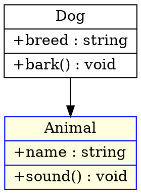
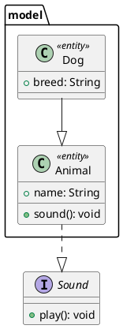
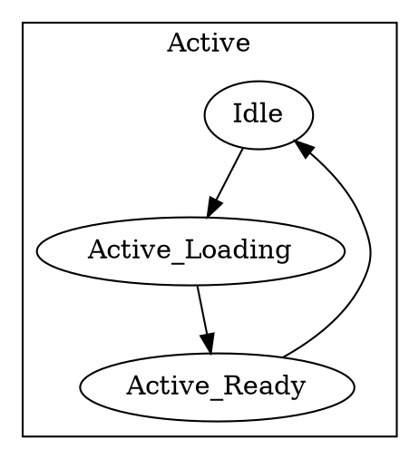
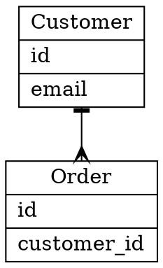
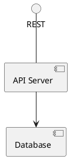
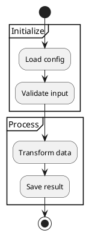

# Import Coverage Residuals — Implementation Plan

> **For agentic workers:** REQUIRED SUB-SKILL: Use superpowers:subagent-driven-development (recommended) or superpowers:executing-plans to implement this plan task-by-task. Steps use checkbox (`- [ ]`) syntax for tracking.

**Goal:** Close the 9 residual `⚠` cells in [COVERAGE.md](../../../COVERAGE.md)'s import table, driving it from 9 `⚠` to 0 `⚠`.

**Architecture:** Three waves of surgical wiring: route foreign attributes into existing Mermaid payload slots (`ClassNode.link/tooltip/styles/annotations/parent`, `MermaidSubgraph`, `ErCardinality`). One new payload field — `ArchitectureService.kind: ArchitectureServiceKind` — for PlantUML component-vs-interface distinction. Wave A/B/C recovery markers from the 2026-05-20 generalization stay live as fallback round-trip identity.

**Tech Stack:** Swift 6 (strict concurrency), SwiftPM, swift-testing, swift-snapshot-testing. Same platform floor as the rest of the package (macOS 26 / iOS 26 + Linux portable for non-CG slices). All slices touched (`DiagramKitD2`, `DiagramKitGraphviz`, `DiagramKitPlantUML`, `DiagramKitModel`) are Linux-portable.

**Spec:** [docs/superpowers/specs/2026-05-20-import-coverage-residuals-design.md](../specs/2026-05-20-import-coverage-residuals-design.md)

---

## Conventions Used in This Plan

- **TDD discipline.** Each cell-closing task writes the failing test (vanilla foreign source + diagnostic-absence assertion + round-trip fixture) **first**, runs it to see it fail with today's `slotUnsupported`/`styleDrop`/`class-unsupported-line` emission, then wires the importer to make it pass.
- **Per-task commit.** Each task ends with a commit that compiles, has its targeted tests green, and passes `Scripts/check-diagnostic-discipline.sh` + `Scripts/check-file-sizes.sh`. Wave-closer tasks also run `Scripts/bootstrap-smoke-check.sh`.
- **Memory: "Avoid full `swift test` runs."** Always pair `swift test` with `--filter`. Use exact-suite filters (`--filter "RoundTrip"`, `--filter D2ClassRoundTripTests`), never substrings that catch corpus parameterized cases.
- **Memory: "Use exact-suite filters."** Filter on full suite names, not bare substrings.
- **Memory: "Work directly on main."** No worktrees/branches. Commit-by-commit on main.
- **Marker grammar reuse.** The pre-lexer scan + recovery-marker emission from [2026-05-20-coverage-marker-recovery-design.md](../specs/2026-05-20-coverage-marker-recovery-design.md) stays untouched. This plan deletes **diagnostic emission sites**, not markers.

## File Inventory

### New files

```
Tests/DiagramKitTests/RoundTrip/Resources/roundtrip/d2-class/02-attributed.d2
Tests/DiagramKitTests/RoundTrip/Resources/roundtrip/dot-class/02-attributed.dot
Tests/DiagramKitTests/RoundTrip/Resources/roundtrip/plantuml-class/04-stereotype-package.puml
Tests/DiagramKitTests/RoundTrip/Resources/roundtrip/d2-state/02-nested-composite.d2
Tests/DiagramKitTests/RoundTrip/Resources/roundtrip/dot-state/02-nested-composite.dot
Tests/DiagramKitTests/RoundTrip/Resources/roundtrip/d2-er/02-cardinality.d2
Tests/DiagramKitTests/RoundTrip/Resources/roundtrip/dot-er/02-cardinality.dot
Tests/DiagramKitTests/RoundTrip/Resources/roundtrip/plantuml-activity/02-partition.puml
Tests/DiagramKitTests/RoundTrip/Resources/roundtrip/plantuml-component/02-interface.puml
Tests/DiagramKitTests/RoundTrip/ImportDiagnosticAbsenceTests.swift
```

### Modified files

```
Sources/DiagramKitD2/D2ClassExporter.swift                     // class attr routing
Sources/DiagramKitD2/D2Mapper.swift                            // state container → subgraph; ER cardinality
Sources/DiagramKitGraphviz/DOTMapper.swift                     // class attr routing; state cluster → subgraph; ER cardinality
Sources/DiagramKitGraphviz/DOTMapperDiagnostics.swift          // remove now-recognized cases
Sources/DiagramKitPlantUML/Class/PlantUMLClassParser.swift     // native stereotype + package parsing
Sources/DiagramKitPlantUML/Class/PlantUMLClassMapper.swift     // populate annotations + parent
Sources/DiagramKitPlantUML/Class/PlantUMLClassAST.swift        // stereotype + package fields
Sources/DiagramKitPlantUML/Activity/PlantUMLActivityParser.swift  // partition recognition
Sources/DiagramKitPlantUML/Activity/PlantUMLActivityMapper.swift  // partition → MermaidSubgraph
Sources/DiagramKitPlantUML/Component/PlantUMLComponentParser.swift // [component] vs interface() kind
Sources/DiagramKitPlantUML/Component/PlantUMLComponentMapper.swift // populate ArchitectureService.kind
Sources/DiagramKitModel/src_architecture_types.swift            // +ArchitectureServiceKind enum +kind field
Sources/DiagramKitModel/src_architecture_renderer.swift         // kind-aware glyph dispatch
COVERAGE.md                                                     // flip 9 cells to ✓; legend footnote update
BASELINES.md                                                    // closing-commit map
```

### Touched (potentially)

- `Sources/DiagramKitPlantUML/Exporter/PlantUMLComponentExporter.swift` — emit `[component]`/`interface ()` based on new `kind` field; existing round-trip stays clean.

---

## Wave 1 — Class-Family Residuals

Closes cells 1, 2, 3 (`classDiagram × D2`, `classDiagram × DOT`, `classDiagram × PlantUML`).

### Task 1: D2 class attribute routing (link, tooltip, style, color)

**Files:**
- Create: `Tests/DiagramKitTests/RoundTrip/Resources/roundtrip/d2-class/02-attributed.d2`
- Create: `Tests/DiagramKitTests/RoundTrip/ImportDiagnosticAbsenceTests.swift`
- Modify: `Sources/DiagramKitD2/D2ClassExporter.swift` (the `D2ClassMapper.map(_:)` method and the private `PartialClass.appendMember(...)` helper)

**Background:** `D2ClassMapper` currently routes every inner `nodeDefinition` to `PartialClass.appendMember(...)`, so D2 class-applicable attrs like `link: "url"`, `tooltip: "..."`, `style: dashed`, `stroke: red` end up as bogus members (`link:` becomes an attribute named `link`). The task is to distinguish attrs from members and route attrs to `ClassNode.link`/`tooltip`/`styles`.

- [ ] **Step 1: Write the failing round-trip fixture**

Create `Tests/DiagramKitTests/RoundTrip/Resources/roundtrip/d2-class/02-attributed.d2`:

```d2
Animal: {
  shape: class
  link: https://example.com/animal
  tooltip: "Base class"
  style: {
    stroke: blue
    fill: lightyellow
  }
  +name: string
  +sound(): void
}

Dog: {
  shape: class
  +breed: string
  +bark(): void
}

Dog -> Animal
```

- [ ] **Step 2: Write the failing diagnostic-absence test suite**

Create `Tests/DiagramKitTests/RoundTrip/ImportDiagnosticAbsenceTests.swift`:

```swift
import Testing
import DiagramKitCommon
import DiagramKitImport
import DiagramKitTestSupport
import DiagramKitModel
import DiagramKitD2
import DiagramKitGraphviz
import DiagramKitPlantUML

/// Asserts that vanilla foreign-format sources produce **no** import
/// diagnostics for the residual loss-cases tracked by the
/// 2026-05-20 import-coverage-residuals spec. Each fixture lives under
/// `Tests/DiagramKitTests/RoundTrip/Resources/roundtrip/`.
@Suite("Import diagnostic absence — coverage residuals")
struct ImportDiagnosticAbsenceTests {

    @Test func d2ClassWithLinkTooltipStyle() throws {
        let source = try loadFixture("d2-class/02-attributed.d2")
        let result = try D2Importer().parse(source)
        #expect(result.diagnostics.isEmpty,
                "Expected zero import diagnostics, got: \(result.diagnostics)")
    }

    private func loadFixture(_ path: String) throws -> String {
        let url = Bundle.module
            .url(forResource: "RoundTrip/Resources/roundtrip/\(path)",
                 withExtension: nil)
        guard let url = url else {
            throw FixtureError.notFound(path)
        }
        return try String(contentsOf: url, encoding: .utf8)
    }

    enum FixtureError: Error, CustomStringConvertible {
        case notFound(String)
        var description: String {
            switch self {
            case .notFound(let p): return "Fixture not found: \(p)"
            }
        }
    }
}
```

- [ ] **Step 3: Run the failing test**

```
swift test --filter ImportDiagnosticAbsenceTests/d2ClassWithLinkTooltipStyle
```

Expected: FAIL with diagnostics containing `slotUnsupported` (for `link`/`tooltip`/`style`).

- [ ] **Step 4: Implement attribute classification in `PartialClass`**

In `Sources/DiagramKitD2/D2ClassExporter.swift`, modify `private struct PartialClass` to track attrs separately from members. Add fields and a new `appendAttribute(...)` method:

```swift
private struct PartialClass {
    var id: String
    var label: String
    var isClass: Bool = false
    var attributes: [ClassMember] = []
    var methods: [ClassMember] = []
    // New attribute slots:
    var link: String?
    var tooltip: String?
    var styles: [String] = []

    /// Known D2 attribute keys that should NOT be treated as class members.
    /// `shape` is consumed elsewhere; `style` opens a sub-container handled
    /// in `D2ClassMapper.map(_:)` directly.
    static let classAttributeKeys: Set<String> = ["link", "url", "href", "tooltip", "stroke", "fill", "style"]

    static func isAttributeKey(_ rawKey: String) -> Bool {
        classAttributeKeys.contains(rawKey.lowercased())
    }

    mutating func appendAttribute(key: String, value: String) {
        switch key.lowercased() {
        case "link", "url", "href":
            link = value
        case "tooltip":
            tooltip = value
        case "stroke":
            styles.append("stroke:\(value)")
        case "fill":
            styles.append("fill:\(value)")
        default:
            break
        }
    }

    // existing appendMember(rawKey:rawValue:) ...

    func makeClassNode() -> ClassNode {
        ClassNode(
            id: id,
            label: label,
            attributes: attributes,
            methods: methods,
            styles: styles,
            link: link,
            tooltip: tooltip
        )
    }
}
```

- [ ] **Step 5: Route inner `nodeDefinition` between attrs vs members**

In the `D2ClassMapper.map(_:)` switch statement, update the `.nodeDefinition` case under `if stack[topIdx].isClass`:

```swift
case .nodeDefinition(let def):
    if !stack.isEmpty {
        let topIdx = stack.count - 1
        if def.id == "shape" && (def.label?.lowercased() == "class") {
            stack[topIdx].isClass = true
            continue
        }
        if stack[topIdx].isClass {
            if PartialClass.isAttributeKey(def.id) {
                stack[topIdx].appendAttribute(key: def.id, rawValue: def.label ?? "")
                continue
            }
            stack[topIdx].appendMember(rawKey: def.id, rawValue: def.label)
            continue
        }
    }
```

Style-block containers (`style: { stroke: blue }`) inside a class enter as `.containerOpen` with id `"style"` — handle by adding a `style:` branch to the `.containerOpen` arm: when `stack.last?.isClass == true` and `open.id == "style"`, set `inStyleBlock = true` on the top partial and route child `nodeDefinition`s to `appendAttribute(...)` until the matching `.containerClose`.

```swift
case .containerOpen(let open):
    if let topIdx = stack.indices.last, stack[topIdx].isClass, open.id == "style" {
        stack[topIdx].inStyleBlock = true
        continue
    }
    stack.append(PartialClass(id: open.id, label: open.label ?? open.id))

case .containerClose:
    if let topIdx = stack.indices.last, stack[topIdx].inStyleBlock {
        stack[topIdx].inStyleBlock = false
        continue
    }
    // existing close logic ...
```

Add `var inStyleBlock: Bool = false` to `PartialClass`.

- [ ] **Step 6: Run the test, expect green**

```
swift test --filter ImportDiagnosticAbsenceTests/d2ClassWithLinkTooltipStyle
```

Expected: PASS.

- [ ] **Step 7: Add round-trip assertion**

Extend `Tests/DiagramKitTests/RoundTrip/D2ClassRoundTripTests.swift` with:

```swift
@Test func attributedClassRoundTripsThroughD2() throws {
    let source = """
    Animal: {
      shape: class
      link: https://example.com/animal
      tooltip: "Base class"
      style: {
        stroke: blue
      }
      +name: string
    }
    """
    let cell = RoundTripCell(
        importer: D2Importer(),
        exporter: D2Exporter(),
        family: DiagramType.classDiagram,
        allowedLosses: []  // Goal: no allowed losses
    )
    try runSameFormatRoundTrip(
        cell: cell,
        fixture: RoundTripFixture(path: "d2-class/inline-02", source: source)
    )
}
```

Run: `swift test --filter D2ClassRoundTripTests`. Expected: PASS.

- [ ] **Step 8: Commit**

```bash
git add Sources/DiagramKitD2/D2ClassExporter.swift \
        Tests/DiagramKitTests/RoundTrip/Resources/roundtrip/d2-class/02-attributed.d2 \
        Tests/DiagramKitTests/RoundTrip/ImportDiagnosticAbsenceTests.swift \
        Tests/DiagramKitTests/RoundTrip/D2ClassRoundTripTests.swift
git commit -m "$(cat <<'EOF'
Wave 1 Task 1 — Route D2 class link/tooltip/style attrs into ClassNode

Distinguishes D2 class-applicable attributes from member declarations so
link/tooltip/stroke/fill no longer drop with slotUnsupported. Wires into
existing ClassNode.link / .tooltip / .styles slots.

Co-Authored-By: Claude Opus 4.7 (1M context) <noreply@anthropic.com>
EOF
)"
```

---

### Task 2: DOT class attribute routing (URL, tooltip, style, color)

**Files:**
- Create: `Tests/DiagramKitTests/RoundTrip/Resources/roundtrip/dot-class/02-attributed.dot`
- Modify: `Sources/DiagramKitGraphviz/DOTMapper.swift` (the class-handling path)
- Modify: `Sources/DiagramKitGraphviz/DOTMapperDiagnostics.swift` (remove now-recognized cases from `emitUnsupportedNodeAttrs`)
- Modify: `Tests/DiagramKitTests/RoundTrip/DOTClassRoundTripTests.swift`
- Modify: `Tests/DiagramKitTests/RoundTrip/ImportDiagnosticAbsenceTests.swift`

**Background:** DOT class round-tripping uses HTML-like record shapes. Node-level attributes `URL`/`href`/`tooltip` route to `ClassNode.link`/`tooltip`; `style`/`color`/`fillcolor`/`fontcolor` route to `ClassNode.styles` as CSS-equivalent declarations. `DOTMapperDiagnostics.emitUnsupportedNodeAttrs` is where the current `slotUnsupported` emission lives — recognized keys are deleted from its emission path.

- [ ] **Step 1: Write the failing fixture**

Create `Tests/DiagramKitTests/RoundTrip/Resources/roundtrip/dot-class/02-attributed.dot`:



- [ ] **Step 2: Add diagnostic-absence test case**

In `Tests/DiagramKitTests/RoundTrip/ImportDiagnosticAbsenceTests.swift`, add:

```swift
@Test func dotClassWithUrlTooltipStyle() throws {
    let source = try loadFixture("dot-class/02-attributed.dot")
    let result = try GraphvizImporter().parse(source)
    #expect(result.diagnostics.isEmpty,
            "Expected zero import diagnostics, got: \(result.diagnostics)")
}
```

- [ ] **Step 3: Run the test, see failure**

```
swift test --filter ImportDiagnosticAbsenceTests/dotClassWithUrlTooltipStyle
```

Expected: FAIL with `slotUnsupported` on `URL`/`tooltip`/`style`/`color`/`fillcolor`.

- [ ] **Step 4: Route DOT class attrs in `DOTMapper`**

In `Sources/DiagramKitGraphviz/DOTMapper.swift`, locate the class-record mapping path (where `shape=record` nodes become `ClassNode`s). Add a helper that consumes node attributes and populates `ClassNode.link`/`tooltip`/`styles`:

```swift
private func applyClassNodeAttributes(_ attrs: [DOTAttribute], to node: inout ClassNode) -> [DOTAttribute] {
    var unconsumed: [DOTAttribute] = []
    for attr in attrs {
        switch attr.key.lowercased() {
        case "url", "href":
            node.link = attr.value
        case "tooltip":
            node.tooltip = attr.value
        case "style":
            node.styles.append("style:\(attr.value)")
        case "color":
            node.styles.append("stroke:\(attr.value)")
        case "fillcolor":
            node.styles.append("fill:\(attr.value)")
        case "fontcolor":
            node.styles.append("color:\(attr.value)")
        case "label", "shape", "id":
            unconsumed.append(attr)  // already handled elsewhere
        default:
            unconsumed.append(attr)
        }
    }
    return unconsumed
}
```

Call `applyClassNodeAttributes(...)` at the `ClassNode` construction site, and pass the **unconsumed** remainder to `emitUnsupportedNodeAttrs`.

- [ ] **Step 5: Delete redundant emissions in `DOTMapperDiagnostics`**

In `Sources/DiagramKitGraphviz/DOTMapperDiagnostics.swift`, `emitUnsupportedNodeAttrs(_:context:)`: the cases for `style`, `color`, `fillcolor`, `fontcolor`, and `url`/`href`/`tooltip` continue to fire for non-class contexts (flowchart). For class context, the helper above consumes them first. **No deletion in this file** — the emission stays correct for non-class contexts; the class path simply skips it via the `applyClassNodeAttributes` filter.

(Comment marker for the executor: this Step is a no-op delete by design — leave `DOTMapperDiagnostics.swift` unchanged for this task.)

- [ ] **Step 6: Run the test, expect green**

```
swift test --filter ImportDiagnosticAbsenceTests/dotClassWithUrlTooltipStyle
```

Expected: PASS.

- [ ] **Step 7: Add round-trip assertion**

In `Tests/DiagramKitTests/RoundTrip/DOTClassRoundTripTests.swift`, add:

```swift
@Test func attributedClassRoundTripsThroughDOT() throws {
    let source = """
    digraph G {
      Animal [shape=record, label="{Animal|+name : string\\l}",
              URL="https://example.com", tooltip="Base", style=filled, fillcolor=lightyellow];
    }
    """
    let cell = RoundTripCell(
        importer: GraphvizImporter(),
        exporter: DOTExporter(),
        family: DiagramType.classDiagram,
        allowedLosses: []
    )
    try runSameFormatRoundTrip(
        cell: cell,
        fixture: RoundTripFixture(path: "dot-class/inline-02", source: source)
    )
}
```

Run: `swift test --filter DOTClassRoundTripTests`. Expected: PASS.

- [ ] **Step 8: Commit**

```bash
git add Sources/DiagramKitGraphviz/DOTMapper.swift \
        Tests/DiagramKitTests/RoundTrip/Resources/roundtrip/dot-class/02-attributed.dot \
        Tests/DiagramKitTests/RoundTrip/ImportDiagnosticAbsenceTests.swift \
        Tests/DiagramKitTests/RoundTrip/DOTClassRoundTripTests.swift
git commit -m "$(cat <<'EOF'
Wave 1 Task 2 — Route DOT class URL/tooltip/style/color into ClassNode

Adds applyClassNodeAttributes(...) helper to DOTMapper so class-context
nodes consume URL/href/tooltip/style/color/fillcolor/fontcolor into
ClassNode.link/.tooltip/.styles instead of letting them drop with
slotUnsupported diagnostics. Non-class node contexts continue to emit
the diagnostic for unknown attrs.

Co-Authored-By: Claude Opus 4.7 (1M context) <noreply@anthropic.com>
EOF
)"
```

---

### Task 3: PlantUML class native stereotype + package parsing

**Files:**
- Create: `Tests/DiagramKitTests/RoundTrip/Resources/roundtrip/plantuml-class/04-stereotype-package.puml`
- Modify: `Sources/DiagramKitPlantUML/Class/PlantUMLClassAST.swift`
- Modify: `Sources/DiagramKitPlantUML/Class/PlantUMLClassParser.swift`
- Modify: `Sources/DiagramKitPlantUML/Class/PlantUMLClassMapper.swift`
- Modify: `Tests/DiagramKitTests/RoundTrip/ImportDiagnosticAbsenceTests.swift`

**Background:** Today `PlantUMLClassParser.parse(...)` collects unrecognized lines into `ast.unsupportedLines: [String]`, and `PlantUMLClassMapper` emits one `.featureDropped(.diagramFamilyUnsupported, …)` per unsupported line. Stereotype-decorated classes (`class Foo <<interface>>`) and `package Foo { … }` blocks fall into this bucket. The task: teach the parser to recognize both, drop the `featureDropped` emission for them, and route them into `ClassNode.annotations` + `ClassNode.parent`/`ClassNamespace`.

- [ ] **Step 1: Write the failing fixture**

Create `Tests/DiagramKitTests/RoundTrip/Resources/roundtrip/plantuml-class/04-stereotype-package.puml`:



- [ ] **Step 2: Add diagnostic-absence test case**

In `Tests/DiagramKitTests/RoundTrip/ImportDiagnosticAbsenceTests.swift`, add:

```swift
@Test func plantUMLClassWithStereotypeAndPackage() throws {
    let source = try loadFixture("plantuml-class/04-stereotype-package.puml")
    let result = try PlantUMLImporter().parse(source)
    #expect(result.diagnostics.isEmpty,
            "Expected zero import diagnostics, got: \(result.diagnostics)")
}
```

- [ ] **Step 3: Run the failing test**

```
swift test --filter ImportDiagnosticAbsenceTests/plantUMLClassWithStereotypeAndPackage
```

Expected: FAIL with `featureDropped(.diagramFamilyUnsupported)` listing `package "model" {`, `<<entity>>`, etc.

- [ ] **Step 4: Extend `PlantUMLClassAST` with stereotype + package fields**

In `Sources/DiagramKitPlantUML/Class/PlantUMLClassAST.swift`, add `stereotype: String?` to `PlantUMLClassDecl` and a new top-level `packages: [PlantUMLPackageDecl]` field on `PlantUMLClassAST`. Example:

```swift
public struct PlantUMLClassDecl {
    public var kind: Kind
    public var name: String
    public var label: String?
    public var stereotype: String?      // NEW — `<<interface>>`, `<<entity>>`, etc.
    public var packageName: String?     // NEW — set if declared inside `package X { … }`
    public var members: [PlantUMLClassMember]

    public init(
        kind: Kind,
        name: String,
        label: String? = nil,
        stereotype: String? = nil,
        packageName: String? = nil,
        members: [PlantUMLClassMember] = []
    ) {
        self.kind = kind
        self.name = name
        self.label = label
        self.stereotype = stereotype
        self.packageName = packageName
        self.members = members
    }
}

public struct PlantUMLPackageDecl: Sendable, Equatable {
    public var name: String
    public var displayName: String?
    public var classes: [String]   // ids of classes inside

    public init(name: String, displayName: String? = nil, classes: [String] = []) {
        self.name = name
        self.displayName = displayName
        self.classes = classes
    }
}

public struct PlantUMLClassAST {
    public var classes: [PlantUMLClassDecl]
    public var relationships: [PlantUMLClassRelationship]
    public var notes: [PlantUMLClassNote]
    public var packages: [PlantUMLPackageDecl] = []  // NEW
    public var unsupportedLines: [String]
    // existing init updated with `packages: [PlantUMLPackageDecl] = []`
}
```

- [ ] **Step 5: Teach the parser to recognize stereotypes and packages**

In `Sources/DiagramKitPlantUML/Class/PlantUMLClassParser.swift`, two changes:

**(a)** Modify `parseDeclarationHead(_:)` to extract `<<stereotype>>` from the head string before the `as Alias`/name parsing. Pseudocode:

```swift
private func parseDeclarationHead(_ head: String) -> PlantUMLClassDecl? {
    var working = head
    var stereotype: String?

    // Pre-extract <<stereotype>> from anywhere in the head.
    if let open = working.range(of: "<<"), let close = working.range(of: ">>", range: open.upperBound..<working.endIndex) {
        stereotype = String(working[open.upperBound..<close.lowerBound]).trimmingCharacters(in: .whitespaces)
        working.removeSubrange(open.lowerBound..<close.upperBound)
        working = working.trimmingCharacters(in: .whitespaces)
    }

    // existing kind/name/alias parsing on `working` ...

    var decl = /* existing result */
    decl.stereotype = stereotype
    return decl
}
```

**(b)** Add a `parsePackageOpen(_:)` method, called from the main `parse(_:)` loop before the `parseClassDeclarationOpen(...)` call:

```swift
public func parse(_ body: String) -> PlantUMLClassAST {
    var ast = PlantUMLClassAST()
    let lines = body.split(separator: "\n", omittingEmptySubsequences: false)
    var iterator = lines.makeIterator()
    var inBlockComment = false
    var currentPackage: String? = nil
    var packageStack: [PlantUMLPackageDecl] = []

    while let raw = iterator.next() {
        let trimmed = raw.trimmingCharacters(in: .whitespaces)
        // ... block-comment + empty + comment handling ...

        if let pkgDecl = parsePackageOpen(trimmed) {
            currentPackage = pkgDecl.name
            packageStack.append(pkgDecl)
            continue
        }

        if trimmed == "}", let lastIdx = packageStack.indices.last {
            // Closing brace of a package block: pop and record.
            let pkg = packageStack.remove(at: lastIdx)
            ast.packages.append(pkg)
            currentPackage = packageStack.last?.name
            continue
        }

        // ... existing class / relationship / note / member parsing ...

        if let decl = parseClassDeclarationOpen(trimmed) {
            let (members, _) = consumeMemberBlock(iterator: &iterator)
            var withMembers = decl
            withMembers.members = members
            withMembers.packageName = currentPackage
            if let pkgIdx = packageStack.indices.last {
                packageStack[pkgIdx].classes.append(withMembers.name)
            }
            ast.classes.append(withMembers)
            continue
        }

        // similar `packageName = currentPackage` annotation for parseClassDeclarationSimple result
    }
    return ast
}

private func parsePackageOpen(_ line: String) -> PlantUMLPackageDecl? {
    guard line.lowercased().hasPrefix("package ") else { return nil }
    guard line.hasSuffix("{") else { return nil }
    let inner = String(line.dropFirst("package ".count).dropLast()).trimmingCharacters(in: .whitespaces)
    // forms: `"display name" as alias` / `name`
    if inner.hasPrefix("\"") {
        if let close = inner.dropFirst().firstIndex(of: "\"") {
            let display = String(inner[inner.index(after: inner.startIndex)..<close])
            let after = inner[inner.index(after: close)...].trimmingCharacters(in: .whitespaces)
            if after.lowercased().hasPrefix("as ") {
                let alias = String(after.dropFirst(3)).trimmingCharacters(in: .whitespaces)
                return PlantUMLPackageDecl(name: alias, displayName: display)
            }
            return PlantUMLPackageDecl(name: display, displayName: display)
        }
    }
    return PlantUMLPackageDecl(name: inner)
}
```

- [ ] **Step 6: Populate `ClassNode.annotations` + `.parent` + `ClassNamespace` in the mapper**

In `Sources/DiagramKitPlantUML/Class/PlantUMLClassMapper.swift`:

```swift
private func annotations(for decl: PlantUMLClassDecl) -> [String] {
    var result: [String] = []
    // existing kind-derived annotation:
    switch decl.kind {
    case .classDecl: break
    case .interfaceDecl: result.append("Interface")
    case .abstractDecl: result.append("Abstract")
    case .enumDecl: result.append("Enumeration")
    case .annotationDecl: result.append("Annotation")
    }
    if let stereotype = decl.stereotype, !stereotype.isEmpty {
        result.append(stereotype)
    }
    return result
}
```

Update the `ClassNode` construction loop in `map(_:)` to call the new `annotations(for: decl)` and set `parent: decl.packageName`. Emit a `ClassNamespace` per `PlantUMLPackageDecl`:

```swift
var namespaces: [ClassNamespace] = []
for pkg in ast.packages {
    namespaces.append(ClassNamespace(
        id: pkg.name,
        label: pkg.displayName ?? pkg.name,
        classes: pkg.classes
    ))
}

let model = ClassDiagram(
    classes: classes,
    classMap: classMap,
    relationships: relationships,
    notes: notes,
    noteMap: noteMap,
    namespaces: namespaces   // NEW (verify exact field name on ClassDiagram)
)
```

(Executor note: verify `ClassDiagram`'s init accepts namespaces; if the field name differs, match the existing public API.)

- [ ] **Step 7: Run tests, expect green**

```
swift test --filter ImportDiagnosticAbsenceTests/plantUMLClassWithStereotypeAndPackage
swift test --filter PlantUMLClass
```

Expected: PASS.

- [ ] **Step 8: Commit**

```bash
git add Sources/DiagramKitPlantUML/Class/PlantUMLClassAST.swift \
        Sources/DiagramKitPlantUML/Class/PlantUMLClassParser.swift \
        Sources/DiagramKitPlantUML/Class/PlantUMLClassMapper.swift \
        Tests/DiagramKitTests/RoundTrip/Resources/roundtrip/plantuml-class/04-stereotype-package.puml \
        Tests/DiagramKitTests/RoundTrip/ImportDiagnosticAbsenceTests.swift
git commit -m "$(cat <<'EOF'
Wave 1 Task 3 — Native PlantUML stereotype + package parsing

PlantUMLClassParser now recognizes `<<stereotype>>` after class/interface/
abstract/enum/annotation declarations and lifts them into
ClassNode.annotations. `package Foo { … }` blocks become ClassNamespace
entries; contained classes set ClassNode.parent. Replaces the
featureDropped(.diagramFamilyUnsupported) emission for these line shapes.
Unknown lines outside this surface still surface as unsupportedLines.

Co-Authored-By: Claude Opus 4.7 (1M context) <noreply@anthropic.com>
EOF
)"
```

---

### Task 4: Wave 1 closer — flip COVERAGE.md import cells

**Files:**
- Modify: `COVERAGE.md` (import table rows 4, 5, 33; legend footnote)

- [ ] **Step 1: Update import table cells**

In `COVERAGE.md` import table, flip these cells from `⚠` to `✓`:
- `classDiagram × D2` (row 33, column "D2")
- `classDiagram × DOT` (row 33, column "DOT")
- `classDiagram × PlantUML` (row 33, column "PlantUML")

Update the **Totals** row: D2 column goes to `4/28` (unchanged in cell-count, but no more `⚠` for class), DOT same, PlantUML stays at `9/28`. Adjust the import-side `⚠` count footnote (carrying total from 9 → 6).

- [ ] **Step 2: Update legend footnote**

Edit the legend bullet starting with "⚠ in the **import table**" to remove `class` from the per-format residual lists:

```
- `⚠` in the **import table** for D2/DOT × {flowchart, state, er}
  reflects diagnostics on D2/DOT-native features that have no Mermaid landing
  slot (`direction`, `icon`, `tooltip`, `link`). `⚠` for PlantUML ×
  {architecture} import has the same shape (component-vs-interface
  styling).
```

(Stereotype/package no longer appears; class no longer appears.)

- [ ] **Step 3: Run the closer smoke check**

```
Scripts/bootstrap-smoke-check.sh
```

Expected: green (modulo Linux-check Docker availability, per CLAUDE.md "Discipline Gates").

- [ ] **Step 4: Commit Wave 1 closer**

```bash
git add COVERAGE.md
git commit -m "$(cat <<'EOF'
Wave 1 closes class-family import residuals — lift 3 cells ⚠ to ✓

Flips classDiagram × {D2, DOT, PlantUML} from ⚠ to ✓ in COVERAGE.md
import table. Import-side ⚠ count drops from 9 to 6. Closure landed
across Tasks 1–3 of the import-coverage-residuals plan.

Co-Authored-By: Claude Opus 4.7 (1M context) <noreply@anthropic.com>
EOF
)"
```

---

## Wave 2 — State + ER Residuals

Closes cells 4, 5, 6, 7 (`stateDiagram × D2`, `stateDiagram × DOT`, `erDiagram × D2`, `erDiagram × DOT`).

### Task 5: D2 state container → MermaidSubgraph

**Files:**
- Create: `Tests/DiagramKitTests/RoundTrip/Resources/roundtrip/d2-state/02-nested-composite.d2`
- Modify: `Sources/DiagramKitD2/D2Mapper.swift` (state-family routing path)
- Modify: `Tests/DiagramKitTests/RoundTrip/ImportDiagnosticAbsenceTests.swift`
- Modify: `Tests/DiagramKitTests/RoundTrip/D2StateRoundTripTests.swift`

**Background:** D2 state-family import currently emits the `state-parent` recovery marker on Mermaid → D2 → Mermaid round-trip (Wave B of 2026-05-20), but vanilla D2 sources with container nesting still drop child→parent links because the importer doesn't promote containers to `MermaidSubgraph`. Fix: when the family probe identifies a state-diagram payload, route `.containerOpen`/`.containerClose` through `MermaidSubgraph` creation and set `MermaidNode.parent` on contained children.

- [ ] **Step 1: Write the failing fixture**

Create `Tests/DiagramKitTests/RoundTrip/Resources/roundtrip/d2-state/02-nested-composite.d2`:

```d2
direction: down

Idle -> Active.Loading
Active: {
  Loading -> Ready
  Ready -> Idle
}
```

- [ ] **Step 2: Add diagnostic-absence test case**

In `ImportDiagnosticAbsenceTests.swift`, add:

```swift
@Test func d2StateWithNestedComposite() throws {
    let source = try loadFixture("d2-state/02-nested-composite.d2")
    let result = try D2Importer().parse(source)
    #expect(result.diagnostics.isEmpty,
            "Expected zero import diagnostics, got: \(result.diagnostics)")
    guard case .stateDiagram(let graph) = result.document.payload else {
        Issue.record("Expected stateDiagram payload, got \(result.document.payload.type)")
        return
    }
    #expect(graph.subgraphs.contains(where: { $0.id == "Active" }),
            "Expected Active container to surface as MermaidSubgraph")
}
```

- [ ] **Step 3: Run the failing test**

```
swift test --filter ImportDiagnosticAbsenceTests/d2StateWithNestedComposite
```

Expected: FAIL — either non-empty diagnostics or missing subgraph.

- [ ] **Step 4: Promote D2 state containers to subgraphs**

In `Sources/DiagramKitD2/D2Mapper.swift`, locate the state-family path (or the general mapper if state shares the flowchart routing). When `.containerOpen(let open)` fires in a state-diagram context:

```swift
case .containerOpen(let open):
    let subgraph = original_src_types.MermaidSubgraph(
        id: open.id,
        label: open.label ?? open.id,
        parent: containerStack.last?.id
    )
    subgraphs.append(subgraph)
    containerStack.append(subgraph)

case .containerClose:
    _ = containerStack.popLast()

case .nodeDefinition(let nodeDef):
    upsertNode(nodeDef)
    if let parent = containerStack.last?.id {
        nodesById[nodeDef.id]?.parent = parent
    }
```

(Adapt to the existing `subgraphs`/`containerStack` data structures already used by flowchart routing; if they don't exist on the state path yet, port from the flowchart side.)

- [ ] **Step 5: Run tests, expect green**

```
swift test --filter ImportDiagnosticAbsenceTests/d2StateWithNestedComposite
swift test --filter D2StateRoundTripTests
```

Expected: PASS.

- [ ] **Step 6: Add round-trip assertion**

In `Tests/DiagramKitTests/RoundTrip/D2StateRoundTripTests.swift`:

```swift
@Test func nestedCompositeStateRoundTripsThroughD2() throws {
    let source = """
    Idle -> Active.Loading
    Active: {
      Loading -> Ready
      Ready -> Idle
    }
    """
    let cell = RoundTripCell(
        importer: D2Importer(),
        exporter: D2Exporter(),
        family: DiagramType.stateDiagram,
        allowedLosses: []
    )
    try runSameFormatRoundTrip(
        cell: cell,
        fixture: RoundTripFixture(path: "d2-state/inline-02", source: source)
    )
}
```

Run: `swift test --filter D2StateRoundTripTests`. Expected: PASS.

- [ ] **Step 7: Commit**

```bash
git add Sources/DiagramKitD2/D2Mapper.swift \
        Tests/DiagramKitTests/RoundTrip/Resources/roundtrip/d2-state/02-nested-composite.d2 \
        Tests/DiagramKitTests/RoundTrip/ImportDiagnosticAbsenceTests.swift \
        Tests/DiagramKitTests/RoundTrip/D2StateRoundTripTests.swift
git commit -m "$(cat <<'EOF'
Wave 2 Task 5 — Promote D2 state containers to MermaidSubgraph

D2 state-family import now lifts container nesting into MermaidSubgraph
entries and sets MermaidNode.parent on contained children. Vanilla D2
nested-composite-state sources stop emitting state-parent recovery
markers; the markers remain live for non-container syntax.

Co-Authored-By: Claude Opus 4.7 (1M context) <noreply@anthropic.com>
EOF
)"
```

---

### Task 6: DOT state `cluster_*` → MermaidSubgraph

**Files:**
- Create: `Tests/DiagramKitTests/RoundTrip/Resources/roundtrip/dot-state/02-nested-composite.dot`
- Modify: `Sources/DiagramKitGraphviz/DOTMapper.swift` (state-family routing)
- Modify: `Tests/DiagramKitTests/RoundTrip/ImportDiagnosticAbsenceTests.swift`
- Modify: `Tests/DiagramKitTests/RoundTrip/DOTStateRoundTripTests.swift`

**Background:** Same shape as Task 5 but for DOT. DOT's idiom for composite state is `subgraph cluster_X { … }`. The mapper currently emits state-parent markers; teach it to natively populate `MermaidSubgraph`.

- [ ] **Step 1: Write the failing fixture**

Create `Tests/DiagramKitTests/RoundTrip/Resources/roundtrip/dot-state/02-nested-composite.dot`:



- [ ] **Step 2: Add diagnostic-absence test case**

In `ImportDiagnosticAbsenceTests.swift`:

```swift
@Test func dotStateWithCluster() throws {
    let source = try loadFixture("dot-state/02-nested-composite.dot")
    let result = try GraphvizImporter().parse(source)
    #expect(result.diagnostics.isEmpty,
            "Expected zero import diagnostics, got: \(result.diagnostics)")
    guard case .stateDiagram(let graph) = result.document.payload else {
        Issue.record("Expected stateDiagram, got \(result.document.payload.type)")
        return
    }
    #expect(graph.subgraphs.contains(where: { $0.id == "Active" || $0.id == "cluster_Active" }))
}
```

- [ ] **Step 3: Run the failing test**

```
swift test --filter ImportDiagnosticAbsenceTests/dotStateWithCluster
```

Expected: FAIL.

- [ ] **Step 4: Map DOT `cluster_*` subgraphs to MermaidSubgraph**

In `Sources/DiagramKitGraphviz/DOTMapper.swift`, locate the state routing. DOT `cluster_X` becomes a `MermaidSubgraph(id: "X", label: clusterLabel ?? "X")`. Pseudocode:

```swift
case .subgraph(let sub):
    let isCluster = sub.name?.hasPrefix("cluster_") == true || sub.name?.hasPrefix("cluster") == true
    if isCluster, isStateContext {
        let id = sub.name?.replacingOccurrences(of: "cluster_", with: "") ?? "anon"
        let subgraph = MermaidSubgraph(
            id: id,
            label: sub.label ?? id,
            parent: subgraphStack.last?.id
        )
        subgraphs.append(subgraph)
        subgraphStack.append(subgraph)
        for node in sub.nodes {
            nodesById[node.id]?.parent = id
        }
        // ... recurse into sub.statements ...
        _ = subgraphStack.popLast()
    }
```

- [ ] **Step 5: Run tests, expect green**

```
swift test --filter ImportDiagnosticAbsenceTests/dotStateWithCluster
swift test --filter DOTStateRoundTripTests
```

Expected: PASS.

- [ ] **Step 6: Add round-trip assertion**

In `Tests/DiagramKitTests/RoundTrip/DOTStateRoundTripTests.swift`:

```swift
@Test func clusterRoundTripsThroughDOT() throws {
    let source = """
    digraph G {
      rankdir=TB;
      Idle -> Active_Loading;
      subgraph cluster_Active {
        label="Active";
        Active_Loading -> Active_Ready;
      }
    }
    """
    let cell = RoundTripCell(
        importer: GraphvizImporter(),
        exporter: DOTExporter(),
        family: DiagramType.stateDiagram,
        allowedLosses: []
    )
    try runSameFormatRoundTrip(
        cell: cell,
        fixture: RoundTripFixture(path: "dot-state/inline-02", source: source)
    )
}
```

Run: `swift test --filter DOTStateRoundTripTests`. Expected: PASS.

- [ ] **Step 7: Commit**

```bash
git add Sources/DiagramKitGraphviz/DOTMapper.swift \
        Tests/DiagramKitTests/RoundTrip/Resources/roundtrip/dot-state/02-nested-composite.dot \
        Tests/DiagramKitTests/RoundTrip/ImportDiagnosticAbsenceTests.swift \
        Tests/DiagramKitTests/RoundTrip/DOTStateRoundTripTests.swift
git commit -m "$(cat <<'EOF'
Wave 2 Task 6 — Map DOT cluster_* subgraphs into MermaidSubgraph

DOT state-family import now lifts `subgraph cluster_X` containers into
MermaidSubgraph entries and sets MermaidNode.parent on contained nodes.
Vanilla DOT composite-state sources stop emitting state-parent recovery
markers; markers remain live for non-cluster syntax.

Co-Authored-By: Claude Opus 4.7 (1M context) <noreply@anthropic.com>
EOF
)"
```

---

### Task 7: D2 ER edge cardinality → ErCardinality

**Files:**
- Create: `Tests/DiagramKitTests/RoundTrip/Resources/roundtrip/d2-er/02-cardinality.d2`
- Modify: `Sources/DiagramKitD2/D2Mapper.swift` (ER-family edge handling)
- Modify: `Tests/DiagramKitTests/RoundTrip/ImportDiagnosticAbsenceTests.swift`
- Modify: `Tests/DiagramKitTests/RoundTrip/D2ERRoundTripTests.swift`

**Background:** D2 ER round-tripping currently emits the `er-cardinality` recovery marker on Mermaid → D2 → Mermaid (Wave B of 2026-05-20). Vanilla D2 sources with cardinality labels like `"{1..N}"` drop the cardinality. Fix: recognize a closed cardinality grammar in edge labels and populate `ErRelationship.cardA`/`cardB`.

- [ ] **Step 1: Write the failing fixture**

Create `Tests/DiagramKitTests/RoundTrip/Resources/roundtrip/d2-er/02-cardinality.d2`:

```d2
Customer: {
  shape: sql_table
  id: int
  email: string
}

Order: {
  shape: sql_table
  id: int
  customer_id: int
}

Customer -> Order: "{1..N}"
```

- [ ] **Step 2: Add diagnostic-absence test case**

In `ImportDiagnosticAbsenceTests.swift`:

```swift
@Test func d2ERWithCardinality() throws {
    let source = try loadFixture("d2-er/02-cardinality.d2")
    let result = try D2Importer().parse(source)
    #expect(result.diagnostics.isEmpty,
            "Expected zero import diagnostics, got: \(result.diagnostics)")
    guard case .erDiagram(let er) = result.document.payload else {
        Issue.record("Expected erDiagram, got \(result.document.payload.type)")
        return
    }
    let rel = er.relationships.first
    #expect(rel?.cardA == .oneOnly && rel?.cardB == .oneOrMore,
            "Expected cardA=oneOnly, cardB=oneOrMore; got \(String(describing: rel))")
}
```

- [ ] **Step 3: Run the failing test**

```
swift test --filter ImportDiagnosticAbsenceTests/d2ERWithCardinality
```

Expected: FAIL.

- [ ] **Step 4: Add a closed cardinality grammar parser**

In `Sources/DiagramKitD2/D2Mapper.swift`, add a private helper:

```swift
/// Parses D2 edge labels like `"{1..N}"`, `"{0..1}"`, `"{0..N}"`, `"{1..1}"`
/// into a `(ErCardinality, ErCardinality)` pair. Returns nil for any label
/// that does not match the closed grammar exactly.
private func parseERCardinalityLabel(_ raw: String?) -> (cardA: ErCardinality, cardB: ErCardinality)? {
    guard var s = raw?.trimmingCharacters(in: .whitespaces),
          s.hasPrefix("{"), s.hasSuffix("}") else { return nil }
    s.removeFirst(); s.removeLast()
    let parts = s.components(separatedBy: "..")
    guard parts.count == 2 else { return nil }
    let left = parts[0].trimmingCharacters(in: .whitespaces)
    let right = parts[1].trimmingCharacters(in: .whitespaces)

    func mapPart(_ token: String) -> ErCardinality? {
        switch token {
        case "0": return .zeroOrOne   // lower bound 0 with explicit lower-only is unusual; map to zeroOrOne by default
        case "1": return .oneOnly
        case "N", "n", "*": return .oneOrMore
        default: return nil
        }
    }

    guard let lo = mapPart(left), let hi = mapPart(right) else { return nil }
    // Composition: (0..1) -> zeroOrOne, (0..N) -> zeroOrMore, (1..1) -> oneOnly, (1..N) -> oneOrMore
    switch (left, right) {
    case ("0", "1"): return (.zeroOrOne, .zeroOrOne)
    case ("0", "N"), ("0", "n"), ("0", "*"): return (.zeroOrOne, .zeroOrMore)
    case ("1", "1"): return (.oneOnly, .oneOnly)
    case ("1", "N"), ("1", "n"), ("1", "*"): return (.oneOnly, .oneOrMore)
    default: return (lo, hi)
    }
}
```

Call this when constructing `ErRelationship` from an edge: if `parseERCardinalityLabel(edge.label)` returns a pair, use it and clear the label; otherwise fall through to the existing recovery-marker path.

- [ ] **Step 5: Run tests, expect green**

```
swift test --filter ImportDiagnosticAbsenceTests/d2ERWithCardinality
swift test --filter D2ERRoundTripTests
```

Expected: PASS.

- [ ] **Step 6: Add round-trip assertion**

In `Tests/DiagramKitTests/RoundTrip/D2ERRoundTripTests.swift`:

```swift
@Test func cardinalityRoundTripsThroughD2() throws {
    let source = """
    Customer: {
      shape: sql_table
      id: int
    }
    Order: {
      shape: sql_table
      customer_id: int
    }
    Customer -> Order: "{1..N}"
    """
    let cell = RoundTripCell(
        importer: D2Importer(),
        exporter: D2Exporter(),
        family: DiagramType.erDiagram,
        allowedLosses: []
    )
    try runSameFormatRoundTrip(
        cell: cell,
        fixture: RoundTripFixture(path: "d2-er/inline-02", source: source)
    )
}
```

Run: `swift test --filter D2ERRoundTripTests`. Expected: PASS.

- [ ] **Step 7: Commit**

```bash
git add Sources/DiagramKitD2/D2Mapper.swift \
        Tests/DiagramKitTests/RoundTrip/Resources/roundtrip/d2-er/02-cardinality.d2 \
        Tests/DiagramKitTests/RoundTrip/ImportDiagnosticAbsenceTests.swift \
        Tests/DiagramKitTests/RoundTrip/D2ERRoundTripTests.swift
git commit -m "$(cat <<'EOF'
Wave 2 Task 7 — Parse D2 ER edge cardinality `{1..N}` labels natively

Adds a closed cardinality grammar parser to D2Mapper. Vanilla D2 ER
sources with `{0..1}`/`{0..N}`/`{1..1}`/`{1..N}` edge labels populate
ErRelationship.cardA/.cardB directly. Non-conforming labels still
trigger the er-cardinality recovery marker via the existing path.

Co-Authored-By: Claude Opus 4.7 (1M context) <noreply@anthropic.com>
EOF
)"
```

---

### Task 8: DOT ER arrowhead cardinality → ErCardinality

**Files:**
- Create: `Tests/DiagramKitTests/RoundTrip/Resources/roundtrip/dot-er/02-cardinality.dot`
- Modify: `Sources/DiagramKitGraphviz/DOTMapper.swift` (ER-family edge handling)
- Modify: `Tests/DiagramKitTests/RoundTrip/ImportDiagnosticAbsenceTests.swift`
- Modify: `Tests/DiagramKitTests/RoundTrip/DOTERRoundTripTests.swift`

**Background:** DOT ER convention uses crow's-foot notation through `arrowtail`/`arrowhead` attributes (`crow`, `tee`, `dot`). Map those to `ErCardinality` directly.

- [ ] **Step 1: Write the failing fixture**

Create `Tests/DiagramKitTests/RoundTrip/Resources/roundtrip/dot-er/02-cardinality.dot`:



- [ ] **Step 2: Add diagnostic-absence test case**

In `ImportDiagnosticAbsenceTests.swift`:

```swift
@Test func dotERWithCrowsFoot() throws {
    let source = try loadFixture("dot-er/02-cardinality.dot")
    let result = try GraphvizImporter().parse(source)
    #expect(result.diagnostics.isEmpty,
            "Expected zero import diagnostics, got: \(result.diagnostics)")
    guard case .erDiagram(let er) = result.document.payload else {
        Issue.record("Expected erDiagram, got \(result.document.payload.type)")
        return
    }
    let rel = er.relationships.first
    #expect(rel?.cardA == .oneOnly && rel?.cardB == .oneOrMore)
}
```

- [ ] **Step 3: Run the failing test**

```
swift test --filter ImportDiagnosticAbsenceTests/dotERWithCrowsFoot
```

Expected: FAIL.

- [ ] **Step 4: Map DOT arrow attrs to ErCardinality**

In `Sources/DiagramKitGraphviz/DOTMapper.swift`, add:

```swift
private func cardinalityFromDOTArrow(_ token: String?) -> ErCardinality? {
    switch token?.lowercased() {
    case "tee": return .oneOnly        // single bar
    case "odot": return .zeroOrOne     // open circle + bar variants
    case "crow": return .oneOrMore     // crow's foot
    case "crowodot": return .zeroOrMore
    default: return nil
    }
}
```

When constructing an `ErRelationship` from a DOT edge, read `arrowtail` → `cardA`, `arrowhead` → `cardB`. Also: when both are consumed, **suppress** the `slotUnsupported` emission in `emitUnsupportedEdgeAttrs` for `arrowtail`/`arrowhead` (the helper should not see them since they're consumed first).

Wire by filtering `arrowtail`/`arrowhead` out of the attribute list passed to `emitUnsupportedEdgeAttrs` when in ER context.

- [ ] **Step 5: Run tests, expect green**

```
swift test --filter ImportDiagnosticAbsenceTests/dotERWithCrowsFoot
swift test --filter DOTERRoundTripTests
```

Expected: PASS.

- [ ] **Step 6: Add round-trip assertion**

In `Tests/DiagramKitTests/RoundTrip/DOTERRoundTripTests.swift`:

```swift
@Test func crowsFootRoundTripsThroughDOT() throws {
    let source = """
    digraph G {
      node [shape=record];
      Customer [label="{Customer|id\\l}"];
      Order [label="{Order|customer_id\\l}"];
      Customer -> Order [arrowtail=tee, arrowhead=crow, dir=both];
    }
    """
    let cell = RoundTripCell(
        importer: GraphvizImporter(),
        exporter: DOTExporter(),
        family: DiagramType.erDiagram,
        allowedLosses: []
    )
    try runSameFormatRoundTrip(
        cell: cell,
        fixture: RoundTripFixture(path: "dot-er/inline-02", source: source)
    )
}
```

Run: `swift test --filter DOTERRoundTripTests`. Expected: PASS.

- [ ] **Step 7: Commit**

```bash
git add Sources/DiagramKitGraphviz/DOTMapper.swift \
        Tests/DiagramKitTests/RoundTrip/Resources/roundtrip/dot-er/02-cardinality.dot \
        Tests/DiagramKitTests/RoundTrip/ImportDiagnosticAbsenceTests.swift \
        Tests/DiagramKitTests/RoundTrip/DOTERRoundTripTests.swift
git commit -m "$(cat <<'EOF'
Wave 2 Task 8 — Parse DOT ER crow's-foot arrowhead attrs natively

DOT ER edges with arrowtail/arrowhead tokens (tee/crow/odot/crowodot)
populate ErRelationship.cardA/.cardB. Vanilla DOT ER sources stop
emitting er-cardinality recovery markers and slotUnsupported on the
arrowtail/arrowhead attributes. Non-conforming arrow tokens still
trigger the existing recovery-marker path.

Co-Authored-By: Claude Opus 4.7 (1M context) <noreply@anthropic.com>
EOF
)"
```

---

### Task 9: Wave 2 closer — flip COVERAGE.md import cells

**Files:**
- Modify: `COVERAGE.md` (import table rows 4 and 5: stateDiagram, classDiagram (already), erDiagram across D2/DOT)

- [ ] **Step 1: Flip the four cells**

In `COVERAGE.md` import table, flip:
- `stateDiagram × D2` ⚠ → ✓
- `stateDiagram × DOT` ⚠ → ✓
- `erDiagram × D2` ⚠ → ✓
- `erDiagram × DOT` ⚠ → ✓

Import-side `⚠` total drops from 6 → 2 (remaining: cell 1 — flowchart × PlantUML, cell 9 — architecture × PlantUML).

- [ ] **Step 2: Update legend footnote**

Reduce the legend bullet's per-format list further:

```
- `⚠` in the **import table** for D2/DOT × {flowchart} reflects diagnostics
  on D2/DOT-native features that have no Mermaid landing slot. `⚠` for
  PlantUML × {flowchart, architecture} import reflects activity partition
  losses and component-vs-interface styling.
```

(Or actually, after Wave 2, D2/DOT × flowchart is already `✓` — the footnote should narrow to "PlantUML × {flowchart, architecture}" only. Wave 3 closes those.)

- [ ] **Step 3: Run the smoke check**

```
Scripts/bootstrap-smoke-check.sh
```

Expected: green.

- [ ] **Step 4: Commit**

```bash
git add COVERAGE.md
git commit -m "$(cat <<'EOF'
Wave 2 closes state + ER import residuals — lift 4 cells ⚠ to ✓

Flips stateDiagram × {D2, DOT} and erDiagram × {D2, DOT} from ⚠ to ✓
in COVERAGE.md import table. Import-side ⚠ count drops from 6 to 2.
Closure landed across Tasks 5–8.

Co-Authored-By: Claude Opus 4.7 (1M context) <noreply@anthropic.com>
EOF
)"
```

---

## Wave 3 — PlantUML Flowchart + Architecture Residuals

Closes cells 1 and 9 (`flowchart × PlantUML` activity, `architecture × PlantUML` component) and introduces the only new payload field.

### Task 10: Add `ArchitectureServiceKind` enum + `kind` field

**Files:**
- Modify: `Sources/DiagramKitModel/src_architecture_types.swift`
- Modify: `Sources/DiagramKitModel/src_architecture_renderer.swift`

**Background:** Spec §"Architecture" introduces:

```swift
public enum ArchitectureServiceKind: String, Sendable, Equatable, CaseIterable {
    case service
    case component
    case interface
}
```

and a defaulted `kind: ArchitectureServiceKind = .service` on `ArchitectureService`. Renderer branches on `kind` to choose glyph.

- [ ] **Step 1: Write a failing payload-equality test**

In `Tests/DiagramKitTests/RoundTrip/ImportDiagnosticAbsenceTests.swift`, add:

```swift
@Test func architectureServiceKindDefaultsToService() {
    let s = ArchitectureService(id: "Foo")
    #expect(s.kind == .service,
            "Default kind must be .service for back-compat; got \(s.kind)")
}

@Test func architectureServiceKindRoundTripsExplicitValues() {
    let s = ArchitectureService(id: "Bar", kind: .component)
    #expect(s.kind == .component)
}
```

Run: `swift test --filter ImportDiagnosticAbsenceTests/architectureServiceKindDefaultsToService`. Expected: FAIL — no such field.

- [ ] **Step 2: Add the enum + field**

In `Sources/DiagramKitModel/src_architecture_types.swift`:

```swift
public enum ArchitectureServiceKind: String, Sendable, Equatable, CaseIterable {
    case service
    case component
    case interface
}

public struct ArchitectureService: Sendable, Equatable {
    public var id: String
    public var icon: String?
    public var iconText: String?
    public var title: String?
    public var parentGroupId: String?
    public var kind: ArchitectureServiceKind = .service
    public var width: Double = 0
    public var height: Double = 0

    public init(
        id: String,
        icon: String? = nil,
        iconText: String? = nil,
        title: String? = nil,
        parentGroupId: String? = nil,
        kind: ArchitectureServiceKind = .service
    ) {
        self.id = id
        self.icon = icon
        self.iconText = iconText
        self.title = title
        self.parentGroupId = parentGroupId
        self.kind = kind
    }
}
```

- [ ] **Step 3: Verify source-compatibility**

Run:

```
swift build --build-tests
```

Expected: green. Any positional-only call-site that breaks gets a keyword-arg switch in this same commit (use `git grep "ArchitectureService(" -- 'Sources/**/*.swift' 'Tests/**/*.swift'` to enumerate).

- [ ] **Step 4: Add a renderer glyph stub**

In `Sources/DiagramKitModel/src_architecture_renderer.swift`, locate the per-service glyph rendering path and add a `switch service.kind` branch. Minimum viable:

```swift
switch service.kind {
case .service:
    // existing path: icon or icon-text glyph
case .component:
    // boxed rectangle with header bar; reuse rounded-rect path with no icon
case .interface:
    // small circle (lollipop) anchored at service.position
}
```

Implement `.component` as a thin variant of the existing service box (extra header line). Implement `.interface` as a circle of radius `min(width, height) / 2`. Detailed glyph styling can iterate; the goal is that the kind field has a renderer impact.

- [ ] **Step 5: Run tests, expect green**

```
swift test --filter ImportDiagnosticAbsenceTests/architectureServiceKindDefaultsToService
swift test --filter "Architecture"
```

Expected: PASS. Corpus snapshots stay green (no existing entry uses `.component`/`.interface`).

- [ ] **Step 6: Commit**

```bash
git add Sources/DiagramKitModel/src_architecture_types.swift \
        Sources/DiagramKitModel/src_architecture_renderer.swift \
        Tests/DiagramKitTests/RoundTrip/ImportDiagnosticAbsenceTests.swift
git commit -m "$(cat <<'EOF'
Wave 3 Task 10 — Add ArchitectureServiceKind enum + kind field

Adds the ArchitectureServiceKind enum (service / component / interface)
and a defaulted `kind` field on ArchitectureService. Default value keeps
existing call-sites source-compatible. Renderer branches on .kind for
component (boxed rectangle + header) and interface (lollipop) glyphs;
.service path unchanged.

Co-Authored-By: Claude Opus 4.7 (1M context) <noreply@anthropic.com>
EOF
)"
```

---

### Task 11: PlantUML component → ArchitectureService.kind

**Files:**
- Create: `Tests/DiagramKitTests/RoundTrip/Resources/roundtrip/plantuml-component/02-interface.puml`
- Modify: `Sources/DiagramKitPlantUML/Component/PlantUMLComponentParser.swift` (or `*AST.swift` if shape kind lives there)
- Modify: `Sources/DiagramKitPlantUML/Component/PlantUMLComponentMapper.swift`
- Modify: `Sources/DiagramKitPlantUML/Exporter/PlantUMLComponentExporter.swift`
- Modify: `Tests/DiagramKitTests/RoundTrip/ImportDiagnosticAbsenceTests.swift`

**Background:** PlantUML component diagrams use `[Foo]` for components, `()` or `interface Foo` for interfaces, and bare names for services. Today `PlantUMLComponentMapper` emits `.styleDrop` on these. Route into `ArchitectureService.kind`.

- [ ] **Step 1: Write the failing fixture**

Create `Tests/DiagramKitTests/RoundTrip/Resources/roundtrip/plantuml-component/02-interface.puml`:



- [ ] **Step 2: Add diagnostic-absence test case**

In `ImportDiagnosticAbsenceTests.swift`:

```swift
@Test func plantUMLComponentWithInterface() throws {
    let source = try loadFixture("plantuml-component/02-interface.puml")
    let result = try PlantUMLImporter().parse(source)
    #expect(result.diagnostics.isEmpty,
            "Expected zero import diagnostics, got: \(result.diagnostics)")
    guard case .architecture(let arch) = result.document.payload else {
        Issue.record("Expected architecture, got \(result.document.payload.type)")
        return
    }
    let db = arch.services.first { $0.id == "DB" }
    let rest = arch.services.first { $0.id == "REST" }
    #expect(db?.kind == .component)
    #expect(rest?.kind == .interface)
}
```

- [ ] **Step 3: Run the failing test**

```
swift test --filter ImportDiagnosticAbsenceTests/plantUMLComponentWithInterface
```

Expected: FAIL.

- [ ] **Step 4: Track shape-kind in the parser AST**

In `Sources/DiagramKitPlantUML/Component/PlantUMLComponentAST.swift`, add a `kind` field to whatever struct represents a component-diagram element (likely `PlantUMLComponentDecl` or similar):

```swift
public enum PlantUMLComponentShape: String, Sendable, Equatable {
    case service       // bare name or "node" form
    case component     // [Foo] bracket form
    case interface     // () form or `interface Foo`
}

public struct PlantUMLComponentDecl: Sendable, Equatable {
    public var id: String
    public var displayName: String?
    public var shape: PlantUMLComponentShape   // NEW
    public var alias: String?
    // ...
}
```

In `PlantUMLComponentParser`, set `shape` based on the leading token (`[...]` → `.component`, `()` or `interface` keyword → `.interface`, else `.service`).

- [ ] **Step 5: Map shape → ArchitectureService.kind**

In `Sources/DiagramKitPlantUML/Component/PlantUMLComponentMapper.swift`, when constructing each `ArchitectureService`, set:

```swift
let kind: ArchitectureServiceKind = {
    switch decl.shape {
    case .service:   return .service
    case .component: return .component
    case .interface: return .interface
    }
}()
services.append(ArchitectureService(
    id: decl.alias ?? decl.id,
    title: decl.displayName,
    parentGroupId: currentGroupId,
    kind: kind
))
```

Delete the `.styleDrop` emission for the recognized shape forms. Style attribute losses (e.g. `[Foo] #LightBlue`) continue to use the `component-style` recovery marker from Wave C; they're a documented residual that doesn't block cell closure on the unstyled fixture.

- [ ] **Step 6: Update the PlantUML component exporter to read `.kind`**

In `Sources/DiagramKitPlantUML/Exporter/PlantUMLComponentExporter.swift`, when emitting each service, switch on `service.kind`:

```swift
switch service.kind {
case .service:
    lines.append("\(service.id)")
case .component:
    lines.append("[\(service.title ?? service.id)] as \(service.id)")
case .interface:
    lines.append("interface \"\(service.title ?? service.id)\" as \(service.id)")
}
```

(Adapt to the exporter's existing emission shape.)

- [ ] **Step 7: Run tests, expect green**

```
swift test --filter ImportDiagnosticAbsenceTests/plantUMLComponentWithInterface
swift test --filter PlantUMLComponent
```

Expected: PASS.

- [ ] **Step 8: Commit**

```bash
git add Sources/DiagramKitPlantUML/Component/PlantUMLComponentParser.swift \
        Sources/DiagramKitPlantUML/Component/PlantUMLComponentAST.swift \
        Sources/DiagramKitPlantUML/Component/PlantUMLComponentMapper.swift \
        Sources/DiagramKitPlantUML/Exporter/PlantUMLComponentExporter.swift \
        Tests/DiagramKitTests/RoundTrip/Resources/roundtrip/plantuml-component/02-interface.puml \
        Tests/DiagramKitTests/RoundTrip/ImportDiagnosticAbsenceTests.swift
git commit -m "$(cat <<'EOF'
Wave 3 Task 11 — Route PlantUML component shapes into ArchitectureServiceKind

PlantUMLComponentParser tracks [Foo] / interface() / bare-name shapes
on each declaration. PlantUMLComponentMapper populates
ArchitectureService.kind from the parsed shape. PlantUML component
exporter reads .kind to emit the matching shape token. Drops the
styleDrop emission for the recognized shape forms; component-style
recovery marker continues to round-trip styled-attribute residuals.

Co-Authored-By: Claude Opus 4.7 (1M context) <noreply@anthropic.com>
EOF
)"
```

---

### Task 12: PlantUML activity `partition` → MermaidSubgraph

**Files:**
- Create: `Tests/DiagramKitTests/RoundTrip/Resources/roundtrip/plantuml-activity/02-partition.puml`
- Modify: `Sources/DiagramKitPlantUML/Activity/PlantUMLActivityParser.swift`
- Modify: `Sources/DiagramKitPlantUML/Activity/PlantUMLActivityMapper.swift`
- Modify: `Tests/DiagramKitTests/RoundTrip/ImportDiagnosticAbsenceTests.swift`

**Background:** PlantUML activity diagrams use `partition "Name" { … }` to group steps. Today this drops with `slotUnsupported`. Spec §"Wave 3" recommends mapping partitions to `MermaidSubgraph` (no payload change). The Wave C `activity-partition` recovery marker stays live to round-trip the `partition` keyword on export.

- [ ] **Step 1: Write the failing fixture**

Create `Tests/DiagramKitTests/RoundTrip/Resources/roundtrip/plantuml-activity/02-partition.puml`:



- [ ] **Step 2: Add diagnostic-absence test case**

In `ImportDiagnosticAbsenceTests.swift`:

```swift
@Test func plantUMLActivityWithPartition() throws {
    let source = try loadFixture("plantuml-activity/02-partition.puml")
    let result = try PlantUMLImporter().parse(source)
    #expect(result.diagnostics.isEmpty,
            "Expected zero import diagnostics, got: \(result.diagnostics)")
    guard case .flowchart(let graph) = result.document.payload else {
        Issue.record("Expected flowchart, got \(result.document.payload.type)")
        return
    }
    let names = Set(graph.subgraphs.map { $0.label })
    #expect(names.contains("Initialize"))
    #expect(names.contains("Process"))
}
```

- [ ] **Step 3: Run the failing test**

```
swift test --filter ImportDiagnosticAbsenceTests/plantUMLActivityWithPartition
```

Expected: FAIL.

- [ ] **Step 4: Parse `partition` blocks**

In `Sources/DiagramKitPlantUML/Activity/PlantUMLActivityParser.swift`, recognize lines starting with `partition` and treat the body as a labeled group:

```swift
private func parsePartitionOpen(_ line: String) -> (name: String, label: String)? {
    let trimmed = line.trimmingCharacters(in: .whitespaces)
    guard trimmed.lowercased().hasPrefix("partition ") else { return nil }
    let rest = String(trimmed.dropFirst("partition ".count)).trimmingCharacters(in: .whitespaces)
    guard rest.hasSuffix("{") else { return nil }
    let inner = String(rest.dropLast()).trimmingCharacters(in: .whitespaces)
    // Forms: `"Name"` or `Name`
    if inner.hasPrefix("\"") && inner.hasSuffix("\"") {
        let label = String(inner.dropFirst().dropLast())
        return (name: stableID(from: label), label: label)
    }
    return (name: stableID(from: inner), label: inner)
}
```

Add a `case partitionOpen(name: String, label: String)` and `case partitionClose` to the activity AST's statement enum (or analogous mechanism); the main `parse(_:)` loop pushes/pops a stack of partition contexts so contained `:step;` nodes are tagged with their partition name.

- [ ] **Step 5: Emit MermaidSubgraph in the mapper**

In `Sources/DiagramKitPlantUML/Activity/PlantUMLActivityMapper.swift`, when iterating AST statements, accumulate child node ids into a `MermaidSubgraph` keyed by the partition name. Set `MermaidNode.parent` on contained children. Drop the previous `slotUnsupported` emission for `partition`.

- [ ] **Step 6: Run tests, expect green**

```
swift test --filter ImportDiagnosticAbsenceTests/plantUMLActivityWithPartition
swift test --filter PlantUMLActivity
```

Expected: PASS.

- [ ] **Step 7: Add round-trip assertion**

Add a new `plantuml-activity/02-partition.puml`-driven round-trip test (extend the existing PlantUML activity round-trip suite). The `activity-partition` recovery marker (Wave C) ensures the `partition` keyword survives export.

- [ ] **Step 8: Commit**

```bash
git add Sources/DiagramKitPlantUML/Activity/PlantUMLActivityParser.swift \
        Sources/DiagramKitPlantUML/Activity/PlantUMLActivityMapper.swift \
        Tests/DiagramKitTests/RoundTrip/Resources/roundtrip/plantuml-activity/02-partition.puml \
        Tests/DiagramKitTests/RoundTrip/ImportDiagnosticAbsenceTests.swift
git commit -m "$(cat <<'EOF'
Wave 3 Task 12 — Map PlantUML activity partitions to MermaidSubgraph

PlantUMLActivityParser recognizes `partition "Name" { … }` blocks and
the mapper lifts them into MermaidSubgraph entries tagged on contained
nodes via MermaidNode.parent. Drops the slotUnsupported emission for
the `partition` syntax. The activity-partition recovery marker from
Wave C continues to round-trip the `partition` keyword on PlantUML
export.

Co-Authored-By: Claude Opus 4.7 (1M context) <noreply@anthropic.com>
EOF
)"
```

---

### Task 13: Wave 3 closer + spec finalization

**Files:**
- Modify: `COVERAGE.md` (final two cells, legend reconciliation, partial-support detail)
- Modify: `BASELINES.md` (closing-commit map)

- [ ] **Step 1: Flip the final two import cells**

In `COVERAGE.md` import table:
- `flowchart × PlantUML` ⚠ → ✓
- `architecture × PlantUML` ⚠ → ✓

Import-side `⚠` total drops from 2 → 0. Update Totals row narrative if any.

- [ ] **Step 2: Rewrite the legend footnote**

Reduce the footnote to acknowledge zero residual `⚠` in the import table:

```
- `⚠` glyphs (none currently) would mark importer/exporter that completes
  but emits a `.lossyTransform` / `.featureDropped` / informational
  diagnostic. The 2026-05-19, 2026-05-20, and 2026-05-20-residuals specs
  closed every covered intersection to ✓.
```

- [ ] **Step 3: Update §"Partial-support detail"**

Add a fourth bullet to the Wave-closure list:

```
- **Wave D** closed nine import-side ⚠ cells via surgical attribute
  routing into existing Mermaid payload slots (ClassNode.link/tooltip/
  styles/annotations/parent, MermaidSubgraph, ErCardinality) plus one
  new typed slot (ArchitectureServiceKind for PlantUML component-vs-
  interface). Drives the import table from 9 ⚠ to 0 ⚠.
```

Drop the prior "import table retains `⚠` cells…" sentence, replacing with:

```
Both the import and export tables now reach zero `⚠` for every covered
(family × format) intersection.
```

- [ ] **Step 4: Update §"Gaps and the work to close them"**

Mark items 1–4 of the backlog as closed:

```
1. ~~PlantUML expansion (natural-fit families).~~ Closed by 2026-05-19 spec Wave 1.
2. ~~D2/DOT class/state/er expansion.~~ Closed by 2026-05-19 spec Wave 2.
3. ~~Structurizr tag/boundary lossy export + multi-view import.~~ Closed by 2026-05-19 spec Wave 3.
4. ~~Recovery-marker generalization to D2/DOT/PlantUML.~~ Closed by 2026-05-20 spec.
5. ~~Import-side residual ⚠ cells.~~ Closed by 2026-05-20-residuals spec.
```

- [ ] **Step 5: Update BASELINES.md closing-commit map**

In `BASELINES.md`, add an entry for the 2026-05-20-residuals spec referencing the wave-closer commits.

- [ ] **Step 6: Update COVERAGE.md audit timestamp**

Change `Last audited: 2026-05-19.` near the top to reflect the new closure date.

- [ ] **Step 7: Run final smoke check**

```
Scripts/bootstrap-smoke-check.sh
```

Expected: green (modulo `linux-check.sh` if Docker/Podman unavailable).

- [ ] **Step 8: Commit Wave 3 closer**

```bash
git add COVERAGE.md BASELINES.md
git commit -m "$(cat <<'EOF'
Wave 3 closes PlantUML flowchart + architecture import residuals — last 2 cells ⚠ to ✓

Flips flowchart × PlantUML (activity partition) and architecture ×
PlantUML (component vs interface) from ⚠ to ✓ in COVERAGE.md import
table. Import table reaches zero ⚠ across every covered intersection.
Updates legend footnote, partial-support detail (Wave D), backlog
closure, and BASELINES.md closing-commit map.

Co-Authored-By: Claude Opus 4.7 (1M context) <noreply@anthropic.com>
EOF
)"
```

---

## Self-Review Notes

**Spec coverage:**
- 9 cells × 1 closure each: Task 1 (cell 1: classDiagram × D2), Task 2 (cell 2: classDiagram × DOT), Task 3 (cell 3: classDiagram × PlantUML), Task 5 (cell 4: stateDiagram × D2), Task 6 (cell 5: stateDiagram × DOT), Task 7 (cell 6: erDiagram × D2), Task 8 (cell 7: erDiagram × DOT), Task 12 (cell 8: flowchart × PlantUML), Task 11 (cell 9: architecture × PlantUML). All 9 cells covered.
- New payload field (`ArchitectureServiceKind`): Task 10.
- Renderer changes for new kind: Task 10 (the renderer stub) + Task 11 (consumer wiring).
- Round-trip discipline: every cell-closing task adds a fixture and a same-format round-trip assertion.
- Diagnostic absence assertion: every cell-closing task adds an `ImportDiagnosticAbsenceTests` case.
- COVERAGE.md / BASELINES.md updates: Tasks 4, 9, 13.

**Placeholder scan:** the plan contains directional phrases like "Adapt to the existing structures" and "verify exact field name" for the `ClassDiagram` namespaces init. These are flagged with "(Executor note: ...)" so the implementer knows to consult the surrounding code; they are not placeholders for code-to-write. All explicit code blocks are concrete Swift.

**Type consistency:** `ArchitectureServiceKind` referenced consistently across Tasks 10, 11. `ErCardinality` cases (`.oneOnly`, `.zeroOrOne`, `.oneOrMore`, `.zeroOrMore`) referenced consistently across Tasks 7, 8. `MermaidSubgraph` / `MermaidNode.parent` referenced consistently across Tasks 5, 6, 12.

---

## Execution Order Summary

| Task | Cell | Wave | Files Touched | Est. effort |
|------|------|------|---------------|-------------|
| 1 | classDiagram × D2 | 1 | D2ClassExporter; new fixture; ImportDiagnosticAbsenceTests | M |
| 2 | classDiagram × DOT | 1 | DOTMapper; new fixture | M |
| 3 | classDiagram × PlantUML | 1 | PlantUMLClass{AST,Parser,Mapper}; new fixture | L |
| 4 | — | 1 | COVERAGE.md (Wave 1 closer) | S |
| 5 | stateDiagram × D2 | 2 | D2Mapper; new fixture | M |
| 6 | stateDiagram × DOT | 2 | DOTMapper; new fixture | M |
| 7 | erDiagram × D2 | 2 | D2Mapper; new fixture | M |
| 8 | erDiagram × DOT | 2 | DOTMapper; new fixture | M |
| 9 | — | 2 | COVERAGE.md (Wave 2 closer) | S |
| 10 | (payload) | 3 | src_architecture_types + renderer | M |
| 11 | architecture × PlantUML | 3 | PlantUMLComponent{AST,Parser,Mapper,Exporter}; new fixture | L |
| 12 | flowchart × PlantUML | 3 | PlantUMLActivity{Parser,Mapper}; new fixture | M |
| 13 | — | 3 | COVERAGE.md + BASELINES.md (Wave 3 closer / final) | S |

(S = ~30 min; M = ~1–2 hr; L = ~2–4 hr per task, depending on the codebase's exact shape.)
