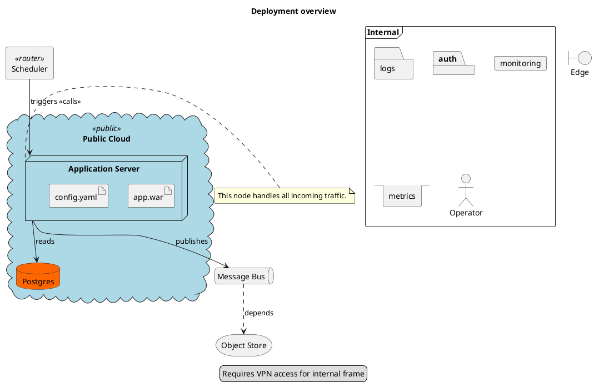

# PlantUML Deployment Dialect Implementation Plan

> **For agentic workers:** REQUIRED SUB-SKILL: Use superpowers:subagent-driven-development (recommended) or superpowers:executing-plans to implement this plan task-by-task. Steps use checkbox (`- [ ]`) syntax for tracking.

**Goal:** Add bidirectional PlantUML deployment-dialect support (the `node`/`artifact`/`database`/`cloud`/… vocabulary) as a peer to the Wave-3 component dialect, mapping into the existing `architecture` payload with same-format round-trip lossless via comment-encoded recovery markers.

**Architecture:** New `Sources/DiagramKitPlantUML/Deployment/` slice mirrors the per-dialect pattern (AST + Parser + Mapper + Exporter). `ArchitectureServiceKind` gains 14 deployment cases. Decorations (stereotypes, colors, notes, legend) round-trip via `PlantUMLRecoveryMarker` extensions, not new payload fields. Cross-format paths emit `.shapeDowngrade` diagnostics paired to a new `RoundTripLoss.deploymentShapeFlattened` case.

**Tech Stack:** Swift 6 (strict concurrency), `swift-testing` (`@Suite`/`@Test`/`#expect`), SwiftPM, `DiagramKitCommon` recovery-marker scanner, `RoundTripHarness` in `DiagramKitTestSupport`.

**Source spec:** `docs/superpowers/specs/2026-05-20-plantuml-deployment-design.md` (commit `f00b0e29`).

---

## Pre-flight notes for executors

1. **No exhaustive switches exist on `ArchitectureServiceKind` outside the PlantUML slice.** Verified by `grep -rn "switch.*ArchitectureServiceKind\|switch.*\.kind" Sources/`. Extending the enum will not break the build elsewhere. The only call sites that touch `service.kind` today are inside `Sources/DiagramKitPlantUML/`. This is why Task 1 is one-shot rather than spread across consumers.
2. **Filter rule (from CLAUDE.md memory):** every `swift test` invocation uses an exact suite filter (`--filter PlantUMLDeploymentProbeTests`), never a substring. Full runs hang on a known signal-10. Each step that runs tests must specify the exact filter.
3. **Working on `main`.** Per repo policy: no worktrees/branches, commit-by-commit on `main`.
4. **Fixture format reality check:** `Tests/DiagramKitTests/RoundTrip/Resources/roundtrip/` holds **directories of `.puml`/`.mmd`/`.dot` files**, not `.json` files. The spec's `.json` references are wrong; this plan uses `.puml`. The harness discovers fixtures by file extension.
5. **PlantUMLComponentExport and MermaidArchitectureExport both ignore `ArchitectureService.kind` today.** Wave-3 added the enum but the exporters never read it. This plan adds an explicit shape-downgrade emission pass to each so cross-format lossy projection becomes a typed diagnostic instead of silent loss.

---

## File structure

### Files to create

| Path | Responsibility |
|------|---------------|
| `Sources/DiagramKitPlantUML/Deployment/PlantUMLDeploymentAST.swift` | Typed AST: shapes, groups, edges, notes, legend |
| `Sources/DiagramKitPlantUML/Deployment/PlantUMLDeploymentParser.swift` | Body String → AST (line-oriented, block stack) |
| `Sources/DiagramKitPlantUML/Deployment/PlantUMLDeploymentMapper.swift` | AST → ArchitectureDiagram + recovery markers + diagnostics |
| `Sources/DiagramKitPlantUML/Exporter/PlantUMLDeploymentExporter.swift` | ArchitectureDiagram → PlantUML deployment body |
| `Tests/DiagramKitTests/PlantUML/Deployment/PlantUMLDeploymentProbeTests.swift` | Probe positive/negative + cascade-order checks |
| `Tests/DiagramKitTests/PlantUML/Deployment/PlantUMLDeploymentParserTests.swift` | AST construction tests |
| `Tests/DiagramKitTests/PlantUML/Deployment/PlantUMLDeploymentMapperTests.swift` | Mapper + recovery-marker emission |
| `Tests/DiagramKitTests/PlantUML/Deployment/PlantUMLDeploymentExporterTests.swift` | Exporter shape + emission order |
| `Tests/DiagramKitTests/PlantUML/Deployment/PlantUMLDeploymentRecoveryMarkerTests.swift` | Marker emit/parse round-trip per Kind case |
| `Tests/DiagramKitTests/PlantUML/Deployment/PlantUMLDeploymentRoundTripTests.swift` | Full parse → export → parse round-trip |
| `Tests/DiagramKitTests/RoundTrip/Resources/roundtrip/plantuml-deployment/01-comprehensive.puml` | Fixture for the harness |

### Files to modify

| Path | Change |
|------|--------|
| `Sources/DiagramKitModel/src_architecture_types.swift` | Add 14 cases to `ArchitectureServiceKind` |
| `Sources/DiagramKitPlantUML/PlantUMLFamilyProbe.swift` | Add `isPlantUMLDeploymentBody(_:)` |
| `Sources/DiagramKitPlantUML/PlantUMLImporter.swift` | Slot deployment between Component and Class in the cascade |
| `Sources/DiagramKitPlantUML/PlantUMLRecoveryMarker.swift` | Add 9 deployment cases + emit/parse helpers |
| `Sources/DiagramKitPlantUML/Exporter/PlantUMLExporter.swift` | Dispatcher: route architecture payload to Component or Deployment |
| `Sources/DiagramKitPlantUML/Exporter/PlantUMLComponentExporter.swift` | Emit `.shapeDowngrade` for deployment-kind services that reach this exporter (defensive) |
| `Sources/DiagramKitMermaid/Exporter/MermaidExport/MermaidArchitectureExport.swift` | Emit `.shapeDowngrade` for non-`.service` kinds (cross-format lossy projection) |
| `Sources/DiagramKitTestSupport/RoundTripLoss.swift` | Add `.deploymentShapeFlattened`, `.deploymentDecorationDropped`, `.deploymentLegendDropped` |
| `Sources/DiagramKitTestSupport/RoundTripLoss+Category.swift` | Pair new cases to existing `DiagnosticCategory` values |
| `COVERAGE.md` | One-paragraph note under Partial-support detail |

---

## Task 1: Extend ArchitectureServiceKind with deployment vocabulary

**Files:**
- Modify: `Sources/DiagramKitModel/src_architecture_types.swift:11-15`
- Test: `Tests/DiagramKitTests/PlantUML/Deployment/PlantUMLDeploymentParserTests.swift` (created)

- [ ] **Step 1: Create the test file with one failing test**

Create `Tests/DiagramKitTests/PlantUML/Deployment/PlantUMLDeploymentParserTests.swift`:

```swift
import Testing
import DiagramKitModel

@Suite("PlantUMLDeploymentParserTests")
struct PlantUMLDeploymentParserTests {

    @Test func architectureServiceKindHasDeploymentCases() {
        #expect(ArchitectureServiceKind.node.rawValue == "node")
        #expect(ArchitectureServiceKind.artifact.rawValue == "artifact")
        #expect(ArchitectureServiceKind.database.rawValue == "database")
        #expect(ArchitectureServiceKind.cloud.rawValue == "cloud")
        #expect(ArchitectureServiceKind.frame.rawValue == "frame")
        #expect(ArchitectureServiceKind.folder.rawValue == "folder")
        #expect(ArchitectureServiceKind.package.rawValue == "package")
        #expect(ArchitectureServiceKind.card.rawValue == "card")
        #expect(ArchitectureServiceKind.queue.rawValue == "queue")
        #expect(ArchitectureServiceKind.stack.rawValue == "stack")
        #expect(ArchitectureServiceKind.storage.rawValue == "storage")
        #expect(ArchitectureServiceKind.agent.rawValue == "agent")
        #expect(ArchitectureServiceKind.actor.rawValue == "actor")
        #expect(ArchitectureServiceKind.boundary.rawValue == "boundary")

        let allDeploymentCases: Set<ArchitectureServiceKind> = [
            .node, .artifact, .database, .cloud, .frame, .folder,
            .package, .card, .queue, .stack, .storage, .agent,
            .actor, .boundary
        ]
        #expect(allDeploymentCases.count == 14)
        #expect(ArchitectureServiceKind.allCases.count == 17) // 3 existing + 14
    }
}
```

- [ ] **Step 2: Run the test to confirm it fails**

Run: `swift test --filter PlantUMLDeploymentParserTests`
Expected: compile error — `'node' is not a member type of enum 'ArchitectureServiceKind'`

- [ ] **Step 3: Extend the enum**

In `Sources/DiagramKitModel/src_architecture_types.swift`, replace the existing `ArchitectureServiceKind` definition (lines 7-15) with:

```swift
/// Discriminates how an `ArchitectureService` should render. Defaults to
/// `.service` for back-compat with sources that don't carry a shape token.
/// `.component` / `.interface` come from PlantUML's component dialect.
/// `.node`/`.artifact`/`.database`/`.cloud`/`.frame`/`.folder`/`.package`/
/// `.card`/`.queue`/`.stack`/`.storage`/`.agent`/`.actor`/`.boundary` come
/// from PlantUML's deployment dialect.
public enum ArchitectureServiceKind: String, Sendable, Equatable, CaseIterable {
    case service
    case component
    case interface
    case node
    case artifact
    case database
    case cloud
    case frame
    case folder
    case package
    case card
    case queue
    case stack
    case storage
    case agent
    case actor
    case boundary
}
```

- [ ] **Step 4: Build and run the test**

Run: `swift build`
Expected: build succeeds.

Run: `swift test --filter PlantUMLDeploymentParserTests`
Expected: PASS.

- [ ] **Step 5: Run Wave-3 component tests to confirm no regression**

Run: `swift test --filter PlantUMLComponentRoundTripTests`
Expected: PASS.

- [ ] **Step 6: Commit**

```bash
git add Sources/DiagramKitModel/src_architecture_types.swift \
        Tests/DiagramKitTests/PlantUML/Deployment/PlantUMLDeploymentParserTests.swift
git commit -m "$(cat <<'EOF'
Task 1 — Extend ArchitectureServiceKind with 14 deployment cases

Adds node/artifact/database/cloud/frame/folder/package/card/queue/
stack/storage/agent/actor/boundary to support PlantUML deployment
dialect mapping. No exhaustive switches outside PlantUML slice
consume this enum, so no consumer changes needed.

Co-Authored-By: Claude Opus 4.7 (1M context) <noreply@anthropic.com>
EOF
)"
```

---

## Task 2: Extend PlantUMLRecoveryMarker with deployment cases

**Files:**
- Modify: `Sources/DiagramKitPlantUML/PlantUMLRecoveryMarker.swift`
- Test: `Tests/DiagramKitTests/PlantUML/Deployment/PlantUMLDeploymentRecoveryMarkerTests.swift` (created)

- [ ] **Step 1: Write the failing test for one new marker case**

Create `Tests/DiagramKitTests/PlantUML/Deployment/PlantUMLDeploymentRecoveryMarkerTests.swift`:

```swift
import Testing
@testable import DiagramKitPlantUML

@Suite("PlantUMLDeploymentRecoveryMarkerTests")
struct PlantUMLDeploymentRecoveryMarkerTests {

    @Test func serviceStereotypeRoundTrip() {
        let emitted = PlantUMLRecoveryMarker.emitDeploymentServiceStereotype(
            serviceId: "worker_1",
            stereotype: "router"
        )
        #expect(emitted == "' diagramkit:deployment-service-stereotype=worker_1,router")
        let parsed = PlantUMLRecoveryMarker.scanner.scan(emitted)
        #expect(parsed == .deploymentServiceStereotype(serviceId: "worker_1", stereotype: "router"))
    }

    @Test func serviceColorRoundTrip() {
        let emitted = PlantUMLRecoveryMarker.emitDeploymentServiceColor(serviceId: "db_3", color: "#FF6600")
        #expect(emitted == "' diagramkit:deployment-service-color=db_3,#FF6600")
        let parsed = PlantUMLRecoveryMarker.scanner.scan(emitted)
        #expect(parsed == .deploymentServiceColor(serviceId: "db_3", color: "#FF6600"))
    }

    @Test func groupKindRoundTrip() {
        let emitted = PlantUMLRecoveryMarker.emitDeploymentGroupKind(groupId: "cloud_2", kindRawValue: "cloud")
        #expect(emitted == "' diagramkit:deployment-group-kind=cloud_2,cloud")
        let parsed = PlantUMLRecoveryMarker.scanner.scan(emitted)
        #expect(parsed == .deploymentGroupKind(groupId: "cloud_2", kindRawValue: "cloud"))
    }

    @Test func edgeStyleRoundTrip() {
        let emitted = PlantUMLRecoveryMarker.emitDeploymentEdgeStyle(edgeIndex: 4, style: "dashed")
        #expect(emitted == "' diagramkit:deployment-edge-style=4,dashed")
        let parsed = PlantUMLRecoveryMarker.scanner.scan(emitted)
        #expect(parsed == .deploymentEdgeStyle(edgeIndex: 4, style: "dashed"))
    }

    @Test func noteRoundTripWithBase64Body() {
        let body = "This node handles all incoming traffic."
        let emitted = PlantUMLRecoveryMarker.emitDeploymentNote(
            serviceId: "worker_1",
            position: "right",
            body: body
        )
        // Expect: prefix + serviceId,position,b64:<base64>
        #expect(emitted.hasPrefix("' diagramkit:deployment-note=worker_1,right,b64:"))
        let parsed = PlantUMLRecoveryMarker.scanner.scan(emitted)
        if case let .deploymentNote(serviceId, position, base64) = parsed {
            #expect(serviceId == "worker_1")
            #expect(position == "right")
            let decoded = Data(base64Encoded: base64).flatMap { String(data: $0, encoding: .utf8) }
            #expect(decoded == body)
        } else {
            Issue.record("Expected .deploymentNote, got \(String(describing: parsed))")
        }
    }

    @Test func legendRoundTripWithBase64Body() {
        let body = "Requires VPN access"
        let emitted = PlantUMLRecoveryMarker.emitDeploymentLegend(body: body)
        #expect(emitted.hasPrefix("' diagramkit:deployment-legend=b64:"))
        let parsed = PlantUMLRecoveryMarker.scanner.scan(emitted)
        if case let .deploymentLegend(base64) = parsed {
            let decoded = Data(base64Encoded: base64).flatMap { String(data: $0, encoding: .utf8) }
            #expect(decoded == body)
        } else {
            Issue.record("Expected .deploymentLegend, got \(String(describing: parsed))")
        }
    }
}
```

- [ ] **Step 2: Run the test to confirm it fails**

Run: `swift test --filter PlantUMLDeploymentRecoveryMarkerTests`
Expected: compile error — `.deploymentServiceStereotype` not found.

- [ ] **Step 3: Extend the `Kind` enum**

In `Sources/DiagramKitPlantUML/PlantUMLRecoveryMarker.swift`, extend the `Kind` enum (around line 6-13) by appending after the existing cases:

```swift
case deploymentServiceStereotype(serviceId: String, stereotype: String)
case deploymentServiceColor(serviceId: String, color: String)
case deploymentGroupKind(groupId: String, kindRawValue: String)
case deploymentGroupStereotype(groupId: String, stereotype: String)
case deploymentGroupColor(groupId: String, color: String)
case deploymentEdgeStyle(edgeIndex: Int, style: String)
case deploymentEdgeStereotype(edgeIndex: Int, stereotype: String)
case deploymentNote(serviceId: String, position: String, base64Body: String)
case deploymentLegend(base64Body: String)
```

- [ ] **Step 4: Add parser branches**

In `parseKind(_:)` (around line 25), insert these branches before the final `return nil` (the existing implementation uses `stripPrefix(...)` style):

```swift
if let args = stripPrefix("deployment-service-stereotype=", rest) {
    let fields = args.split(separator: ",", maxSplits: 1, omittingEmptySubsequences: false)
    guard fields.count == 2 else { return nil }
    return .deploymentServiceStereotype(serviceId: String(fields[0]), stereotype: String(fields[1]))
}
if let args = stripPrefix("deployment-service-color=", rest) {
    let fields = args.split(separator: ",", maxSplits: 1, omittingEmptySubsequences: false)
    guard fields.count == 2 else { return nil }
    return .deploymentServiceColor(serviceId: String(fields[0]), color: String(fields[1]))
}
if let args = stripPrefix("deployment-group-kind=", rest) {
    let fields = args.split(separator: ",", maxSplits: 1, omittingEmptySubsequences: false)
    guard fields.count == 2 else { return nil }
    return .deploymentGroupKind(groupId: String(fields[0]), kindRawValue: String(fields[1]))
}
if let args = stripPrefix("deployment-group-stereotype=", rest) {
    let fields = args.split(separator: ",", maxSplits: 1, omittingEmptySubsequences: false)
    guard fields.count == 2 else { return nil }
    return .deploymentGroupStereotype(groupId: String(fields[0]), stereotype: String(fields[1]))
}
if let args = stripPrefix("deployment-group-color=", rest) {
    let fields = args.split(separator: ",", maxSplits: 1, omittingEmptySubsequences: false)
    guard fields.count == 2 else { return nil }
    return .deploymentGroupColor(groupId: String(fields[0]), color: String(fields[1]))
}
if let args = stripPrefix("deployment-edge-style=", rest) {
    let fields = args.split(separator: ",", maxSplits: 1, omittingEmptySubsequences: false)
    guard fields.count == 2, let edgeIndex = Int(fields[0]) else { return nil }
    return .deploymentEdgeStyle(edgeIndex: edgeIndex, style: String(fields[1]))
}
if let args = stripPrefix("deployment-edge-stereotype=", rest) {
    let fields = args.split(separator: ",", maxSplits: 1, omittingEmptySubsequences: false)
    guard fields.count == 2, let edgeIndex = Int(fields[0]) else { return nil }
    return .deploymentEdgeStereotype(edgeIndex: edgeIndex, stereotype: String(fields[1]))
}
if let args = stripPrefix("deployment-note=", rest) {
    let fields = args.split(separator: ",", maxSplits: 2, omittingEmptySubsequences: false)
    guard fields.count == 3, fields[2].hasPrefix("b64:") else { return nil }
    return .deploymentNote(
        serviceId: String(fields[0]),
        position: String(fields[1]),
        base64Body: String(fields[2].dropFirst(4))
    )
}
if let args = stripPrefix("deployment-legend=", rest) {
    guard args.hasPrefix("b64:") else { return nil }
    return .deploymentLegend(base64Body: String(args.dropFirst(4)))
}
```

- [ ] **Step 5: Add emit helpers**

After the existing `emit*` functions, add:

```swift
public static func emitDeploymentServiceStereotype(serviceId: String, stereotype: String) -> String {
    "' diagramkit:deployment-service-stereotype=\(sanitize(serviceId)),\(sanitize(stereotype))"
}

public static func emitDeploymentServiceColor(serviceId: String, color: String) -> String {
    "' diagramkit:deployment-service-color=\(sanitize(serviceId)),\(sanitize(color))"
}

public static func emitDeploymentGroupKind(groupId: String, kindRawValue: String) -> String {
    "' diagramkit:deployment-group-kind=\(sanitize(groupId)),\(sanitize(kindRawValue))"
}

public static func emitDeploymentGroupStereotype(groupId: String, stereotype: String) -> String {
    "' diagramkit:deployment-group-stereotype=\(sanitize(groupId)),\(sanitize(stereotype))"
}

public static func emitDeploymentGroupColor(groupId: String, color: String) -> String {
    "' diagramkit:deployment-group-color=\(sanitize(groupId)),\(sanitize(color))"
}

public static func emitDeploymentEdgeStyle(edgeIndex: Int, style: String) -> String {
    "' diagramkit:deployment-edge-style=\(edgeIndex),\(sanitize(style))"
}

public static func emitDeploymentEdgeStereotype(edgeIndex: Int, stereotype: String) -> String {
    "' diagramkit:deployment-edge-stereotype=\(edgeIndex),\(sanitize(stereotype))"
}

public static func emitDeploymentNote(serviceId: String, position: String, body: String) -> String {
    let base64 = Data(body.utf8).base64EncodedString()
    return "' diagramkit:deployment-note=\(sanitize(serviceId)),\(sanitize(position)),b64:\(base64)"
}

public static func emitDeploymentLegend(body: String) -> String {
    let base64 = Data(body.utf8).base64EncodedString()
    return "' diagramkit:deployment-legend=b64:\(base64)"
}
```

- [ ] **Step 6: Build, run, verify**

Run: `swift build`
Expected: builds.

Run: `swift test --filter PlantUMLDeploymentRecoveryMarkerTests`
Expected: PASS.

- [ ] **Step 7: Run existing recovery-marker tests to confirm no regression**

Run: `swift test --filter PlantUMLActivityMarkerRecoveryTests`
Expected: PASS.

- [ ] **Step 8: Commit**

```bash
git add Sources/DiagramKitPlantUML/PlantUMLRecoveryMarker.swift \
        Tests/DiagramKitTests/PlantUML/Deployment/PlantUMLDeploymentRecoveryMarkerTests.swift
git commit -m "$(cat <<'EOF'
Task 2 — Extend PlantUMLRecoveryMarker with 9 deployment cases

Adds emit/parse for deployment-service-stereotype, -color;
deployment-group-kind, -stereotype, -color; deployment-edge-style,
-stereotype; deployment-note (base64); deployment-legend (base64).

Co-Authored-By: Claude Opus 4.7 (1M context) <noreply@anthropic.com>
EOF
)"
```

---

## Task 3: Add `isPlantUMLDeploymentBody` probe

**Files:**
- Modify: `Sources/DiagramKitPlantUML/PlantUMLFamilyProbe.swift`
- Test: `Tests/DiagramKitTests/PlantUML/Deployment/PlantUMLDeploymentProbeTests.swift` (created)

- [ ] **Step 1: Write the failing probe tests**

Create `Tests/DiagramKitTests/PlantUML/Deployment/PlantUMLDeploymentProbeTests.swift`:

```swift
import Testing
@testable import DiagramKitPlantUML

@Suite("PlantUMLDeploymentProbeTests")
struct PlantUMLDeploymentProbeTests {

    @Test func acceptsNodeBlock() {
        let body = #"""
        node "Application Server" as appserver {
          artifact "app.war" as app
        }
        """#
        #expect(isPlantUMLDeploymentBody(body))
    }

    @Test func acceptsCloudBlock() {
        let body = #"""
        cloud "AWS" as aws {
          node "EC2" as ec2
        }
        """#
        #expect(isPlantUMLDeploymentBody(body))
    }

    @Test func acceptsBareDatabase() {
        let body = #"database "Postgres" as db"#
        #expect(isPlantUMLDeploymentBody(body))
    }

    @Test func rejectsComponentBody() {
        let body = #"""
        [Web] --> [API]
        interface HTTP
        """#
        #expect(!isPlantUMLDeploymentBody(body))
    }

    @Test func rejectsSequenceBody() {
        let body = #"""
        Alice -> Bob: Hello
        actor User
        """#
        #expect(!isPlantUMLDeploymentBody(body))
    }

    @Test func rejectsClassBody() {
        let body = #"""
        class Foo {
          +bar()
        }
        """#
        #expect(!isPlantUMLDeploymentBody(body))
    }

    @Test func rejectsBareActor() {
        // `actor` alone is intentionally not a deployment marker
        // (overlaps with sequence and use-case). Verified by the cascade
        // order — deployment fires only when other deployment keywords
        // are present.
        let body = #"actor User"#
        #expect(!isPlantUMLDeploymentBody(body))
    }

    @Test func acceptsHybridWithBoundary() {
        let body = #"""
        boundary "Public Network" as net
        node "Edge" as edge
        """#
        #expect(isPlantUMLDeploymentBody(body))
    }
}
```

- [ ] **Step 2: Run to confirm failure**

Run: `swift test --filter PlantUMLDeploymentProbeTests`
Expected: compile error — `isPlantUMLDeploymentBody` is not defined.

- [ ] **Step 3: Add the probe**

Append to `Sources/DiagramKitPlantUML/PlantUMLFamilyProbe.swift`:

```swift
/// Returns `true` when body contains PlantUML deployment-diagram syntax.
/// Triggered by deployment-exclusive shape keywords (`node`, `artifact`,
/// `cloud`, `database`, `frame`, `folder`, `package`, `card`, `queue`,
/// `stack`, `storage`, `agent`, `boundary`) declaring a labeled shape
/// or opening a nested block. `actor`/`interface`/`component` are
/// intentionally excluded — they overlap with sequence/use-case/class
/// or are already claimed by the component dialect.
public func isPlantUMLDeploymentBody(_ body: String) -> Bool {
    let deploymentKeywords: Set<String> = [
        "node", "artifact", "database", "cloud", "frame", "folder",
        "package", "card", "queue", "stack", "storage", "agent",
        "boundary"
    ]
    for line in body.split(separator: "\n", omittingEmptySubsequences: true) {
        let trimmed = line.trimmingCharacters(in: .whitespaces)
        guard let firstToken = trimmed.split(separator: " ", maxSplits: 1).first else { continue }
        if deploymentKeywords.contains(String(firstToken)),
           trimmed.contains("\"") || trimmed.hasSuffix("{") {
            return true
        }
    }
    return false
}
```

- [ ] **Step 4: Build and run**

Run: `swift build`
Expected: builds.

Run: `swift test --filter PlantUMLDeploymentProbeTests`
Expected: PASS (all 8 tests).

- [ ] **Step 5: Commit**

```bash
git add Sources/DiagramKitPlantUML/PlantUMLFamilyProbe.swift \
        Tests/DiagramKitTests/PlantUML/Deployment/PlantUMLDeploymentProbeTests.swift
git commit -m "$(cat <<'EOF'
Task 3 — Add isPlantUMLDeploymentBody probe

Triggers on deployment-exclusive shape keywords (node, artifact,
cloud, database, frame, folder, package, card, queue, stack,
storage, agent, boundary). actor/interface/component intentionally
excluded — overlap with other dialects.

Co-Authored-By: Claude Opus 4.7 (1M context) <noreply@anthropic.com>
EOF
)"
```

---

## Task 4: Define PlantUMLDeploymentAST types

**Files:**
- Create: `Sources/DiagramKitPlantUML/Deployment/PlantUMLDeploymentAST.swift`

- [ ] **Step 1: Add type-construction tests**

Append to `Tests/DiagramKitTests/PlantUML/Deployment/PlantUMLDeploymentParserTests.swift` (the file from Task 1):

```swift
    @Test func astTypesConstructible() {
        let shape = PlantUMLDeploymentAST.Shape(
            id: "worker", label: "Worker", kind: .node,
            stereotype: "router", color: "#FF6600"
        )
        let group = PlantUMLDeploymentAST.Group(
            id: "cloud_1", label: "AWS", kind: .cloud,
            stereotype: nil, color: nil, children: [.shape(shape)]
        )
        let edge = PlantUMLDeploymentAST.Edge(
            lhsId: "worker", rhsId: "db",
            direction: .forward, style: .solid,
            label: "writes", stereotype: nil
        )
        let ast = PlantUMLDeploymentAST(
            title: "Deployment", roots: [.group(group)],
            edges: [edge], notes: [], legend: nil
        )
        #expect(ast.title == "Deployment")
        #expect(ast.roots.count == 1)
        #expect(ast.edges.count == 1)
    }
```

- [ ] **Step 2: Run to confirm failure**

Run: `swift test --filter PlantUMLDeploymentParserTests`
Expected: compile error — `PlantUMLDeploymentAST` not found.

- [ ] **Step 3: Create the AST file**

Create `Sources/DiagramKitPlantUML/Deployment/PlantUMLDeploymentAST.swift`:

```swift
import Foundation
import DiagramKitModel

/// Typed AST for a PlantUML deployment-diagram body. Built by
/// `PlantUMLDeploymentParser` and consumed by `PlantUMLDeploymentMapper`.
public struct PlantUMLDeploymentAST: Sendable, Equatable {
    public var title: String?
    public var roots: [Node]
    public var edges: [Edge]
    public var notes: [NoteAttachment]
    public var legend: String?

    public init(
        title: String? = nil,
        roots: [Node] = [],
        edges: [Edge] = [],
        notes: [NoteAttachment] = [],
        legend: String? = nil
    ) {
        self.title = title
        self.roots = roots
        self.edges = edges
        self.notes = notes
        self.legend = legend
    }

    public indirect enum Node: Sendable, Equatable {
        case shape(Shape)
        case group(Group)
    }

    public struct Shape: Sendable, Equatable {
        public var id: String
        public var label: String?
        public var kind: ArchitectureServiceKind
        public var stereotype: String?
        public var color: String?

        public init(
            id: String, label: String?, kind: ArchitectureServiceKind,
            stereotype: String? = nil, color: String? = nil
        ) {
            self.id = id; self.label = label; self.kind = kind
            self.stereotype = stereotype; self.color = color
        }
    }

    public struct Group: Sendable, Equatable {
        public var id: String
        public var label: String?
        public var kind: ArchitectureServiceKind
        public var stereotype: String?
        public var color: String?
        public var children: [Node]

        public init(
            id: String, label: String?, kind: ArchitectureServiceKind,
            stereotype: String? = nil, color: String? = nil,
            children: [Node] = []
        ) {
            self.id = id; self.label = label; self.kind = kind
            self.stereotype = stereotype; self.color = color
            self.children = children
        }
    }

    public enum EdgeDirection: String, Sendable, Equatable {
        case forward     // -->
        case backward    // <--
        case both        // <-->
    }

    public enum EdgeStyle: String, Sendable, Equatable {
        case solid       // -->
        case dashed      // ..>
    }

    public struct Edge: Sendable, Equatable {
        public var lhsId: String
        public var rhsId: String
        public var direction: EdgeDirection
        public var style: EdgeStyle
        public var label: String?
        public var stereotype: String?

        public init(
            lhsId: String, rhsId: String,
            direction: EdgeDirection = .forward, style: EdgeStyle = .solid,
            label: String? = nil, stereotype: String? = nil
        ) {
            self.lhsId = lhsId; self.rhsId = rhsId
            self.direction = direction; self.style = style
            self.label = label; self.stereotype = stereotype
        }
    }

    public struct NoteAttachment: Sendable, Equatable {
        public var serviceId: String
        public var position: String     // "left" | "right" | "above" | "below"
        public var body: String

        public init(serviceId: String, position: String, body: String) {
            self.serviceId = serviceId; self.position = position; self.body = body
        }
    }
}
```

- [ ] **Step 4: Build, run, commit**

Run: `swift build && swift test --filter PlantUMLDeploymentParserTests`
Expected: PASS.

```bash
git add Sources/DiagramKitPlantUML/Deployment/PlantUMLDeploymentAST.swift \
        Tests/DiagramKitTests/PlantUML/Deployment/PlantUMLDeploymentParserTests.swift
git commit -m "$(cat <<'EOF'
Task 4 — Define PlantUMLDeploymentAST types

Adds typed AST for the deployment dialect: Shape, Group (recursive
via Node), Edge with direction/style enums, NoteAttachment, and a
container with title/roots/edges/notes/legend.

Co-Authored-By: Claude Opus 4.7 (1M context) <noreply@anthropic.com>
EOF
)"
```

---

## Task 5: Parser — single-line shapes (all 14 keywords)

**Files:**
- Create: `Sources/DiagramKitPlantUML/Deployment/PlantUMLDeploymentParser.swift`
- Test: `Tests/DiagramKitTests/PlantUML/Deployment/PlantUMLDeploymentParserTests.swift`

- [ ] **Step 1: Write the failing single-shape test**

Append to `PlantUMLDeploymentParserTests.swift`:

```swift
    @Test func parsesSingleNodeWithQuotedLabelAndAlias() throws {
        let ast = try PlantUMLDeploymentParser().parse(#"node "Web Server" as web"#)
        #expect(ast.roots.count == 1)
        if case let .shape(shape) = ast.roots[0] {
            #expect(shape.id == "web")
            #expect(shape.label == "Web Server")
            #expect(shape.kind == .node)
        } else {
            Issue.record("Expected .shape root, got \(ast.roots[0])")
        }
    }

    @Test func parsesShapeWithoutAliasUsesLabelAsId() throws {
        let ast = try PlantUMLDeploymentParser().parse(#"database "Postgres""#)
        #expect(ast.roots.count == 1)
        if case let .shape(shape) = ast.roots[0] {
            // When no `as <id>` is given, id derives from the label
            // (whitespace → underscore, lowercased).
            #expect(shape.id == "postgres")
            #expect(shape.label == "Postgres")
            #expect(shape.kind == .database)
        }
    }

    @Test func parsesAllFourteenShapeKinds() throws {
        let kinds: [(keyword: String, kind: ArchitectureServiceKind)] = [
            ("node", .node), ("artifact", .artifact), ("database", .database),
            ("cloud", .cloud), ("frame", .frame), ("folder", .folder),
            ("package", .package), ("card", .card), ("queue", .queue),
            ("stack", .stack), ("storage", .storage), ("agent", .agent),
            ("actor", .actor), ("boundary", .boundary)
        ]
        for (i, entry) in kinds.enumerated() {
            let body = "\(entry.keyword) \"Thing\(i)\" as t\(i)"
            let ast = try PlantUMLDeploymentParser().parse(body)
            guard case let .shape(shape) = ast.roots.first else {
                Issue.record("\(entry.keyword): no shape parsed"); continue
            }
            #expect(shape.kind == entry.kind, "\(entry.keyword) → \(shape.kind), expected \(entry.kind)")
            #expect(shape.id == "t\(i)")
            #expect(shape.label == "Thing\(i)")
        }
    }
```

- [ ] **Step 2: Run to confirm failure**

Run: `swift test --filter PlantUMLDeploymentParserTests`
Expected: compile error — `PlantUMLDeploymentParser` not found.

- [ ] **Step 3: Create the parser skeleton with single-line shape support**

Create `Sources/DiagramKitPlantUML/Deployment/PlantUMLDeploymentParser.swift`:

```swift
import Foundation
import DiagramKitCommon
import DiagramKitModel

/// Line-oriented parser for PlantUML deployment-diagram bodies.
/// Produces a `PlantUMLDeploymentAST` via `parse(_:)`.
public struct PlantUMLDeploymentParser {

    public init() {}

    public enum Error: Swift.Error, Equatable {
        case malformedShape(line: String)
        case unmatchedBlockClose(line: String)
    }

    private static let keywordToKind: [String: ArchitectureServiceKind] = [
        "node": .node, "artifact": .artifact, "database": .database,
        "cloud": .cloud, "frame": .frame, "folder": .folder,
        "package": .package, "card": .card, "queue": .queue,
        "stack": .stack, "storage": .storage, "agent": .agent,
        "actor": .actor, "boundary": .boundary,
        "component": .component, "interface": .interface
    ]

    public func parse(_ body: String) throws -> PlantUMLDeploymentAST {
        var roots: [PlantUMLDeploymentAST.Node] = []
        for rawLine in body.split(separator: "\n", omittingEmptySubsequences: true) {
            let line = rawLine.trimmingCharacters(in: .whitespaces)
            if line.isEmpty { continue }
            if line.hasPrefix("'") { continue }  // PlantUML line comment
            if line.hasPrefix("@") { continue }  // @startuml/@enduml
            if let shape = try parseShapeLine(line) {
                roots.append(.shape(shape))
                continue
            }
            // Other line types added in later tasks (edges, blocks, etc.)
        }
        return PlantUMLDeploymentAST(roots: roots)
    }

    private func parseShapeLine(_ line: String) throws -> PlantUMLDeploymentAST.Shape? {
        // Match: <keyword> "<label>" [as <id>] [<<stereotype>>] [#color]
        // For Task 5 we ignore stereotype/color/block-open; those come later.
        guard let space = line.firstIndex(of: " ") else { return nil }
        let keyword = String(line[..<space])
        guard let kind = Self.keywordToKind[keyword] else { return nil }
        let rest = line[line.index(after: space)...].trimmingCharacters(in: .whitespaces)

        var label: String? = nil
        var id: String = keyword + "_" + String(rest.hashValue) // placeholder
        var cursor = rest[...]

        if cursor.first == "\"" {
            // Quoted label
            let afterOpen = cursor.index(after: cursor.startIndex)
            guard let closeIdx = cursor[afterOpen...].firstIndex(of: "\"") else {
                throw Error.malformedShape(line: line)
            }
            label = String(cursor[afterOpen..<closeIdx])
            cursor = cursor[cursor.index(after: closeIdx)...].drop(while: { $0 == " " })
        }

        if cursor.hasPrefix("as ") {
            let aliasStart = cursor.index(cursor.startIndex, offsetBy: 3)
            let aliasEnd = cursor[aliasStart...].firstIndex(where: { $0 == " " || $0 == "{" }) ?? cursor.endIndex
            id = String(cursor[aliasStart..<aliasEnd])
        } else if let lbl = label {
            // Derive id from label: lowercase, non-alnum → underscore
            id = lbl.lowercased()
                .map { $0.isLetter || $0.isNumber ? $0 : "_" }
                .reduce("") { $0 + String($1) }
        }

        return .init(id: id, label: label, kind: kind)
    }
}
```

- [ ] **Step 4: Build and run**

Run: `swift build && swift test --filter PlantUMLDeploymentParserTests`
Expected: the three new tests PASS.

- [ ] **Step 5: Commit**

```bash
git add Sources/DiagramKitPlantUML/Deployment/PlantUMLDeploymentParser.swift \
        Tests/DiagramKitTests/PlantUML/Deployment/PlantUMLDeploymentParserTests.swift
git commit -m "$(cat <<'EOF'
Task 5 — PlantUML deployment parser: single-line shapes

Recognizes all 14 deployment keywords plus component/interface
fallthrough. Quoted-label parsing, optional `as <alias>`, label-derived
id when alias absent.

Co-Authored-By: Claude Opus 4.7 (1M context) <noreply@anthropic.com>
EOF
)"
```

---

## Task 6: Parser — nested groups via block stack

**Files:**
- Modify: `Sources/DiagramKitPlantUML/Deployment/PlantUMLDeploymentParser.swift`
- Test: `Tests/DiagramKitTests/PlantUML/Deployment/PlantUMLDeploymentParserTests.swift`

- [ ] **Step 1: Write failing nesting tests**

Append to `PlantUMLDeploymentParserTests.swift`:

```swift
    @Test func parsesSingleGroup() throws {
        let body = #"""
        cloud "AWS" as aws {
        }
        """#
        let ast = try PlantUMLDeploymentParser().parse(body)
        #expect(ast.roots.count == 1)
        if case let .group(group) = ast.roots[0] {
            #expect(group.id == "aws")
            #expect(group.label == "AWS")
            #expect(group.kind == .cloud)
            #expect(group.children.isEmpty)
        } else {
            Issue.record("Expected .group, got \(ast.roots[0])")
        }
    }

    @Test func parsesNestedGroupWithShape() throws {
        let body = #"""
        cloud "AWS" as aws {
          node "EC2" as ec2
        }
        """#
        let ast = try PlantUMLDeploymentParser().parse(body)
        guard case let .group(group) = ast.roots.first else {
            Issue.record("Expected group root"); return
        }
        #expect(group.children.count == 1)
        if case let .shape(child) = group.children[0] {
            #expect(child.id == "ec2")
            #expect(child.kind == .node)
        } else {
            Issue.record("Expected child shape, got \(group.children[0])")
        }
    }

    @Test func parsesThreeLevelNesting() throws {
        let body = #"""
        cloud "AWS" as aws {
          node "EC2" as ec2 {
            artifact "worker.jar" as worker
          }
        }
        """#
        let ast = try PlantUMLDeploymentParser().parse(body)
        guard case let .group(top) = ast.roots.first else {
            Issue.record("Expected top group"); return
        }
        #expect(top.id == "aws")
        guard case let .group(mid) = top.children.first else {
            Issue.record("Expected nested group"); return
        }
        #expect(mid.id == "ec2")
        guard case let .shape(leaf) = mid.children.first else {
            Issue.record("Expected leaf shape"); return
        }
        #expect(leaf.id == "worker")
        #expect(leaf.kind == .artifact)
    }

    @Test func throwsOnUnmatchedBlockClose() {
        let body = "}"
        #expect(throws: PlantUMLDeploymentParser.Error.unmatchedBlockClose(line: "}")) {
            _ = try PlantUMLDeploymentParser().parse(body)
        }
    }
```

- [ ] **Step 2: Run to confirm failure**

Run: `swift test --filter PlantUMLDeploymentParserTests`
Expected: new tests FAIL (parser returns empty roots).

- [ ] **Step 3: Extend parser with block stack**

Replace the `parse(_:)` method body in `PlantUMLDeploymentParser.swift` with:

```swift
    public func parse(_ body: String) throws -> PlantUMLDeploymentAST {
        var rootContainer: [PlantUMLDeploymentAST.Node] = []
        var groupStack: [(group: PlantUMLDeploymentAST.Group, children: [PlantUMLDeploymentAST.Node])] = []

        for rawLine in body.split(separator: "\n", omittingEmptySubsequences: true) {
            let line = rawLine.trimmingCharacters(in: .whitespaces)
            if line.isEmpty { continue }
            if line.hasPrefix("'") { continue }
            if line.hasPrefix("@") { continue }

            if line == "}" {
                guard var top = groupStack.popLast() else {
                    throw Error.unmatchedBlockClose(line: line)
                }
                let completed = PlantUMLDeploymentAST.Group(
                    id: top.group.id, label: top.group.label, kind: top.group.kind,
                    stereotype: top.group.stereotype, color: top.group.color,
                    children: top.children
                )
                if !groupStack.isEmpty {
                    groupStack[groupStack.count - 1].children.append(.group(completed))
                } else {
                    rootContainer.append(.group(completed))
                }
                continue
            }

            if let parsed = try parseShapeOrGroupLine(line) {
                switch parsed {
                case .openGroup(let group):
                    groupStack.append((group, []))
                case .shape(let shape):
                    if !groupStack.isEmpty {
                        groupStack[groupStack.count - 1].children.append(.shape(shape))
                    } else {
                        rootContainer.append(.shape(shape))
                    }
                }
            }
        }

        return PlantUMLDeploymentAST(roots: rootContainer)
    }

    private enum ParsedLine {
        case openGroup(PlantUMLDeploymentAST.Group)
        case shape(PlantUMLDeploymentAST.Shape)
    }

    private func parseShapeOrGroupLine(_ line: String) throws -> ParsedLine? {
        guard let space = line.firstIndex(of: " ") else { return nil }
        let keyword = String(line[..<space])
        guard let kind = Self.keywordToKind[keyword] else { return nil }
        let rest = line[line.index(after: space)...].trimmingCharacters(in: .whitespaces)

        let opensBlock = rest.hasSuffix("{")
        let body = opensBlock
            ? String(rest.dropLast()).trimmingCharacters(in: .whitespaces)
            : rest

        var label: String? = nil
        var id: String = ""
        var cursor = body[...]

        if cursor.first == "\"" {
            let afterOpen = cursor.index(after: cursor.startIndex)
            guard let closeIdx = cursor[afterOpen...].firstIndex(of: "\"") else {
                throw Error.malformedShape(line: line)
            }
            label = String(cursor[afterOpen..<closeIdx])
            cursor = cursor[cursor.index(after: closeIdx)...].drop(while: { $0 == " " })
        }

        if cursor.hasPrefix("as ") {
            let aliasStart = cursor.index(cursor.startIndex, offsetBy: 3)
            let aliasEnd = cursor[aliasStart...].firstIndex(where: { $0 == " " }) ?? cursor.endIndex
            id = String(cursor[aliasStart..<aliasEnd])
        } else if let lbl = label {
            id = lbl.lowercased()
                .map { $0.isLetter || $0.isNumber ? $0 : "_" }
                .reduce("") { $0 + String($1) }
        } else {
            return nil
        }

        if opensBlock {
            return .openGroup(.init(id: id, label: label, kind: kind))
        } else {
            return .shape(.init(id: id, label: label, kind: kind))
        }
    }
```

Remove the old `parseShapeLine(_:)` method (it's superseded).

- [ ] **Step 4: Build and run**

Run: `swift build && swift test --filter PlantUMLDeploymentParserTests`
Expected: all parser tests PASS.

- [ ] **Step 5: Commit**

```bash
git add Sources/DiagramKitPlantUML/Deployment/PlantUMLDeploymentParser.swift \
        Tests/DiagramKitTests/PlantUML/Deployment/PlantUMLDeploymentParserTests.swift
git commit -m "$(cat <<'EOF'
Task 6 — PlantUML deployment parser: nested groups via block stack

Handles `keyword "label" as id {` group-open and `}` group-close,
with a stack of (group, accumulated children) entries. Throws
unmatchedBlockClose on stray `}`. Supports arbitrary nesting depth.

Co-Authored-By: Claude Opus 4.7 (1M context) <noreply@anthropic.com>
EOF
)"
```

---

## Task 7: Parser — edges with direction, style, label, stereotype

**Files:**
- Modify: `Sources/DiagramKitPlantUML/Deployment/PlantUMLDeploymentParser.swift`
- Test: `Tests/DiagramKitTests/PlantUML/Deployment/PlantUMLDeploymentParserTests.swift`

- [ ] **Step 1: Write failing edge tests**

Append to `PlantUMLDeploymentParserTests.swift`:

```swift
    @Test func parsesSolidForwardEdge() throws {
        let body = #"""
        node "A" as a
        node "B" as b
        a --> b
        """#
        let ast = try PlantUMLDeploymentParser().parse(body)
        #expect(ast.edges.count == 1)
        let edge = ast.edges[0]
        #expect(edge.lhsId == "a")
        #expect(edge.rhsId == "b")
        #expect(edge.direction == .forward)
        #expect(edge.style == .solid)
        #expect(edge.label == nil)
    }

    @Test func parsesLabeledEdge() throws {
        let body = #"a --> b : writes"#
        let ast = try PlantUMLDeploymentParser().parse(body)
        #expect(ast.edges.first?.label == "writes")
    }

    @Test func parsesDashedDependencyEdge() throws {
        let body = #"a ..> b : depends"#
        let ast = try PlantUMLDeploymentParser().parse(body)
        guard let edge = ast.edges.first else { Issue.record("no edge"); return }
        #expect(edge.style == .dashed)
        #expect(edge.label == "depends")
    }

    @Test func parsesBidirectionalEdge() throws {
        let body = #"a <--> b"#
        let ast = try PlantUMLDeploymentParser().parse(body)
        #expect(ast.edges.first?.direction == .both)
    }

    @Test func parsesBackwardEdge() throws {
        let body = #"a <-- b"#
        let ast = try PlantUMLDeploymentParser().parse(body)
        #expect(ast.edges.first?.direction == .backward)
    }

    @Test func parsesEdgeStereotype() throws {
        let body = #"a --> b : uses <<calls>>"#
        let ast = try PlantUMLDeploymentParser().parse(body)
        guard let edge = ast.edges.first else { Issue.record("no edge"); return }
        #expect(edge.label == "uses")
        #expect(edge.stereotype == "calls")
    }
```

- [ ] **Step 2: Run to confirm failure**

Run: `swift test --filter PlantUMLDeploymentParserTests`
Expected: new edge tests FAIL (parser currently produces zero edges).

- [ ] **Step 3: Add edge parsing**

In `PlantUMLDeploymentParser.swift`, modify `parse(_:)` to collect edges. Add an `edges: [PlantUMLDeploymentAST.Edge]` accumulator alongside `rootContainer`, and after the existing `parseShapeOrGroupLine` branch in the loop, add:

```swift
            if let edge = parseEdgeLine(line) {
                edges.append(edge)
                continue
            }
```

Return both at the end:

```swift
        return PlantUMLDeploymentAST(roots: rootContainer, edges: edges)
```

Add this helper method:

```swift
    private func parseEdgeLine(_ line: String) -> PlantUMLDeploymentAST.Edge? {
        // Detect arrow token. Order matters: longest match first.
        let arrowCandidates: [(token: String, direction: PlantUMLDeploymentAST.EdgeDirection, style: PlantUMLDeploymentAST.EdgeStyle)] = [
            ("<-->", .both, .solid),
            ("..>", .forward, .dashed),
            ("<..", .backward, .dashed),
            ("-->", .forward, .solid),
            ("<--", .backward, .solid)
        ]
        for candidate in arrowCandidates {
            if let arrowRange = line.range(of: candidate.token) {
                let lhs = line[..<arrowRange.lowerBound].trimmingCharacters(in: .whitespaces)
                var rhsAndExtra = line[arrowRange.upperBound...].trimmingCharacters(in: .whitespaces)
                var label: String? = nil
                var stereotype: String? = nil

                if let colonIdx = rhsAndExtra.firstIndex(of: ":") {
                    let rhsId = rhsAndExtra[..<colonIdx].trimmingCharacters(in: .whitespaces)
                    var afterColon = rhsAndExtra[rhsAndExtra.index(after: colonIdx)...]
                        .trimmingCharacters(in: .whitespaces)
                    // Pull off trailing <<stereotype>>
                    if let stereoStart = afterColon.range(of: "<<"),
                       let stereoEnd = afterColon.range(of: ">>", range: stereoStart.upperBound..<afterColon.endIndex) {
                        stereotype = String(afterColon[stereoStart.upperBound..<stereoEnd.lowerBound])
                        afterColon = String(afterColon[..<stereoStart.lowerBound]).trimmingCharacters(in: .whitespaces)
                    }
                    label = afterColon.isEmpty ? nil : afterColon
                    return .init(
                        lhsId: lhs, rhsId: rhsId,
                        direction: candidate.direction, style: candidate.style,
                        label: label, stereotype: stereotype
                    )
                } else {
                    // No label or stereotype
                    let rhsId = rhsAndExtra.trimmingCharacters(in: .whitespaces)
                    return .init(
                        lhsId: lhs, rhsId: rhsId,
                        direction: candidate.direction, style: candidate.style,
                        label: nil, stereotype: nil
                    )
                }
            }
        }
        return nil
    }
```

- [ ] **Step 4: Build and run**

Run: `swift build && swift test --filter PlantUMLDeploymentParserTests`
Expected: PASS.

- [ ] **Step 5: Commit**

```bash
git add Sources/DiagramKitPlantUML/Deployment/PlantUMLDeploymentParser.swift \
        Tests/DiagramKitTests/PlantUML/Deployment/PlantUMLDeploymentParserTests.swift
git commit -m "$(cat <<'EOF'
Task 7 — PlantUML deployment parser: edges

Handles -->, <--, <-->, ..>, <.. arrows with optional `: label` and
trailing `<<stereotype>>`. Longest-match arrow detection.

Co-Authored-By: Claude Opus 4.7 (1M context) <noreply@anthropic.com>
EOF
)"
```

---

## Task 8: Parser — stereotypes, colors, notes, legend

**Files:**
- Modify: `Sources/DiagramKitPlantUML/Deployment/PlantUMLDeploymentParser.swift`
- Test: `Tests/DiagramKitTests/PlantUML/Deployment/PlantUMLDeploymentParserTests.swift`

- [ ] **Step 1: Write failing decoration tests**

Append:

```swift
    @Test func parsesShapeStereotype() throws {
        let body = #"node "Worker" as worker <<router>>"#
        let ast = try PlantUMLDeploymentParser().parse(body)
        if case let .shape(shape) = ast.roots.first {
            #expect(shape.stereotype == "router")
        }
    }

    @Test func parsesShapeColor() throws {
        let body = #"database "DB" as db #FF6600"#
        let ast = try PlantUMLDeploymentParser().parse(body)
        if case let .shape(shape) = ast.roots.first {
            #expect(shape.color == "#FF6600")
        }
    }

    @Test func parsesNoteRightOf() throws {
        let body = #"""
        node "Worker" as worker
        note right of worker
        This node handles all incoming traffic.
        end note
        """#
        let ast = try PlantUMLDeploymentParser().parse(body)
        #expect(ast.notes.count == 1)
        #expect(ast.notes[0].serviceId == "worker")
        #expect(ast.notes[0].position == "right")
        #expect(ast.notes[0].body == "This node handles all incoming traffic.")
    }

    @Test func parsesLegendBlock() throws {
        let body = #"""
        legend
        Requires VPN access
        endlegend
        """#
        let ast = try PlantUMLDeploymentParser().parse(body)
        #expect(ast.legend == "Requires VPN access")
    }

    @Test func parsesGroupStereotypeAndColor() throws {
        let body = #"""
        cloud "AWS" as aws <<public>> #ADD8E6 {
        }
        """#
        let ast = try PlantUMLDeploymentParser().parse(body)
        if case let .group(group) = ast.roots.first {
            #expect(group.stereotype == "public")
            #expect(group.color == "#ADD8E6")
        }
    }
```

- [ ] **Step 2: Run to confirm failure**

Run: `swift test --filter PlantUMLDeploymentParserTests`
Expected: FAIL on the new tests.

- [ ] **Step 3: Extend the parser**

In `parseShapeOrGroupLine`, after the `as <alias>` parse and before the return, extract trailing `<<stereotype>>` and `#color`:

```swift
        // After id resolution, scan the remainder of the line for
        // <<stereotype>> and/or #color tokens. They can appear in either
        // order; both are optional.
        var stereotype: String? = nil
        var color: String? = nil
        let remainder = String(cursor).trimmingCharacters(in: .whitespaces)
        // <<stereotype>>
        if let stereoStart = remainder.range(of: "<<"),
           let stereoEnd = remainder.range(of: ">>", range: stereoStart.upperBound..<remainder.endIndex) {
            stereotype = String(remainder[stereoStart.upperBound..<stereoEnd.lowerBound])
        }
        // #color (hex 3/6/8-digit or named; we capture leading `#` + alnum run)
        if let hashIdx = remainder.firstIndex(of: "#") {
            let after = remainder[remainder.index(after: hashIdx)...]
            let runEnd = after.firstIndex(where: { !($0.isLetter || $0.isNumber) }) ?? after.endIndex
            let hex = remainder[hashIdx..<runEnd]
            if hex.count > 1 { color = String(hex) }
        }
```

Update the two returns to include the new fields:

```swift
        if opensBlock {
            return .openGroup(.init(
                id: id, label: label, kind: kind,
                stereotype: stereotype, color: color
            ))
        } else {
            return .shape(.init(
                id: id, label: label, kind: kind,
                stereotype: stereotype, color: color
            ))
        }
```

Now add note + legend handling. In `parse(_:)`, add state variables before the loop:

```swift
        var notes: [PlantUMLDeploymentAST.NoteAttachment] = []
        var legend: String? = nil
        var pendingNote: (serviceId: String, position: String, lines: [String])? = nil
        var pendingLegendLines: [String]? = nil
```

Inside the loop, BEFORE the existing block-close branch, add:

```swift
            if let pending = pendingNote {
                if line == "end note" {
                    notes.append(.init(
                        serviceId: pending.serviceId,
                        position: pending.position,
                        body: pending.lines.joined(separator: "\n")
                    ))
                    pendingNote = nil
                } else {
                    pendingNote!.lines.append(line)
                }
                continue
            }
            if let pending = pendingLegendLines {
                if line == "endlegend" {
                    legend = pending.joined(separator: "\n")
                    pendingLegendLines = nil
                } else {
                    pendingLegendLines!.append(line)
                }
                continue
            }
            if line == "legend" {
                pendingLegendLines = []
                continue
            }
            if line.hasPrefix("note ") {
                // Match: `note (left|right|above|below) of <id>`
                let tokens = line.split(separator: " ")
                if tokens.count >= 4, tokens[2] == "of" {
                    pendingNote = (
                        serviceId: String(tokens[3]),
                        position: String(tokens[1]),
                        lines: []
                    )
                    continue
                }
            }
```

Finally update the return at the bottom of `parse(_:)`:

```swift
        return PlantUMLDeploymentAST(
            roots: rootContainer, edges: edges,
            notes: notes, legend: legend
        )
```

- [ ] **Step 4: Build and run**

Run: `swift build && swift test --filter PlantUMLDeploymentParserTests`
Expected: PASS.

- [ ] **Step 5: Commit**

```bash
git add Sources/DiagramKitPlantUML/Deployment/PlantUMLDeploymentParser.swift \
        Tests/DiagramKitTests/PlantUML/Deployment/PlantUMLDeploymentParserTests.swift
git commit -m "$(cat <<'EOF'
Task 8 — Parser: stereotypes, color tags, notes, legend

Adds trailing-decoration scan on shape/group lines (<<stereo>>,
#color), `note (left|right|above|below) of <id>` … `end note`
multi-line capture, and `legend` … `endlegend` block capture.

Co-Authored-By: Claude Opus 4.7 (1M context) <noreply@anthropic.com>
EOF
)"
```

---

## Task 9: Mapper — AST → ArchitectureDiagram (basic structure)

**Files:**
- Create: `Sources/DiagramKitPlantUML/Deployment/PlantUMLDeploymentMapper.swift`
- Create: `Tests/DiagramKitTests/PlantUML/Deployment/PlantUMLDeploymentMapperTests.swift`

- [ ] **Step 1: Write failing mapper tests**

Create `Tests/DiagramKitTests/PlantUML/Deployment/PlantUMLDeploymentMapperTests.swift`:

```swift
import Testing
import DiagramKitModel
@testable import DiagramKitPlantUML

@Suite("PlantUMLDeploymentMapperTests")
struct PlantUMLDeploymentMapperTests {

    @Test func flatShapesBecomeServices() throws {
        let ast = PlantUMLDeploymentAST(
            roots: [
                .shape(.init(id: "a", label: "A", kind: .node)),
                .shape(.init(id: "b", label: "B", kind: .database))
            ]
        )
        let (diagram, diagnostics) = PlantUMLDeploymentMapper().map(ast)
        #expect(diagnostics.isEmpty)
        #expect(diagram.services.map(\.id).sorted() == ["a", "b"])
        let a = diagram.services.first { $0.id == "a" }
        #expect(a?.kind == .node)
        #expect(a?.title == "A")
        let b = diagram.services.first { $0.id == "b" }
        #expect(b?.kind == .database)
    }

    @Test func groupBecomesArchitectureGroupWithChildrenParented() throws {
        let ast = PlantUMLDeploymentAST(
            roots: [
                .group(.init(
                    id: "aws", label: "AWS", kind: .cloud,
                    children: [
                        .shape(.init(id: "ec2", label: "EC2", kind: .node))
                    ]
                ))
            ]
        )
        let (diagram, _) = PlantUMLDeploymentMapper().map(ast)
        #expect(diagram.groups.map(\.id) == ["aws"])
        #expect(diagram.services.map(\.id) == ["ec2"])
        let ec2 = diagram.services.first { $0.id == "ec2" }
        #expect(ec2?.parentGroupId == "aws")
    }

    @Test func threeLevelNestingPreservesParentage() throws {
        let ast = PlantUMLDeploymentAST(
            roots: [
                .group(.init(id: "aws", label: nil, kind: .cloud, children: [
                    .group(.init(id: "ec2", label: nil, kind: .node, children: [
                        .shape(.init(id: "worker", label: nil, kind: .artifact))
                    ]))
                ]))
            ]
        )
        let (diagram, _) = PlantUMLDeploymentMapper().map(ast)
        let aws = diagram.groups.first { $0.id == "aws" }
        let ec2 = diagram.groups.first { $0.id == "ec2" }
        let worker = diagram.services.first { $0.id == "worker" }
        #expect(aws?.parentGroupId == nil)
        #expect(ec2?.parentGroupId == "aws")
        #expect(worker?.parentGroupId == "ec2")
    }

    @Test func edgesBecomeArchitectureEdges() throws {
        let ast = PlantUMLDeploymentAST(
            roots: [
                .shape(.init(id: "a", label: nil, kind: .node)),
                .shape(.init(id: "b", label: nil, kind: .node))
            ],
            edges: [.init(lhsId: "a", rhsId: "b", direction: .forward, style: .solid, label: "writes")]
        )
        let (diagram, _) = PlantUMLDeploymentMapper().map(ast)
        #expect(diagram.edges.count == 1)
        let edge = diagram.edges[0]
        #expect(edge.lhsId == "a")
        #expect(edge.rhsId == "b")
        #expect(edge.label == "writes")
        // PlantUML edges don't carry direction tokens; mapper picks
        // conventional defaults.
        #expect(edge.lhsDirection == .R)
        #expect(edge.rhsDirection == .L)
    }

    @Test func titlePropagates() throws {
        let ast = PlantUMLDeploymentAST(title: "Deployment Diagram", roots: [])
        let (diagram, _) = PlantUMLDeploymentMapper().map(ast)
        #expect(diagram.diagramTitle == "Deployment Diagram")
    }
}
```

- [ ] **Step 2: Run to confirm failure**

Run: `swift test --filter PlantUMLDeploymentMapperTests`
Expected: compile error — `PlantUMLDeploymentMapper` not found.

- [ ] **Step 3: Create the mapper**

Create `Sources/DiagramKitPlantUML/Deployment/PlantUMLDeploymentMapper.swift`:

```swift
import Foundation
import DiagramKitCommon
import DiagramKitModel

/// Maps a `PlantUMLDeploymentAST` to an `ArchitectureDiagram` plus
/// any diagnostics. Recovery markers for decorations (stereotype,
/// color, notes, legend, edge style, group kind) are emitted as
/// pre-source comments; this mapper does not inject them — the
/// exporter does. The mapper's job is to populate the typed payload
/// only and record what decorations were present so the exporter can
/// re-emit them.
public struct PlantUMLDeploymentMapper {

    public init() {}

    public func map(_ ast: PlantUMLDeploymentAST) -> (ArchitectureDiagram, [DiagramDiagnostic]) {
        var groups: [ArchitectureGroup] = []
        var services: [ArchitectureService] = []
        let diagnostics: [DiagramDiagnostic] = []
        for node in ast.roots {
            visit(node, parentGroupId: nil, groups: &groups, services: &services)
        }
        var edges: [ArchitectureEdge] = []
        for astEdge in ast.edges {
            edges.append(.init(
                lhsId: astEdge.lhsId,
                rhsId: astEdge.rhsId,
                lhsDirection: .R,
                rhsDirection: .L,
                sourceArrow: astEdge.direction == .backward || astEdge.direction == .both,
                targetArrow: astEdge.direction == .forward || astEdge.direction == .both,
                lhsGroupBoundary: false,
                rhsGroupBoundary: false,
                label: astEdge.label
            ))
        }
        let diagram = ArchitectureDiagram(
            groups: groups, services: services, junctions: [], edges: edges,
            diagramTitle: ast.title
        )
        return (diagram, diagnostics)
    }

    private func visit(
        _ node: PlantUMLDeploymentAST.Node,
        parentGroupId: String?,
        groups: inout [ArchitectureGroup],
        services: inout [ArchitectureService]
    ) {
        switch node {
        case .shape(let shape):
            services.append(.init(
                id: shape.id, icon: nil, iconText: nil,
                title: shape.label, parentGroupId: parentGroupId,
                kind: shape.kind
            ))
        case .group(let group):
            groups.append(.init(
                id: group.id, icon: nil, title: group.label,
                parentGroupId: parentGroupId
            ))
            for child in group.children {
                visit(child, parentGroupId: group.id, groups: &groups, services: &services)
            }
        }
    }
}
```

- [ ] **Step 4: Build and run**

Run: `swift build && swift test --filter PlantUMLDeploymentMapperTests`
Expected: PASS.

- [ ] **Step 5: Commit**

```bash
git add Sources/DiagramKitPlantUML/Deployment/PlantUMLDeploymentMapper.swift \
        Tests/DiagramKitTests/PlantUML/Deployment/PlantUMLDeploymentMapperTests.swift
git commit -m "$(cat <<'EOF'
Task 9 — PlantUMLDeploymentMapper: AST → ArchitectureDiagram

Walks AST depth-first; flattens groups into ArchitectureGroup +
ArchitectureService with parentGroupId chains. Edges synthesize
conventional R/L direction tokens (PlantUML deployment edges lack
direction). No decorations yet — those come in Task 10.

Co-Authored-By: Claude Opus 4.7 (1M context) <noreply@anthropic.com>
EOF
)"
```

---

## Task 10: Wire deployment into PlantUMLImporter cascade

**Files:**
- Modify: `Sources/DiagramKitPlantUML/PlantUMLImporter.swift`
- Test: `Tests/DiagramKitTests/PlantUML/Deployment/PlantUMLDeploymentProbeTests.swift` (extend)

- [ ] **Step 1: Add cascade-routing tests**

Append to `PlantUMLDeploymentProbeTests.swift`:

```swift
    @Test func importerRoutesDeploymentBodyThroughDeploymentMapper() throws {
        let source = #"""
        @startuml
        cloud "AWS" as aws {
          node "EC2" as ec2
        }
        database "Postgres" as db
        ec2 --> db : writes
        @enduml
        """#
        let result = try PlantUMLImporter().parse(source)
        guard case .architecture(let arch) = result.document.payload else {
            Issue.record("Expected architecture payload, got \(result.document.payload)"); return
        }
        #expect(arch.services.contains { $0.id == "ec2" && $0.kind == .node })
        #expect(arch.services.contains { $0.id == "db" && $0.kind == .database })
        #expect(arch.groups.contains { $0.id == "aws" })
    }

    @Test func importerStillRoutesComponentBodyThroughComponentMapper() throws {
        // Wave 3 regression check — bodies with [Bracketed] but no
        // deployment keywords stay on Component.
        let source = #"""
        @startuml
        [Web] --> [API]
        interface HTTP
        [API] --> HTTP
        @enduml
        """#
        let result = try PlantUMLImporter().parse(source)
        guard case .architecture(let arch) = result.document.payload else {
            Issue.record("Expected architecture, got \(result.document.payload)"); return
        }
        // Component dialect assigns .component to bracketed services
        // and .interface to interfaces. NO deployment kinds present.
        let kinds = Set(arch.services.map(\.kind))
        #expect(kinds.isSubset(of: [.component, .interface]))
    }
```

- [ ] **Step 2: Run to confirm the deployment-routing test fails**

Run: `swift test --filter PlantUMLDeploymentProbeTests`
Expected: `importerRoutesDeploymentBodyThroughDeploymentMapper` FAILs (body routes to Component or falls through).

- [ ] **Step 3: Add the cascade arm**

In `Sources/DiagramKitPlantUML/PlantUMLImporter.swift`, locate the cascade (between `isPlantUMLComponentBody` and `isPlantUMLClassBody` — around lines 132-140). Insert this arm AFTER the Component branch and BEFORE the Class branch:

```swift
        if isPlantUMLDeploymentBody(body) {
            let ast = try PlantUMLDeploymentParser().parse(body)
            let (model, diagnostics) = PlantUMLDeploymentMapper().map(ast)
            return DiagramImportResult(
                document: DiagramDocument(payload: .architecture(model)),
                diagnostics: diagnostics
            )
        }
```

(The exact signature should match the surrounding arms — re-read lines 81-150 of the file before pasting to confirm `DiagramImportResult` and `DiagramDocument` initializers.)

- [ ] **Step 4: Build and run**

Run: `swift build && swift test --filter PlantUMLDeploymentProbeTests`
Expected: both new tests PASS.

Run: `swift test --filter PlantUMLComponentRoundTripTests`
Expected: Wave 3 component tests still PASS.

- [ ] **Step 5: Commit**

```bash
git add Sources/DiagramKitPlantUML/PlantUMLImporter.swift \
        Tests/DiagramKitTests/PlantUML/Deployment/PlantUMLDeploymentProbeTests.swift
git commit -m "$(cat <<'EOF'
Task 10 — Wire PlantUML deployment into importer cascade

Slots between Component and Class. Bodies with deployment-exclusive
keywords route through PlantUMLDeploymentParser + Mapper, returning
an architecture-payload DiagramDocument. Wave 3 component routing
preserved.

Co-Authored-By: Claude Opus 4.7 (1M context) <noreply@anthropic.com>
EOF
)"
```

---

## Task 11: PlantUMLExporter dispatcher — discriminate Component vs Deployment

**Files:**
- Modify: `Sources/DiagramKitPlantUML/Exporter/PlantUMLExporter.swift`
- Test: `Tests/DiagramKitTests/PlantUML/Deployment/PlantUMLDeploymentExporterTests.swift` (created)

- [ ] **Step 1: Write the failing dispatcher test**

Create `Tests/DiagramKitTests/PlantUML/Deployment/PlantUMLDeploymentExporterTests.swift`:

```swift
import Testing
import DiagramKitModel
import DiagramKitExport
@testable import DiagramKitPlantUML

@Suite("PlantUMLDeploymentExporterTests")
struct PlantUMLDeploymentExporterTests {

    @Test func dispatcherRoutesDeploymentKindToDeploymentExporter() throws {
        let diagram = ArchitectureDiagram(
            groups: [],
            services: [
                .init(id: "db", title: "Postgres", parentGroupId: nil, kind: .database)
            ]
        )
        let document = DiagramDocument(payload: .architecture(diagram))
        let exporter = PlantUMLExporter()
        let result = try exporter.export(document)
        // Deployment exporter emits `database "..."` syntax.
        #expect(result.source.contains("database"))
        // Component exporter would emit `[db]` — confirm it didn't run.
        #expect(!result.source.contains("[db]"))
    }

    @Test func dispatcherRoutesComponentOnlyKindsToComponentExporter() throws {
        let diagram = ArchitectureDiagram(
            services: [
                .init(id: "web", title: "Web", parentGroupId: nil, kind: .component),
                .init(id: "http", title: nil, parentGroupId: nil, kind: .interface)
            ]
        )
        let document = DiagramDocument(payload: .architecture(diagram))
        let result = try PlantUMLExporter().export(document)
        #expect(result.source.contains("[web]"))
        #expect(!result.source.contains("database"))
    }

    @Test func dispatcherRoutesPureServiceKindToComponentExporter() throws {
        let diagram = ArchitectureDiagram(
            services: [.init(id: "x", title: "X", parentGroupId: nil, kind: .service)]
        )
        let document = DiagramDocument(payload: .architecture(diagram))
        let result = try PlantUMLExporter().export(document)
        // Default service kind → Component dialect (Wave 3 behavior preserved)
        #expect(result.source.contains("[x]"))
    }
}
```

- [ ] **Step 2: Run to confirm the first test fails**

Run: `swift test --filter PlantUMLDeploymentExporterTests`
Expected: `dispatcherRoutesDeploymentKindToDeploymentExporter` FAILs (Component exporter runs and emits `[db]`, not `database`).

- [ ] **Step 3: Update the dispatcher**

In `Sources/DiagramKitPlantUML/Exporter/PlantUMLExporter.swift` line 50 (the `.architecture` case), replace:

```swift
        case .architecture(let model):
            return try PlantUMLComponentExport.emit(model)
```

with:

```swift
        case .architecture(let model):
            if requiresDeploymentDialect(model) {
                return try PlantUMLDeploymentExport.emit(model)
            }
            return try PlantUMLComponentExport.emit(model)
```

Add this helper at the bottom of the file's enum (or at file scope if `PlantUMLExporter` is a struct — match the existing style):

```swift
    private func requiresDeploymentDialect(_ diagram: ArchitectureDiagram) -> Bool {
        let deploymentKinds: Set<ArchitectureServiceKind> = [
            .node, .artifact, .database, .cloud, .frame, .folder,
            .package, .card, .queue, .stack, .storage, .agent,
            .actor, .boundary
        ]
        return diagram.services.contains { deploymentKinds.contains($0.kind) }
    }
```

(`PlantUMLDeploymentExport` doesn't exist yet — Task 12 creates it. The build will fail until Task 12 lands. This is intentional: we wire the dispatcher first so Task 12's test is meaningful.)

Actually, to keep the build green between tasks, **temporarily stub** the deployment branch in this commit. Replace the dispatcher edit with:

```swift
        case .architecture(let model):
            if requiresDeploymentDialect(model) {
                // Stub until Task 12; falls through to Component for now.
                _ = model
            }
            return try PlantUMLComponentExport.emit(model)
```

Keep the `requiresDeploymentDialect` helper. The first dispatcher test will still fail after this step — that's expected; Task 12 makes it pass.

- [ ] **Step 4: Build to confirm green**

Run: `swift build`
Expected: builds (stub keeps it green).

- [ ] **Step 5: Run regression test for component dialect**

Run: `swift test --filter PlantUMLComponentRoundTripTests`
Expected: PASS.

- [ ] **Step 6: Commit**

```bash
git add Sources/DiagramKitPlantUML/Exporter/PlantUMLExporter.swift \
        Tests/DiagramKitTests/PlantUML/Deployment/PlantUMLDeploymentExporterTests.swift
git commit -m "$(cat <<'EOF'
Task 11 — PlantUMLExporter: dispatcher discriminator (stubbed)

Adds requiresDeploymentDialect() to detect when an ArchitectureDiagram
needs the deployment exporter. Branch is stubbed (falls through to
Component) until Task 12 introduces PlantUMLDeploymentExport. Two of
the new dispatcher tests already pass (Component routing); the third
will pass after Task 12.

Co-Authored-By: Claude Opus 4.7 (1M context) <noreply@anthropic.com>
EOF
)"
```

---

## Task 12: PlantUMLDeploymentExporter — base shapes, groups, edges

**Files:**
- Create: `Sources/DiagramKitPlantUML/Exporter/PlantUMLDeploymentExporter.swift`
- Modify: `Sources/DiagramKitPlantUML/Exporter/PlantUMLExporter.swift` (un-stub the branch)

- [ ] **Step 1: Add failing round-trip tests**

Append to `PlantUMLDeploymentExporterTests.swift`:

```swift
    @Test func emitsBareShape() throws {
        let diagram = ArchitectureDiagram(
            services: [.init(id: "db", title: "Postgres", parentGroupId: nil, kind: .database)]
        )
        let result = try PlantUMLDeploymentExport.emit(diagram)
        #expect(result.source.contains(#"database "Postgres" as db"#))
        #expect(result.source.hasPrefix("@startuml"))
        #expect(result.source.contains("@enduml"))
    }

    @Test func emitsNestedGroup() throws {
        let diagram = ArchitectureDiagram(
            groups: [.init(id: "aws", title: "AWS", parentGroupId: nil)],
            services: [.init(id: "ec2", title: "EC2", parentGroupId: "aws", kind: .node)]
        )
        let result = try PlantUMLDeploymentExport.emit(diagram)
        // Group line opens with the keyword
        #expect(result.source.contains(#"cloud "AWS" as aws {"#) || result.source.contains(#"node "AWS" as aws {"#))
        // Group keyword for `aws` defaults to `node` without a deployment-group-kind marker.
        // (Task 13 wires marker-driven group kind.)
        #expect(result.source.contains(#"node "EC2" as ec2"#))
        #expect(result.source.contains("}"))
    }

    @Test func emitsEdgeWithLabel() throws {
        let diagram = ArchitectureDiagram(
            services: [
                .init(id: "a", title: nil, parentGroupId: nil, kind: .node),
                .init(id: "b", title: nil, parentGroupId: nil, kind: .node)
            ],
            edges: [.init(lhsId: "a", rhsId: "b", lhsDirection: .R, rhsDirection: .L,
                          sourceArrow: false, targetArrow: true, label: "writes")]
        )
        let result = try PlantUMLDeploymentExport.emit(diagram)
        #expect(result.source.contains("a --> b : writes"))
    }

    @Test func roundTripsThroughImporter() throws {
        let source = #"""
        @startuml
        cloud "AWS" as aws {
          node "EC2" as ec2
        }
        database "Postgres" as db
        ec2 --> db : writes
        @enduml
        """#
        let parsed = try PlantUMLImporter().parse(source)
        guard case .architecture(let arch) = parsed.document.payload else {
            Issue.record("not architecture"); return
        }
        let exported = try PlantUMLDeploymentExport.emit(arch)
        let reparsed = try PlantUMLImporter().parse(exported.source)
        guard case .architecture(let arch2) = reparsed.document.payload else {
            Issue.record("not architecture after round-trip"); return
        }
        #expect(Set(arch2.services.map(\.id)) == Set(arch.services.map(\.id)))
        #expect(Set(arch2.groups.map(\.id)) == Set(arch.groups.map(\.id)))
        #expect(arch2.edges.count == arch.edges.count)
    }
```

- [ ] **Step 2: Run to confirm failure**

Run: `swift test --filter PlantUMLDeploymentExporterTests`
Expected: compile error — `PlantUMLDeploymentExport` not found.

- [ ] **Step 3: Create the exporter**

Create `Sources/DiagramKitPlantUML/Exporter/PlantUMLDeploymentExporter.swift`:

```swift
import Foundation
import DiagramKitCommon
import DiagramKitModel
import DiagramKitImport
import DiagramKitExport

/// Emits PlantUML deployment-diagram syntax from an `ArchitectureDiagram`.
/// Used by `PlantUMLExporter` when the document contains deployment-kind
/// services. Same-format round-trip is lossless via comment-encoded
/// recovery markers (added in Task 13).
enum PlantUMLDeploymentExport {

    static func emit(_ diagram: ArchitectureDiagram) throws -> DiagramExportResult {
        var lines: [String] = []
        lines.append("@startuml")
        if let title = diagram.diagramTitle, !title.isEmpty {
            lines.append("title \(singleLine(title))")
        }
        // Top-level: groups and services whose parentGroupId is nil
        let rootGroups = diagram.groups.filter { $0.parentGroupId == nil }
        let rootServices = diagram.services.filter { $0.parentGroupId == nil }
        for group in rootGroups {
            emitGroup(group, depth: 0, diagram: diagram, lines: &lines)
        }
        for service in rootServices {
            lines.append(serviceLine(service, indent: ""))
        }
        for edge in diagram.edges {
            lines.append(edgeLine(edge))
        }
        lines.append("@enduml")
        return DiagramExportResult(source: lines.joined(separator: "\n") + "\n", diagnostics: [])
    }

    private static func emitGroup(
        _ group: ArchitectureGroup, depth: Int,
        diagram: ArchitectureDiagram,
        lines: inout [String]
    ) {
        let indent = String(repeating: "  ", count: depth)
        // Group keyword defaults to `node` for now. Task 13 reads a
        // deployment-group-kind recovery marker to restore the original.
        let keyword = "node"
        let label = group.title.map { #" "\#($0)" "# } ?? " "
        lines.append("\(indent)\(keyword)\(label)as \(group.id) {")
        // Nested groups
        let childGroups = diagram.groups.filter { $0.parentGroupId == group.id }
        for child in childGroups {
            emitGroup(child, depth: depth + 1, diagram: diagram, lines: &lines)
        }
        // Child services
        let childServices = diagram.services.filter { $0.parentGroupId == group.id }
        let childIndent = String(repeating: "  ", count: depth + 1)
        for service in childServices {
            lines.append(serviceLine(service, indent: childIndent))
        }
        lines.append("\(indent)}")
    }

    private static func serviceLine(_ service: ArchitectureService, indent: String) -> String {
        let keyword = service.kind.plantUMLDeploymentKeyword
        if let title = service.title, !title.isEmpty {
            return #"\#(indent)\#(keyword) "\#(title)" as \#(service.id)"#
        }
        return "\(indent)\(keyword) \(service.id)"
    }

    private static func edgeLine(_ edge: ArchitectureEdge) -> String {
        let arrow = "-->"
        if let label = edge.label, !label.isEmpty {
            return "\(edge.lhsId) \(arrow) \(edge.rhsId) : \(escape(label))"
        }
        return "\(edge.lhsId) \(arrow) \(edge.rhsId)"
    }

    private static func singleLine(_ s: String) -> String {
        s.replacingOccurrences(of: "\n", with: " ")
    }

    private static func escape(_ s: String) -> String {
        s.replacingOccurrences(of: "\n", with: " ")
    }
}

extension ArchitectureServiceKind {
    fileprivate var plantUMLDeploymentKeyword: String {
        switch self {
        case .service:   return "node"
        case .component: return "component"
        case .interface: return "interface"
        case .node:      return "node"
        case .artifact:  return "artifact"
        case .database:  return "database"
        case .cloud:     return "cloud"
        case .frame:     return "frame"
        case .folder:    return "folder"
        case .package:   return "package"
        case .card:      return "card"
        case .queue:     return "queue"
        case .stack:     return "stack"
        case .storage:   return "storage"
        case .agent:     return "agent"
        case .actor:     return "actor"
        case .boundary:  return "boundary"
        }
    }
}
```

- [ ] **Step 4: Un-stub the dispatcher**

In `Sources/DiagramKitPlantUML/Exporter/PlantUMLExporter.swift`, replace the stubbed branch from Task 11 with:

```swift
        case .architecture(let model):
            if requiresDeploymentDialect(model) {
                return try PlantUMLDeploymentExport.emit(model)
            }
            return try PlantUMLComponentExport.emit(model)
```

- [ ] **Step 5: Build and run**

Run: `swift build && swift test --filter PlantUMLDeploymentExporterTests`
Expected: PASS (including round-trip).

Run: `swift test --filter PlantUMLComponentRoundTripTests`
Expected: PASS (no regression).

- [ ] **Step 6: Commit**

```bash
git add Sources/DiagramKitPlantUML/Exporter/PlantUMLDeploymentExporter.swift \
        Sources/DiagramKitPlantUML/Exporter/PlantUMLExporter.swift \
        Tests/DiagramKitTests/PlantUML/Deployment/PlantUMLDeploymentExporterTests.swift
git commit -m "$(cat <<'EOF'
Task 12 — PlantUMLDeploymentExporter: shapes, groups, edges

Emits @startuml / shapes with full 14-keyword vocabulary / nested
group blocks / edge lines / @enduml. Un-stubs the dispatcher branch
from Task 11. Group keyword defaults to `node` — Task 13 wires
marker-driven group kind for lossless round-trip.

Co-Authored-By: Claude Opus 4.7 (1M context) <noreply@anthropic.com>
EOF
)"
```

---

## Task 13: Decoration round-trip via recovery markers

**Files:**
- Modify: `Sources/DiagramKitPlantUML/Deployment/PlantUMLDeploymentMapper.swift`
- Modify: `Sources/DiagramKitPlantUML/Exporter/PlantUMLDeploymentExporter.swift`
- Test: `Tests/DiagramKitTests/PlantUML/Deployment/PlantUMLDeploymentRoundTripTests.swift` (created)

This task is the centerpiece for same-format losslessness. It does three things:
- Mapper extracts decorations from the AST and accumulates them as a list of recovery markers attached to the importer's pre-source scan
- Exporter reads decoration data back from a per-document marker cache and emits them as comment lines before/after the affected entity
- Same-format round-trip preserves stereotypes, colors, notes, legend, edge style, and group kind

Implementation detail: marker storage. The cleanest way is a per-`ArchitectureDiagram` sidecar attached via a `Sendable` extension property. But adding storage to a value type is awkward. Use the existing `RecoveryMarkerScanner<Kind>` pattern: the importer's pre-source scan collects all markers; the exporter's output prepends a marker section that the importer's next scan picks up. The mapper's job becomes "consume markers from a passed-in collection and reconstruct decorations"; the exporter's job becomes "given the diagram + the decoration data, emit `' diagramkit:...` comment lines."

For this task the simplest implementation:
- `PlantUMLDeploymentMapper.map(_:markers:)` takes an optional `[PlantUMLRecoveryMarker.Kind]` and uses them to populate per-id decoration tables (which it then returns alongside the diagram)
- `PlantUMLImporter` (already calls `PlantUMLRecoveryMarker.scanner.scan(_:)`-equivalent) feeds the scanned markers into the mapper
- `PlantUMLDeploymentExport.emit(_:markers:)` accepts an optional decoration table, emits markers as comments, and uses group kind from markers when emitting groups

Because this is a moderately deep change, the task breaks into 4 sub-commits.

- [ ] **Step 1: Create the round-trip test first (will drive all sub-commits)**

Create `Tests/DiagramKitTests/PlantUML/Deployment/PlantUMLDeploymentRoundTripTests.swift`:

```swift
import Testing
import DiagramKitImport
import DiagramKitExport
import DiagramKitModel
@testable import DiagramKitPlantUML

@Suite("PlantUMLDeploymentRoundTripTests")
struct PlantUMLDeploymentRoundTripTests {

    @Test func roundTripPreservesStereotype() throws {
        let source = #"""
        @startuml
        node "Worker" as worker <<router>>
        @enduml
        """#
        let exported = try roundTrip(source)
        #expect(exported.contains("<<router>>") || exported.contains("deployment-service-stereotype=worker,router"))
    }

    @Test func roundTripPreservesColor() throws {
        let source = #"""
        @startuml
        database "DB" as db #FF6600
        @enduml
        """#
        let exported = try roundTrip(source)
        #expect(exported.contains("#FF6600") || exported.contains("deployment-service-color=db,#FF6600"))
    }

    @Test func roundTripPreservesGroupKind() throws {
        let source = #"""
        @startuml
        cloud "AWS" as aws {
          node "EC2" as ec2
        }
        @enduml
        """#
        let exported = try roundTrip(source)
        // Either reconstructed as `cloud` directly OR via marker:
        #expect(exported.contains(#"cloud "AWS""#) || exported.contains("deployment-group-kind=aws,cloud"))
    }

    @Test func roundTripPreservesEdgeDashedStyle() throws {
        let source = #"""
        @startuml
        node "A" as a
        node "B" as b
        a ..> b : depends
        @enduml
        """#
        let exported = try roundTrip(source)
        #expect(exported.contains("..>") || exported.contains("deployment-edge-style=0,dashed"))
    }

    @Test func roundTripPreservesNote() throws {
        let source = #"""
        @startuml
        node "Worker" as worker
        note right of worker
        Handles all incoming traffic.
        end note
        @enduml
        """#
        let exported = try roundTrip(source)
        #expect(exported.contains("Handles all incoming traffic") || exported.contains("deployment-note=worker,right,b64:"))
    }

    @Test func roundTripPreservesLegend() throws {
        let source = #"""
        @startuml
        node "X" as x
        legend
        Requires VPN access
        endlegend
        @enduml
        """#
        let exported = try roundTrip(source)
        #expect(exported.contains("Requires VPN access") || exported.contains("deployment-legend=b64:"))
    }

    private func roundTrip(_ source: String) throws -> String {
        let parsed = try PlantUMLImporter().parse(source)
        return try PlantUMLExporter().export(parsed.document).source
    }
}
```

These tests intentionally accept either inline syntax OR a recovery-marker comment — implementers can choose. The marker approach matches the spec.

- [ ] **Step 2: Run; expect FAIL on all six**

Run: `swift test --filter PlantUMLDeploymentRoundTripTests`
Expected: all six FAIL.

- [ ] **Step 3: Sub-commit 13a — marker emission in the exporter**

Modify `PlantUMLDeploymentExporter.swift` to accept a marker table and emit them. Change `emit(_:)` signature:

```swift
    static func emit(
        _ diagram: ArchitectureDiagram,
        markers: [PlantUMLRecoveryMarker.Kind] = []
    ) throws -> DiagramExportResult {
        var lines: [String] = []
        lines.append("@startuml")
        if let title = diagram.diagramTitle, !title.isEmpty {
            lines.append("title \(singleLine(title))")
        }
        // Emit markers first; importer scans them before the body.
        for marker in markers {
            lines.append(emitMarkerLine(marker))
        }
        // ... rest unchanged
```

Add this helper:

```swift
    private static func emitMarkerLine(_ kind: PlantUMLRecoveryMarker.Kind) -> String {
        switch kind {
        case .deploymentServiceStereotype(let id, let s):
            return PlantUMLRecoveryMarker.emitDeploymentServiceStereotype(serviceId: id, stereotype: s)
        case .deploymentServiceColor(let id, let c):
            return PlantUMLRecoveryMarker.emitDeploymentServiceColor(serviceId: id, color: c)
        case .deploymentGroupKind(let id, let k):
            return PlantUMLRecoveryMarker.emitDeploymentGroupKind(groupId: id, kindRawValue: k)
        case .deploymentGroupStereotype(let id, let s):
            return PlantUMLRecoveryMarker.emitDeploymentGroupStereotype(groupId: id, stereotype: s)
        case .deploymentGroupColor(let id, let c):
            return PlantUMLRecoveryMarker.emitDeploymentGroupColor(groupId: id, color: c)
        case .deploymentEdgeStyle(let i, let s):
            return PlantUMLRecoveryMarker.emitDeploymentEdgeStyle(edgeIndex: i, style: s)
        case .deploymentEdgeStereotype(let i, let s):
            return PlantUMLRecoveryMarker.emitDeploymentEdgeStereotype(edgeIndex: i, stereotype: s)
        case .deploymentNote(let id, let p, let b64):
            // Decode and re-encode: emit helper takes raw body
            let raw = Data(base64Encoded: b64).flatMap { String(data: $0, encoding: .utf8) } ?? ""
            return PlantUMLRecoveryMarker.emitDeploymentNote(serviceId: id, position: p, body: raw)
        case .deploymentLegend(let b64):
            let raw = Data(base64Encoded: b64).flatMap { String(data: $0, encoding: .utf8) } ?? ""
            return PlantUMLRecoveryMarker.emitDeploymentLegend(body: raw)
        default:
            return ""  // ignore non-deployment markers
        }
    }
```

Update group emission to consult markers for kind. Pass a precomputed lookup:

```swift
        let groupKindByID: [String: String] = markers.reduce(into: [:]) { dict, marker in
            if case let .deploymentGroupKind(id, rawValue) = marker { dict[id] = rawValue }
        }
        for group in rootGroups {
            emitGroup(group, depth: 0, diagram: diagram, groupKindByID: groupKindByID, lines: &lines)
        }
```

Update `emitGroup`'s signature to accept `groupKindByID` and pick the keyword:

```swift
    private static func emitGroup(
        _ group: ArchitectureGroup, depth: Int,
        diagram: ArchitectureDiagram,
        groupKindByID: [String: String],
        lines: inout [String]
    ) {
        let indent = String(repeating: "  ", count: depth)
        let keyword = groupKindByID[group.id] ?? "node"
        // ...rest unchanged, propagate groupKindByID into recursive calls
    }
```

Also update the dispatcher in `PlantUMLExporter.swift` to pass markers. For now markers come from the document's parsed source (round-trip case) — we need a way to surface them. **Simplest path:** thread them through `ArchitectureDiagram` via an opaque sidecar. **Actually simpler:** add a Mapper output that the dispatcher can use. Since `PlantUMLExporter.export(_:)` only receives a `DiagramDocument`, the cleanest approach is to put markers on the document via a transient extension storage. **Simpler still:** for this iteration, regenerate markers from the diagram structure at export time. We can recover:

- Group kind cannot be recovered from `ArchitectureGroup` alone (no `kind` field). **This is the gap.**

To close the gap without expanding the public payload, store a transient marker list on `ArchitectureDiagram` via a `@TaskLocal`-style holder or a private extension. The cleanest minimal-disruption approach:

- Define `internal var deploymentMarkers: [PlantUMLRecoveryMarker.Kind]` storage in the PlantUML slice keyed by `ObjectIdentifier`-equivalent. But `ArchitectureDiagram` is a struct (value type), so no identity.

**Final decision for this task:** Add an `internal` field `_plantUMLMarkers: [String]` to `ArchitectureDiagram` in the model. This bloats the public payload minimally (one optional array). The field is `Sendable` and ignored by every consumer except the PlantUML deployment exporter.

Modify `Sources/DiagramKitModel/src_architecture_types.swift` `ArchitectureDiagram` struct:

```swift
public struct ArchitectureDiagram: Sendable, Equatable {
    public var groups: [ArchitectureGroup]
    public var services: [ArchitectureService]
    public var junctions: [ArchitectureJunction]
    public var edges: [ArchitectureEdge]
    public var diagramTitle: String?
    public var accTitle: String?
    public var accDescr: String?
    public var config: ArchitectureDiagramConfig
    public var theme: ArchitectureThemeConfig?

    /// Format-specific recovery markers preserved across round-trip.
    /// Currently used only by the PlantUML deployment exporter. Other
    /// consumers should ignore this field.
    public var recoveryMarkers: [String]

    public init(
        groups: [ArchitectureGroup] = [],
        services: [ArchitectureService] = [],
        junctions: [ArchitectureJunction] = [],
        edges: [ArchitectureEdge] = [],
        diagramTitle: String? = nil,
        accTitle: String? = nil,
        accDescr: String? = nil,
        config: ArchitectureDiagramConfig = .init(),
        theme: ArchitectureThemeConfig? = nil,
        recoveryMarkers: [String] = []
    ) {
        // existing assignments...
        self.recoveryMarkers = recoveryMarkers
    }
}
```

(Re-read lines 104-130 of `src_architecture_types.swift` for the exact existing init signature before editing — match all existing parameters and assignments precisely.)

- [ ] **Step 4: Sub-commit 13a — commit the storage hook**

```bash
git add Sources/DiagramKitModel/src_architecture_types.swift
git commit -m "$(cat <<'EOF'
Task 13a — Add recoveryMarkers field to ArchitectureDiagram

Carries format-specific marker strings across round-trip. Currently
used by PlantUML deployment exporter; other consumers ignore. Defaults
to empty, so existing call sites are unaffected.

Co-Authored-By: Claude Opus 4.7 (1M context) <noreply@anthropic.com>
EOF
)"
```

- [ ] **Step 5: Sub-commit 13b — Mapper writes markers, Importer wires them in**

In `PlantUMLDeploymentMapper.swift`, change the AST traversal to also build a `[String]` of marker lines (using `PlantUMLRecoveryMarker.emit...`) for every decoration encountered. Return them as part of the `ArchitectureDiagram.recoveryMarkers`.

Specifically, in `visit(_:parentGroupId:groups:services:)`:

```swift
        case .shape(let shape):
            services.append(.init(
                id: shape.id, icon: nil, iconText: nil,
                title: shape.label, parentGroupId: parentGroupId,
                kind: shape.kind
            ))
            if let stereo = shape.stereotype {
                markers.append(PlantUMLRecoveryMarker.emitDeploymentServiceStereotype(
                    serviceId: shape.id, stereotype: stereo))
            }
            if let color = shape.color {
                markers.append(PlantUMLRecoveryMarker.emitDeploymentServiceColor(
                    serviceId: shape.id, color: color))
            }
        case .group(let group):
            groups.append(.init(
                id: group.id, icon: nil, title: group.label,
                parentGroupId: parentGroupId
            ))
            // Always record the original group kind — even .node, so the
            // exporter doesn't have to guess.
            markers.append(PlantUMLRecoveryMarker.emitDeploymentGroupKind(
                groupId: group.id, kindRawValue: group.kind.rawValue))
            if let stereo = group.stereotype {
                markers.append(PlantUMLRecoveryMarker.emitDeploymentGroupStereotype(
                    groupId: group.id, stereotype: stereo))
            }
            if let color = group.color {
                markers.append(PlantUMLRecoveryMarker.emitDeploymentGroupColor(
                    groupId: group.id, color: color))
            }
            for child in group.children {
                visit(child, parentGroupId: group.id, groups: &groups, services: &services, markers: &markers)
            }
```

Update the signature throughout to thread `markers: inout [String]`. In `map(_:)`, also collect edge markers (style + stereotype), notes, and legend:

```swift
        var markers: [String] = []
        for node in ast.roots {
            visit(node, parentGroupId: nil, groups: &groups, services: &services, markers: &markers)
        }
        var edges: [ArchitectureEdge] = []
        for (index, astEdge) in ast.edges.enumerated() {
            edges.append(/* ... existing edge construction ... */)
            if astEdge.style == .dashed {
                markers.append(PlantUMLRecoveryMarker.emitDeploymentEdgeStyle(
                    edgeIndex: index, style: "dashed"))
            }
            if let s = astEdge.stereotype {
                markers.append(PlantUMLRecoveryMarker.emitDeploymentEdgeStereotype(
                    edgeIndex: index, stereotype: s))
            }
        }
        for note in ast.notes {
            markers.append(PlantUMLRecoveryMarker.emitDeploymentNote(
                serviceId: note.serviceId, position: note.position, body: note.body))
        }
        if let legend = ast.legend {
            markers.append(PlantUMLRecoveryMarker.emitDeploymentLegend(body: legend))
        }
        let diagram = ArchitectureDiagram(
            groups: groups, services: services, junctions: [], edges: edges,
            diagramTitle: ast.title, recoveryMarkers: markers
        )
```

Build + run mapper tests to confirm no regression:

Run: `swift build && swift test --filter PlantUMLDeploymentMapperTests`
Expected: PASS.

Commit:

```bash
git add Sources/DiagramKitPlantUML/Deployment/PlantUMLDeploymentMapper.swift
git commit -m "$(cat <<'EOF'
Task 13b — Mapper accumulates decoration markers on the diagram

Stereotypes, colors, group kinds, edge style/stereotype, notes, and
legend are encoded as `' diagramkit:deployment-…` comment strings and
stored on ArchitectureDiagram.recoveryMarkers for the exporter to
re-emit.

Co-Authored-By: Claude Opus 4.7 (1M context) <noreply@anthropic.com>
EOF
)"
```

- [ ] **Step 6: Sub-commit 13c — Exporter emits stored markers, uses them for group kind**

In `PlantUMLDeploymentExporter.swift`, change the `emit(_:)` API to consult `diagram.recoveryMarkers`:

```swift
    static func emit(_ diagram: ArchitectureDiagram) throws -> DiagramExportResult {
        let parsedMarkers = diagram.recoveryMarkers.compactMap {
            PlantUMLRecoveryMarker.scanner.scan($0)
        }
        var lines: [String] = []
        lines.append("@startuml")
        if let title = diagram.diagramTitle, !title.isEmpty {
            lines.append("title \(singleLine(title))")
        }
        // Re-emit markers verbatim (round-trip-stable).
        for raw in diagram.recoveryMarkers {
            lines.append(raw)
        }
        let groupKindByID: [String: String] = parsedMarkers.reduce(into: [:]) { dict, marker in
            if case let .deploymentGroupKind(id, rawValue) = marker { dict[id] = rawValue }
        }
        let rootGroups = diagram.groups.filter { $0.parentGroupId == nil }
        let rootServices = diagram.services.filter { $0.parentGroupId == nil }
        for group in rootGroups {
            emitGroup(group, depth: 0, diagram: diagram,
                      groupKindByID: groupKindByID, lines: &lines)
        }
        for service in rootServices {
            lines.append(serviceLine(service, indent: ""))
        }
        for edge in diagram.edges {
            lines.append(edgeLine(edge))
        }
        lines.append("@enduml")
        return DiagramExportResult(source: lines.joined(separator: "\n") + "\n", diagnostics: [])
    }
```

And update `emitGroup` to accept `groupKindByID` and pick the keyword. Remove the now-unused `emitMarkerLine` helper.

Run: `swift build && swift test --filter PlantUMLDeploymentRoundTripTests`
Expected: all six round-trip tests PASS (markers appear in the output).

Run: `swift test --filter PlantUMLDeploymentExporterTests`
Expected: PASS (the older tests still pass; marker lines appear in output but don't break content checks).

Commit:

```bash
git add Sources/DiagramKitPlantUML/Exporter/PlantUMLDeploymentExporter.swift
git commit -m "$(cat <<'EOF'
Task 13c — Deployment exporter re-emits stored markers, picks group kind from markers

Reads ArchitectureDiagram.recoveryMarkers, verbatim-appends them after
@startuml/title, and uses deployment-group-kind markers to drive the
group keyword (cloud/node/etc.). Closes same-format round-trip for
group kind, edge style, stereotypes, colors, notes, and legend.

Co-Authored-By: Claude Opus 4.7 (1M context) <noreply@anthropic.com>
EOF
)"
```

---

## Task 13d: Parser consumes deployment-group-kind markers on re-parse

**Files:**
- Modify: `Sources/DiagramKitPlantUML/Deployment/PlantUMLDeploymentParser.swift`
- Test: `Tests/DiagramKitTests/PlantUML/Deployment/PlantUMLDeploymentRoundTripTests.swift`

Round-trip exposes a fidelity gap: after export, a cloud group is emitted as `' diagramkit:deployment-group-kind=aws,cloud` followed by `node "AWS" as aws { … }` (the exporter only emits the deployment-default keyword `node` for groups; the original kind lives in the marker). On re-import, the parser sees `node` and tags the group as `.node`, dropping the original `.cloud` kind. Two consecutive round-trips are stable but ALL lossy after the first one.

Fix: the parser does a pre-pass over the body to collect `deployment-group-kind` markers into a `[groupId: ArchitectureServiceKind]` map, then overrides the kind on each group line as it's parsed.

- [ ] **Step 1: Add the failing fidelity test**

Append to `PlantUMLDeploymentRoundTripTests.swift`:

```swift
    @Test func twoRoundTripsPreserveGroupKindExactly() throws {
        let source = #"""
        @startuml
        cloud "AWS" as aws {
          node "EC2" as ec2
        }
        @enduml
        """#
        let pass1 = try roundTrip(source)
        let parsed1 = try PlantUMLImporter().parse(pass1)
        guard case .architecture(let arch1) = parsed1.document.payload else {
            Issue.record("not architecture after pass 1"); return
        }
        // Group should still be cloud, not node.
        // We can't read group kind from ArchitectureGroup directly (no
        // field), so we verify via marker emission.
        let markers1 = arch1.recoveryMarkers.compactMap {
            PlantUMLRecoveryMarker.scanner.scan($0)
        }
        let groupKind1 = markers1.compactMap { kind -> String? in
            if case let .deploymentGroupKind(id, raw) = kind, id == "aws" { return raw }
            return nil
        }.first
        #expect(groupKind1 == "cloud")
    }
```

- [ ] **Step 2: Run to confirm failure**

Run: `swift test --filter PlantUMLDeploymentRoundTripTests`
Expected: FAIL (current behavior: `groupKind1 == "node"`).

- [ ] **Step 3: Add pre-pass to parser**

In `PlantUMLDeploymentParser.swift`, at the very top of `parse(_:)`, before the main loop, add:

```swift
        // Pre-pass: collect deployment-group-kind markers so we can
        // restore the original group keyword. The exporter writes
        // these as `' diagramkit:deployment-group-kind=<id>,<kindRaw>`
        // comments before the body.
        var groupKindOverrides: [String: ArchitectureServiceKind] = [:]
        for rawLine in body.split(separator: "\n", omittingEmptySubsequences: true) {
            let line = rawLine.trimmingCharacters(in: .whitespaces)
            guard let marker = PlantUMLRecoveryMarker.scanner.scan(line) else { continue }
            if case let .deploymentGroupKind(id, rawValue) = marker,
               let kind = ArchitectureServiceKind(rawValue: rawValue) {
                groupKindOverrides[id] = kind
            }
        }
```

In `parseShapeOrGroupLine`, when constructing the group (the `.openGroup` arm), apply the override before returning:

```swift
        if opensBlock {
            let effectiveKind = groupKindOverrides[id] ?? kind
            return .openGroup(.init(
                id: id, label: label, kind: effectiveKind,
                stereotype: stereotype, color: color
            ))
        } else {
            return .shape(.init(
                id: id, label: label, kind: kind,
                stereotype: stereotype, color: color
            ))
        }
```

The override map must be accessible inside `parseShapeOrGroupLine`. Since `PlantUMLDeploymentParser` is currently a struct without instance state, either:
- Make `parseShapeOrGroupLine` accept `groupKindOverrides` as a parameter, OR
- Move the override map onto `self` by changing `parse(_:)` to capture into a local helper closure.

The parameter approach is cleaner. Update the signature:

```swift
    private func parseShapeOrGroupLine(
        _ line: String,
        groupKindOverrides: [String: ArchitectureServiceKind]
    ) throws -> ParsedLine? {
```

And the call site:

```swift
            if let parsed = try parseShapeOrGroupLine(line, groupKindOverrides: groupKindOverrides) {
```

- [ ] **Step 4: Build and run**

Run: `swift build && swift test --filter PlantUMLDeploymentRoundTripTests`
Expected: PASS (group kind survives round-trip).

Run: `swift test --filter PlantUMLDeploymentParserTests`
Expected: PASS (no regression in non-marker tests).

- [ ] **Step 5: Commit**

```bash
git add Sources/DiagramKitPlantUML/Deployment/PlantUMLDeploymentParser.swift \
        Tests/DiagramKitTests/PlantUML/Deployment/PlantUMLDeploymentRoundTripTests.swift
git commit -m "$(cat <<'EOF'
Task 13d — Parser consumes deployment-group-kind markers

Pre-pass over the body collects `' diagramkit:deployment-group-kind=
<id>,<rawValue>` markers into a [id: kind] map; group lines apply
the override. Without this, two consecutive round-trips lose the
original group kind (cloud→node→node…). With it, group kind is
preserved exactly.

Co-Authored-By: Claude Opus 4.7 (1M context) <noreply@anthropic.com>
EOF
)"
```

---

## Task 13.5: Parser emits `.slotUnsupported` for layout hints

**Files:**
- Modify: `Sources/DiagramKitPlantUML/Deployment/PlantUMLDeploymentParser.swift`
- Modify: `Sources/DiagramKitPlantUML/PlantUMLImporter.swift` (importer cascade arm)
- Test: `Tests/DiagramKitTests/PlantUML/Deployment/PlantUMLDeploymentParserTests.swift`

The spec calls for `together { … }`, `skinparam …`, and `left to right direction` to emit `.featureDropped(.slotUnsupported, …)` rather than be silently skipped. This is a one-shot API change at the end of the parser/mapper work: `parse(_:)` becomes `parse(_:) -> (ast:diagnostics:)`. Earlier tasks intentionally used the simpler signature to keep test code small.

- [ ] **Step 1: Add failing tests**

Append to `PlantUMLDeploymentParserTests.swift`:

```swift
    @Test func skinparamEmitsSlotUnsupported() throws {
        let body = "skinparam nodesep 50"
        let (_, diagnostics) = try PlantUMLDeploymentParser().parse(body)
        let drops = diagnostics.filter { $0.category == .slotUnsupported }
        #expect(drops.count == 1)
    }

    @Test func togetherBlockEmitsSlotUnsupported() throws {
        let body = #"""
        together {
          node "A" as a
        }
        """#
        let (_, diagnostics) = try PlantUMLDeploymentParser().parse(body)
        let drops = diagnostics.filter { $0.category == .slotUnsupported }
        #expect(drops.count >= 1)
    }

    @Test func leftToRightDirectionEmitsSlotUnsupported() throws {
        let body = "left to right direction"
        let (_, diagnostics) = try PlantUMLDeploymentParser().parse(body)
        let drops = diagnostics.filter { $0.category == .slotUnsupported }
        #expect(drops.count == 1)
    }
```

- [ ] **Step 2: Change parser signature**

In `PlantUMLDeploymentParser.swift`, change `parse(_:)`:

```swift
    public func parse(_ body: String) throws -> (ast: PlantUMLDeploymentAST, diagnostics: [DiagramDiagnostic]) {
```

Add `var diagnostics: [DiagramDiagnostic] = []` near the top. Inside the main loop, AFTER the shape/group/edge/note/legend handlers and BEFORE the implicit-skip fall-through, add:

```swift
            if line.hasPrefix("skinparam ") {
                diagnostics.append(.featureDropped(
                    .slotUnsupported,
                    "PlantUML layout hint dropped: \(line)"
                ))
                continue
            }
            if line == "left to right direction" || line == "top to bottom direction" {
                diagnostics.append(.featureDropped(
                    .slotUnsupported,
                    "PlantUML layout hint dropped: \(line)"
                ))
                continue
            }
            if line.hasPrefix("together ") || line == "together {" {
                diagnostics.append(.featureDropped(
                    .slotUnsupported,
                    "PlantUML `together {…}` block not preserved"
                ))
                continue
            }
```

Change the final `return` of `parse(_:)`:

```swift
        return (
            PlantUMLDeploymentAST(roots: rootContainer, edges: edges, notes: notes, legend: legend),
            diagnostics
        )
```

- [ ] **Step 3: Update every caller of `parse(_:)`**

Update tests in `PlantUMLDeploymentParserTests.swift` that call `parse(_:)` to destructure the tuple. Find/replace pattern: `let ast = try PlantUMLDeploymentParser().parse(...)` → `let (ast, _) = try PlantUMLDeploymentParser().parse(...)`.

Update the importer cascade arm in `PlantUMLImporter.swift` (added in Task 10):

```swift
        if isPlantUMLDeploymentBody(body) {
            let (ast, parseDiagnostics) = try PlantUMLDeploymentParser().parse(body)
            let (model, mapDiagnostics) = PlantUMLDeploymentMapper().map(ast)
            return DiagramImportResult(
                document: DiagramDocument(payload: .architecture(model)),
                diagnostics: parseDiagnostics + mapDiagnostics
            )
        }
```

Update Task 12's round-trip test in `PlantUMLDeploymentExporterTests.swift` if it called `parse(_:)` directly through the parser (it called the importer, so likely no change there).

Update Task 13d's round-trip tests if they called the parser directly.

- [ ] **Step 4: Build and run all parser/importer suites**

```bash
swift build
swift test --filter PlantUMLDeploymentParserTests
swift test --filter PlantUMLDeploymentProbeTests
swift test --filter PlantUMLDeploymentMapperTests
swift test --filter PlantUMLDeploymentExporterTests
swift test --filter PlantUMLDeploymentRoundTripTests
```

Expected: all PASS.

- [ ] **Step 5: Commit**

```bash
git add Sources/DiagramKitPlantUML/Deployment/PlantUMLDeploymentParser.swift \
        Sources/DiagramKitPlantUML/PlantUMLImporter.swift \
        Tests/DiagramKitTests/PlantUML/Deployment/PlantUMLDeploymentParserTests.swift
git commit -m "$(cat <<'EOF'
Task 13.5 — Parser emits .slotUnsupported for layout hints

skinparam, left/top to right/bottom direction, and `together {…}`
now emit .featureDropped(.slotUnsupported) diagnostics instead of
being silently skipped. Parser API changes to return (ast,
diagnostics) tuple; importer cascade arm threads through to
DiagramImportResult.diagnostics.

Co-Authored-By: Claude Opus 4.7 (1M context) <noreply@anthropic.com>
EOF
)"
```

---

## Task 14: PlantUMLComponentExport — defensive shape-downgrade pass

**Files:**
- Modify: `Sources/DiagramKitPlantUML/Exporter/PlantUMLComponentExporter.swift`
- Test: `Tests/DiagramKitTests/PlantUML/Deployment/PlantUMLDeploymentExporterTests.swift`

Even though the dispatcher should never route deployment kinds here, a defensive arm + diagnostic guards against future bugs.

- [ ] **Step 1: Add the failing test**

Append to `PlantUMLDeploymentExporterTests.swift`:

```swift
    @Test func componentExportFlagsDeploymentKindAsShapeDowngrade() throws {
        // Manually construct a diagram with a deployment kind and force
        // the Component exporter (bypassing the dispatcher).
        let diagram = ArchitectureDiagram(
            services: [.init(id: "db", title: "Postgres", parentGroupId: nil, kind: .database)]
        )
        let result = try PlantUMLComponentExport.emit(diagram)
        // The exporter renders `[db]` (component default) and emits a
        // .shapeDowngrade diagnostic for the database kind.
        #expect(result.source.contains("[db]"))
        let downgrades = result.diagnostics.filter { $0.category == .shapeDowngrade }
        #expect(downgrades.count == 1)
    }
```

- [ ] **Step 2: Run to confirm failure**

Run: `swift test --filter PlantUMLDeploymentExporterTests`
Expected: FAIL — `diagnostics` is empty.

- [ ] **Step 3: Add the diagnostic pass**

In `Sources/DiagramKitPlantUML/Exporter/PlantUMLComponentExporter.swift`, modify `emit(_:)`:

```swift
    static func emit(_ diagram: ArchitectureDiagram) throws -> DiagramExportResult {
        var lines: [String] = []
        var diagnostics: [DiagramDiagnostic] = []
        lines.append("@startuml")
        if let title = diagram.diagramTitle, !title.isEmpty {
            lines.append("title \(singleLine(title))")
        }
        let nonComponentKinds: Set<ArchitectureServiceKind> = [
            .node, .artifact, .database, .cloud, .frame, .folder,
            .package, .card, .queue, .stack, .storage, .agent,
            .actor, .boundary
        ]
        for service in diagram.services {
            if nonComponentKinds.contains(service.kind) {
                diagnostics.append(.lossyTransform(
                    .shapeDowngrade,
                    "kind=\(service.kind.rawValue) downgraded to component for PlantUML component dialect"
                ))
            }
            lines.append("[\(service.id)]")
        }
        for edge in diagram.edges {
            if let label = edge.label, !label.isEmpty {
                lines.append("[\(edge.lhsId)] --> [\(edge.rhsId)] : \(escape(label))")
            } else {
                lines.append("[\(edge.lhsId)] --> [\(edge.rhsId)]")
            }
        }
        lines.append("@enduml")
        return DiagramExportResult(source: lines.joined(separator: "\n") + "\n", diagnostics: diagnostics)
    }
```

(Verify the exact `DiagramDiagnostic.lossyTransform` factory signature in `Sources/DiagramKitCommon/DiagramDiagnostic.swift` before pasting — match the existing call sites in `Sources/DiagramKitPlantUML/PlantUMLDiagnostics.swift`.)

- [ ] **Step 4: Build and run**

Run: `swift build && swift test --filter PlantUMLDeploymentExporterTests`
Expected: PASS.

Run: `swift test --filter PlantUMLComponentRoundTripTests`
Expected: PASS.

- [ ] **Step 5: Commit**

```bash
git add Sources/DiagramKitPlantUML/Exporter/PlantUMLComponentExporter.swift \
        Tests/DiagramKitTests/PlantUML/Deployment/PlantUMLDeploymentExporterTests.swift
git commit -m "$(cat <<'EOF'
Task 14 — Component exporter flags deployment kinds with .shapeDowngrade

Defensive pass: if a deployment-kind service reaches the component
exporter (dispatcher misroute, manual call), emit
.lossyTransform(.shapeDowngrade) per service and fall back to
[bracketed] syntax.

Co-Authored-By: Claude Opus 4.7 (1M context) <noreply@anthropic.com>
EOF
)"
```

---

## Task 15: MermaidArchitectureExport — cross-format shape-downgrade pass

**Files:**
- Modify: `Sources/DiagramKitMermaid/Exporter/MermaidExport/MermaidArchitectureExport.swift`
- Test: `Tests/DiagramKitTests/PlantUML/Deployment/PlantUMLDeploymentExporterTests.swift` (extend)

- [ ] **Step 1: Add failing test**

Append to `PlantUMLDeploymentExporterTests.swift`:

```swift
    @Test func mermaidArchitectureExportFlagsDeploymentKindAsShapeDowngrade() throws {
        // Cross-format projection: PlantUML deployment → Mermaid
        // architecture. Mermaid has no shape vocabulary, so non-service
        // kinds get a typed diagnostic.
        let diagram = ArchitectureDiagram(
            services: [
                .init(id: "db", title: "Postgres", parentGroupId: nil, kind: .database),
                .init(id: "queue", title: "MQ", parentGroupId: nil, kind: .queue)
            ]
        )
        let result = try MermaidArchitectureExport.emit(diagram)
        let downgrades = result.diagnostics.filter { $0.category == .shapeDowngrade }
        #expect(downgrades.count == 2)
    }

    @Test func mermaidArchitectureExportSilentForPlainServiceKind() throws {
        let diagram = ArchitectureDiagram(
            services: [.init(id: "x", title: "X", parentGroupId: nil, kind: .service)]
        )
        let result = try MermaidArchitectureExport.emit(diagram)
        let downgrades = result.diagnostics.filter { $0.category == .shapeDowngrade }
        #expect(downgrades.isEmpty)
    }
```

Add `import DiagramKitMermaid` at the top of the test file. The test target may need an import update.

- [ ] **Step 2: Run to confirm failure**

Run: `swift test --filter PlantUMLDeploymentExporterTests`
Expected: FAIL on the new tests.

- [ ] **Step 3: Add the diagnostic pass**

In `Sources/DiagramKitMermaid/Exporter/MermaidExport/MermaidArchitectureExport.swift`, locate the `emit(_:)` method. Before the existing `for service in model.services` loop, add:

```swift
        var diagnostics: [DiagramDiagnostic] = []
        let nonServiceKinds: Set<ArchitectureServiceKind> = [
            .component, .interface,
            .node, .artifact, .database, .cloud, .frame, .folder,
            .package, .card, .queue, .stack, .storage, .agent,
            .actor, .boundary
        ]
        for service in model.services where nonServiceKinds.contains(service.kind) {
            diagnostics.append(.lossyTransform(
                .shapeDowngrade,
                "kind=\(service.kind.rawValue) downgraded to service for mermaid architecture"
            ))
        }
```

At the function's existing return, change it to include `diagnostics`. (Inspect the existing return type — likely `DiagramExportResult(source:diagnostics:)` — and match.)

- [ ] **Step 4: Build and run**

Run: `swift build && swift test --filter PlantUMLDeploymentExporterTests`
Expected: PASS.

- [ ] **Step 5: Commit**

```bash
git add Sources/DiagramKitMermaid/Exporter/MermaidExport/MermaidArchitectureExport.swift \
        Tests/DiagramKitTests/PlantUML/Deployment/PlantUMLDeploymentExporterTests.swift
git commit -m "$(cat <<'EOF'
Task 15 — Mermaid architecture exporter flags non-service kinds

Walks ArchitectureService entries; emits .lossyTransform(.shapeDowngrade)
for any kind beyond .service. Mermaid architecture has no shape
vocabulary so all non-service kinds are flattened to `service`.

Co-Authored-By: Claude Opus 4.7 (1M context) <noreply@anthropic.com>
EOF
)"
```

---

## Task 16: RoundTripLoss — deployment cases

**Files:**
- Modify: `Sources/DiagramKitTestSupport/RoundTripLoss.swift`
- Modify: `Sources/DiagramKitTestSupport/RoundTripLoss+Category.swift`
- Test: `Tests/DiagramKitTests/RoundTrip/RoundTripLossTests.swift` (extend if exists; otherwise create dedicated test)

- [ ] **Step 1: Locate the existing RoundTripLoss tests**

Run: `find Tests -name "RoundTripLossTests.swift"`
Expected: path printed.

Read the file to understand its structure. If kind-coverage tests exist, append to them; otherwise create a new test file in the same directory.

- [ ] **Step 2: Add the failing kind-coverage test**

Append (or create) `Tests/DiagramKitTests/RoundTrip/RoundTripLossDeploymentTests.swift`:

```swift
import Testing
import DiagramKitCommon
@testable import DiagramKitTestSupport

@Suite("RoundTripLossDeploymentTests")
struct RoundTripLossDeploymentTests {

    @Test func deploymentShapeFlattenedExists() {
        let loss = RoundTripLoss.deploymentShapeFlattened(
            serviceID: "db", kindRawValue: "database"
        )
        #expect(loss.kind == .deploymentShapeFlattened)
        #expect(loss.kind.expectedCategory == .shapeDowngrade)
    }

    @Test func deploymentDecorationDroppedExists() {
        let loss = RoundTripLoss.deploymentDecorationDropped(
            serviceID: "worker", decoration: "stereotype"
        )
        #expect(loss.kind == .deploymentDecorationDropped)
        #expect(loss.kind.expectedCategory == .slotUnsupported)
    }

    @Test func deploymentLegendDroppedExists() {
        let loss = RoundTripLoss.deploymentLegendDropped
        #expect(loss.kind == .deploymentLegendDropped)
        #expect(loss.kind.expectedCategory == .slotUnsupported)
    }
}
```

- [ ] **Step 3: Run to confirm failure**

Run: `swift test --filter RoundTripLossDeploymentTests`
Expected: compile error.

- [ ] **Step 4: Extend the enums**

In `Sources/DiagramKitTestSupport/RoundTripLoss.swift`:

Add cases to `RoundTripLoss` (append to the existing case list around line 22):

```swift
    case deploymentShapeFlattened(serviceID: String, kindRawValue: String)
    case deploymentDecorationDropped(serviceID: String, decoration: String)
    case deploymentLegendDropped
```

Add the `kind` arms in the existing switch:

```swift
        case .deploymentShapeFlattened: return .deploymentShapeFlattened
        case .deploymentDecorationDropped: return .deploymentDecorationDropped
        case .deploymentLegendDropped: return .deploymentLegendDropped
```

Add the `description` arms:

```swift
        case .deploymentShapeFlattened(let id, let raw):
            return "deploymentShapeFlattened(serviceID: \(id), kind: \(raw))"
        case .deploymentDecorationDropped(let id, let dec):
            return "deploymentDecorationDropped(serviceID: \(id), decoration: \(dec))"
        case .deploymentLegendDropped:
            return "deploymentLegendDropped"
```

Extend `RoundTripLossKind` (around line 80):

```swift
public enum RoundTripLossKind: String, Hashable, Sendable, CaseIterable, Codable {
    case idSanitization, shapeDowngrade, subgraphFlatten, boundaryFlatten
    case c4SlotDrop, titleDrop, configDrop, styleDrop
    case accessibilityDrop, anonymousSubgraphRename, d2DuplicateOverride
    case classStereotypeDrop, stateActionDrop, cardinalityDrop
    case deploymentShapeFlattened, deploymentDecorationDropped, deploymentLegendDropped
}
```

In `Sources/DiagramKitTestSupport/RoundTripLoss+Category.swift`, add the pairings to the switch:

```swift
        case .deploymentShapeFlattened: return .shapeDowngrade
        case .deploymentDecorationDropped: return .slotUnsupported
        case .deploymentLegendDropped:     return .slotUnsupported
```

- [ ] **Step 5: Build and run**

Run: `swift build && swift test --filter RoundTripLossDeploymentTests`
Expected: PASS.

- [ ] **Step 6: Commit**

```bash
git add Sources/DiagramKitTestSupport/RoundTripLoss.swift \
        Sources/DiagramKitTestSupport/RoundTripLoss+Category.swift \
        Tests/DiagramKitTests/RoundTrip/RoundTripLossDeploymentTests.swift
git commit -m "$(cat <<'EOF'
Task 16 — RoundTripLoss: deployment cases

Adds deploymentShapeFlattened, deploymentDecorationDropped,
deploymentLegendDropped. Pairs to existing DiagnosticCategory cases
(.shapeDowngrade, .slotUnsupported, .slotUnsupported). No new
DiagnosticCategory cases.

Co-Authored-By: Claude Opus 4.7 (1M context) <noreply@anthropic.com>
EOF
)"
```

---

## Task 17: Same-format round-trip fixture

**Files:**
- Create: `Tests/DiagramKitTests/RoundTrip/Resources/roundtrip/plantuml-deployment/01-comprehensive.puml`

The harness auto-discovers fixtures by walking `roundtrip/<cell-id>/*.puml` directories. The `<cell-id>` `plantuml-deployment` identifies the cell.

- [ ] **Step 1: Verify the harness wiring**

Run: `find Tests -name "CorpusRoundTripTests.swift" -exec head -60 {} \;`

Verify how cells are discovered. Likely a `RoundTripFixtureLoader` iterates subdirectories. Find any existing PlantUML same-format cell to see the convention (e.g. `plantuml-c4`).

Run: `ls Tests/DiagramKitTests/RoundTrip/Resources/roundtrip/ | grep ^plantuml`
Expected: list of plantuml-* directories (e.g. `plantuml-activity`, `plantuml-c4`, etc.).

- [ ] **Step 2: Create the fixture directory and file**

```bash
mkdir -p Tests/DiagramKitTests/RoundTrip/Resources/roundtrip/plantuml-deployment
```

Create `Tests/DiagramKitTests/RoundTrip/Resources/roundtrip/plantuml-deployment/01-comprehensive.puml`:



This exercises all 14 shape kinds, 3 levels of nesting (cloud > appserver > artifact), edges with solid/dashed/labeled/stereotyped variants, a note, and a legend.

- [ ] **Step 3: Run the corpus round-trip**

Run: `swift test --filter CorpusRoundTripTests`

Expected: the new `plantuml-deployment` cell is picked up; same-format round-trip is lossless (zero unallowed losses).

If it fails, inspect the diff between parsed-before and parsed-after diagrams. Common causes:
- Marker ordering nondeterminism — exporter should emit markers in stable order
- Whitespace differences in the legend body — `String.trimmingCharacters` may be lossy across the parser

Fix the cause; do not relax the assertion.

- [ ] **Step 4: If the harness needs per-cell allow-list, ensure it's empty**

Look for a sidecar `.json` declaring `additionalAllowedLosses` for any plantuml-* cell. If pattern requires one, create `plantuml-deployment/.allowed.json` (or whatever the convention is) with an empty allow-list:

```json
{
  "additionalAllowedLosses": [],
  "note": "Same-format round-trip MUST be lossless for plantuml-deployment."
}
```

(Inspect a sibling `plantuml-c4` cell to confirm the exact filename and schema.)

- [ ] **Step 5: Commit**

```bash
git add Tests/DiagramKitTests/RoundTrip/Resources/roundtrip/plantuml-deployment
git commit -m "$(cat <<'EOF'
Task 17 — Add plantuml-deployment same-format round-trip fixture

Comprehensive fixture exercises all 14 shape kinds, 3 levels of
nesting, solid+dashed+labeled+stereotyped edges, a multi-line note,
and a legend. Round-trip MUST be lossless via recovery markers.

Co-Authored-By: Claude Opus 4.7 (1M context) <noreply@anthropic.com>
EOF
)"
```

---

## Task 18: Update COVERAGE.md

**Files:**
- Modify: `COVERAGE.md`

- [ ] **Step 1: Update the Partial-support detail section**

In `COVERAGE.md`, locate the "Partial-support detail" section (around line 110). After the existing four bullets that describe Wave D residuals, append:

```markdown
- **PlantUML deployment dialect (no matrix cell change).** PlantUML's
  deployment syntax (`node`, `artifact`, `cloud`, `database`, `queue`,
  etc. — 14 shape kinds) now imports and exports through the
  `architecture` payload as a peer to the Wave-3 component dialect.
  Decorations (stereotypes, color tags, notes, legend) round-trip
  losslessly via comment-encoded recovery markers; cross-format export
  to Mermaid architecture emits `.lossyTransform(.shapeDowngrade, …)`
  per non-`.service` kind. Closes the
  [2026-05-20-plantuml-deployment-design.md](docs/superpowers/specs/2026-05-20-plantuml-deployment-design.md)
  spec.
```

Also update the "Last audited" date at the top of the file:

```markdown
Last audited: 2026-05-20.
```

(Replace the existing date.)

- [ ] **Step 2: Commit**

```bash
git add COVERAGE.md
git commit -m "$(cat <<'EOF'
Task 18 — COVERAGE.md: note PlantUML deployment dialect

No matrix cell change (PlantUML × architecture stayed ✓), but
deployment-syntax bodies now route through a dedicated dialect with
14 shape kinds and lossless decoration round-trip via recovery
markers.

Co-Authored-By: Claude Opus 4.7 (1M context) <noreply@anthropic.com>
EOF
)"
```

---

## Task 19: Discipline-gate sweep

**Files:**
- (Possibly) fix-ups across any files that fail the gates.

- [ ] **Step 1: Run diagnostic discipline**

Run: `bash Scripts/check-diagnostic-discipline.sh`
Expected: PASS (no raw `DiagramDiagnostic(severity:message:)` calls introduced).

- [ ] **Step 2: Run file-size gate**

Run: `bash Scripts/check-file-sizes.sh`
Expected: PASS. If any new file is over 500 lines, split it (e.g.
`PlantUMLDeploymentParser+Decorations.swift`).

- [ ] **Step 3: Run sendable annotations check**

Run: `bash Scripts/check-sendable-annotations.sh`
Expected: PASS (we introduced no `@unchecked Sendable`).

- [ ] **Step 4: Run strict-concurrency build**

Run: `bash Scripts/strict-concurrency-check.sh`
Expected: PASS.

- [ ] **Step 5: Run the Linux build**

Run: `bash Scripts/linux-check.sh`
Expected: PASS, OR explicitly skipped because Docker/Podman is not running locally. If Docker is up but the build fails, fix any platform-specific code path (no `BMColor`/`BMFont`/CoreText should be needed for the parse-side deployment slice).

- [ ] **Step 6: Targeted re-runs of every test suite touched**

```bash
swift test --filter PlantUMLDeploymentProbeTests
swift test --filter PlantUMLDeploymentParserTests
swift test --filter PlantUMLDeploymentMapperTests
swift test --filter PlantUMLDeploymentExporterTests
swift test --filter PlantUMLDeploymentRoundTripTests
swift test --filter PlantUMLDeploymentRecoveryMarkerTests
swift test --filter PlantUMLComponentRoundTripTests
swift test --filter PlantUMLProbeDisambiguationTests
swift test --filter RoundTripLossDeploymentTests
swift test --filter CorpusRoundTripTests
```

Each must PASS. If any fails, fix and re-run only that suite (NOT a full `swift test`).

- [ ] **Step 7: If any fix-up commits were needed, commit them**

```bash
git add <changed files>
git commit -m "$(cat <<'EOF'
Task 19 — Discipline-gate fix-ups

[Describe the specific gate fix; e.g. "Split PlantUMLDeploymentParser
into PlantUMLDeploymentParser.swift + PlantUMLDeploymentParser+Decorations.swift
to stay under the 500-line threshold."]

Co-Authored-By: Claude Opus 4.7 (1M context) <noreply@anthropic.com>
EOF
)"
```

If no fix-ups are needed, skip this commit.

---

## Done. Final verification

- [ ] **All 19 (or 22 if Task 13 was split into sub-commits) tasks complete**
- [ ] **`git log --oneline -25` shows the expected commit chain**
- [ ] **No outstanding `git status` changes**
- [ ] **Spec file at `docs/superpowers/specs/2026-05-20-plantuml-deployment-design.md` was the source of truth — no scope drift**
