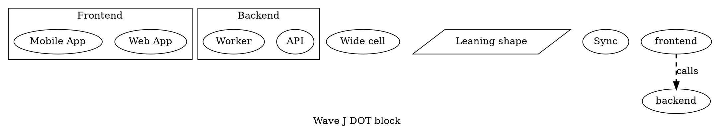
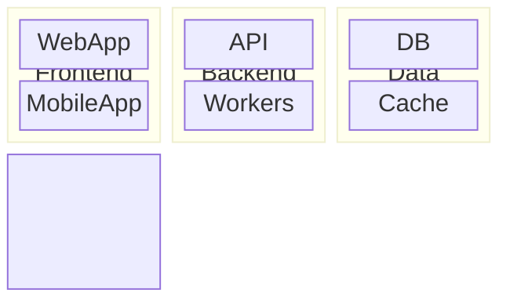

# D2 + DOT block coverage (Wave J) — Implementation Plan

> **For agentic workers:** REQUIRED SUB-SKILL: Use superpowers:subagent-driven-development (recommended) or superpowers:executing-plans to implement this plan task-by-task. Steps use checkbox (`- [ ]`) syntax for tracking.

**Goal:** Add `block` import + export to D2 and DOT, taking each from 9/28 → 10/28 (D2) and 8/28 → 9/28 (DOT) in both directions. Bidirectional, lossless on same-format round-trip via 11 new comment-encoded recovery markers per format, lossy-with-typed-diagnostics on cross-format.

**Architecture:** Per-family mapper + exporter + probe slotted next to existing D2/DOT family files (mirrors Waves E–G). Detection by marker-forced `family=block` (upstream override) or by structural probe on block-distinctive shape kinds and grid attributes. 11 new shared `Kind` cases on each of `D2RecoveryMarker.Kind` and `DOTRecoveryMarker.Kind` preserve grid columns, span widths, blockArrow direction sets, the 23 `BlockNodeType` shape kinds, `BlockEdge` attributes, classDef/class apply tables, and accessibility metadata. No new public surface, no new `DiagnosticCategory` cases, no new `RoundTripLoss` cases.

**Tech Stack:** Swift 6 / Swift Package Manager. swift-testing for new test cases. `RoundTripHarness` and `RoundTripFixtureLoader` for round-trip coverage. `Scripts/check-diagnostic-discipline.sh` for typed-factory enforcement. `swift-snapshot-testing` only on the two new corpus entries.

**Spec:** [`docs/superpowers/specs/2026-05-21-d2-dot-block-design.md`](../specs/2026-05-21-d2-dot-block-design.md)

---

## File map

| Slice | File | Action |
|-------|------|--------|
| D2 marker | `Sources/DiagramKitD2/D2RecoveryMarker.swift` | Extend `Kind` enum with 11 `block*` cases + emit/parse helpers |
| D2 probe | `Sources/DiagramKitD2/D2BlockProbe.swift` | New — structural probe over `D2Document` |
| D2 mapper | `Sources/DiagramKitD2/D2BlockMapper.swift` | New — `D2Document` → `BlockDiagram` |
| D2 exporter | `Sources/DiagramKitD2/D2BlockExporter.swift` | New — `BlockDiagram` → D2 source |
| D2 dispatch | `Sources/DiagramKitD2/D2Importer.swift` | Insert block probe between architecture and flowchart fallback |
| D2 dispatch | `Sources/DiagramKitD2/D2Exporter.swift` | Add `case .block(let diagram):` |
| DOT marker | `Sources/DiagramKitGraphviz/DOTRecoveryMarker.swift` | Extend `Kind` enum with 11 `block*` cases |
| DOT probe | `Sources/DiagramKitGraphviz/DOTBlockProbe.swift` | New — structural probe over `DOTDocument` |
| DOT mapper | `Sources/DiagramKitGraphviz/DOTBlockMapper.swift` | New — `DOTDocument` → `BlockDiagram` |
| DOT exporter | `Sources/DiagramKitGraphviz/DOTBlockExport.swift` | New — `BlockDiagram` → DOT source |
| DOT dispatch | `Sources/DiagramKitGraphviz/GraphvizImporter.swift` | Insert block probe between architecture and flowchart fallback |
| DOT dispatch | `Sources/DiagramKitGraphviz/DOTExporter.swift` | Add `case .block(let diagram):` |
| Cell registry | `Tests/DiagramKitTests/RoundTrip/RoundTripCellRegistry.swift` | Add `d2Block` and `dotBlock` cells |
| Cross registry | `Tests/DiagramKitTests/RoundTrip/RoundTripCrossRegistry.swift` | Add Mermaid↔D2 and Mermaid↔DOT block allowed-loss constants |
| Tests | `Tests/DiagramKitTests/D2BlockMapperTests.swift` | New — D2 mapper tests |
| Tests | `Tests/DiagramKitTests/D2BlockExportTests.swift` | New — D2 exporter tests |
| Tests | `Tests/DiagramKitTests/D2BlockProbeTests.swift` | New — D2 probe tests |
| Tests | `Tests/DiagramKitTests/DOTBlockMapperTests.swift` | New — DOT mapper tests |
| Tests | `Tests/DiagramKitTests/DOTBlockExportTests.swift` | New — DOT exporter tests |
| Tests | `Tests/DiagramKitTests/DOTBlockProbeTests.swift` | New — DOT probe tests |
| Round-trip tests | `Tests/DiagramKitTests/RoundTrip/SameFormatRoundTripTests.swift` | Add D2 + DOT block `@Test` methods |
| Round-trip tests | `Tests/DiagramKitTests/RoundTrip/CrossFormatRoundTripTests.swift` | Add Mermaid↔D2 and Mermaid↔DOT block `@Test` methods |
| Fixtures (same) | `Tests/.../RoundTrip/Resources/roundtrip/d2-block/01-comprehensive.d2` | New — exercises every marker kind |
| Fixtures (same) | `Tests/.../RoundTrip/Resources/roundtrip/dot-block/01-comprehensive.dot` | New — same coverage in DOT idiom |
| Fixtures (cross) | `Tests/.../RoundTrip/Resources/roundtrip/cross-mermaid-d2-block/01-basic.mmd` | New |
| Fixtures (cross) | `Tests/.../RoundTrip/Resources/roundtrip/cross-d2-mermaid-block/01-basic.d2` | New |
| Fixtures (cross) | `Tests/.../RoundTrip/Resources/roundtrip/cross-mermaid-dot-block/01-basic.mmd` | New |
| Fixtures (cross) | `Tests/.../RoundTrip/Resources/roundtrip/cross-dot-mermaid-block/01-basic.dot` | New |
| Corpus | `Sources/DiagramKitSample/Resources/test-diagrams.json` | Two new entries: `d2-block-1`, `dot-block-1` |
| Snapshots | `Tests/DiagramKitTests/__Snapshots__/` | 6 new baselines (2 SVG + 2 image + 2 ASCII) |
| Coverage doc | `COVERAGE.md` | Wave J closer paragraph; flip 2 cells from — to ✓; bump totals |
| Baselines doc | `BASELINES.md` | 437→439 SVG, 437→439 image, 424→426 ASCII, 1298→1304 total; corpus 424→426 |
| Project doc | `CLAUDE.md` | Corpus 424 → 426 entries (27 → 29 multi-format) |

---

## Task 1: Extend `D2RecoveryMarker.Kind` with 11 block cases

**Files:**
- Modify: `Sources/DiagramKitD2/D2RecoveryMarker.swift`
- Test: `Tests/DiagramKitTests/D2RecoveryMarkerTests.swift` (if exists; otherwise inline in `D2BlockMapperTests.swift` later — confirm by greppping)

- [ ] **Step 1: Confirm test target convention**

Run: `find Tests/DiagramKitTests -name "D2RecoveryMarker*"`
If a `D2RecoveryMarkerTests.swift` already exists, extend it. Otherwise, add the marker emit/parse tests inline in a new file `Tests/DiagramKitTests/D2BlockMarkerTests.swift` for this task.

- [ ] **Step 2: Write failing emit/parse tests for the 11 new kinds**

Create or extend the test file with:

```swift
import Testing
@testable import DiagramKitD2

@Suite("D2 block recovery markers")
struct D2BlockMarkerTests {

    @Test("blockCols emit + parse round-trip")
    func blockCols() {
        let line = D2RecoveryMarker.emitBlockCols(containerID: "group", columns: 3)
        #expect(line == "# diagramkit:block-cols=group,3")
        let scan = D2RecoveryMarker.scanner.scan(source: line)
        guard case .blockCols(let id, let n) = scan.markers.first?.kind else {
            Issue.record("expected blockCols marker")
            return
        }
        #expect(id == "group")
        #expect(n == 3)
    }

    @Test("blockWidth emit + parse round-trip")
    func blockWidth() {
        let line = D2RecoveryMarker.emitBlockWidth(nodeID: "a", widthInColumns: 2)
        #expect(line == "# diagramkit:block-width=a,2")
        let scan = D2RecoveryMarker.scanner.scan(source: line)
        guard case .blockWidth(let id, let span) = scan.markers.first?.kind else {
            Issue.record("expected blockWidth marker")
            return
        }
        #expect(id == "a")
        #expect(span == 2)
    }

    @Test("blockShapeFallback emit + parse round-trip")
    func blockShapeFallback() {
        let line = D2RecoveryMarker.emitBlockShapeFallback(nodeID: "n1", rawValue: "lean_left")
        #expect(line == "# diagramkit:block-shape-fallback=n1,lean_left")
        let scan = D2RecoveryMarker.scanner.scan(source: line)
        guard case .blockShapeFallback(let id, let raw) = scan.markers.first?.kind else {
            Issue.record("expected blockShapeFallback marker")
            return
        }
        #expect(id == "n1")
        #expect(raw == "lean_left")
    }

    @Test("blockArrowDir emit + parse round-trip with multi-direction CSV")
    func blockArrowDir() {
        let line = D2RecoveryMarker.emitBlockArrowDir(nodeID: "arrow1", directionsCsv: "right,up")
        #expect(line == "# diagramkit:block-arrow-dir=arrow1,right,up")
        let scan = D2RecoveryMarker.scanner.scan(source: line)
        guard case .blockArrowDir(let id, let csv) = scan.markers.first?.kind else {
            Issue.record("expected blockArrowDir marker")
            return
        }
        #expect(id == "arrow1")
        #expect(csv == "right,up")
    }

    @Test("blockSpace emit + parse round-trip")
    func blockSpace() {
        let line = D2RecoveryMarker.emitBlockSpace(parentID: "root", columnIndex: 4)
        #expect(line == "# diagramkit:block-space=root,4")
        let scan = D2RecoveryMarker.scanner.scan(source: line)
        guard case .blockSpace(let parent, let idx) = scan.markers.first?.kind else {
            Issue.record("expected blockSpace marker")
            return
        }
        #expect(parent == "root")
        #expect(idx == 4)
    }

    @Test("blockEdgeAttrs emit + parse round-trip")
    func blockEdgeAttrs() {
        let line = D2RecoveryMarker.emitBlockEdgeAttrs(
            edgeIndex: 0, thickness: "thick", pattern: "dashed",
            arrowStart: "arrow_open", arrowEnd: "arrow"
        )
        #expect(line == "# diagramkit:block-edge-attrs=0,thick,dashed,arrow_open,arrow")
        let scan = D2RecoveryMarker.scanner.scan(source: line)
        guard case .blockEdgeAttrs(let idx, let t, let p, let aS, let aE) = scan.markers.first?.kind else {
            Issue.record("expected blockEdgeAttrs marker")
            return
        }
        #expect(idx == 0)
        #expect(t == "thick")
        #expect(p == "dashed")
        #expect(aS == "arrow_open")
        #expect(aE == "arrow")
    }

    @Test("blockClassDef emit + parse round-trip with semicolon styles CSV")
    func blockClassDef() {
        let line = D2RecoveryMarker.emitBlockClassDef(
            className: "blue", stylesCsv: "fill:#6cf;stroke:#333"
        )
        #expect(line == "# diagramkit:block-classdef=blue,fill:#6cf;stroke:#333")
        let scan = D2RecoveryMarker.scanner.scan(source: line)
        guard case .blockClassDef(let name, let csv) = scan.markers.first?.kind else {
            Issue.record("expected blockClassDef marker")
            return
        }
        #expect(name == "blue")
        #expect(csv == "fill:#6cf;stroke:#333")
    }

    @Test("blockClassApply emit + parse round-trip")
    func blockClassApply() {
        let line = D2RecoveryMarker.emitBlockClassApply(nodeID: "A", className: "blue")
        #expect(line == "# diagramkit:block-class-apply=A,blue")
        let scan = D2RecoveryMarker.scanner.scan(source: line)
        guard case .blockClassApply(let id, let name) = scan.markers.first?.kind else {
            Issue.record("expected blockClassApply marker")
            return
        }
        #expect(id == "A")
        #expect(name == "blue")
    }

    @Test("blockStyle emit + parse round-trip")
    func blockStyle() {
        let line = D2RecoveryMarker.emitBlockStyle(nodeID: "A", stylesCsv: "fill:#f00")
        #expect(line == "# diagramkit:block-style=A,fill:#f00")
        let scan = D2RecoveryMarker.scanner.scan(source: line)
        guard case .blockStyle(let id, let csv) = scan.markers.first?.kind else {
            Issue.record("expected blockStyle marker")
            return
        }
        #expect(id == "A")
        #expect(csv == "fill:#f00")
    }

    @Test("blockAccTitle / blockAccDescr emit + parse")
    func blockAcc() {
        let titleLine = D2RecoveryMarker.emitBlockAccTitle("My title")
        let descrLine = D2RecoveryMarker.emitBlockAccDescr("Long descr")
        #expect(titleLine == "# diagramkit:block-acc-title=My title")
        #expect(descrLine == "# diagramkit:block-acc-descr=Long descr")
        let scan = D2RecoveryMarker.scanner.scan(source: "\(titleLine)\n\(descrLine)")
        var sawTitle = false, sawDescr = false
        for m in scan.markers {
            if case .blockAccTitle(let t) = m.kind, t == "My title" { sawTitle = true }
            if case .blockAccDescr(let d) = m.kind, d == "Long descr" { sawDescr = true }
        }
        #expect(sawTitle && sawDescr)
    }
}
```

- [ ] **Step 3: Run tests to confirm they fail**

Run: `swift test --filter D2BlockMarkerTests`
Expected: compilation error — the 11 `Kind` cases and emit helpers don't exist yet.

- [ ] **Step 4: Add the 11 new `Kind` cases**

In `Sources/DiagramKitD2/D2RecoveryMarker.swift`, extend the `Kind` enum (after the existing `c4Color` case) with:

```swift
case blockCols(containerID: String, columns: Int)
case blockWidth(nodeID: String, widthInColumns: Int)
case blockShapeFallback(nodeID: String, rawValue: String)
case blockArrowDir(nodeID: String, directionsCsv: String)
case blockSpace(parentID: String, columnIndex: Int)
case blockEdgeAttrs(edgeIndex: Int, thickness: String, pattern: String, arrowStart: String, arrowEnd: String)
case blockClassDef(className: String, stylesCsv: String)
case blockClassApply(nodeID: String, className: String)
case blockStyle(nodeID: String, stylesCsv: String)
case blockAccTitle(text: String)
case blockAccDescr(text: String)
```

- [ ] **Step 5: Add the 11 parse arms inside `parseKind(_:)`**

Insert these (after the existing c4 arms, before the final `return nil`). Use `maxSplits` per the spec's table:

```swift
if let args = stripPrefix("block-cols=", rest) {
    let fields = args.split(separator: ",", maxSplits: 1, omittingEmptySubsequences: false)
    guard fields.count == 2, let n = Int(fields[1]) else { return nil }
    return .blockCols(containerID: String(fields[0]), columns: n)
}
if let args = stripPrefix("block-width=", rest) {
    let fields = args.split(separator: ",", maxSplits: 1, omittingEmptySubsequences: false)
    guard fields.count == 2, let span = Int(fields[1]) else { return nil }
    return .blockWidth(nodeID: String(fields[0]), widthInColumns: span)
}
if let args = stripPrefix("block-shape-fallback=", rest) {
    let fields = args.split(separator: ",", maxSplits: 1, omittingEmptySubsequences: false)
    guard fields.count == 2 else { return nil }
    return .blockShapeFallback(nodeID: String(fields[0]), rawValue: String(fields[1]))
}
if let args = stripPrefix("block-arrow-dir=", rest) {
    let fields = args.split(separator: ",", maxSplits: 1, omittingEmptySubsequences: false)
    guard fields.count == 2 else { return nil }
    return .blockArrowDir(nodeID: String(fields[0]), directionsCsv: String(fields[1]))
}
if let args = stripPrefix("block-space=", rest) {
    let fields = args.split(separator: ",", maxSplits: 1, omittingEmptySubsequences: false)
    guard fields.count == 2, let idx = Int(fields[1]) else { return nil }
    return .blockSpace(parentID: String(fields[0]), columnIndex: idx)
}
if let args = stripPrefix("block-edge-attrs=", rest) {
    let fields = args.split(separator: ",", maxSplits: 4, omittingEmptySubsequences: false)
    guard fields.count == 5, let idx = Int(fields[0]) else { return nil }
    return .blockEdgeAttrs(
        edgeIndex: idx,
        thickness: String(fields[1]),
        pattern: String(fields[2]),
        arrowStart: String(fields[3]),
        arrowEnd: String(fields[4])
    )
}
if let args = stripPrefix("block-classdef=", rest) {
    let fields = args.split(separator: ",", maxSplits: 1, omittingEmptySubsequences: false)
    guard fields.count == 2 else { return nil }
    return .blockClassDef(className: String(fields[0]), stylesCsv: String(fields[1]))
}
if let args = stripPrefix("block-class-apply=", rest) {
    let fields = args.split(separator: ",", maxSplits: 1, omittingEmptySubsequences: false)
    guard fields.count == 2 else { return nil }
    return .blockClassApply(nodeID: String(fields[0]), className: String(fields[1]))
}
if let args = stripPrefix("block-style=", rest) {
    let fields = args.split(separator: ",", maxSplits: 1, omittingEmptySubsequences: false)
    guard fields.count == 2 else { return nil }
    return .blockStyle(nodeID: String(fields[0]), stylesCsv: String(fields[1]))
}
if let args = stripPrefix("block-acc-title=", rest) {
    return .blockAccTitle(text: args)
}
if let args = stripPrefix("block-acc-descr=", rest) {
    return .blockAccDescr(text: args)
}
```

- [ ] **Step 6: Add the 11 emit helpers**

After the existing `emitC4Color(...)` static helper, add:

```swift
public static func emitBlockCols(containerID: String, columns: Int) -> String {
    "# diagramkit:block-cols=\(sanitize(containerID)),\(columns)"
}

public static func emitBlockWidth(nodeID: String, widthInColumns: Int) -> String {
    "# diagramkit:block-width=\(sanitize(nodeID)),\(widthInColumns)"
}

public static func emitBlockShapeFallback(nodeID: String, rawValue: String) -> String {
    "# diagramkit:block-shape-fallback=\(sanitize(nodeID)),\(sanitize(rawValue))"
}

public static func emitBlockArrowDir(nodeID: String, directionsCsv: String) -> String {
    "# diagramkit:block-arrow-dir=\(sanitize(nodeID)),\(directionsCsv)"
}

public static func emitBlockSpace(parentID: String, columnIndex: Int) -> String {
    "# diagramkit:block-space=\(sanitize(parentID)),\(columnIndex)"
}

public static func emitBlockEdgeAttrs(
    edgeIndex: Int, thickness: String, pattern: String,
    arrowStart: String, arrowEnd: String
) -> String {
    "# diagramkit:block-edge-attrs=\(edgeIndex),\(sanitize(thickness)),\(sanitize(pattern)),\(sanitize(arrowStart)),\(sanitize(arrowEnd))"
}

public static func emitBlockClassDef(className: String, stylesCsv: String) -> String {
    "# diagramkit:block-classdef=\(sanitize(className)),\(stylesCsv)"
}

public static func emitBlockClassApply(nodeID: String, className: String) -> String {
    "# diagramkit:block-class-apply=\(sanitize(nodeID)),\(sanitize(className))"
}

public static func emitBlockStyle(nodeID: String, stylesCsv: String) -> String {
    "# diagramkit:block-style=\(sanitize(nodeID)),\(stylesCsv)"
}

public static func emitBlockAccTitle(_ text: String) -> String {
    "# diagramkit:block-acc-title=\(sanitize(text))"
}

public static func emitBlockAccDescr(_ text: String) -> String {
    "# diagramkit:block-acc-descr=\(sanitize(text))"
}
```

The styles CSVs deliberately are not run through `sanitize(_:)` — they contain semicolons that must survive verbatim.

- [ ] **Step 7: Run tests to verify they pass**

Run: `swift test --filter D2BlockMarkerTests`
Expected: PASS for all 10 tests.

- [ ] **Step 8: Commit**

```bash
git add Sources/DiagramKitD2/D2RecoveryMarker.swift \
        Tests/DiagramKitTests/D2BlockMarkerTests.swift
git commit -m "Wave J Task 1 — D2RecoveryMarker block kinds (×11)

Co-Authored-By: Claude Opus 4.7 (1M context) <noreply@anthropic.com>"
```

---

## Task 2: Extend `DOTRecoveryMarker.Kind` with 11 block cases

**Files:**
- Modify: `Sources/DiagramKitGraphviz/DOTRecoveryMarker.swift`
- Test: `Tests/DiagramKitTests/DOTBlockMarkerTests.swift` (new)

- [ ] **Step 1: Write the test file**

Mirror `D2BlockMarkerTests.swift` exactly, replacing `D2RecoveryMarker` with `DOTRecoveryMarker` and importing `DiagramKitGraphviz`. The marker wire formats are identical (`# diagramkit:block-…`); only the namespace differs.

- [ ] **Step 2: Run tests to confirm they fail**

Run: `swift test --filter DOTBlockMarkerTests`
Expected: compilation error.

- [ ] **Step 3: Add the 11 `Kind` cases, parse arms, and emit helpers**

Apply the same diff as Task 1 to `Sources/DiagramKitGraphviz/DOTRecoveryMarker.swift`. The file uses the same comment prefix (`#` for DOT means the scanner already handles comment-encoded markers). Note: DOTLexer may strip `#` comments — verify by reading `DOTRecoveryMarker.swift` first; it has its own scanner that runs as a pre-lexer scan, so the wire format works identically to D2's.

- [ ] **Step 4: Run tests to verify they pass**

Run: `swift test --filter DOTBlockMarkerTests`
Expected: PASS for all 10 tests.

- [ ] **Step 5: Commit**

```bash
git add Sources/DiagramKitGraphviz/DOTRecoveryMarker.swift \
        Tests/DiagramKitTests/DOTBlockMarkerTests.swift
git commit -m "Wave J Task 2 — DOTRecoveryMarker block kinds (×11)

Co-Authored-By: Claude Opus 4.7 (1M context) <noreply@anthropic.com>"
```

---

## Task 3: D2 block structural probe

**Files:**
- Create: `Sources/DiagramKitD2/D2BlockProbe.swift`
- Test: `Tests/DiagramKitTests/D2BlockProbeTests.swift`

- [ ] **Step 1: Write failing tests**

```swift
import Testing
@testable import DiagramKitD2

@Suite("D2 block probe")
struct D2BlockProbeTests {

    @Test("grid-columns attribute triggers detection")
    func gridColumnsTriggers() throws {
        let source = """
        group: "Group" {
          grid-columns: 2
          a: "A"
          b: "B"
        }
        """
        let parser = D2Parser()
        let (doc, _) = try parser.parse(source)
        #expect(D2BlockProbe.detectsBlock(doc) == true)
    }

    @Test(">=2 block-distinctive shapes trigger detection")
    func distinctiveShapesTrigger() throws {
        let source = """
        a.shape: stadium
        b.shape: parallelogram
        """
        let parser = D2Parser()
        let (doc, _) = try parser.parse(source)
        #expect(D2BlockProbe.detectsBlock(doc) == true)
    }

    @Test("plain flowchart-shaped input does not trigger")
    func plainFlowchartRejected() throws {
        let source = """
        a -> b
        b -> c
        """
        let parser = D2Parser()
        let (doc, _) = try parser.parse(source)
        #expect(D2BlockProbe.detectsBlock(doc) == false)
    }

    @Test("architecture-shaped input does not trigger")
    func archShapesRejected() throws {
        let source = """
        a.shape: cylinder
        b.shape: cloud
        """
        let parser = D2Parser()
        let (doc, _) = try parser.parse(source)
        #expect(D2BlockProbe.detectsBlock(doc) == false)
    }

    @Test("single distinctive shape does not trigger")
    func singleDistinctiveRejected() throws {
        let source = """
        a.shape: stadium
        b.shape: rectangle
        """
        let parser = D2Parser()
        let (doc, _) = try parser.parse(source)
        #expect(D2BlockProbe.detectsBlock(doc) == false)
    }
}
```

- [ ] **Step 2: Run tests to confirm they fail**

Run: `swift test --filter D2BlockProbeTests`
Expected: compile error — `D2BlockProbe` doesn't exist.

- [ ] **Step 3: Implement the probe**

Create `Sources/DiagramKitD2/D2BlockProbe.swift`:

```swift
import Foundation
import DiagramKitCommon
import DiagramKitModel

/// Detects whether a `D2Document` should be mapped as a block
/// diagram. Returns `true` when either:
///
/// 1. Any node carries a `grid-rows`, `grid-columns`, or `grid-gap`
///    attribute. These attributes are emitted exclusively by the
///    `D2BlockExporter` (no other family mapper emits them), so their
///    presence is a strong block signal.
/// 2. ≥2 nodes carry shapes from the block-distinctive set
///    `{stadium, parallelogram}`. These shapes are not in the
///    architecture probe (`{cylinder, cloud, queue, page}`) or any
///    other family probe's distinctive set.
///
/// Biased toward false negatives — a marker-less D2 file with only
/// `rectangle` / `oval` / `circle` / `diamond` shapes falls through
/// to flowchart, matching the documented Wave-E policy.
public enum D2BlockProbe {
    public static func detectsBlock(_ doc: D2Document) -> Bool {
        let blockDistinctiveShapes: Set<String> = ["stadium", "parallelogram"]
        var distinctiveHits = 0
        for stmt in doc.statements {
            switch stmt {
            case .nodeDefinition(let nodeDef):
                // Check the structured attributes the parser surfaces; the
                // exact name depends on D2Parser. If grid attrs land in a
                // generic attributes dict, replace the `nodeDef.grid*` chain
                // with the appropriate accessor.
                if nodeDef.attributes["grid-columns"] != nil
                    || nodeDef.attributes["grid-rows"] != nil
                    || nodeDef.attributes["grid-gap"] != nil {
                    return true
                }
                if let shape = nodeDef.shape, blockDistinctiveShapes.contains(shape) {
                    distinctiveHits += 1
                    if distinctiveHits >= 2 { return true }
                }
            case .containerOpen(let open):
                if open.attributes["grid-columns"] != nil
                    || open.attributes["grid-rows"] != nil
                    || open.attributes["grid-gap"] != nil {
                    return true
                }
            default:
                continue
            }
        }
        return false
    }
}
```

If `D2Document.NodeDefinition.attributes` does not exist with that exact name, run:

```bash
grep -n "struct NodeDefinition\|var attributes\|grid-columns" Sources/DiagramKitD2/D2AST.swift Sources/DiagramKitD2/D2Parser.swift
```

and adapt the accessor name. The probe must compile against the existing AST; do not change the AST.

- [ ] **Step 4: Run tests to verify they pass**

Run: `swift test --filter D2BlockProbeTests`
Expected: 5/5 PASS.

- [ ] **Step 5: Commit**

```bash
git add Sources/DiagramKitD2/D2BlockProbe.swift \
        Tests/DiagramKitTests/D2BlockProbeTests.swift
git commit -m "Wave J Task 3 — D2BlockProbe

Co-Authored-By: Claude Opus 4.7 (1M context) <noreply@anthropic.com>"
```

---

## Task 4: D2 block mapper (`D2Document` → `BlockDiagram`)

**Files:**
- Create: `Sources/DiagramKitD2/D2BlockMapper.swift`
- Test: `Tests/DiagramKitTests/D2BlockMapperTests.swift`

This task lands incrementally — one mapper feature per test. **Cycle through Steps 1–4 for each test case** below; commit at Step 5 once they all pass.

- [ ] **Step 1: Write the failing test for the simplest case**

```swift
import Testing
import DiagramKitCommon
import DiagramKitModel
@testable import DiagramKitD2

@Suite("D2 block mapper")
struct D2BlockMapperTests {

    @Test("Single root block, marker-forced family=block")
    func singleBlock() throws {
        let source = """
        # diagramkit:family=block
        a: "A"
        """
        let parser = D2Parser()
        let (doc, _) = try parser.parse(source)
        let markers = D2RecoveryMarker.scanner.scan(source: source).markers
        let (block, diag) = D2BlockMapper().map(doc, markers: markers)
        #expect(diag.isEmpty)
        #expect(block.rootChildren == ["a"])
        #expect(block.blockDatabase["a"]?.label == "A")
        #expect(block.blockDatabase["a"]?.type == .square)
    }
}
```

- [ ] **Step 2: Run test to verify it fails**

Run: `swift test --filter D2BlockMapperTests`
Expected: compile error — `D2BlockMapper` does not exist.

- [ ] **Step 3: Write the minimal mapper skeleton**

```swift
import Foundation
import DiagramKitCommon
import DiagramKitModel

/// Maps a `D2Document` (already family-classified as `block`) to a
/// `BlockDiagram`. D2 containers become composite `BlockNode`s; node
/// definitions become leaf `BlockNode`s. Recovery markers restore
/// information that D2's native vocabulary cannot express: shape
/// fallbacks (lean_left, trapezoid, block_arrow, …), grid spans,
/// blockArrow direction sets, space cells, classDef tables, inline
/// styles, edge attribute variants, and accessibility metadata.
public struct D2BlockMapper {
    public init() {}

    public func map(
        _ doc: D2Document,
        markers: [RecoveryMarker<D2RecoveryMarker.Kind>]
    ) -> (BlockDiagram, [DiagramDiagnostic]) {
        var blockDatabase: [String: BlockNode] = [
            "root": BlockNode(id: "root", type: .composite, children: [], columns: -1)
        ]
        var rootChildren: [String] = []
        var edges: [BlockEdge] = []
        var diagnostics: [DiagramDiagnostic] = []
        var containerStack: [String] = []

        for stmt in doc.statements {
            switch stmt {
            case .containerOpen(let open):
                blockDatabase[open.id] = BlockNode(
                    id: open.id,
                    label: open.label ?? open.id,
                    type: .composite,
                    children: [],
                    columns: -1
                )
                if let parent = containerStack.last {
                    blockDatabase[parent]?.children.append(open.id)
                } else {
                    rootChildren.append(open.id)
                }
                containerStack.append(open.id)
            case .containerClose:
                if !containerStack.isEmpty { containerStack.removeLast() }
            case .nodeDefinition(let nodeDef):
                let type = Self.blockType(for: nodeDef.shape)
                blockDatabase[nodeDef.id] = BlockNode(
                    id: nodeDef.id,
                    label: nodeDef.label ?? nodeDef.id,
                    type: type
                )
                if let parent = containerStack.last {
                    blockDatabase[parent]?.children.append(nodeDef.id)
                } else {
                    rootChildren.append(nodeDef.id)
                }
            case .edgeDefinition(let edgeDef):
                edges.append(BlockEdge(
                    id: "edge_\(edges.count)",
                    start: edgeDef.source,
                    end: edgeDef.target,
                    label: edgeDef.label
                ))
            default:
                continue
            }
        }

        Self.applyMarkers(
            markers: markers,
            blockDatabase: &blockDatabase,
            edges: &edges,
            rootChildren: &rootChildren,
            diagnostics: &diagnostics
        )

        return (
            BlockDiagram(
                rootId: "root",
                rootChildren: rootChildren,
                blockDatabase: blockDatabase,
                edges: edges
            ),
            diagnostics
        )
    }

    private static func blockType(for shape: String?) -> BlockNodeType {
        switch shape {
        case "rectangle", nil: return .square
        case "oval":           return .round
        case "circle":         return .circle
        case "diamond":        return .diamond
        case "hexagon":        return .hexagon
        case "stadium":        return .stadium
        case "package":        return .subroutine
        case "cylinder":       return .cylinder
        case "parallelogram":  return .leanRight
        default:               return .square
        }
    }

    private static func applyMarkers(
        markers: [RecoveryMarker<D2RecoveryMarker.Kind>],
        blockDatabase: inout [String: BlockNode],
        edges: inout [BlockEdge],
        rootChildren: inout [String],
        diagnostics: inout [DiagramDiagnostic]
    ) {
        for marker in markers {
            switch marker.kind {
            case .blockCols(let containerID, let n):
                blockDatabase[containerID]?.columns = n
            case .blockWidth(let id, let span):
                blockDatabase[id]?.widthInColumns = span
            case .blockShapeFallback(let id, let raw):
                if let restored = BlockNodeType(rawValue: raw) {
                    blockDatabase[id]?.type = restored
                }
            case .blockArrowDir(let id, let csv):
                let dirs = csv.split(separator: ",")
                    .compactMap { BlockDirection(rawValue: String($0)) }
                blockDatabase[id]?.directions = dirs
            // Step-out cases below land in subsequent iterations.
            default:
                continue
            }
        }
    }
}
```

- [ ] **Step 4: Run test to verify it passes**

Run: `swift test --filter "D2BlockMapperTests/singleBlock"`
Expected: PASS.

- [ ] **Step 5: Iterate. Add a new test for each of these cases, run, implement the marker arm, run again. Order:**

| Test name | Source snippet | What it verifies |
|---|---|---|
| `nestedComposite` | `g: "G" { x: "X"; y: "Y" }` | Composite + children traversal |
| `columnsApplied` | `# diagramkit:family=block`<br>`g { grid-columns: 3; a; b; c }` | `BlockNode.columns` populated from native attr |
| `columnsViaMarker` | `g { a; b }` + `# diagramkit:block-cols=g,2` | `blockCols` marker restores columns when no native grid attr |
| `widthSpanViaMarker` | … + `# diagramkit:block-width=a,2` | `widthInColumns` restored |
| `shapeFallbackViaMarker` | `a.shape: rectangle` + `# diagramkit:block-shape-fallback=a,lean_left` | Type restored to `.leanLeft` |
| `blockArrowReconstructs` | `arrow1: "right"` + fallback `block_arrow` + dir marker `arrow1,right,up` | Node ends up `.blockArrow` with `[.right, .up]` directions; missing dir marker → `featureDropped` diagnostic |
| `spaceReconstructs` | only `# diagramkit:block-space=root,2` | Synthetic `space-<n>` node inserted at index 2 in `rootChildren` |
| `edgeAttrsApplied` | `a -> b` + `# diagramkit:block-edge-attrs=0,thick,dashed,arrow_open,arrow` | Edge 0's `thickness`/`pattern`/`arrowTypeStart`/`arrowTypeEnd` set |
| `classDefAndApply` | `# diagramkit:block-classdef=blue,fill:#6cf` + `# diagramkit:block-class-apply=a,blue` | `BlockDiagram.classes["blue"]` populated; `blockDatabase["a"].classes` contains `"blue"` |
| `inlineStyle` | `# diagramkit:block-style=a,fill:#f00` | `blockDatabase["a"].styles` contains `"fill:#f00"` |
| `accTitleDescr` | both acc markers | `BlockDiagram.accTitle` / `.accDescr` populated |
| `idSanitization` | `a-b.shape: rectangle` | `featureDropped(.idSanitization, …)` diagnostic + sanitized ID used as key |

After each test passes, extend the `applyMarkers` `switch` with the corresponding `case .blockX(...)` arm.

For `blockArrow` reconstruction, the fallback marker `block_arrow` must be applied **before** `blockArrowDir`, so:

```swift
// First pass: shape fallbacks.
for marker in markers {
    if case .blockShapeFallback(let id, let raw) = marker.kind,
       let restored = BlockNodeType(rawValue: raw) {
        blockDatabase[id]?.type = restored
    }
}
// Second pass: everything else.
for marker in markers { … }
```

For `blockSpace`, generate synthetic IDs `"space-<index>"` and insert them into the parent's `children` (or `rootChildren` when `parentID == "root"`) at `columnIndex`, then add `BlockNode(id: "space-<index>", type: .space)` entries to `blockDatabase`.

- [ ] **Step 6: Run the full mapper suite**

Run: `swift test --filter D2BlockMapperTests`
Expected: every test PASS.

- [ ] **Step 7: Commit**

```bash
git add Sources/DiagramKitD2/D2BlockMapper.swift \
        Tests/DiagramKitTests/D2BlockMapperTests.swift
git commit -m "Wave J Task 4 — D2BlockMapper

Co-Authored-By: Claude Opus 4.7 (1M context) <noreply@anthropic.com>"
```

---

## Task 5: D2 block exporter (`BlockDiagram` → D2 source)

**Files:**
- Create: `Sources/DiagramKitD2/D2BlockExporter.swift`
- Test: `Tests/DiagramKitTests/D2BlockExportTests.swift`

- [ ] **Step 1: Write the failing test for the simplest case**

```swift
import Testing
import DiagramKitCommon
import DiagramKitModel
@testable import DiagramKitD2

@Suite("D2 block exporter")
struct D2BlockExportTests {

    @Test("Single rectangle node emits family marker + node line")
    func singleRectangle() throws {
        let block = BlockDiagram(
            rootId: "root",
            rootChildren: ["a"],
            blockDatabase: [
                "root": BlockNode(id: "root", type: .composite, children: ["a"], columns: -1),
                "a":    BlockNode(id: "a", label: "A", type: .square),
            ]
        )
        let result = D2BlockExporter.export(block, title: nil)
        #expect(result.source.contains("# diagramkit:family=block"))
        #expect(result.source.contains("a: \"A\""))
        #expect(result.diagnostics.isEmpty)
    }
}
```

- [ ] **Step 2: Run test to verify it fails**

Run: `swift test --filter D2BlockExportTests`
Expected: compile error — `D2BlockExporter` does not exist.

- [ ] **Step 3: Write the minimal exporter skeleton**

```swift
import Foundation
import DiagramKitCommon
import DiagramKitModel
import DiagramKitExport

public enum D2BlockExporter {

    public static func export(_ block: BlockDiagram, title: String?) -> DiagramExportResult {
        var lines: [String] = []
        var diagnostics: [DiagramDiagnostic] = []

        lines.append(D2RecoveryMarker.emitFamily("block"))
        if let title, !title.isEmpty {
            lines.append("title: \"\(escape(title))\"")
        }

        emit(
            childIDs: block.rootChildren,
            parentID: block.rootId,
            db: block.blockDatabase,
            depth: 0,
            into: &lines,
            diagnostics: &diagnostics
        )

        for (idx, edge) in block.edges.enumerated() {
            emit(edge: edge, index: idx, into: &lines, diagnostics: &diagnostics)
        }

        for (className, def) in block.classes.sorted(by: { $0.key < $1.key }) {
            let stylesCsv = def.styles.joined(separator: ";")
            lines.append(D2RecoveryMarker.emitBlockClassDef(className: className, stylesCsv: stylesCsv))
        }

        if let t = block.accTitle, !t.isEmpty {
            lines.append(D2RecoveryMarker.emitBlockAccTitle(t))
        }
        if let d = block.accDescr, !d.isEmpty {
            lines.append(D2RecoveryMarker.emitBlockAccDescr(d))
        }

        return DiagramExportResult(
            source: lines.joined(separator: "\n") + "\n",
            diagnostics: diagnostics
        )
    }

    private static func emit(
        childIDs: [String],
        parentID: String,
        db: [String: BlockNode],
        depth: Int,
        into lines: inout [String],
        diagnostics: inout [DiagramDiagnostic]
    ) {
        let indent = String(repeating: "  ", count: depth)
        for (col, id) in childIDs.enumerated() {
            guard let node = db[id] else { continue }
            switch node.type {
            case .space:
                lines.append(D2RecoveryMarker.emitBlockSpace(parentID: parentID, columnIndex: col))
            case .composite:
                lines.append("\(indent)\(id): \"\(escape(node.label))\" {")
                if let cols = node.columns, cols >= 1 {
                    lines.append("\(indent)  grid-columns: \(cols)")
                }
                emit(
                    childIDs: node.children,
                    parentID: id,
                    db: db,
                    depth: depth + 1,
                    into: &lines,
                    diagnostics: &diagnostics
                )
                lines.append("\(indent)}")
            default:
                emitLeaf(node, indent: indent, into: &lines, diagnostics: &diagnostics)
            }
            // Inline styles + class apply markers.
            if let styles = node.styles, !styles.isEmpty {
                lines.append(D2RecoveryMarker.emitBlockStyle(
                    nodeID: id, stylesCsv: styles.joined(separator: ";")
                ))
            }
            if let classes = node.classes {
                for className in classes {
                    lines.append(D2RecoveryMarker.emitBlockClassApply(nodeID: id, className: className))
                }
            }
            if let span = node.widthInColumns, span > 1 {
                lines.append(D2RecoveryMarker.emitBlockWidth(nodeID: id, widthInColumns: span))
            }
        }
    }

    private static func emitLeaf(
        _ node: BlockNode,
        indent: String,
        into lines: inout [String],
        diagnostics: inout [DiagramDiagnostic]
    ) {
        let mapped = d2Shape(for: node.type)
        lines.append("\(indent)\(node.id): \"\(escape(node.label))\"")
        if mapped.name != "rectangle" {
            lines.append("\(indent)\(node.id).shape: \(mapped.name)")
        }
        if mapped.lossy {
            lines.append(D2RecoveryMarker.emitBlockShapeFallback(
                nodeID: node.id, rawValue: node.type.rawValue
            ))
            diagnostics.append(.lossyTransform(
                .shapeDowngrade,
                message: "block shape \(node.type.rawValue) downgraded to D2 \(mapped.name)"
            ))
        }
        if node.type == .blockArrow, let dirs = node.directions {
            let csv = dirs.map(\.rawValue).joined(separator: ",")
            lines.append(D2RecoveryMarker.emitBlockArrowDir(nodeID: node.id, directionsCsv: csv))
        }
    }

    private static func emit(
        edge: BlockEdge,
        index: Int,
        into lines: inout [String],
        diagnostics: inout [DiagramDiagnostic]
    ) {
        let arrow = "->"  // direction is recoverable via the edge-attrs marker
        if let label = edge.label, !label.isEmpty {
            lines.append("\(edge.start) \(arrow) \(edge.end): \"\(escape(label))\"")
        } else {
            lines.append("\(edge.start) \(arrow) \(edge.end)")
        }
        // Always emit the attrs marker for round-trip identity.
        lines.append(D2RecoveryMarker.emitBlockEdgeAttrs(
            edgeIndex: index,
            thickness: edge.thickness,
            pattern: edge.pattern,
            arrowStart: edge.arrowTypeStart,
            arrowEnd: edge.arrowTypeEnd
        ))
    }

    private static func d2Shape(for type: BlockNodeType) -> (name: String, lossy: Bool) {
        switch type {
        case .square, .na:        return ("rectangle", false)
        case .round:               return ("oval", false)
        case .circle:              return ("circle", false)
        case .doublecircle:        return ("circle", true)
        case .diamond:             return ("diamond", false)
        case .hexagon:             return ("hexagon", false)
        case .stadium:             return ("stadium", false)
        case .subroutine:          return ("package", true)
        case .cylinder:            return ("cylinder", false)
        case .leanRight, .leanLeft, .trapezoid, .invTrapezoid,
             .rectLeftInvArrow, .blockArrow:
            return ("rectangle", true)
        case .space, .composite, .classDef, .applyClass, .applyStyles,
             .columnSetting, .edge:
            return ("rectangle", false)
        }
    }

    private static func escape(_ text: String) -> String {
        text.replacingOccurrences(of: "\\", with: "\\\\")
            .replacingOccurrences(of: "\"", with: "\\\"")
            .replacingOccurrences(of: "\n", with: "\\n")
    }
}
```

- [ ] **Step 4: Run test to verify it passes**

Run: `swift test --filter "D2BlockExportTests/singleRectangle"`
Expected: PASS.

- [ ] **Step 5: Iterate. Add tests + extend exporter for the remaining cases. Order:**

| Test name | Verifies |
|---|---|
| `nestedComposite` | Container open/close lines with proper indentation |
| `gridColumnsEmitted` | `grid-columns: N` line emitted inside a composite with `columns >= 1` |
| `widthMarkerEmitted` | `block-width=<id>,<n>` for `widthInColumns > 1` |
| `shapeFallbacks` | Every type from the lossy set (`leanLeft`, `trapezoid`, `subroutine`, `blockArrow`) emits a `block-shape-fallback` marker AND a `.shapeDowngrade` diagnostic |
| `blockArrowEmitsDirMarker` | `block_arrow` shape with `directions = [.right, .up]` emits `block-arrow-dir=<id>,right,up` |
| `spaceEmitsMarkerOnly` | `space` node produces NO native line, only `block-space=<parent>,<col>` |
| `edgeAttrsAlwaysEmitted` | Every edge gets a `block-edge-attrs` marker even when attributes are default |
| `classDefAndApply` | `block-classdef` per class definition; `block-class-apply` per applied class |
| `inlineStyle` | `block-style` per node with `styles != nil` |
| `accTitleDescr` | Both acc markers emitted |
| `titleEmitted` | When `title != nil`, `title: "…"` line precedes the body |

- [ ] **Step 6: Run the full exporter suite**

Run: `swift test --filter D2BlockExportTests`
Expected: every test PASS.

- [ ] **Step 7: Commit**

```bash
git add Sources/DiagramKitD2/D2BlockExporter.swift \
        Tests/DiagramKitTests/D2BlockExportTests.swift
git commit -m "Wave J Task 5 — D2BlockExporter

Co-Authored-By: Claude Opus 4.7 (1M context) <noreply@anthropic.com>"
```

---

## Task 6: Wire D2 importer + exporter dispatch

**Files:**
- Modify: `Sources/DiagramKitD2/D2Importer.swift`
- Modify: `Sources/DiagramKitD2/D2Exporter.swift`
- Test: `Tests/DiagramKitTests/D2BlockDispatchTests.swift` (new)

- [ ] **Step 1: Write the failing integration test**

```swift
import Testing
import DiagramKitImport
import DiagramKitExport
import DiagramKitModel
import DiagramKitD2

@Suite("D2 block dispatch")
struct D2BlockDispatchTests {

    @Test("Marker-forced family=block routes through D2BlockMapper")
    func markerForcedRoutes() throws {
        let source = """
        # diagramkit:family=block
        a: "A"
        """
        let result = try D2Importer().parse(source)
        guard case .block(let block) = result.document.payload else {
            Issue.record("expected .block payload, got \(result.document.payload)")
            return
        }
        #expect(block.rootChildren == ["a"])
    }

    @Test("Probe-detected grid-columns routes through D2BlockMapper")
    func probeDetectedRoutes() throws {
        let source = """
        g: "G" {
          grid-columns: 2
          a: "A"
          b: "B"
        }
        """
        let result = try D2Importer().parse(source)
        guard case .block = result.document.payload else {
            Issue.record("expected .block payload")
            return
        }
    }

    @Test("Exporter emits valid D2 for a block payload")
    func exporterEmits() throws {
        var doc = DiagramDocument(payload: .block(BlockDiagram(
            rootId: "root", rootChildren: ["a"],
            blockDatabase: [
                "root": BlockNode(id: "root", type: .composite, children: ["a"], columns: -1),
                "a":    BlockNode(id: "a", label: "A", type: .square),
            ]
        )))
        let result = try D2Exporter().export(doc)
        #expect(result.source.contains("# diagramkit:family=block"))
        #expect(result.source.contains("a: \"A\""))
    }
}
```

- [ ] **Step 2: Run tests to verify they fail**

Run: `swift test --filter D2BlockDispatchTests`
Expected: FAIL — block input falls through to flowchart fallback.

- [ ] **Step 3: Add the dispatch insertion to `D2Importer.parse`**

In `Sources/DiagramKitD2/D2Importer.swift`, after the existing `if markerFamily == "architecture" || D2ArchitectureProbe…` block (around line 109–117), insert:

```swift
if markerFamily == "block" || D2BlockProbe.detectsBlock(d2Doc) {
    let (block, blockDiagnostics) = D2BlockMapper().map(d2Doc, markers: markerScan.markers)
    var document = DiagramDocument(payload: .block(block))
    document.title = Self.documentTitleMetadata(in: source)
    return DiagramImportResult(
        document: document,
        diagnostics: parseDiagnostics + blockDiagnostics
    )
}
```

The block probe runs **after** architecture so that architecture-distinctive shapes still win when they appear without grid attributes.

- [ ] **Step 4: Add `.block` to `supportedDiagramTypes`**

In the same file, extend the `supportedDiagramTypes` set:

```swift
public let supportedDiagramTypes: Set<DiagramType> = [
    .flowchart, .classDiagram, .stateDiagram, .erDiagram,
    .sequenceDiagram, .architecture, .mindmap, .treeView,
    .c4, .block,
]
```

Do the same in `D2Exporter.supportedDiagramTypes`.

- [ ] **Step 5: Add the `.block(let diagram)` case to `D2Exporter.export`**

In `Sources/DiagramKitD2/D2Exporter.swift`, in the payload switch, before `default:`:

```swift
case .block(let diagram):
    return D2BlockExporter.export(diagram, title: document.title)
```

- [ ] **Step 6: Run tests to verify they pass**

Run: `swift test --filter D2BlockDispatchTests`
Expected: 3/3 PASS.

- [ ] **Step 7: Commit**

```bash
git add Sources/DiagramKitD2/D2Importer.swift \
        Sources/DiagramKitD2/D2Exporter.swift \
        Tests/DiagramKitTests/D2BlockDispatchTests.swift
git commit -m "Wave J Task 6 — D2 importer/exporter dispatch for block

Co-Authored-By: Claude Opus 4.7 (1M context) <noreply@anthropic.com>"
```

---

## Task 7: DOT block structural probe

**Files:**
- Create: `Sources/DiagramKitGraphviz/DOTBlockProbe.swift`
- Test: `Tests/DiagramKitTests/DOTBlockProbeTests.swift`

DOT-distinctive shape set per the spec: `{box3d, parallelogram, invhouse, house, trapezium, invtrapezium, octagon}`. The grid signal is `≥2 cluster subgraphs AND at least one rank=same subgraph with ≥2 nodes`.

- [ ] **Step 1: Write failing tests**

```swift
import Testing
@testable import DiagramKitGraphviz

@Suite("DOT block probe")
struct DOTBlockProbeTests {

    @Test("rank=same row signature triggers detection")
    func rankSameTriggers() throws {
        let source = """
        digraph G {
          subgraph cluster_a { a; b; }
          subgraph cluster_b { { rank=same; c; d; } c; d; }
        }
        """
        let lexer = DOTLexer()
        let tokens = try lexer.tokenize(source)
        let parser = DOTParser()
        let (doc, _) = try parser.parse(tokens)
        #expect(DOTBlockProbe.detectsBlock(doc) == true)
    }

    @Test(">=2 block-distinctive shapes trigger detection")
    func distinctiveShapesTrigger() throws {
        let source = """
        digraph G {
          a [shape=trapezium];
          b [shape=parallelogram];
        }
        """
        let lexer = DOTLexer()
        let tokens = try lexer.tokenize(source)
        let parser = DOTParser()
        let (doc, _) = try parser.parse(tokens)
        #expect(DOTBlockProbe.detectsBlock(doc) == true)
    }

    @Test("plain digraph rejected")
    func plainDigraphRejected() throws {
        let source = """
        digraph G {
          a -> b;
          b -> c;
        }
        """
        let lexer = DOTLexer()
        let tokens = try lexer.tokenize(source)
        let parser = DOTParser()
        let (doc, _) = try parser.parse(tokens)
        #expect(DOTBlockProbe.detectsBlock(doc) == false)
    }

    @Test("architecture-shaped input rejected")
    func archShapesRejected() throws {
        let source = """
        digraph G {
          a [shape=cylinder];
          b [shape=component];
        }
        """
        let lexer = DOTLexer()
        let tokens = try lexer.tokenize(source)
        let parser = DOTParser()
        let (doc, _) = try parser.parse(tokens)
        #expect(DOTBlockProbe.detectsBlock(doc) == false)
    }

    @Test("box3d majority tiebreaker — block side wins")
    func box3dBlockSideMajority() throws {
        let source = """
        digraph G {
          a [shape=box3d];
          b [shape=box3d];
          c [shape=trapezium];
        }
        """
        let lexer = DOTLexer()
        let tokens = try lexer.tokenize(source)
        let parser = DOTParser()
        let (doc, _) = try parser.parse(tokens)
        #expect(DOTBlockProbe.detectsBlock(doc) == true)
    }

    @Test("box3d majority tiebreaker — arch side wins")
    func box3dArchSideMajority() throws {
        let source = """
        digraph G {
          a [shape=box3d];
          b [shape=cylinder];
          c [shape=component];
        }
        """
        let lexer = DOTLexer()
        let tokens = try lexer.tokenize(source)
        let parser = DOTParser()
        let (doc, _) = try parser.parse(tokens)
        #expect(DOTBlockProbe.detectsBlock(doc) == false)
    }
}
```

- [ ] **Step 2: Run** `swift test --filter DOTBlockProbeTests` — expect compile error.

- [ ] **Step 3: Implement `Sources/DiagramKitGraphviz/DOTBlockProbe.swift`**

```swift
import Foundation
import DiagramKitCommon
import DiagramKitModel

public enum DOTBlockProbe {
    public static func detectsBlock(_ doc: DOTDocument) -> Bool {
        let blockShapes: Set<String> = [
            "box3d", "parallelogram", "invhouse", "house",
            "trapezium", "invtrapezium", "octagon",
        ]
        let archShapes: Set<String> = [
            "cylinder", "component", "note", "folder",
        ]

        var rankSameCount = 0
        var clusterCount = 0
        var blockHits = 0
        var box3dCount = 0
        var blockSideNonBox3d = 0
        var archSideHits = 0

        // Walk top-level + subgraph bodies. Replace the iteration
        // shape below with the actual DOTDocument traversal helpers
        // (use the same accessors DOTArchitectureProbe uses).
        for stmt in doc.statements {
            switch stmt {
            case .subgraph(let sub):
                if sub.id.hasPrefix("cluster") { clusterCount += 1 }
                if sub.isRankSame { rankSameCount += 1 }
            case .nodeStatement(let node):
                if let shape = node.attributes["shape"] {
                    if shape == "box3d" {
                        box3dCount += 1
                    } else if blockShapes.contains(shape) {
                        blockHits += 1
                        blockSideNonBox3d += 1
                    } else if archShapes.contains(shape) {
                        archSideHits += 1
                    }
                }
            default:
                continue
            }
        }

        if clusterCount >= 2 && rankSameCount >= 1 { return true }
        if blockHits >= 2 { return true }
        // box3d tiebreaker: count box3d as "block-side" only when
        // block-side non-box3d hits outnumber arch-side hits.
        if box3dCount > 0 && blockSideNonBox3d > archSideHits {
            return (box3dCount + blockSideNonBox3d) >= 2
        }
        return false
    }
}
```

If `DOTDocument` doesn't surface the exact accessors used above (`Subgraph.isRankSame`, `NodeStatement.attributes`), `grep -n "rank=same\|isRankSame\|struct Subgraph\|struct NodeStatement" Sources/DiagramKitGraphviz/DOTAST.swift` and adapt. Do not modify the AST.

- [ ] **Step 4: Run** `swift test --filter DOTBlockProbeTests` — expect 6/6 PASS.

- [ ] **Step 5: Commit**

```bash
git add Sources/DiagramKitGraphviz/DOTBlockProbe.swift \
        Tests/DiagramKitTests/DOTBlockProbeTests.swift
git commit -m "Wave J Task 7 — DOTBlockProbe

Co-Authored-By: Claude Opus 4.7 (1M context) <noreply@anthropic.com>"
```

---

## Task 8: DOT block mapper

**Files:**
- Create: `Sources/DiagramKitGraphviz/DOTBlockMapper.swift`
- Test: `Tests/DiagramKitTests/DOTBlockMapperTests.swift`

> Reading this task in isolation? First skim Task 4 — this task applies the same TDD cycle (one mapper feature per failing test, marker arms added one at a time) to DOT, calling out only the deltas.

Reading from `DOTDocument` and using DOT-shape names. Key differences from D2:

- Composite containers are `subgraph cluster_<id>`. The mapper must strip the `cluster_` prefix when converting to a `BlockNode.id`.
- Grid is reconstructed from `rank=same` subgraph groupings, NOT from a native attribute. The mapper walks ranks inside a cluster in order, counts the nodes in the longest rank, and uses that as the parent container's `columns`. The marker `block-cols` overrides this when present.

- [ ] **Step 1–7:** Follow the same TDD cycle as Task 4. The test case list from Task 4 applies directly with DOT-idiom inputs. Use the `dotShape(for:)` mapping:

```swift
private static func blockType(for shape: String?) -> BlockNodeType {
    switch shape {
    case "box", nil:        return .square
    case "ellipse":         return .round
    case "circle":          return .circle
    case "doublecircle":    return .doublecircle
    case "diamond":         return .diamond
    case "hexagon":         return .hexagon
    case "cylinder":        return .cylinder
    case "box3d":           return .subroutine
    case "parallelogram":   return .leanRight
    case "trapezium":       return .trapezoid
    case "invtrapezium":    return .invTrapezoid
    default:                return .square
    }
}
```

Marker handling is identical between D2 and DOT — `applyMarkers` may be lifted into a shared internal helper later, but for Wave J copy-paste between mappers is acceptable (the patterns diverge in container traversal but match in marker semantics).

- [ ] **Commit:**

```bash
git add Sources/DiagramKitGraphviz/DOTBlockMapper.swift \
        Tests/DiagramKitTests/DOTBlockMapperTests.swift
git commit -m "Wave J Task 8 — DOTBlockMapper

Co-Authored-By: Claude Opus 4.7 (1M context) <noreply@anthropic.com>"
```

---

## Task 9: DOT block exporter

**Files:**
- Create: `Sources/DiagramKitGraphviz/DOTBlockExport.swift`
- Test: `Tests/DiagramKitTests/DOTBlockExportTests.swift`

> Reading this task in isolation? First skim Task 5 — this task applies the same TDD cycle to DOT, calling out only the deltas.

DOT-specific differences:

- Top-level wrapper: `digraph G { rankdir=TB; … }`.
- Composite container: `subgraph cluster_<id> { label="<label>"; … }`.
- Grid is emitted via `rank=same` subgraphs: chunk children by `columns`, emit each chunk inside `{ rank=same; child1; child2; child3 }`. ALWAYS emit a `block-cols=<containerID>,<N>` marker as well so the importer can reconstruct deterministically even if a downstream tool rewrites the rank groups.
- Edge: `src -> tgt [label="…"];`.
- `block-edge-attrs` marker emitted on its own line outside the edge attribute brackets (markers must stay as comments, not as attribute values).

- [ ] **Steps 1–7:** Same TDD cycle and test case list as Task 5.

- [ ] **Commit:**

```bash
git add Sources/DiagramKitGraphviz/DOTBlockExport.swift \
        Tests/DiagramKitTests/DOTBlockExportTests.swift
git commit -m "Wave J Task 9 — DOTBlockExport

Co-Authored-By: Claude Opus 4.7 (1M context) <noreply@anthropic.com>"
```

---

## Task 10: Wire DOT importer + exporter dispatch

**Files:**
- Modify: `Sources/DiagramKitGraphviz/GraphvizImporter.swift`
- Modify: `Sources/DiagramKitGraphviz/DOTExporter.swift`
- Test: `Tests/DiagramKitTests/DOTBlockDispatchTests.swift` (new)

> Reading this task in isolation? First skim Task 6 — this task is the DOT mirror of the D2 importer/exporter dispatch wiring.

Insertion site in `GraphvizImporter.parse`: after the `if markerFamily == "architecture" || DOTArchitectureProbe…` block (around line 83), before the flowchart fallback.

Insert the block dispatch branch:

```swift
if markerFamily == "block" || DOTBlockProbe.detectsBlock(dotDoc) {
    let (block, blockDiagnostics) = DOTBlockMapper().map(dotDoc, markers: markerScan.markers)
    let document = DiagramDocument(payload: .block(block))
    return DiagramImportResult(
        document: document,
        diagnostics: parseDiagnostics + blockDiagnostics
    )
}
```

And in `DOTExporter.export`, before `default:`:

```swift
case .block(let diagram):
    return try DOTBlockExport.emit(diagram, title: document.title)
```

Add `.block` to both `supportedDiagramTypes` sets.

- [ ] **Steps 1–7:** Same TDD cycle as Task 6 with DOT-flavored test fixtures.

- [ ] **Commit:**

```bash
git add Sources/DiagramKitGraphviz/GraphvizImporter.swift \
        Sources/DiagramKitGraphviz/DOTExporter.swift \
        Tests/DiagramKitTests/DOTBlockDispatchTests.swift
git commit -m "Wave J Task 10 — DOT importer/exporter dispatch for block

Co-Authored-By: Claude Opus 4.7 (1M context) <noreply@anthropic.com>"
```

---

## Task 11: Same-format round-trip — cells + fixtures + tests

**Files:**
- Modify: `Tests/DiagramKitTests/RoundTrip/RoundTripCellRegistry.swift`
- Modify: `Tests/DiagramKitTests/RoundTrip/SameFormatRoundTripTests.swift`
- Create: `Tests/DiagramKitTests/RoundTrip/Resources/roundtrip/d2-block/01-comprehensive.d2`
- Create: `Tests/DiagramKitTests/RoundTrip/Resources/roundtrip/dot-block/01-comprehensive.dot`

- [ ] **Step 1: Add the two cells**

In `RoundTripCellRegistry.swift`, after `d2TreeView`:

```swift
static let d2Block = RoundTripCell(
    importer: D2Importer(),
    exporter: D2Exporter(),
    family: DiagramType.block,
    allowedLosses: [.idSanitization, .shapeDowngrade, .styleDrop]
)

static let dotBlock = RoundTripCell(
    importer: GraphvizImporter(),
    exporter: DOTExporter(),
    family: DiagramType.block,
    allowedLosses: [.idSanitization, .shapeDowngrade, .styleDrop]
)
```

- [ ] **Step 2: Add the two `@Test` methods**

In `SameFormatRoundTripTests.swift`, append:

```swift
@Test(
    "D2 block round-trip",
    arguments: try fixtures(for: "d2-block", fromRoot: roundTripResourcesRoot())
)
func d2Block(fixture: RoundTripFixture) throws {
    try runSameFormatRoundTrip(cell: RoundTripCellRegistry.d2Block, fixture: fixture)
}

@Test(
    "DOT block round-trip",
    arguments: try fixtures(for: "dot-block", fromRoot: roundTripResourcesRoot())
)
func dotBlock(fixture: RoundTripFixture) throws {
    try runSameFormatRoundTrip(cell: RoundTripCellRegistry.dotBlock, fixture: fixture)
}
```

- [ ] **Step 3: Create the D2 comprehensive fixture**

Path: `Tests/DiagramKitTests/RoundTrip/Resources/roundtrip/d2-block/01-comprehensive.d2`

Must exercise: ≥2-level nested composite, `grid-columns N`, one span > 1, one blockArrow with ≥2 directions, one space cell, one classDef + ≥1 class apply, one edge with non-default attrs, one type requiring `block-shape-fallback`, `title`/`accTitle`/`accDescr`. Example:

```d2
# diagramkit:family=block
# diagramkit:block-acc-title=Wave J fixture
# diagramkit:block-acc-descr=Comprehensive d2 block round-trip
title: "Wave J D2 block"

frontend: "Frontend" {
  grid-columns: 2
  webapp: "Web App"
  mobile: "Mobile App"
}
# diagramkit:block-cols=frontend,2

backend: "Backend" {
  grid-columns: 1
  api: "API"
  worker: "Worker"
}

wide: "Wide cell"
# diagramkit:block-width=wide,2

leaning: "Leaning shape"
leaning.shape: rectangle
# diagramkit:block-shape-fallback=leaning,lean_left

arrow1: "Sync"
arrow1.shape: rectangle
# diagramkit:block-shape-fallback=arrow1,block_arrow
# diagramkit:block-arrow-dir=arrow1,right,up

# diagramkit:block-space=root,5

frontend -> backend: "calls"
# diagramkit:block-edge-attrs=0,thick,dashed,arrow_open,arrow

# diagramkit:block-classdef=blue,fill:#6cf;stroke:#333
# diagramkit:block-class-apply=arrow1,blue
```

- [ ] **Step 4: Create the DOT comprehensive fixture**

Path: `Tests/DiagramKitTests/RoundTrip/Resources/roundtrip/dot-block/01-comprehensive.dot`

Same content coverage. Example outline (fill in DOT syntax):



- [ ] **Step 5: Run same-format round-trip**

Run: `swift test --filter "SameFormatRoundTripTests/d2Block"`
Run: `swift test --filter "SameFormatRoundTripTests/dotBlock"`
Expected: both PASS.

- [ ] **Step 6: Commit**

```bash
git add Tests/DiagramKitTests/RoundTrip/RoundTripCellRegistry.swift \
        Tests/DiagramKitTests/RoundTrip/SameFormatRoundTripTests.swift \
        "Tests/DiagramKitTests/RoundTrip/Resources/roundtrip/d2-block" \
        "Tests/DiagramKitTests/RoundTrip/Resources/roundtrip/dot-block"
git commit -m "Wave J Task 11 — same-format block round-trip (D2 + DOT)

Co-Authored-By: Claude Opus 4.7 (1M context) <noreply@anthropic.com>"
```

---

## Task 12: Cross-format pair fixtures + tests + allowed-loss constants

**Files:**
- Modify: `Tests/DiagramKitTests/RoundTrip/RoundTripCrossRegistry.swift`
- Modify: `Tests/DiagramKitTests/RoundTrip/CrossFormatRoundTripTests.swift`
- Create: `Tests/.../roundtrip/cross-mermaid-d2-block/01-basic.mmd`
- Create: `Tests/.../roundtrip/cross-d2-mermaid-block/01-basic.d2`
- Create: `Tests/.../roundtrip/cross-mermaid-dot-block/01-basic.mmd`
- Create: `Tests/.../roundtrip/cross-dot-mermaid-block/01-basic.dot`

- [ ] **Step 1: Add allowed-loss constants**

In `RoundTripCrossRegistry.swift`, after the existing block-related entries (none yet — append at the family-grouped position consistent with neighbors):

```swift
static let mermaidD2Block: Set<RoundTripLossKind> = [
    .idSanitization, .shapeDowngrade, .styleDrop,
]
static let d2MermaidBlock: Set<RoundTripLossKind> = [
    .idSanitization, .shapeDowngrade, .styleDrop,
]
static let mermaidDotBlock: Set<RoundTripLossKind> = [
    .idSanitization, .shapeDowngrade, .styleDrop,
]
static let dotMermaidBlock: Set<RoundTripLossKind> = [
    .idSanitization, .shapeDowngrade, .styleDrop,
]
```

- [ ] **Step 2: Add four `@Test` methods to `CrossFormatRoundTripTests`**

After the existing C4 cross-format methods (use the C4 block as the structural template), append:

```swift
// MARK: Mermaid ↔ D2 (block)

@Test(
    "Mermaid → D2 → Mermaid (block)",
    arguments: try fixtures(for: "cross-mermaid-d2-block", fromRoot: roundTripResourcesRoot())
)
func mermaidD2Block(fixture: RoundTripFixture) throws {
    try runCrossFormatRoundTrip(
        legA: RoundTripCellRegistry.mermaidBlock,
        legB: RoundTripCellRegistry.d2Block,
        additionalAllowedLosses: RoundTripCrossRegistry.mermaidD2Block,
        fixture: fixture
    )
}

@Test(
    "D2 → Mermaid → D2 (block)",
    arguments: try fixtures(for: "cross-d2-mermaid-block", fromRoot: roundTripResourcesRoot())
)
func d2MermaidBlock(fixture: RoundTripFixture) throws {
    try runCrossFormatRoundTrip(
        legA: RoundTripCellRegistry.d2Block,
        legB: RoundTripCellRegistry.mermaidBlock,
        additionalAllowedLosses: RoundTripCrossRegistry.d2MermaidBlock,
        fixture: fixture
    )
}

// MARK: Mermaid ↔ DOT (block)

@Test(
    "Mermaid → DOT → Mermaid (block)",
    arguments: try fixtures(for: "cross-mermaid-dot-block", fromRoot: roundTripResourcesRoot())
)
func mermaidDotBlock(fixture: RoundTripFixture) throws {
    try runCrossFormatRoundTrip(
        legA: RoundTripCellRegistry.mermaidBlock,
        legB: RoundTripCellRegistry.dotBlock,
        additionalAllowedLosses: RoundTripCrossRegistry.mermaidDotBlock,
        fixture: fixture
    )
}

@Test(
    "DOT → Mermaid → DOT (block)",
    arguments: try fixtures(for: "cross-dot-mermaid-block", fromRoot: roundTripResourcesRoot())
)
func dotMermaidBlock(fixture: RoundTripFixture) throws {
    try runCrossFormatRoundTrip(
        legA: RoundTripCellRegistry.dotBlock,
        legB: RoundTripCellRegistry.mermaidBlock,
        additionalAllowedLosses: RoundTripCrossRegistry.dotMermaidBlock,
        fixture: fixture
    )
}
```

If `RoundTripCellRegistry.mermaidBlock` doesn't already exist, add it:

```swift
static let mermaidBlock = RoundTripCell(
    importer: MermaidImporter(),
    exporter: MermaidExporter(),
    family: DiagramType.block,
    allowedLosses: [.idSanitization]
)
```

Run `grep "mermaidBlock" Tests/DiagramKitTests/RoundTrip/RoundTripCellRegistry.swift` first to confirm.

- [ ] **Step 3: Create the four cross-format fixtures**

Each is a single source file. Keep them simpler than the same-format comprehensive fixtures — focus on the structural subset (nested containers + columns + a few shape kinds + one edge) that both formats preserve cleanly. The lossy attributes (blockArrow, accessibility metadata, edge styles) are exercised by the same-format fixtures.

Example `cross-mermaid-d2-block/01-basic.mmd`:



Mirror the structure (not the syntax) in the other three fixtures.

- [ ] **Step 4: Run cross-format tests**

Run: `swift test --filter "CrossFormatRoundTripTests/mermaidD2Block"`
Run: `swift test --filter "CrossFormatRoundTripTests/d2MermaidBlock"`
Run: `swift test --filter "CrossFormatRoundTripTests/mermaidDotBlock"`
Run: `swift test --filter "CrossFormatRoundTripTests/dotMermaidBlock"`
Expected: all PASS.

- [ ] **Step 5: Commit**

```bash
git add Tests/DiagramKitTests/RoundTrip/RoundTripCrossRegistry.swift \
        Tests/DiagramKitTests/RoundTrip/CrossFormatRoundTripTests.swift \
        Tests/DiagramKitTests/RoundTrip/RoundTripCellRegistry.swift \
        Tests/DiagramKitTests/RoundTrip/Resources/roundtrip/cross-mermaid-d2-block \
        Tests/DiagramKitTests/RoundTrip/Resources/roundtrip/cross-d2-mermaid-block \
        Tests/DiagramKitTests/RoundTrip/Resources/roundtrip/cross-mermaid-dot-block \
        Tests/DiagramKitTests/RoundTrip/Resources/roundtrip/cross-dot-mermaid-block
git commit -m "Wave J Task 12 — cross-format block round-trip (Mermaid ↔ D2/DOT)

Co-Authored-By: Claude Opus 4.7 (1M context) <noreply@anthropic.com>"
```

---

## Task 13: Add two corpus entries + record snapshot baselines

**Files:**
- Modify: `Sources/DiagramKitSample/Resources/test-diagrams.json`
- Create (snapshot files under `Tests/DiagramKitTests/__Snapshots__/`)

- [ ] **Step 1: Add two corpus entries**

Append to `test-diagrams.json` after the existing multi-format block-ish entries:

```json
{
  "id": "d2-block-1",
  "category": "block",
  "format": "d2",
  "name": "D2 Block (Wave J)",
  "source": "# diagramkit:family=block\nfrontend: \"Frontend\" {\n  grid-columns: 2\n  webapp: \"Web App\"\n  mobile: \"Mobile App\"\n}\nbackend: \"Backend\" {\n  grid-columns: 1\n  api: \"API\"\n}\nfrontend -> backend: \"calls\"\n"
},
{
  "id": "dot-block-1",
  "category": "block",
  "format": "dot",
  "name": "DOT Block (Wave J)",
  "source": "# diagramkit:family=block\ndigraph G {\n  subgraph cluster_frontend {\n    label=\"Frontend\";\n    { rank=same; webapp; mobile; }\n    webapp [label=\"Web App\"];\n    mobile [label=\"Mobile App\"];\n  }\n  # diagramkit:block-cols=frontend,2\n  subgraph cluster_backend {\n    label=\"Backend\";\n    api [label=\"API\"];\n  }\n  frontend -> backend [label=\"calls\"];\n}\n"
}
```

Confirm `JSON` structure matches the existing entries with `format` field — grep the file for the multi-format entries to verify shape.

- [ ] **Step 2: Record snapshots for the two new entries only**

Run (the chunked approach from `CLAUDE.md` "Commands"):

```bash
SNAPSHOT_TESTING_RECORD=all \
SNAPSHOT_DIAGRAM_IDS=d2-block-1,dot-block-1 \
swift test --filter CorpusSnapshotTests
```

Expected: 6 new files appear under `Tests/DiagramKitTests/__Snapshots__/` (2 SVG `.txt`, 2 image `.png`, 2 ASCII `.txt`).

- [ ] **Step 3: Re-run the same filter without record mode to confirm**

```bash
SNAPSHOT_DIAGRAM_IDS=d2-block-1,dot-block-1 \
swift test --filter CorpusSnapshotTests
```

Expected: PASS for both entries.

- [ ] **Step 4: Verify corpus count**

```bash
grep -c '"id"' Sources/DiagramKitSample/Resources/test-diagrams.json
```

Expected: `426`.

- [ ] **Step 5: Commit**

```bash
git add Sources/DiagramKitSample/Resources/test-diagrams.json \
        Tests/DiagramKitTests/__Snapshots__/
git commit -m "Wave J Task 13 — d2-block-1 + dot-block-1 corpus entries

Co-Authored-By: Claude Opus 4.7 (1M context) <noreply@anthropic.com>"
```

---

## Task 14: Closer commit — COVERAGE.md, BASELINES.md, CLAUDE.md

**Files:**
- Modify: `COVERAGE.md`
- Modify: `BASELINES.md`
- Modify: `CLAUDE.md`

- [ ] **Step 1: Update `COVERAGE.md` matrix cells**

For the `block` row in both **Import coverage** and **Export coverage** tables, change:

```
| block             |   ★    | — | —  |     —      |    —    |
```

to:

```
| block             |   ★    | ✓ | ✓  |     —      |    —    |
```

Update the `**Totals**` row: D2 import `9/28` → `10/28`; DOT import `8/28` → `9/28`; same on the export side.

- [ ] **Step 2: Update `COVERAGE.md` round-trip discipline**

Update the same-format list to include `d2 {…, block}` and `dot {…, block}`. Update the cross-format pairs list to add `block × {mermaid↔d2, mermaid↔dot}`. Update fixture totals:

- Same-format: 45 → 47
- Cross-format directed: 82 → 86; unordered: 41 → 43

- [ ] **Step 3: Append the Wave J subsection to "Partial-support detail"**

After the Wave I bullet:

```markdown
- **Wave J — D2 + DOT block.** D2 and DOT each gain one family (no
  matrix `⚠` involved; both cells were `—`). Detection: structural
  probe for D2 `grid-rows/columns/gap` attributes OR ≥2 block-
  distinctive shapes (`stadium`, `parallelogram` on D2;
  `box3d`/`parallelogram`/`invhouse`/`house`/`trapezium`/
  `invtrapezium`/`octagon` on DOT, with a `box3d` ambiguity
  tiebreaker against architecture's `cylinder`/`component`/`note`/
  `folder`). Marker-forced via `# diagramkit:family=block` overrides
  the probe. Eleven new shared recovery-marker kinds (`blockCols`,
  `blockWidth`, `blockShapeFallback`, `blockArrowDir`, `blockSpace`,
  `blockEdgeAttrs`, `blockClassDef`, `blockClassApply`, `blockStyle`,
  `blockAccTitle`, `blockAccDescr`) preserve grid columns, span
  widths, the 23 `BlockNodeType` shape kinds, `blockArrow` direction
  sets, space cells, edge thickness/pattern/arrow variants,
  classDef/class apply tables, inline styles, and accessibility
  metadata across same-format round-trip. Cross-format
  `mermaid ↔ d2` and `mermaid ↔ dot` paths (2 unordered, 4 directed)
  bridge through the canonical `BlockDiagram` payload. D2 ↔ DOT is
  deferred — both formats use the same marker set, so the conversion
  would only shuffle markers. No new `DiagnosticCategory` cases;
  reuses `.shapeDowngrade` / `.styleDrop` / `.slotUnsupported` /
  `.idSanitization`. No new `RoundTripLoss` cases. Closes
  [`docs/superpowers/specs/2026-05-21-d2-dot-block-design.md`](docs/superpowers/specs/2026-05-21-d2-dot-block-design.md).
```

- [ ] **Step 4: Update `COVERAGE.md` backlog closer**

After the Wave I bullet in "Backlog summary":

```markdown
11. ~~**D2 + DOT expansion: block (one family × two formats × both
    directions, marker-recovered round-trip + 2 new cross-format
    pairs).**~~ Closed by Wave J
    (2026-05-21-d2-dot-block spec).
```

- [ ] **Step 5: Update `BASELINES.md`**

Change corpus from `424` to `426`; SVG `437` → `439`; image `437` → `439`; ASCII `424` → `426`; total `1298` → `1304`.

- [ ] **Step 6: Update `CLAUDE.md`**

Change `424 entries: 397 Mermaid + 27 multi-format` to `426 entries: 397 Mermaid + 29 multi-format`. The COVERAGE.md "Last audited" line moves to `2026-05-21 (Wave J)`.

- [ ] **Step 7: Run the local merge gate**

```bash
Scripts/bootstrap-smoke-check.sh
```

Expected: PASS (or, if Docker/Podman not running, the `linux-check.sh` step records as skipped — that is acceptable per `CLAUDE.md`).

If a discipline-gate check fails, fix it in this commit BEFORE proceeding. Do not split discipline fixes into a follow-up.

- [ ] **Step 8: Commit**

```bash
git add COVERAGE.md BASELINES.md CLAUDE.md
git commit -m "Wave J closer — COVERAGE.md / BASELINES.md / CLAUDE.md

D2: 9/28 → 10/28 import + export. DOT: 8/28 → 9/28 import + export.
Two new cross-format pairs: block × {mermaid↔d2, mermaid↔dot}.
Two new corpus entries (d2-block-1, dot-block-1) → 424 → 426.

Co-Authored-By: Claude Opus 4.7 (1M context) <noreply@anthropic.com>"
```

---

## Discipline gates (run at every commit boundary)

- `Scripts/check-file-sizes.sh` — every new file under 500 lines.
- `Scripts/check-sendable-annotations.sh` — no new `@unchecked Sendable`.
- `Scripts/check-diagnostic-discipline.sh` — typed factories only.
- `Scripts/strict-concurrency-check.sh` — Swift 6 strict mode passes.

If any gate fires, fix in the same commit it surfaced.

---

## Notes for the engineer

- **Do not run the full `swift test` suite.** Always pair with `--filter <SuiteName>` per CLAUDE.md / MEMORY.md. The full run is slow and may hang on a pre-existing signal-10 in `CorpusSnapshotTests`.
- **Commit-by-commit on `main`.** No worktrees or branches per the standing project default.
- **Fix pre-existing failures.** If touching `RoundTripCellRegistry.swift` exposes a stale `allowedLosses` entry on a neighboring cell, fix it in the same line of work.
- **Do not re-run tests once you've seen the result.** After two confirmatory runs of the same filter, either commit or change strategy.
- **No mock infrastructure in this work.** All importer/mapper/exporter tests use real `D2Parser`/`DOTParser` output.
- **Style/shape-CSV semantics:** styles CSVs use semicolons inside; the outer marker grammar uses commas. Do not run styles through `sanitize(_:)` — semicolons must survive.
- **Marker ordering on import**: shape-fallback markers must apply BEFORE arrow-dir markers because the latter is only meaningful when the shape is `block_arrow`. The mapper applies markers in two passes (shape fallbacks first, everything else second).
- **Marker emission**: edge attributes get a marker EVERY edge, not only on non-default attribute values. This ensures round-trip identity even if a downstream tool drops the native attribute encoding. Per the spec section 4.
