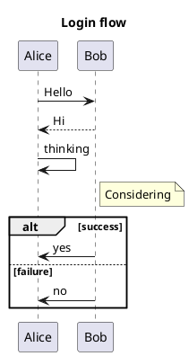

# D2 Sequence Diagram (Wave F) Implementation Plan

> **For agentic workers:** REQUIRED SUB-SKILL: Use superpowers:subagent-driven-development (recommended) or superpowers:executing-plans to implement this plan task-by-task. Steps use checkbox (`- [ ]`) syntax for tracking.

**Goal:** Add `sequenceDiagram` import + export to `DiagramKitD2` via D2's native `shape: sequence_diagram` syntax, raising D2 from 7/28 to 8/28 coverage in each direction, lossless on same-format round-trip via recovery markers.

**Architecture:** A new `D2SequenceProbe` detects sequence sources structurally (top-level `shape: sequence_diagram`). `D2SequenceMapper` walks the parsed `D2Document` and builds a `SequenceDiagram(items: [SequenceItem])` timeline, applying eleven new `D2RecoveryMarker.Kind` cases as a second pass for sequence-specific encoding. `D2SequenceExporter` emits canonical D2 source paired with markers so same-format round-trip is lossless. Cross-format `mermaid↔d2` and `plantuml↔d2` work because each format independently imports/exports `.sequenceDiagram` and the harness composes the legs.

**Tech Stack:** Swift 6 strict-concurrency; existing `RecoveryMarkerScanner<Kind>` infrastructure (`Sources/DiagramKitCommon/RecoveryMarker/`); `RoundTripHarness` for round-trip discipline (`Sources/DiagramKitTestSupport/`); swift-testing `@Suite`/`@Test`.

**Spec:** [`docs/superpowers/specs/2026-05-21-d2-sequence-design.md`](../specs/2026-05-21-d2-sequence-design.md).

**Reusable losses (no new `RoundTripLoss` cases):**
- `RoundTripLoss.idSanitization(original:sanitized:)` — the only loss expected on same-format or cross-format paths once markers carry exact metadata. Cross-format fixtures intentionally avoid features that have no shared subset (lifelines, bottomActors, rectHighlights, exotic arrows, `.link`/`.links`/`.properties`/`.details`).

**Diagnostic categories used (no new categories):**
- `.lossyTransform(.shapeDowngrade, …)` — on import when a D2 shape value has no `ParticipantType` mapping.
- `.lossyTransform(.semanticDowngrade, …)` — on import for block-type inference fallback and empty boxes; on export when `lifelines`/`bottomActors`/`rectHighlights` are dropped.
- `.lossyTransform(.idSanitization, …)` — on export when identifiers contain dots/spaces.
- `.featureDropped(.metadataDropped, …)` — on export for `.link`/`.links`/`.properties`/`.details` items.

**Marker grammar (eleven new kinds, all `# diagramkit:seq-*=`):**

| Kind              | Arg shape (comma-separated)                            |
|-------------------|--------------------------------------------------------|
| `seq-actor-kind`  | `<actorID>,<participantType>`                           |
| `seq-arrow-type`  | `<messageIndex>,<rawValue>`                             |
| `seq-message-attr`| `<messageIndex>,<attr>` where `<attr>` ∈ `{activate,deactivate,wrap,seqNum=<n>,create,destroy}` |
| `seq-block-type`  | `<containerLabel>,<blockType>`                          |
| `seq-block-divider` | `<containerLabel>,<dividerIndex>,<label>`             |
| `seq-note`        | `<afterMessageIndex>,<position>,<actorIDsCsv>,<text>`   |
| `seq-box`         | `<containerLabel>,<fill>,<wrap>,<name>`                 |
| `seq-autonumber`  | `<start>,<step>,<visible>`                              |
| `seq-title`       | `<text>`                                                |
| `seq-acc-title`   | `<text>`                                                |
| `seq-acc-descr`   | `<text>`                                                |

`messageIndex` is the 0-based position in the importer's reconstructed messages array (declaration order). All comma-separated args use the existing `sanitize(_:)` helper (newline/CR/quote → space).

**Fixture conventions:**
- Same-format: `Tests/DiagramKitTests/RoundTrip/Resources/roundtrip/d2-sequence/NN-name.d2` (flat `.d2` files, prefix-numbered).
- Cross-format: `roundtrip/cross-mermaid-d2-sequence/NN-name.mermaid` (legA→legB direction encoded by directory name; `cross-mermaid-d2-sequence` runs Mermaid source through `mermaid → d2 → mermaid`). The reciprocal `cross-d2-mermaid-sequence/NN-name.d2` runs `d2 → mermaid → d2`. Same applies to PlantUML.

---

## Task 1: Extend `D2RecoveryMarker.Kind` with sequence cases

**Files:**
- Modify: `Sources/DiagramKitD2/D2RecoveryMarker.swift`
- Create: `Tests/DiagramKitTests/D2RecoveryMarkerSequenceTests.swift`

Add eleven `Kind` cases plus emit/parse handlers for sequence-specific recovery. Tests assert emit/parse is a round-trip for each kind.

- [ ] **Step 1: Write the failing test**

```swift
// Tests/DiagramKitTests/D2RecoveryMarkerSequenceTests.swift
import Testing
@testable import DiagramKitD2

@Suite("D2RecoveryMarker — sequence kinds")
struct D2RecoveryMarkerSequenceTests {

    @Test("seqActorKind round-trips emit → scanner → parse")
    func seqActorKindRoundTrip() throws {
        let line = D2RecoveryMarker.emitSeqActorKind(actorID: "alice", participantType: "actor")
        let markers = D2RecoveryMarker.scanner.scan(source: line).markers
        try #require(markers.count == 1)
        guard case .seqActorKind(let id, let kind) = markers[0].kind else {
            Issue.record("expected seqActorKind, got \(markers[0].kind)")
            return
        }
        #expect(id == "alice")
        #expect(kind == "actor")
    }

    @Test("seqArrowType round-trips with integer index and rawValue")
    func seqArrowTypeRoundTrip() throws {
        let line = D2RecoveryMarker.emitSeqArrowType(messageIndex: 3, rawValue: 24)
        let markers = D2RecoveryMarker.scanner.scan(source: line).markers
        guard case .seqArrowType(let idx, let raw) = markers[0].kind else {
            Issue.record("wrong kind"); return
        }
        #expect(idx == 3)
        #expect(raw == 24)
    }

    @Test("seqMessageAttr carries attr verbatim")
    func seqMessageAttrRoundTrip() throws {
        let line = D2RecoveryMarker.emitSeqMessageAttr(messageIndex: 1, attr: "activate")
        let markers = D2RecoveryMarker.scanner.scan(source: line).markers
        guard case .seqMessageAttr(let idx, let attr) = markers[0].kind else {
            Issue.record("wrong kind"); return
        }
        #expect(idx == 1)
        #expect(attr == "activate")
    }

    @Test("seqBlockType pins block type for a container label")
    func seqBlockTypeRoundTrip() throws {
        let line = D2RecoveryMarker.emitSeqBlockType(containerLabel: "alt_1", blockType: "alt")
        let markers = D2RecoveryMarker.scanner.scan(source: line).markers
        guard case .seqBlockType(let label, let type) = markers[0].kind else {
            Issue.record("wrong kind"); return
        }
        #expect(label == "alt_1")
        #expect(type == "alt")
    }

    @Test("seqBlockDivider preserves index and label")
    func seqBlockDividerRoundTrip() throws {
        let line = D2RecoveryMarker.emitSeqBlockDivider(containerLabel: "alt_1", dividerIndex: 2, label: "no path")
        let markers = D2RecoveryMarker.scanner.scan(source: line).markers
        guard case .seqBlockDivider(let label, let idx, let dLabel) = markers[0].kind else {
            Issue.record("wrong kind"); return
        }
        #expect(label == "alt_1")
        #expect(idx == 2)
        #expect(dLabel == "no path")
    }

    @Test("seqNote preserves position, actors and text")
    func seqNoteRoundTrip() throws {
        let line = D2RecoveryMarker.emitSeqNote(
            afterMessageIndex: 1,
            position: "right of",
            actorIDsCsv: "bob",
            text: "Thinking..."
        )
        let markers = D2RecoveryMarker.scanner.scan(source: line).markers
        guard case .seqNote(let after, let pos, let csv, let text) = markers[0].kind else {
            Issue.record("wrong kind"); return
        }
        #expect(after == 1)
        #expect(pos == "right of")
        #expect(csv == "bob")
        #expect(text == "Thinking...")
    }

    @Test("seqBox preserves fill / wrap / name")
    func seqBoxRoundTrip() throws {
        let line = D2RecoveryMarker.emitSeqBox(
            containerLabel: "customerBox",
            fill: "#ECECFF",
            wrap: true,
            name: "Customer side"
        )
        let markers = D2RecoveryMarker.scanner.scan(source: line).markers
        guard case .seqBox(let label, let fill, let wrap, let name) = markers[0].kind else {
            Issue.record("wrong kind"); return
        }
        #expect(label == "customerBox")
        #expect(fill == "#ECECFF")
        #expect(wrap == true)
        #expect(name == "Customer side")
    }

    @Test("seqAutonumber preserves start / step / visible")
    func seqAutonumberRoundTrip() throws {
        let line = D2RecoveryMarker.emitSeqAutonumber(start: 5.0, step: 10.0, visible: true)
        let markers = D2RecoveryMarker.scanner.scan(source: line).markers
        guard case .seqAutonumber(let start, let step, let visible) = markers[0].kind else {
            Issue.record("wrong kind"); return
        }
        #expect(start == 5.0)
        #expect(step == 10.0)
        #expect(visible == true)
    }

    @Test("seqTitle / seqAccTitle / seqAccDescr carry text verbatim")
    func titleMarkerRoundTrip() throws {
        let titleLine = D2RecoveryMarker.emitSeqTitle("Login flow")
        let titleMarkers = D2RecoveryMarker.scanner.scan(source: titleLine).markers
        guard case .seqTitle(let t) = titleMarkers[0].kind else { Issue.record("wrong kind"); return }
        #expect(t == "Login flow")

        let accTitleLine = D2RecoveryMarker.emitSeqAccTitle("Login")
        guard case .seqAccTitle(let at) = D2RecoveryMarker.scanner.scan(source: accTitleLine).markers[0].kind else {
            Issue.record("wrong kind"); return
        }
        #expect(at == "Login")

        let accDescrLine = D2RecoveryMarker.emitSeqAccDescr("OAuth flow")
        guard case .seqAccDescr(let ad) = D2RecoveryMarker.scanner.scan(source: accDescrLine).markers[0].kind else {
            Issue.record("wrong kind"); return
        }
        #expect(ad == "OAuth flow")
    }
}
```

- [ ] **Step 2: Run the test to verify failure**

```bash
swift test --filter D2RecoveryMarkerSequenceTests
```

Expected: compilation errors — `D2RecoveryMarker.emitSeqActorKind` and the eleven new `Kind` cases do not exist.

- [ ] **Step 3: Add the cases + emit/parse in `D2RecoveryMarker.swift`**

In `Sources/DiagramKitD2/D2RecoveryMarker.swift`, extend the `Kind` enum (keep existing eight cases intact):

```swift
public enum Kind: Sendable, Equatable {
    // … existing 8 cases (classStereotype, stateAction, erCardinality,
    // archIcon, archGroup, family, treeRoot, mindmapIcon) …
    case seqActorKind(actorID: String, participantType: String)
    case seqArrowType(messageIndex: Int, rawValue: Int)
    case seqMessageAttr(messageIndex: Int, attr: String)
    case seqBlockType(containerLabel: String, blockType: String)
    case seqBlockDivider(containerLabel: String, dividerIndex: Int, label: String)
    case seqNote(afterMessageIndex: Int, position: String, actorIDsCsv: String, text: String)
    case seqBox(containerLabel: String, fill: String, wrap: Bool, name: String)
    case seqAutonumber(start: Double, step: Double, visible: Bool)
    case seqTitle(text: String)
    case seqAccTitle(text: String)
    case seqAccDescr(text: String)
}
```

Add parse branches inside `parseKind(_:)` (after the existing `mindmap-icon` branch, before `return nil`):

```swift
if let args = stripPrefix("seq-actor-kind=", rest) {
    let fields = args.split(separator: ",", maxSplits: 1, omittingEmptySubsequences: false)
    guard fields.count == 2 else { return nil }
    return .seqActorKind(actorID: String(fields[0]), participantType: String(fields[1]))
}
if let args = stripPrefix("seq-arrow-type=", rest) {
    let fields = args.split(separator: ",", maxSplits: 1, omittingEmptySubsequences: false)
    guard fields.count == 2, let idx = Int(fields[0]), let raw = Int(fields[1]) else { return nil }
    return .seqArrowType(messageIndex: idx, rawValue: raw)
}
if let args = stripPrefix("seq-message-attr=", rest) {
    let fields = args.split(separator: ",", maxSplits: 1, omittingEmptySubsequences: false)
    guard fields.count == 2, let idx = Int(fields[0]) else { return nil }
    return .seqMessageAttr(messageIndex: idx, attr: String(fields[1]))
}
if let args = stripPrefix("seq-block-type=", rest) {
    let fields = args.split(separator: ",", maxSplits: 1, omittingEmptySubsequences: false)
    guard fields.count == 2 else { return nil }
    return .seqBlockType(containerLabel: String(fields[0]), blockType: String(fields[1]))
}
if let args = stripPrefix("seq-block-divider=", rest) {
    let fields = args.split(separator: ",", maxSplits: 2, omittingEmptySubsequences: false)
    guard fields.count == 3, let idx = Int(fields[1]) else { return nil }
    return .seqBlockDivider(containerLabel: String(fields[0]), dividerIndex: idx, label: String(fields[2]))
}
if let args = stripPrefix("seq-note=", rest) {
    let fields = args.split(separator: ",", maxSplits: 3, omittingEmptySubsequences: false)
    guard fields.count == 4, let after = Int(fields[0]) else { return nil }
    return .seqNote(
        afterMessageIndex: after,
        position: String(fields[1]),
        actorIDsCsv: String(fields[2]),
        text: String(fields[3])
    )
}
if let args = stripPrefix("seq-box=", rest) {
    let fields = args.split(separator: ",", maxSplits: 3, omittingEmptySubsequences: false)
    guard fields.count == 4 else { return nil }
    let wrap = (String(fields[2]).lowercased() == "true")
    return .seqBox(containerLabel: String(fields[0]), fill: String(fields[1]), wrap: wrap, name: String(fields[3]))
}
if let args = stripPrefix("seq-autonumber=", rest) {
    let fields = args.split(separator: ",", maxSplits: 2, omittingEmptySubsequences: false)
    guard fields.count == 3, let start = Double(fields[0]), let step = Double(fields[1]) else { return nil }
    let visible = (String(fields[2]).lowercased() == "true")
    return .seqAutonumber(start: start, step: step, visible: visible)
}
if let args = stripPrefix("seq-title=", rest) {
    return .seqTitle(text: args)
}
if let args = stripPrefix("seq-acc-title=", rest) {
    return .seqAccTitle(text: args)
}
if let args = stripPrefix("seq-acc-descr=", rest) {
    return .seqAccDescr(text: args)
}
```

Add emit helpers in the same file (after `emitMindmapIcon`):

```swift
public static func emitSeqActorKind(actorID: String, participantType: String) -> String {
    "# diagramkit:seq-actor-kind=\(sanitize(actorID)),\(sanitize(participantType))"
}
public static func emitSeqArrowType(messageIndex: Int, rawValue: Int) -> String {
    "# diagramkit:seq-arrow-type=\(messageIndex),\(rawValue)"
}
public static func emitSeqMessageAttr(messageIndex: Int, attr: String) -> String {
    "# diagramkit:seq-message-attr=\(messageIndex),\(sanitize(attr))"
}
public static func emitSeqBlockType(containerLabel: String, blockType: String) -> String {
    "# diagramkit:seq-block-type=\(sanitize(containerLabel)),\(sanitize(blockType))"
}
public static func emitSeqBlockDivider(containerLabel: String, dividerIndex: Int, label: String) -> String {
    "# diagramkit:seq-block-divider=\(sanitize(containerLabel)),\(dividerIndex),\(sanitize(label))"
}
public static func emitSeqNote(afterMessageIndex: Int, position: String, actorIDsCsv: String, text: String) -> String {
    "# diagramkit:seq-note=\(afterMessageIndex),\(sanitize(position)),\(sanitize(actorIDsCsv)),\(sanitize(text))"
}
public static func emitSeqBox(containerLabel: String, fill: String, wrap: Bool, name: String) -> String {
    "# diagramkit:seq-box=\(sanitize(containerLabel)),\(sanitize(fill)),\(wrap),\(sanitize(name))"
}
public static func emitSeqAutonumber(start: Double, step: Double, visible: Bool) -> String {
    "# diagramkit:seq-autonumber=\(start),\(step),\(visible)"
}
public static func emitSeqTitle(_ text: String) -> String {
    "# diagramkit:seq-title=\(sanitize(text))"
}
public static func emitSeqAccTitle(_ text: String) -> String {
    "# diagramkit:seq-acc-title=\(sanitize(text))"
}
public static func emitSeqAccDescr(_ text: String) -> String {
    "# diagramkit:seq-acc-descr=\(sanitize(text))"
}
```

- [ ] **Step 4: Run the test to verify success**

```bash
swift test --filter D2RecoveryMarkerSequenceTests
```

Expected: all 9 test methods pass.

- [ ] **Step 5: Commit**

```bash
git add Sources/DiagramKitD2/D2RecoveryMarker.swift Tests/DiagramKitTests/D2RecoveryMarkerSequenceTests.swift
git commit -m "Task 1 — D2 sequence: extend D2RecoveryMarker.Kind with 11 seq-* cases"
```

---

## Task 2: `D2SequenceProbe` — structural detection

**Files:**
- Create: `Sources/DiagramKitD2/D2SequenceProbe.swift`
- Create: `Tests/DiagramKitTests/D2SequenceProbeTests.swift`

Detects sequence-diagram sources by looking for a top-level node carrying `shape == "sequence_diagram"`. Nested containers don't trigger detection (they're boxes inside the outer sequence diagram).

- [ ] **Step 1: Write the failing test**

```swift
// Tests/DiagramKitTests/D2SequenceProbeTests.swift
import Testing
@testable import DiagramKitD2

@Suite("D2SequenceProbe")
struct D2SequenceProbeTests {

    @Test("Detects when top-level shape: sequence_diagram is present")
    func detectsTopLevelShape() throws {
        let source = """
        shape: sequence_diagram
        alice: Alice
        bob: Bob
        alice -> bob: Hello
        """
        let (doc, _) = try D2Parser().parse(source)
        #expect(D2SequenceProbe.detectsSequence(doc))
    }

    @Test("Does not detect when only a nested container has shape: sequence_diagram")
    func ignoresNestedOnly() throws {
        // A nested sequence_diagram inside something else is meant to
        // represent a SequenceBox, but the outer document is not itself
        // a sequence diagram in that case.
        let source = """
        outer: {
          inner: {
            shape: sequence_diagram
            alice
          }
        }
        """
        let (doc, _) = try D2Parser().parse(source)
        #expect(!D2SequenceProbe.detectsSequence(doc))
    }

    @Test("Does not detect plain flowchart")
    func ignoresFlowchart() throws {
        let source = """
        a -> b
        b -> c
        """
        let (doc, _) = try D2Parser().parse(source)
        #expect(!D2SequenceProbe.detectsSequence(doc))
    }

    @Test("Does not detect class diagram")
    func ignoresClass() throws {
        let source = """
        Foo: { shape: class }
        """
        let (doc, _) = try D2Parser().parse(source)
        #expect(!D2SequenceProbe.detectsSequence(doc))
    }
}
```

- [ ] **Step 2: Run the test to verify failure**

```bash
swift test --filter D2SequenceProbeTests
```

Expected: compilation error — `D2SequenceProbe` does not exist.

- [ ] **Step 3: Create the probe**

```swift
// Sources/DiagramKitD2/D2SequenceProbe.swift
import Foundation

/// Detects whether a `D2Document` describes a sequence diagram.
///
/// A D2 document is treated as a sequence diagram when at least one
/// top-level node carries `shape: sequence_diagram`. Nested containers
/// with the same shape are sequence boxes (members), not the outer
/// dispatch signal.
enum D2SequenceProbe {

    static func detectsSequence(_ document: D2Document) -> Bool {
        for stmt in document.statements {
            if case .nodeDefinition(let def) = stmt,
               def.shape == "sequence_diagram" {
                return true
            }
        }
        return false
    }
}
```

- [ ] **Step 4: Run the test to verify success**

```bash
swift test --filter D2SequenceProbeTests
```

Expected: all 4 test methods pass.

- [ ] **Step 5: Commit**

```bash
git add Sources/DiagramKitD2/D2SequenceProbe.swift Tests/DiagramKitTests/D2SequenceProbeTests.swift
git commit -m "Task 2 — D2 sequence: structural probe (top-level shape: sequence_diagram)"
```

---

## Task 3: `D2SequenceMapper` — actors + simple messages + dispatch wiring

**Files:**
- Create: `Sources/DiagramKitD2/D2SequenceMapper.swift`
- Modify: `Sources/DiagramKitD2/D2Importer.swift`
- Create: `Tests/DiagramKitTests/D2SequenceMapperTests.swift`

Build the minimal mapper that produces a `SequenceDiagram` from D2 input containing only actors (top-level keys) and messages (top-level edges). Wire it into `D2Importer.parse(_:)` between the existing `D2StateProbe` branch and the marker-forced family branch. Add `.sequenceDiagram` to `supportedDiagramTypes`.

- [ ] **Step 1: Write the failing test**

```swift
// Tests/DiagramKitTests/D2SequenceMapperTests.swift
import Testing
import DiagramKitImport
import DiagramKitModel
@testable import DiagramKitD2

@Suite("D2SequenceMapper")
struct D2SequenceMapperTests {

    @Test("Parses participants from top-level node definitions")
    func parsesParticipants() throws {
        let source = """
        shape: sequence_diagram
        alice: Alice
        bob: Bob
        """
        let result = try D2Importer().parse(source)
        guard case .sequenceDiagram(let seq) = result.document.payload else {
            Issue.record("expected .sequenceDiagram, got \(result.document.payload)"); return
        }
        #expect(seq.actors.map(\.id) == ["alice", "bob"])
        #expect(seq.actors.map(\.label) == ["Alice", "Bob"])
        #expect(seq.actors.allSatisfy { $0.type == .participant })
    }

    @Test("Parses messages from top-level edges")
    func parsesMessages() throws {
        let source = """
        shape: sequence_diagram
        alice -> bob: Hello
        bob -> alice: Hi back
        """
        let result = try D2Importer().parse(source)
        guard case .sequenceDiagram(let seq) = result.document.payload else {
            Issue.record("not a sequence diagram"); return
        }
        #expect(seq.messages.count == 2)
        #expect(seq.messages[0].from == "alice")
        #expect(seq.messages[0].to == "bob")
        #expect(seq.messages[0].label == "Hello")
        #expect(seq.messages[0].arrowType == .solid)
        #expect(seq.messages[1].from == "bob")
        #expect(seq.messages[1].to == "alice")
    }

    @Test("Bidirectional edges map to .bidirectionalSolid")
    func parsesBidirectional() throws {
        let source = """
        shape: sequence_diagram
        alice <-> bob: Sync
        """
        let result = try D2Importer().parse(source)
        guard case .sequenceDiagram(let seq) = result.document.payload else {
            Issue.record("not sequence"); return
        }
        #expect(seq.messages.first?.arrowType == .bidirectionalSolid)
    }

    @Test("D2Importer.supportedDiagramTypes now contains .sequenceDiagram")
    func importerAdvertisesSequence() {
        #expect(D2Importer().supportedDiagramTypes.contains(.sequenceDiagram))
    }

    @Test("Self-message preserved")
    func selfMessage() throws {
        let source = """
        shape: sequence_diagram
        alice -> alice: thinking
        """
        let result = try D2Importer().parse(source)
        guard case .sequenceDiagram(let seq) = result.document.payload else {
            Issue.record("not sequence"); return
        }
        #expect(seq.messages.first?.from == "alice")
        #expect(seq.messages.first?.to == "alice")
    }
}
```

- [ ] **Step 2: Run the test to verify failure**

```bash
swift test --filter D2SequenceMapperTests
```

Expected: compilation error or first assertion fails — `D2SequenceMapper` doesn't exist; `supportedDiagramTypes` doesn't include `.sequenceDiagram`.

- [ ] **Step 3: Create the mapper**

```swift
// Sources/DiagramKitD2/D2SequenceMapper.swift
import Foundation
import DiagramKitCommon
import DiagramKitModel

/// Builds a `SequenceDiagram` from a parsed `D2Document`.
///
/// The mapper walks D2 statements in declaration order and emits a
/// `SequenceItem` timeline. The result is canonical: derived computed
/// arrays (`actors`, `messages`, `blocks`, `boxes`, `notes`) reconstruct
/// from `items` via the existing `SequenceDiagram` computed properties.
struct D2SequenceMapper {

    func map(
        _ document: D2Document,
        markers: [RecoveryMarker<D2RecoveryMarker.Kind>]
    ) -> (SequenceDiagram, [DiagramDiagnostic]) {
        var items: [SequenceItem] = []
        var diagnostics: [DiagramDiagnostic] = []
        var seenActorIDs: Set<String> = []

        for stmt in document.statements {
            switch stmt {
            case .nodeDefinition(let def):
                // Skip the dispatch-signal node itself (it carries
                // shape: sequence_diagram and no participant payload).
                if def.shape == "sequence_diagram" && def.label == nil { continue }
                guard !seenActorIDs.contains(def.id) else { continue }
                let label = def.label ?? def.id
                let type = D2SequenceMapper.participantType(forShape: def.shape) ?? .participant
                if let shape = def.shape, type == .participant, shape != "sequence_diagram" {
                    diagnostics.append(.lossyTransform(
                        .shapeDowngrade,
                        message: "D2 shape '\(shape)' has no ParticipantType mapping; defaulted to .participant"
                    ))
                }
                items.append(.actor(SequenceActor(
                    id: def.id,
                    label: label,
                    type: type,
                    isExplicit: true
                )))
                seenActorIDs.insert(def.id)

            case .edgeDefinition(let edge):
                if !seenActorIDs.contains(edge.source) {
                    items.append(.actor(SequenceActor(id: edge.source, label: edge.source, type: .participant, isExplicit: false)))
                    seenActorIDs.insert(edge.source)
                }
                if !seenActorIDs.contains(edge.target) {
                    items.append(.actor(SequenceActor(id: edge.target, label: edge.target, type: .participant, isExplicit: false)))
                    seenActorIDs.insert(edge.target)
                }
                let arrow: SequenceArrowType = {
                    switch edge.edgeKind {
                    case .bidirectional: return .bidirectionalSolid
                    case .directional, .undirected: return .solid
                    }
                }()
                items.append(.message(SequenceMessage(
                    from: edge.source,
                    to: edge.target,
                    label: edge.label ?? "",
                    arrowType: arrow
                )))

            default:
                break
            }
        }

        // Markers will be applied in later tasks; for Task 3 we only
        // honor seq-actor-kind so existing actor types are recoverable.
        applyActorKindMarkers(&items, markers: markers)
        applyArrowTypeMarkers(&items, markers: markers)

        return (SequenceDiagram(items: items), diagnostics)
    }

    private func applyActorKindMarkers(
        _ items: inout [SequenceItem],
        markers: [RecoveryMarker<D2RecoveryMarker.Kind>]
    ) {
        for marker in markers {
            guard case .seqActorKind(let id, let raw) = marker.kind else { continue }
            guard let type = ParticipantType(rawValue: raw) else { continue }
            for idx in items.indices {
                if case .actor(var actor) = items[idx], actor.id == id {
                    actor.type = type
                    items[idx] = .actor(actor)
                }
            }
        }
    }

    private func applyArrowTypeMarkers(
        _ items: inout [SequenceItem],
        markers: [RecoveryMarker<D2RecoveryMarker.Kind>]
    ) {
        var msgIdx = -1
        for idx in items.indices {
            if case .message(var msg) = items[idx] {
                msgIdx += 1
                let captured = msgIdx
                for marker in markers {
                    guard case .seqArrowType(let mIdx, let raw) = marker.kind,
                          mIdx == captured,
                          let arrow = SequenceArrowType(rawValue: raw)
                    else { continue }
                    msg.arrowType = arrow
                }
                items[idx] = .message(msg)
            }
        }
    }

    static func participantType(forShape shape: String?) -> ParticipantType? {
        guard let shape else { return .participant }
        switch shape {
        case "person":   return .actor
        case "cylinder": return .database
        case "queue":    return .queue
        case "oval":     return .boundary
        case "hexagon":  return .control
        case "cloud":    return .entity
        case "page":     return .collections
        default:         return nil
        }
    }
}
```

Modify `Sources/DiagramKitD2/D2Importer.swift`:

1. Add `.sequenceDiagram` to `supportedDiagramTypes`:

```swift
public let supportedDiagramTypes: Set<DiagramType> = [
    .flowchart,
    .classDiagram,
    .stateDiagram,
    .erDiagram,
    .sequenceDiagram,
    .architecture,
    .mindmap,
    .treeView,
]
```

2. Insert the sequence dispatch branch in `parse(_:)` after the `D2StateProbe` block (lines around 58-66) and before the `markerFamily` block (around lines 68-71). Also honor `markerFamily == "sequence"`:

```swift
if D2SequenceProbe.detectsSequence(d2Doc) {
    let (seq, seqDiagnostics) = D2SequenceMapper().map(d2Doc, markers: markerScan.markers)
    var document = DiagramDocument(payload: .sequenceDiagram(seq))
    document.title = Self.documentTitleMetadata(in: source)
    return DiagramImportResult(
        document: document,
        diagnostics: parseDiagnostics + seqDiagnostics
    )
}

// (existing markerFamily computation continues here)
```

3. Extend the marker-forced family branch to handle `"sequence"`:

```swift
if markerFamily == "sequence" {
    let (seq, seqDiagnostics) = D2SequenceMapper().map(d2Doc, markers: markerScan.markers)
    var document = DiagramDocument(payload: .sequenceDiagram(seq))
    document.title = Self.documentTitleMetadata(in: source)
    return DiagramImportResult(
        document: document,
        diagnostics: parseDiagnostics + seqDiagnostics
    )
}
```

Place this `markerFamily == "sequence"` branch just before the existing `markerFamily == "architecture" || …` branch so a marker can override structural fall-through.

- [ ] **Step 4: Run the tests to verify success**

```bash
swift test --filter D2SequenceMapperTests
swift test --filter D2SequenceProbeTests
swift test --filter D2RecoveryMarkerSequenceTests
```

Expected: all pass. Also verify nothing existing broke:

```bash
swift test --filter D2ClassRoundTripTests
swift test --filter D2ArchitectureRoutingTests
```

Expected: all pass.

- [ ] **Step 5: Commit**

```bash
git add Sources/DiagramKitD2/D2SequenceMapper.swift Sources/DiagramKitD2/D2Importer.swift Tests/DiagramKitTests/D2SequenceMapperTests.swift
git commit -m "Task 3 — D2 sequence: mapper (actors + messages) + importer dispatch"
```

---

## Task 4: Mapper — blocks (alt/opt/loop/par/critical) + boxes (nested sequence_diagram)

**Files:**
- Modify: `Sources/DiagramKitD2/D2SequenceMapper.swift`
- Modify: `Tests/DiagramKitTests/D2SequenceMapperTests.swift`

Extend the mapper to handle D2 containers as either `SequenceBlock` (default) or `SequenceBox` (when the container itself carries `shape: sequence_diagram`). Block type is recovered from `seq-block-type` marker, else inferred from container label prefix, else defaults to `"opt"` with a `.semanticDowngrade` diagnostic. Box metadata (fill, wrap, name) comes from `seq-box` marker.

- [ ] **Step 1: Add failing tests to `D2SequenceMapperTests.swift`**

```swift
@Test("Container with alt_<n> label produces a SequenceBlock of type 'alt'")
func altBlockInferredFromLabel() throws {
    let source = """
    shape: sequence_diagram
    alice -> bob: ask
    alt_1: {
      bob -> alice: yes
    }
    """
    let result = try D2Importer().parse(source)
    guard case .sequenceDiagram(let seq) = result.document.payload else {
        Issue.record("not sequence"); return
    }
    let block = try #require(seq.blocks.first)
    #expect(block.type == "alt")
    #expect(block.startItemIndex < block.endItemIndex)
}

@Test("Container without recognizable prefix defaults to 'opt' with semanticDowngrade")
func unrecognizedBlockDefaultsToOpt() throws {
    let source = """
    shape: sequence_diagram
    alice -> bob: ask
    fancy_thing: {
      bob -> alice: yes
    }
    """
    let result = try D2Importer().parse(source)
    guard case .sequenceDiagram(let seq) = result.document.payload else {
        Issue.record("not sequence"); return
    }
    let block = try #require(seq.blocks.first)
    #expect(block.type == "opt")
    let downgraded = result.diagnostics.contains {
        if case .lossyTransform(let cat, _, _) = $0, cat == .semanticDowngrade { return true }
        return false
    }
    #expect(downgraded)
}

@Test("seq-block-type marker overrides label-prefix inference")
func blockTypeMarkerWins() throws {
    let source = """
    # diagramkit:seq-block-type=fancy_thing,critical
    shape: sequence_diagram
    alice -> bob: ask
    fancy_thing: {
      bob -> alice: yes
    }
    """
    let result = try D2Importer().parse(source)
    guard case .sequenceDiagram(let seq) = result.document.payload else {
        Issue.record("not sequence"); return
    }
    #expect(seq.blocks.first?.type == "critical")
}

@Test("Container with shape: sequence_diagram becomes a SequenceBox")
func nestedSequenceDiagramBecomesBox() throws {
    let source = """
    # diagramkit:seq-box=customerBox,#ECECFF,true,Customer side
    shape: sequence_diagram
    customerBox: Customer side {
      shape: sequence_diagram
      alice: Alice
    }
    """
    let result = try D2Importer().parse(source)
    guard case .sequenceDiagram(let seq) = result.document.payload else {
        Issue.record("not sequence"); return
    }
    let box = try #require(seq.boxes.first)
    #expect(box.name == "Customer side")
    #expect(box.fill == "#ECECFF")
    #expect(box.wrap == true)
    #expect(box.actorIds == ["alice"])
}

@Test("Block divider recovered from marker")
func blockDividerRecovered() throws {
    let source = """
    # diagramkit:seq-block-divider=alt_1,1,no path
    shape: sequence_diagram
    alice -> bob: ask
    alt_1: {
      bob -> alice: yes
      bob -> alice: no
    }
    """
    let result = try D2Importer().parse(source)
    guard case .sequenceDiagram(let seq) = result.document.payload else {
        Issue.record("not sequence"); return
    }
    let block = try #require(seq.blocks.first)
    #expect(block.dividers.first?.label == "no path")
}
```

- [ ] **Step 2: Run the tests to verify failure**

```bash
swift test --filter D2SequenceMapperTests
```

Expected: container-related tests fail — mapper currently ignores containers.

- [ ] **Step 3: Extend `D2SequenceMapper.map(_:markers:)` to handle containers**

Replace the body of the `for stmt in document.statements` loop with a stateful walker. Add a `containerStack` so nesting works, and emit `.blockStart`/`.blockEnd` or `.boxStart`/`.boxEnd` based on whether the container itself has `shape: sequence_diagram`.

The full mapper body becomes (replace the existing `func map(_:markers:)`):

```swift
func map(
    _ document: D2Document,
    markers: [RecoveryMarker<D2RecoveryMarker.Kind>]
) -> (SequenceDiagram, [DiagramDiagnostic]) {
    var items: [SequenceItem] = []
    var diagnostics: [DiagramDiagnostic] = []
    var seenActorIDs: Set<String> = []

    enum ContainerFrame { case block(label: String); case box(label: String) }
    var containerStack: [ContainerFrame] = []

    func registerActor(_ id: String, label: String, type: ParticipantType, isExplicit: Bool) {
        guard !seenActorIDs.contains(id) else { return }
        items.append(.actor(SequenceActor(id: id, label: label, type: type, isExplicit: isExplicit)))
        seenActorIDs.insert(id)
    }

    func inferBlockType(label: String) -> (type: String, inferred: Bool) {
        for prefix in ["alt_", "opt_", "loop_", "par_", "critical_", "break_", "rect_"] {
            if label.hasPrefix(prefix) {
                return (String(prefix.dropLast()), false)
            }
        }
        return ("opt", true)
    }

    func explicitBlockType(for label: String) -> String? {
        for marker in markers {
            if case .seqBlockType(let l, let type) = marker.kind, l == label {
                return type
            }
        }
        return nil
    }

    func boxMetadata(for label: String) -> (fill: String, wrap: Bool, name: String)? {
        for marker in markers {
            if case .seqBox(let l, let fill, let wrap, let name) = marker.kind, l == label {
                return (fill, wrap, name)
            }
        }
        return nil
    }

    for stmt in document.statements {
        switch stmt {
        case .nodeDefinition(let def):
            if def.shape == "sequence_diagram" && def.label == nil { continue }
            let label = def.label ?? def.id
            let type = D2SequenceMapper.participantType(forShape: def.shape) ?? .participant
            if let shape = def.shape, type == .participant, shape != "sequence_diagram" {
                diagnostics.append(.lossyTransform(
                    .shapeDowngrade,
                    message: "D2 shape '\(shape)' has no ParticipantType mapping; defaulted to .participant"
                ))
            }
            registerActor(def.id, label: label, type: type, isExplicit: true)

        case .edgeDefinition(let edge):
            registerActor(edge.source, label: edge.source, type: .participant, isExplicit: false)
            registerActor(edge.target, label: edge.target, type: .participant, isExplicit: false)
            let arrow: SequenceArrowType = {
                switch edge.edgeKind {
                case .bidirectional: return .bidirectionalSolid
                case .directional, .undirected: return .solid
                }
            }()
            items.append(.message(SequenceMessage(
                from: edge.source,
                to: edge.target,
                label: edge.label ?? "",
                arrowType: arrow
            )))

        case .containerOpen(let open):
            if let box = boxMetadata(for: open.id) {
                items.append(.boxStart(fill: box.fill, title: box.name, wrap: box.wrap))
                containerStack.append(.box(label: open.id))
            } else {
                let blockType: String
                if let pinned = explicitBlockType(for: open.id) {
                    blockType = pinned
                } else {
                    let inferred = inferBlockType(label: open.id)
                    blockType = inferred.type
                    if inferred.inferred {
                        diagnostics.append(.lossyTransform(
                            .semanticDowngrade,
                            message: "D2 sequence container '\(open.id)' assumed block type 'opt'; no seq-block-type marker found"
                        ))
                    }
                }
                items.append(.blockStart(type: blockType, label: open.id))
                containerStack.append(.block(label: open.id))
            }

        case .containerClose:
            guard let frame = containerStack.popLast() else { continue }
            switch frame {
            case .block(let label):
                // Resolve the block type by finding the matching .blockStart
                // we already emitted for this label, then close it.
                let resolvedType: String = items.reversed().firstNonNil {
                    if case .blockStart(let t, let l) = $0, l == label { return t }
                    return nil
                } ?? "opt"
                items.append(.blockEnd(type: resolvedType))
                // .blockDivider items are inserted in a second pass below
                // (applyBlockDividerMarkers) so that each divider lands at
                // its declared dividerIndex among the block's messages.
            case .box:
                items.append(.boxEnd)
            }

        default:
            break
        }
    }

    var working = items
    applyActorKindMarkers(&working, markers: markers)
    applyArrowTypeMarkers(&working, markers: markers)
    applyBlockDividerMarkers(&working, markers: markers)
    return (SequenceDiagram(items: working), diagnostics)
}

/// Helper used by the `.containerClose` arm above. Swift doesn't
/// ship a `firstNonNil` on `Collection`, so we add it locally.
private extension Sequence {
    func firstNonNil<T>(_ transform: (Element) -> T?) -> T? {
        for e in self { if let t = transform(e) { return t } }
        return nil
    }
}

/// Insert `.blockDivider` items at the message-index position
/// indicated by each `seq-block-divider` marker. Multiple dividers
/// for the same block land in ascending `dividerIndex` order.
private func applyBlockDividerMarkers(
    _ items: inout [SequenceItem],
    markers: [RecoveryMarker<D2RecoveryMarker.Kind>]
) {
    struct DividerSpec {
        let containerLabel: String
        let dividerIndex: Int
        let label: String
    }
    let specs: [DividerSpec] = markers.compactMap { m in
        if case .seqBlockDivider(let label, let idx, let text) = m.kind {
            return DividerSpec(containerLabel: label, dividerIndex: idx, label: text)
        }
        return nil
    }.sorted { $0.dividerIndex > $1.dividerIndex } // insert back-to-front

    for spec in specs {
        // Find the .blockStart for this container; count messages from
        // there forward until we hit either the spec.dividerIndex-th
        // message or .blockEnd, and insert just before that message.
        guard let startIdx = items.firstIndex(where: {
            if case .blockStart(_, let l) = $0, l == spec.containerLabel { return true }
            return false
        }) else { continue }
        var msgsInside = 0
        var insertAt = startIdx + 1
        var depth = 1
        var cursor = startIdx + 1
        while cursor < items.count, depth > 0 {
            switch items[cursor] {
            case .blockStart: depth += 1
            case .blockEnd:
                depth -= 1
                if depth == 0 { insertAt = cursor; cursor = items.count; continue }
            case .message:
                if depth == 1 {
                    if msgsInside == spec.dividerIndex {
                        insertAt = cursor
                        cursor = items.count
                        continue
                    }
                    msgsInside += 1
                }
            default: break
            }
            cursor += 1
        }
        // Block type isn't carried by the marker — use the type from
        // the matching .blockStart so the divider semantically aligns
        // (Mermaid's renderer treats `alt` / `else` together).
        let blockType: String = {
            if case .blockStart(let t, _) = items[startIdx] { return t }
            return "alt"
        }()
        items.insert(.blockDivider(type: blockType, label: spec.label), at: insertAt)
    }
}
```

- [ ] **Step 4: Run the tests to verify success**

```bash
swift test --filter D2SequenceMapperTests
```

Expected: all 10 test methods pass (5 from Task 3 + 5 new).

- [ ] **Step 5: Commit**

```bash
git add Sources/DiagramKitD2/D2SequenceMapper.swift Tests/DiagramKitTests/D2SequenceMapperTests.swift
git commit -m "Task 4 — D2 sequence mapper: blocks (alt/opt/loop/par/critical) + boxes"
```

---

## Task 5: Mapper — notes, activations, autonumber, title/accTitle/accDescr

**Files:**
- Modify: `Sources/DiagramKitD2/D2SequenceMapper.swift`
- Modify: `Tests/DiagramKitTests/D2SequenceMapperTests.swift`

Add marker-driven recovery for the remaining `SequenceItem` cases: notes inserted at `afterMessageIndex`, per-message activate/deactivate/wrap/seqNum/create/destroy attributes, autonumber events, and title/accTitle/accDescr items.

- [ ] **Step 1: Add failing tests**

```swift
@Test("seq-note marker creates a SequenceNote at the right position")
func noteFromMarker() throws {
    let source = """
    # diagramkit:seq-note=0,right of,bob,Thinking...
    shape: sequence_diagram
    alice -> bob: ping
    """
    let result = try D2Importer().parse(source)
    guard case .sequenceDiagram(let seq) = result.document.payload else {
        Issue.record("not sequence"); return
    }
    let note = try #require(seq.notes.first)
    #expect(note.position == "right of")
    #expect(note.actorIds == ["bob"])
    #expect(note.text == "Thinking...")
}

@Test("seq-message-attr=<n>,activate sets activate flag")
func activateFromMarker() throws {
    let source = """
    # diagramkit:seq-message-attr=0,activate
    shape: sequence_diagram
    alice -> bob: ping
    """
    let result = try D2Importer().parse(source)
    guard case .sequenceDiagram(let seq) = result.document.payload else {
        Issue.record("not sequence"); return
    }
    #expect(seq.messages.first?.activate == true)
}

@Test("seq-autonumber recovers (start, step, visible)")
func autonumberMarker() throws {
    let source = """
    # diagramkit:seq-autonumber=5,10,true
    shape: sequence_diagram
    alice -> bob: ping
    """
    let result = try D2Importer().parse(source)
    guard case .sequenceDiagram(let seq) = result.document.payload else {
        Issue.record("not sequence"); return
    }
    #expect(seq.autonumberEnabled == true)
    #expect(seq.autonumberStart == 5.0)
    #expect(seq.autonumberStep == 10.0)
}

@Test("seq-title / seq-acc-title / seq-acc-descr recovered onto SequenceDiagram")
func titleMarkers() throws {
    let source = """
    # diagramkit:seq-title=Login flow
    # diagramkit:seq-acc-title=Login
    # diagramkit:seq-acc-descr=Validates OAuth
    shape: sequence_diagram
    alice -> bob: auth
    """
    let result = try D2Importer().parse(source)
    guard case .sequenceDiagram(let seq) = result.document.payload else {
        Issue.record("not sequence"); return
    }
    #expect(seq.title == "Login flow")
    #expect(seq.accTitle == "Login")
    #expect(seq.accDescr == "Validates OAuth")
}
```

- [ ] **Step 2: Run the tests to verify failure**

```bash
swift test --filter D2SequenceMapperTests
```

Expected: 4 new tests fail — markers parse, but their effects aren't applied yet.

- [ ] **Step 3: Extend `D2SequenceMapper`**

Add three new helpers and call them at the end of `map(_:markers:)`, after `applyArrowTypeMarkers`:

```swift
private func applyMessageAttrMarkers(
    _ items: inout [SequenceItem],
    markers: [RecoveryMarker<D2RecoveryMarker.Kind>]
) {
    var msgIdx = -1
    for idx in items.indices {
        guard case .message(var msg) = items[idx] else { continue }
        msgIdx += 1
        let captured = msgIdx
        for marker in markers {
            guard case .seqMessageAttr(let mIdx, let attr) = marker.kind, mIdx == captured else { continue }
            switch attr {
            case "activate":   msg.activate = true
            case "deactivate": msg.deactivate = true
            case "wrap":       msg.wrap = true
            case "create", "destroy":
                // create/destroy handled below by lifting actor declarations
                break
            default:
                if attr.hasPrefix("seqNum=") {
                    if let n = Double(attr.dropFirst("seqNum=".count)) {
                        msg.sequenceNumber = n
                        msg.sequenceVisible = true
                    }
                }
            }
        }
        items[idx] = .message(msg)
    }
}

private func applyNoteMarkers(
    _ items: inout [SequenceItem],
    markers: [RecoveryMarker<D2RecoveryMarker.Kind>]
) {
    // Identify the position of each message in `items` so we can insert
    // a `.note` immediately after the indicated message.
    var messagePositions: [Int] = []
    for (idx, item) in items.enumerated() {
        if case .message = item { messagePositions.append(idx) }
    }
    var insertions: [(targetIndex: Int, note: SequenceNote)] = []
    for marker in markers {
        guard case .seqNote(let after, let position, let csv, let text) = marker.kind,
              after >= 0,
              after < messagePositions.count
        else { continue }
        let targetIndex = messagePositions[after] + 1
        let actorIDs = csv.split(separator: " ").map(String.init)
            .flatMap { $0.split(separator: ",").map(String.init) }
            .filter { !$0.isEmpty }
        let note = SequenceNote(actorIds: actorIDs, text: text, position: position, afterItemIndex: targetIndex)
        insertions.append((targetIndex, note))
    }
    // Insert from the back so earlier indices remain valid.
    for (targetIndex, note) in insertions.sorted(by: { $0.targetIndex > $1.targetIndex }) {
        items.insert(.note(note), at: targetIndex)
    }
}

private func applyAutonumberMarkers(
    _ items: inout [SequenceItem],
    markers: [RecoveryMarker<D2RecoveryMarker.Kind>]
) {
    for marker in markers {
        guard case .seqAutonumber(let start, let step, let visible) = marker.kind else { continue }
        items.insert(.autonumberEvent(start: start, step: step, visible: visible), at: 0)
        return
    }
}

private func applyTitleMarkers(
    _ items: inout [SequenceItem],
    markers: [RecoveryMarker<D2RecoveryMarker.Kind>]
) {
    for marker in markers {
        switch marker.kind {
        case .seqTitle(let t):     items.insert(.title(t), at: 0)
        case .seqAccTitle(let t):  items.insert(.accTitle(t), at: 0)
        case .seqAccDescr(let d):  items.insert(.accDescr(d), at: 0)
        default: break
        }
    }
}
```

Update the end of `map(_:markers:)`:

```swift
var working = items
applyActorKindMarkers(&working, markers: markers)
applyArrowTypeMarkers(&working, markers: markers)
applyMessageAttrMarkers(&working, markers: markers)
applyNoteMarkers(&working, markers: markers)
applyAutonumberMarkers(&working, markers: markers)
applyTitleMarkers(&working, markers: markers)
return (SequenceDiagram(items: working), diagnostics)
```

- [ ] **Step 4: Run the tests to verify success**

```bash
swift test --filter D2SequenceMapperTests
```

Expected: all 14 test methods pass.

- [ ] **Step 5: Commit**

```bash
git add Sources/DiagramKitD2/D2SequenceMapper.swift Tests/DiagramKitTests/D2SequenceMapperTests.swift
git commit -m "Task 5 — D2 sequence mapper: notes, activations, autonumber, titles"
```

---

## Task 6: `D2SequenceExporter` — actors + simple messages + dispatch wiring

**Files:**
- Create: `Sources/DiagramKitD2/D2SequenceExporter.swift`
- Modify: `Sources/DiagramKitD2/D2Exporter.swift`
- Create: `Tests/DiagramKitTests/D2SequenceExporterTests.swift`

Add the minimal exporter that emits the dispatch header (`shape: sequence_diagram`), actors with `id: label` lines and optional `id.shape:` for structural participant types, and edges with `->`/`-->`/`<->` chosen by arrow type. Always emit `seq-arrow-type` and `seq-actor-kind` markers so round-trip is exact. Wire dispatch in `D2Exporter.export(_:)`.

- [ ] **Step 1: Write the failing test**

```swift
// Tests/DiagramKitTests/D2SequenceExporterTests.swift
import Testing
import DiagramKitImport
import DiagramKitExport
import DiagramKitModel
@testable import DiagramKitD2

@Suite("D2SequenceExporter")
struct D2SequenceExporterTests {

    @Test("Emits dispatch header and actors with labels")
    func emitsHeaderAndActors() throws {
        let doc = DiagramDocument(payload: .sequenceDiagram(SequenceDiagram(items: [
            .actor(SequenceActor(id: "alice", label: "Alice", type: .actor, isExplicit: true)),
            .actor(SequenceActor(id: "bob", label: "Bob", type: .participant, isExplicit: true)),
        ])))
        let out = try D2Exporter().export(doc)
        #expect(out.source.contains("shape: sequence_diagram"))
        #expect(out.source.contains("alice: \"Alice\""))
        #expect(out.source.contains("bob: \"Bob\""))
        // Marker for actor with non-default type
        #expect(out.source.contains("# diagramkit:seq-actor-kind=alice,actor"))
        // Person shape for .actor
        #expect(out.source.contains("alice.shape: person"))
    }

    @Test("Emits messages with -> / --> / <-> arrows + seq-arrow-type markers")
    func emitsMessages() throws {
        let doc = DiagramDocument(payload: .sequenceDiagram(SequenceDiagram(items: [
            .actor(SequenceActor(id: "alice", label: "Alice")),
            .actor(SequenceActor(id: "bob", label: "Bob")),
            .message(SequenceMessage(from: "alice", to: "bob", label: "Hello", arrowType: .solid)),
            .message(SequenceMessage(from: "bob", to: "alice", label: "Hi", arrowType: .dotted)),
            .message(SequenceMessage(from: "alice", to: "bob", label: "Sync", arrowType: .bidirectionalSolid)),
        ])))
        let out = try D2Exporter().export(doc)
        #expect(out.source.contains("alice -> bob: \"Hello\""))
        #expect(out.source.contains("bob --> alice: \"Hi\""))
        #expect(out.source.contains("alice <-> bob: \"Sync\""))
        #expect(out.source.contains("# diagramkit:seq-arrow-type=0,0"))
        #expect(out.source.contains("# diagramkit:seq-arrow-type=1,1"))
        #expect(out.source.contains("# diagramkit:seq-arrow-type=2,33"))
    }

    @Test("Round-trip through D2Importer reproduces actors + messages")
    func minimalRoundTrip() throws {
        let original = DiagramDocument(payload: .sequenceDiagram(SequenceDiagram(items: [
            .actor(SequenceActor(id: "alice", label: "Alice", type: .actor)),
            .actor(SequenceActor(id: "bob", label: "Bob", type: .participant)),
            .message(SequenceMessage(from: "alice", to: "bob", label: "Hello", arrowType: .solid)),
        ])))
        let exported = try D2Exporter().export(original)
        let reimported = try D2Importer().parse(exported.source)
        guard case .sequenceDiagram(let seq) = reimported.document.payload else {
            Issue.record("re-imported is not sequence"); return
        }
        #expect(seq.actors.map(\.id) == ["alice", "bob"])
        #expect(seq.actors.first?.type == .actor)
        #expect(seq.messages.first?.label == "Hello")
    }

    @Test("D2Exporter.supportedDiagramTypes now contains .sequenceDiagram")
    func exporterAdvertisesSequence() {
        #expect(D2Exporter().supportedDiagramTypes.contains(.sequenceDiagram))
    }
}
```

- [ ] **Step 2: Run the tests to verify failure**

```bash
swift test --filter D2SequenceExporterTests
```

Expected: compilation errors / asserts fail — `D2SequenceExporter` doesn't exist; exporter's `supportedDiagramTypes` lacks `.sequenceDiagram`.

- [ ] **Step 3: Create the exporter**

```swift
// Sources/DiagramKitD2/D2SequenceExporter.swift
import Foundation
import DiagramKitCommon
import DiagramKitModel
import DiagramKitImport
import DiagramKitExport

enum D2SequenceExport {

    static func emit(_ seq: SequenceDiagram, title: String? = nil) -> DiagramExportResult {
        var lines: [String] = []
        var diagnostics: [DiagramDiagnostic] = []

        // Dispatch signal + family marker so probes survive comment-only edits.
        lines.append("# diagramkit:family=sequence")
        lines.append("shape: sequence_diagram")
        lines.append("")

        // Title metadata first (marker + human-readable comment).
        if let t = seq.title, !t.isEmpty {
            lines.append(D2RecoveryMarker.emitSeqTitle(t))
            lines.append("# title: \(singleLine(t))")
        }
        if let t = seq.accTitle { lines.append(D2RecoveryMarker.emitSeqAccTitle(t)) }
        if let d = seq.accDescr { lines.append(D2RecoveryMarker.emitSeqAccDescr(d)) }

        // Autonumber: at most one event materializes.
        if seq.autonumberEnabled {
            lines.append(D2RecoveryMarker.emitSeqAutonumber(
                start: seq.autonumberStart,
                step: seq.autonumberStep,
                visible: true
            ))
        }

        // Actors and messages walk the canonical items timeline.
        var msgIdx = -1

        for item in seq.items {
            switch item {
            case .actor(let actor):
                let sanitizedId = sanitizeID(actor.id, &diagnostics)
                lines.append("\(sanitizedId): \"\(escape(actor.label))\"")
                if actor.type != .participant {
                    lines.append(D2RecoveryMarker.emitSeqActorKind(
                        actorID: sanitizedId,
                        participantType: actor.type.rawValue
                    ))
                    if let shape = shape(for: actor.type) {
                        lines.append("\(sanitizedId).shape: \(shape)")
                    }
                }

            case .message(let msg):
                msgIdx += 1
                let from = sanitizeID(msg.from, &diagnostics)
                let to = sanitizeID(msg.to, &diagnostics)
                let arrow = arrowToken(for: msg.arrowType)
                if msg.label.isEmpty {
                    lines.append("\(from) \(arrow) \(to)")
                } else {
                    lines.append("\(from) \(arrow) \(to): \"\(escape(msg.label))\"")
                }
                lines.append(D2RecoveryMarker.emitSeqArrowType(
                    messageIndex: msgIdx,
                    rawValue: msg.arrowType.rawValue
                ))
                if msg.activate {
                    lines.append(D2RecoveryMarker.emitSeqMessageAttr(messageIndex: msgIdx, attr: "activate"))
                }
                if msg.deactivate {
                    lines.append(D2RecoveryMarker.emitSeqMessageAttr(messageIndex: msgIdx, attr: "deactivate"))
                }
                if msg.wrap == true {
                    lines.append(D2RecoveryMarker.emitSeqMessageAttr(messageIndex: msgIdx, attr: "wrap"))
                }
                if let n = msg.sequenceNumber, msg.sequenceVisible {
                    lines.append(D2RecoveryMarker.emitSeqMessageAttr(messageIndex: msgIdx, attr: "seqNum=\(n)"))
                }

            // Block / box / note / activation / autonumber / title items handled in later tasks.
            default:
                break
            }
        }

        // Note: lifelines / bottomActors / rectHighlights live on
        // `PositionedGraph`, not `SequenceDiagram`, so there is nothing
        // to drop on the unpositioned payload at export time.
        // `.link` / `.links` / `.properties` / `.details` item drops
        // land in Task 8 when the items walk covers those cases.

        return DiagramExportResult(
            source: lines.joined(separator: "\n") + "\n",
            diagnostics: diagnostics
        )
    }

    // MARK: helpers

    static func arrowToken(for arrow: SequenceArrowType) -> String {
        switch arrow {
        case .bidirectionalSolid, .bidirectionalDotted: return "<->"
        case .dotted, .dottedCross, .dottedOpen, .dottedPoint,
             .solidArrowTopDotted, .solidArrowBottomDotted,
             .stickArrowTopDotted, .stickArrowBottomDotted,
             .solidArrowTopReverseDotted, .solidArrowBottomReverseDotted,
             .stickArrowTopReverseDotted, .stickArrowBottomReverseDotted:
            return "-->"
        default:
            return "->"
        }
    }

    static func shape(for type: ParticipantType) -> String? {
        switch type {
        case .actor:       return "person"
        case .database:    return "cylinder"
        case .queue:       return "queue"
        case .boundary:    return "oval"
        case .control:     return "hexagon"
        case .entity:      return "cloud"
        case .collections: return "page"
        case .participant: return nil
        }
    }

    static func sanitizeID(_ raw: String, _ diagnostics: inout [DiagramDiagnostic]) -> String {
        var result = ""
        var didRewrite = false
        for ch in raw {
            switch ch {
            case "a"..."z", "A"..."Z", "0"..."9", "_":
                result.append(ch)
            case " ", "-", ".":
                result.append("_")
                didRewrite = true
            default:
                result.append("_")
                didRewrite = true
            }
        }
        let safe = result.isEmpty ? "actor" : result
        if didRewrite || safe != raw {
            diagnostics.append(.lossyTransform(
                .idSanitization,
                message: "Renamed '\(raw)' → '\(safe)' for D2 ID safety"
            ))
        }
        return safe
    }

    static func escape(_ text: String) -> String {
        text.replacingOccurrences(of: "\\", with: "\\\\")
            .replacingOccurrences(of: "\"", with: "\\\"")
            .replacingOccurrences(of: "\n", with: "\\n")
            .replacingOccurrences(of: "\r", with: "")
    }

    static func singleLine(_ text: String) -> String {
        text.replacingOccurrences(of: "\r\n", with: "\n")
            .replacingOccurrences(of: "\r", with: "\n")
            .split(separator: "\n", omittingEmptySubsequences: false)
            .joined(separator: " ")
    }
}
```

Wire dispatch in `Sources/DiagramKitD2/D2Exporter.swift`:

1. Add `.sequenceDiagram` to `supportedDiagramTypes`:

```swift
public let supportedDiagramTypes: Set<DiagramType> = [
    .flowchart,
    .classDiagram,
    .stateDiagram,
    .erDiagram,
    .sequenceDiagram,
    .architecture,
    .mindmap,
    .treeView,
]
```

2. Add a case in `export(_:)`:

```swift
case .sequenceDiagram(let seq):
    return D2SequenceExport.emit(seq, title: document.title)
```

- [ ] **Step 4: Run the tests to verify success**

```bash
swift test --filter D2SequenceExporterTests
```

Expected: all 4 test methods pass. Also re-run the mapper suite to confirm no regression:

```bash
swift test --filter D2SequenceMapperTests
```

Expected: pass.

- [ ] **Step 5: Commit**

```bash
git add Sources/DiagramKitD2/D2SequenceExporter.swift Sources/DiagramKitD2/D2Exporter.swift Tests/DiagramKitTests/D2SequenceExporterTests.swift
git commit -m "Task 6 — D2 sequence: exporter (actors + messages) + exporter dispatch"
```

---

## Task 7: Exporter — blocks + boxes + activations + dividers

**Files:**
- Modify: `Sources/DiagramKitD2/D2SequenceExporter.swift`
- Modify: `Tests/DiagramKitTests/D2SequenceExporterTests.swift`

Walk the `items` timeline and emit `.blockStart/.blockEnd` as `<label>: { … }` D2 containers (with `seq-block-type` marker), `.boxStart/.boxEnd` as `shape: sequence_diagram` containers (with `seq-box` marker), `.blockDivider` as `seq-block-divider` markers, and `.activationStart/End` as `seq-message-attr` markers attached to the adjacent message.

- [ ] **Step 1: Add failing tests**

```swift
@Test("Block start/end emits container with seq-block-type marker")
func emitsBlockContainer() throws {
    let doc = DiagramDocument(payload: .sequenceDiagram(SequenceDiagram(items: [
        .actor(SequenceActor(id: "alice", label: "Alice")),
        .actor(SequenceActor(id: "bob", label: "Bob")),
        .message(SequenceMessage(from: "alice", to: "bob", label: "ask")),
        .blockStart(type: "alt", label: "alt_1"),
        .message(SequenceMessage(from: "bob", to: "alice", label: "yes")),
        .blockDivider(type: "alt", label: "no path"),
        .message(SequenceMessage(from: "bob", to: "alice", label: "no")),
        .blockEnd(type: "alt"),
    ])))
    let out = try D2Exporter().export(doc)
    #expect(out.source.contains("alt_1: {"))
    #expect(out.source.contains("# diagramkit:seq-block-type=alt_1,alt"))
    #expect(out.source.contains("# diagramkit:seq-block-divider=alt_1,1,no path"))
}

@Test("Box start/end emits nested shape: sequence_diagram container with seq-box marker")
func emitsBoxContainer() throws {
    let doc = DiagramDocument(payload: .sequenceDiagram(SequenceDiagram(items: [
        .boxStart(fill: "#ECECFF", title: "Customer side", wrap: true),
        .actor(SequenceActor(id: "alice", label: "Alice")),
        .boxEnd,
    ])))
    let out = try D2Exporter().export(doc)
    #expect(out.source.contains("# diagramkit:seq-box="))
    #expect(out.source.contains("shape: sequence_diagram") /* outer */)
    // The inner box container declares its own shape: sequence_diagram
    let occurrences = out.source.components(separatedBy: "shape: sequence_diagram").count - 1
    #expect(occurrences >= 2)
}

@Test("activation/deactivation lifted into seq-message-attr on adjacent message")
func liftsActivations() throws {
    let doc = DiagramDocument(payload: .sequenceDiagram(SequenceDiagram(items: [
        .actor(SequenceActor(id: "alice", label: "Alice")),
        .actor(SequenceActor(id: "bob", label: "Bob")),
        .activationStart(actorId: "bob"),
        .message(SequenceMessage(from: "alice", to: "bob", label: "ping")),
        .activationEnd(actorId: "bob"),
    ])))
    let out = try D2Exporter().export(doc)
    // The activation pair should produce activate + deactivate markers
    // on message 0.
    #expect(out.source.contains("# diagramkit:seq-message-attr=0,activate"))
    #expect(out.source.contains("# diagramkit:seq-message-attr=0,deactivate"))
}

@Test("Full block/box round-trip preserves type, label, and divider")
func blockBoxRoundTrip() throws {
    let original = DiagramDocument(payload: .sequenceDiagram(SequenceDiagram(items: [
        .actor(SequenceActor(id: "alice", label: "Alice")),
        .actor(SequenceActor(id: "bob", label: "Bob")),
        .message(SequenceMessage(from: "alice", to: "bob", label: "ask")),
        .blockStart(type: "alt", label: "alt_1"),
        .message(SequenceMessage(from: "bob", to: "alice", label: "yes")),
        .blockDivider(type: "alt", label: "no path"),
        .message(SequenceMessage(from: "bob", to: "alice", label: "no")),
        .blockEnd(type: "alt"),
    ])))
    let exported = try D2Exporter().export(original)
    let reimported = try D2Importer().parse(exported.source)
    guard case .sequenceDiagram(let seq) = reimported.document.payload else {
        Issue.record("not sequence"); return
    }
    let block = try #require(seq.blocks.first)
    #expect(block.type == "alt")
    #expect(block.label == "alt_1")
    #expect(block.dividers.first?.label == "no path")
}
```

- [ ] **Step 2: Run the tests to verify failure**

```bash
swift test --filter D2SequenceExporterTests
```

Expected: new tests fail — exporter currently ignores block/box/activation items.

- [ ] **Step 3: Extend the exporter**

In `D2SequenceExport.emit(_:title:)`, replace the `for item in seq.items` block with a more complete walker that tracks indentation and emits the new item kinds. Add helper functions for box/block emission.

```swift
var indent = ""
let indentUnit = "  "

// Pending activation/deactivation flags to attach to the next message.
var pendingActivate = false
var pendingDeactivate = false
var pendingCreate = false

// Stack of open blocks with running divider counts so .blockDivider
// items emit a stable dividerIndex tied to the enclosing block. Boxes
// are tracked separately so we can pair .boxStart/.boxEnd indentation.
struct OpenBlock { var label: String; var dividers: Int }
var blockStack: [OpenBlock] = []
var boxStack: [String] = [] // labels in box_<n> namespace

var boxCounter = 0

for item in seq.items {
    switch item {
    case .actor(let actor):
        let sanitizedId = sanitizeID(actor.id, &diagnostics)
        lines.append("\(indent)\(sanitizedId): \"\(escape(actor.label))\"")
        if actor.type != .participant {
            lines.append("\(indent)\(D2RecoveryMarker.emitSeqActorKind(actorID: sanitizedId, participantType: actor.type.rawValue))")
            if let shape = shape(for: actor.type) {
                lines.append("\(indent)\(sanitizedId).shape: \(shape)")
            }
        }

    case .message(let msg):
        msgIdx += 1
        let from = sanitizeID(msg.from, &diagnostics)
        let to = sanitizeID(msg.to, &diagnostics)
        let arrow = arrowToken(for: msg.arrowType)
        if msg.label.isEmpty {
            lines.append("\(indent)\(from) \(arrow) \(to)")
        } else {
            lines.append("\(indent)\(from) \(arrow) \(to): \"\(escape(msg.label))\"")
        }
        lines.append("\(indent)\(D2RecoveryMarker.emitSeqArrowType(messageIndex: msgIdx, rawValue: msg.arrowType.rawValue))")
        if pendingCreate {
            lines.append("\(indent)\(D2RecoveryMarker.emitSeqMessageAttr(messageIndex: msgIdx, attr: "create"))")
            pendingCreate = false
        }
        if msg.activate || pendingActivate {
            lines.append("\(indent)\(D2RecoveryMarker.emitSeqMessageAttr(messageIndex: msgIdx, attr: "activate"))")
        }
        if msg.deactivate || pendingDeactivate {
            lines.append("\(indent)\(D2RecoveryMarker.emitSeqMessageAttr(messageIndex: msgIdx, attr: "deactivate"))")
        }
        pendingActivate = false
        pendingDeactivate = false
        if msg.wrap == true {
            lines.append("\(indent)\(D2RecoveryMarker.emitSeqMessageAttr(messageIndex: msgIdx, attr: "wrap"))")
        }
        if let n = msg.sequenceNumber, msg.sequenceVisible {
            lines.append("\(indent)\(D2RecoveryMarker.emitSeqMessageAttr(messageIndex: msgIdx, attr: "seqNum=\(n)"))")
        }

    case .blockStart(let type, let label):
        lines.append("\(indent)\(D2RecoveryMarker.emitSeqBlockType(containerLabel: label, blockType: type))")
        lines.append("\(indent)\(label): {")
        indent += indentUnit
        blockStack.append(OpenBlock(label: label, dividers: 0))

    case .blockDivider(_, let label):
        guard var top = blockStack.popLast() else { break }
        lines.append("\(indent)\(D2RecoveryMarker.emitSeqBlockDivider(containerLabel: top.label, dividerIndex: top.dividers + 1, label: label))")
        top.dividers += 1
        blockStack.append(top)

    case .blockEnd:
        indent = String(indent.dropLast(indentUnit.count))
        lines.append("\(indent)}")
        _ = blockStack.popLast()

    case .boxStart(let fill, let title, let wrap):
        boxCounter += 1
        let label = "box_\(boxCounter)"
        lines.append("\(indent)\(D2RecoveryMarker.emitSeqBox(containerLabel: label, fill: fill, wrap: wrap, name: title ?? label))")
        let displayTitle = title ?? label
        lines.append("\(indent)\(label): \"\(escape(displayTitle))\" {")
        indent += indentUnit
        lines.append("\(indent)shape: sequence_diagram")
        boxStack.append(label)

    case .boxEnd:
        indent = String(indent.dropLast(indentUnit.count))
        lines.append("\(indent)}")
        _ = boxStack.popLast()

    case .activationStart:
        pendingActivate = true

    case .activationEnd:
        pendingDeactivate = true

    case .autonumberEvent:
        // Already emitted as a top-level marker before the items walk.
        break

    case .title, .accTitle, .accDescr:
        // Already emitted as top-level title metadata.
        break

    case .note:
        // Notes handled in Task 8.
        break

    case .createParticipant, .destroyParticipant,
         .link, .links, .properties, .details:
        // Handled in Task 8.
        break
    }
}
```

No additional helper functions needed — block-divider indexing is now stack-tracked inline.

- [ ] **Step 4: Run the tests to verify success**

```bash
swift test --filter D2SequenceExporterTests
swift test --filter D2SequenceMapperTests
```

Expected: all pass.

- [ ] **Step 5: Commit**

```bash
git add Sources/DiagramKitD2/D2SequenceExporter.swift Tests/DiagramKitTests/D2SequenceExporterTests.swift
git commit -m "Task 7 — D2 sequence exporter: blocks + boxes + activations + dividers"
```

---

## Task 8: Exporter — notes, create/destroy, metadata drops

**Files:**
- Modify: `Sources/DiagramKitD2/D2SequenceExporter.swift`
- Modify: `Tests/DiagramKitTests/D2SequenceExporterTests.swift`

Add `.note` emission (comment + `seq-note` marker), `.createParticipant`/`.destroyParticipant` lifting onto adjacent message via `seq-message-attr`, and `.featureDropped(.metadataDropped, …)` diagnostics for `.link`/`.links`/`.properties`/`.details` items.

- [ ] **Step 1: Add failing tests**

```swift
@Test("Note emitted as comment + seq-note marker referencing afterMessageIndex")
func notesEmitted() throws {
    let doc = DiagramDocument(payload: .sequenceDiagram(SequenceDiagram(items: [
        .actor(SequenceActor(id: "alice", label: "Alice")),
        .actor(SequenceActor(id: "bob", label: "Bob")),
        .message(SequenceMessage(from: "alice", to: "bob", label: "ping")),
        .note(SequenceNote(actorIds: ["bob"], text: "Thinking...", position: "right of")),
    ])))
    let out = try D2Exporter().export(doc)
    #expect(out.source.contains("# diagramkit:seq-note=0,right of,bob,Thinking..."))
    #expect(out.source.contains("# Note (right of bob): Thinking..."))
}

@Test("Note round-trips through importer")
func noteRoundTrip() throws {
    let original = DiagramDocument(payload: .sequenceDiagram(SequenceDiagram(items: [
        .actor(SequenceActor(id: "alice", label: "Alice")),
        .actor(SequenceActor(id: "bob", label: "Bob")),
        .message(SequenceMessage(from: "alice", to: "bob", label: "ping")),
        .note(SequenceNote(actorIds: ["bob"], text: "Thinking...", position: "right of")),
    ])))
    let exported = try D2Exporter().export(original)
    let reimported = try D2Importer().parse(exported.source)
    guard case .sequenceDiagram(let seq) = reimported.document.payload else {
        Issue.record("not sequence"); return
    }
    let note = try #require(seq.notes.first)
    #expect(note.actorIds == ["bob"])
    #expect(note.position == "right of")
    #expect(note.text == "Thinking...")
}

@Test(".link / .properties / .details items dropped with featureDropped diagnostic")
func metadataDropped() throws {
    let doc = DiagramDocument(payload: .sequenceDiagram(SequenceDiagram(items: [
        .actor(SequenceActor(id: "alice", label: "Alice")),
        .link("alice", label: "docs", url: "https://example.com"),
        .properties("alice", json: "{\"role\":\"admin\"}"),
        .details("alice", elementId: "elem1"),
    ])))
    let out = try D2Exporter().export(doc)
    let dropped = out.diagnostics.filter {
        if case .featureDropped(.metadataDropped, _, _) = $0 { return true }
        return false
    }
    #expect(dropped.count == 3)
}
```

- [ ] **Step 2: Run the tests to verify failure**

```bash
swift test --filter D2SequenceExporterTests
```

Expected: 3 new tests fail.

- [ ] **Step 3: Extend the exporter's item-walk switch**

Add these cases:

```swift
case .note(let n):
    // Find the most recent emitted message's index (msgIdx points at
    // the last emitted message — that is the "after" index).
    let after = msgIdx
    let actorsCsv = n.actorIds.joined(separator: ",")
    lines.append("\(indent)\(D2RecoveryMarker.emitSeqNote(afterMessageIndex: after, position: n.position, actorIDsCsv: actorsCsv, text: n.text))")
    let actorsForDisplay = n.actorIds.joined(separator: ",")
    lines.append("\(indent)# Note (\(n.position) \(actorsForDisplay)): \(escape(n.text))")

case .createParticipant(let actor):
    // Emit the actor declaration and mark the next message as `create`.
    let sanitizedId = sanitizeID(actor.id, &diagnostics)
    lines.append("\(indent)\(sanitizedId): \"\(escape(actor.label))\"")
    if actor.type != .participant {
        lines.append("\(indent)\(D2RecoveryMarker.emitSeqActorKind(actorID: sanitizedId, participantType: actor.type.rawValue))")
        if let shape = shape(for: actor.type) {
            lines.append("\(indent)\(sanitizedId).shape: \(shape)")
        }
    }
    pendingActivate = true   // create implies an activation marker on the next msg
    // We use pendingActivate as a sentinel; the actual `create` attr is added
    // when the next message lands.

case .destroyParticipant(let id):
    // Lift onto the most recently emitted message.
    lines.append("\(indent)\(D2RecoveryMarker.emitSeqMessageAttr(messageIndex: msgIdx, attr: "destroy"))")
    _ = id

case .link(let actorId, _, _),
     .links(let actorId, _),
     .properties(let actorId, _),
     .details(let actorId, _):
    diagnostics.append(.featureDropped(
        .metadataDropped,
        message: "Sequence item for actor '\(actorId)' dropped: D2 has no equivalent"
    ))
```

For `.createParticipant`, also extend the `.message` arm in Task 7 so that when `pendingActivate` was set by a preceding `.createParticipant`, the emitted marker is `create` (not `activate`). Add a separate `pendingCreate: Bool` flag set by `.createParticipant`, then in `.message`:

```swift
if pendingCreate {
    lines.append("\(indent)\(D2RecoveryMarker.emitSeqMessageAttr(messageIndex: msgIdx, attr: "create"))")
    pendingCreate = false
}
```

(Adjust the `.createParticipant` case above to set `pendingCreate = true` instead of `pendingActivate = true`.)

- [ ] **Step 4: Run the tests to verify success**

```bash
swift test --filter D2SequenceExporterTests
swift test --filter D2SequenceMapperTests
```

Expected: all pass.

- [ ] **Step 5: Commit**

```bash
git add Sources/DiagramKitD2/D2SequenceExporter.swift Tests/DiagramKitTests/D2SequenceExporterTests.swift
git commit -m "Task 8 — D2 sequence exporter: notes, create/destroy, metadata drops"
```

---

## Task 9: Same-format round-trip fixture + cell registry + harness wiring

**Files:**
- Create: `Tests/DiagramKitTests/RoundTrip/Resources/roundtrip/d2-sequence/01-basic.d2`
- Create: `Tests/DiagramKitTests/RoundTrip/Resources/roundtrip/d2-sequence/02-full-tier.d2`
- Modify: `Tests/DiagramKitTests/RoundTrip/RoundTripCellRegistry.swift`
- Modify: `Tests/DiagramKitTests/RoundTrip/SameFormatRoundTripTests.swift`

Add two same-format fixtures: a minimal one exercising actors + messages, and a Standard-tier one exercising blocks, boxes, notes, activations, and arrow-type marker recovery. Register `d2Sequence` in the cell registry. Wire a `@Test` method in `SameFormatRoundTripTests`.

- [ ] **Step 1: Create the fixtures**

```d2
// Tests/DiagramKitTests/RoundTrip/Resources/roundtrip/d2-sequence/01-basic.d2
# diagramkit:family=sequence
shape: sequence_diagram

alice: Alice
bob: Bob

alice -> bob: Hello
# diagramkit:seq-arrow-type=0,0
bob --> alice: Hi
# diagramkit:seq-arrow-type=1,1
```

```d2
// Tests/DiagramKitTests/RoundTrip/Resources/roundtrip/d2-sequence/02-full-tier.d2
# diagramkit:family=sequence
shape: sequence_diagram

# diagramkit:seq-title=Login flow
# title: Login flow

alice: Alice
# diagramkit:seq-actor-kind=alice,actor
alice.shape: person

bob: Bob

# diagramkit:seq-box=customerBox,#ECECFF,true,Customer side
customerBox: "Customer side" {
  shape: sequence_diagram
  alice
}

alice -> bob: ask
# diagramkit:seq-arrow-type=0,0
# diagramkit:seq-message-attr=0,activate

bob --> alice: ack
# diagramkit:seq-arrow-type=1,1
# diagramkit:seq-message-attr=1,deactivate

# diagramkit:seq-note=1,right of,bob,Thinking...
# Note (right of bob): Thinking...

# diagramkit:seq-block-type=alt_1,alt
alt_1: {
  bob -> alice: yes
  # diagramkit:seq-arrow-type=2,0
  # diagramkit:seq-block-divider=alt_1,1,no path
  bob -> alice: no
  # diagramkit:seq-arrow-type=3,0
}
```

- [ ] **Step 2: Register the cell**

In `Tests/DiagramKitTests/RoundTrip/RoundTripCellRegistry.swift`, after the existing `d2TreeView` definition, add:

```swift
static let d2Sequence = RoundTripCell(
    importer: D2Importer(),
    exporter: D2Exporter(),
    family: DiagramType.sequenceDiagram,
    allowedLosses: [.idSanitization]
)
```

- [ ] **Step 3: Wire the @Test in `SameFormatRoundTripTests.swift`**

After the existing D2 same-format methods (e.g. `d2Mindmap`), add:

```swift
@Suite("D2 sequence round-trip")
struct D2SequenceRoundTripSuite {
    @Test(
        "D2 sequence round-trip",
        arguments: try fixtures(for: "d2-sequence", fromRoot: roundTripResourcesRoot())
    )
    func d2Sequence(fixture: RoundTripFixture) throws {
        try RoundTripHarness.assert(
            cell: RoundTripCellRegistry.d2Sequence,
            fixture: fixture
        )
    }
}
```

(If `SameFormatRoundTripTests.swift` uses inline `@Test` methods inside a single `@Suite` instead of nested suites, add `d2Sequence` to that suite to match the existing convention. Check the surrounding methods (`mermaidFlowchart`, `mermaidSequence`, etc.) for the exact pattern, since this file's layout has evolved.)

- [ ] **Step 4: Run the round-trip tests**

```bash
swift test --filter "D2 sequence round-trip"
```

Expected: both `01-basic.d2` and `02-full-tier.d2` pass. If `02-full-tier.d2` fails with a structural diff, dump the post-import `SequenceDiagram` and the post-export D2 source for inspection — divergences are almost always either (a) marker positional drift across the export/import cycle or (b) `RoundTripLoss` reporting that `idSanitization` isn't the only loss (which signals an unintended drop).

- [ ] **Step 5: Commit**

```bash
git add Tests/DiagramKitTests/RoundTrip/Resources/roundtrip/d2-sequence/ Tests/DiagramKitTests/RoundTrip/RoundTripCellRegistry.swift Tests/DiagramKitTests/RoundTrip/SameFormatRoundTripTests.swift
git commit -m "Task 9 — D2 sequence: same-format round-trip fixture + cell registry"
```

---

## Task 10: Cross-format mermaid ↔ d2 round-trip

**Files:**
- Create: `Tests/DiagramKitTests/RoundTrip/Resources/roundtrip/cross-mermaid-d2-sequence/01-basic.mermaid`
- Create: `Tests/DiagramKitTests/RoundTrip/Resources/roundtrip/cross-d2-mermaid-sequence/01-basic.d2`
- Modify: `Tests/DiagramKitTests/RoundTrip/CrossFormatRoundTripTests.swift`

Add two cross-format directed pairs (`mermaid → d2 → mermaid` and `d2 → mermaid → d2`) with fixtures exercising the natural shared subset: participants, three arrow flavors, self-message, an `alt`/`else` block, a `Note over`.

- [ ] **Step 1: Create the Mermaid-side fixture**

```text
// Tests/DiagramKitTests/RoundTrip/Resources/roundtrip/cross-mermaid-d2-sequence/01-basic.mermaid
sequenceDiagram
    title Login flow
    participant Alice
    participant Bob
    Alice ->> Bob: Hello
    Bob -->> Alice: Hi
    Alice ->> Alice: thinking
    Note right of Bob: Considering
    alt success
        Bob ->> Alice: yes
    else failure
        Bob ->> Alice: no
    end
```

- [ ] **Step 2: Create the D2-side fixture**

```d2
// Tests/DiagramKitTests/RoundTrip/Resources/roundtrip/cross-d2-mermaid-sequence/01-basic.d2
# diagramkit:family=sequence
shape: sequence_diagram

# diagramkit:seq-title=Login flow
# title: Login flow

alice: Alice
bob: Bob

alice -> bob: Hello
# diagramkit:seq-arrow-type=0,0
bob --> alice: Hi
# diagramkit:seq-arrow-type=1,1
alice -> alice: thinking
# diagramkit:seq-arrow-type=2,0

# diagramkit:seq-note=2,right of,bob,Considering
# Note (right of bob): Considering

# diagramkit:seq-block-type=alt_1,alt
alt_1: {
  bob -> alice: yes
  # diagramkit:seq-arrow-type=3,0
  # diagramkit:seq-block-divider=alt_1,1,failure
  bob -> alice: no
  # diagramkit:seq-arrow-type=4,0
}
```

- [ ] **Step 3: Add the @Test methods in `CrossFormatRoundTripTests.swift`**

In `Tests/DiagramKitTests/RoundTrip/CrossFormatRoundTripTests.swift`, after the existing cross-format pairs for sequence (currently only `cross-mermaid-plantuml-sequence` exists), add:

```swift
@Test(
    "Cross-format mermaid → d2 → mermaid (sequence)",
    arguments: try fixtures(for: "cross-mermaid-d2-sequence", fromRoot: roundTripResourcesRoot())
)
func crossMermaidD2Sequence(fixture: RoundTripFixture) throws {
    try RoundTripHarness.assertCrossFormat(
        legA: RoundTripCellRegistry.mermaidSequence,
        legB: RoundTripCellRegistry.d2Sequence,
        fixture: fixture
    )
}

@Test(
    "Cross-format d2 → mermaid → d2 (sequence)",
    arguments: try fixtures(for: "cross-d2-mermaid-sequence", fromRoot: roundTripResourcesRoot())
)
func crossD2MermaidSequence(fixture: RoundTripFixture) throws {
    try RoundTripHarness.assertCrossFormat(
        legA: RoundTripCellRegistry.d2Sequence,
        legB: RoundTripCellRegistry.mermaidSequence,
        fixture: fixture
    )
}
```

(Look at one of the existing cross-format methods such as `crossMermaidD2Mindmap` to confirm the exact `RoundTripHarness.assertCrossFormat` signature and any other ergonomics.)

- [ ] **Step 4: Run the cross-format tests**

```bash
swift test --filter "Cross-format mermaid → d2 → mermaid (sequence)"
swift test --filter "Cross-format d2 → mermaid → d2 (sequence)"
```

Expected: both pass. If they fail, the most likely culprits are:
1. Mermaid's `participant Alice` declares an actor with `id == "Alice"` (capitalized), while D2 sanitizes to lower-case-friendly identifiers. Check that the harness's structural diff is case-sensitive, and if so, lower-case the IDs in the Mermaid fixture.
2. The `alt`/`else` block label flow — Mermaid encodes the second branch with a divider; D2 encodes it as a `seq-block-divider` marker. If the divider's `label` isn't preserved, check `applyBlockDividerMarkers` in `D2SequenceMapper` (Task 4).

- [ ] **Step 5: Commit**

```bash
git add Tests/DiagramKitTests/RoundTrip/Resources/roundtrip/cross-mermaid-d2-sequence/ Tests/DiagramKitTests/RoundTrip/Resources/roundtrip/cross-d2-mermaid-sequence/ Tests/DiagramKitTests/RoundTrip/CrossFormatRoundTripTests.swift
git commit -m "Task 10 — D2 sequence: cross-format mermaid↔d2 round-trip (2 directed)"
```

---

## Task 11: Cross-format plantuml ↔ d2 round-trip

**Files:**
- Create: `Tests/DiagramKitTests/RoundTrip/Resources/roundtrip/cross-plantuml-d2-sequence/01-basic.puml`
- Create: `Tests/DiagramKitTests/RoundTrip/Resources/roundtrip/cross-d2-plantuml-sequence/01-basic.d2`
- Modify: `Tests/DiagramKitTests/RoundTrip/CrossFormatRoundTripTests.swift`

Mirror Task 10 for PlantUML. Use the natural subset PlantUML's sequence exporter supports cleanly (no `create/destroy`, no boxes — `cross-format plantuml↔d2` is the only pair the spec marks those as "drop with diag.").

- [ ] **Step 1: Create the PlantUML fixture**



- [ ] **Step 2: Create the D2 fixture**

```d2
// Tests/DiagramKitTests/RoundTrip/Resources/roundtrip/cross-d2-plantuml-sequence/01-basic.d2
# diagramkit:family=sequence
shape: sequence_diagram

# diagramkit:seq-title=Login flow
# title: Login flow

alice: Alice
bob: Bob

alice -> bob: Hello
# diagramkit:seq-arrow-type=0,0
bob --> alice: Hi
# diagramkit:seq-arrow-type=1,1
alice -> alice: thinking
# diagramkit:seq-arrow-type=2,0

# diagramkit:seq-note=2,right of,bob,Considering
# Note (right of bob): Considering

# diagramkit:seq-block-type=alt_1,alt
alt_1: {
  bob -> alice: yes
  # diagramkit:seq-arrow-type=3,0
  # diagramkit:seq-block-divider=alt_1,1,failure
  bob -> alice: no
  # diagramkit:seq-arrow-type=4,0
}
```

- [ ] **Step 3: Add the @Test methods**

In `CrossFormatRoundTripTests.swift`, add (after the mermaid↔d2 sequence pair from Task 10):

```swift
@Test(
    "Cross-format plantuml → d2 → plantuml (sequence)",
    arguments: try fixtures(for: "cross-plantuml-d2-sequence", fromRoot: roundTripResourcesRoot())
)
func crossPlantUMLD2Sequence(fixture: RoundTripFixture) throws {
    try RoundTripHarness.assertCrossFormat(
        legA: RoundTripCellRegistry.plantumlSequence,
        legB: RoundTripCellRegistry.d2Sequence,
        fixture: fixture
    )
}

@Test(
    "Cross-format d2 → plantuml → d2 (sequence)",
    arguments: try fixtures(for: "cross-d2-plantuml-sequence", fromRoot: roundTripResourcesRoot())
)
func crossD2PlantUMLSequence(fixture: RoundTripFixture) throws {
    try RoundTripHarness.assertCrossFormat(
        legA: RoundTripCellRegistry.d2Sequence,
        legB: RoundTripCellRegistry.plantumlSequence,
        fixture: fixture
    )
}
```

- [ ] **Step 4: Run the cross-format tests**

```bash
swift test --filter "Cross-format plantuml → d2 → plantuml (sequence)"
swift test --filter "Cross-format d2 → plantuml → d2 (sequence)"
```

Expected: both pass.

- [ ] **Step 5: Commit**

```bash
git add Tests/DiagramKitTests/RoundTrip/Resources/roundtrip/cross-plantuml-d2-sequence/ Tests/DiagramKitTests/RoundTrip/Resources/roundtrip/cross-d2-plantuml-sequence/ Tests/DiagramKitTests/RoundTrip/CrossFormatRoundTripTests.swift
git commit -m "Task 11 — D2 sequence: cross-format plantuml↔d2 round-trip (2 directed)"
```

---

## Task 12: COVERAGE.md update + Wave F closer

**Files:**
- Modify: `COVERAGE.md`

Bump the D2 import/export rows for `sequenceDiagram` from `—` to `✓`, update totals, update round-trip discipline counts, and append a Wave F bullet to the "Partial-support detail" section.

- [ ] **Step 1: Modify the import matrix row**

In `COVERAGE.md` line 34 (the `sequenceDiagram` row in the import table):

```markdown
| sequenceDiagram   |   ★    | ✓ | —  |     —      |    ✓    |
```

(`D2` column changes from `—` to `✓`; DOT/Structurizr remain `—`; Mermaid stays `★`; PlantUML stays `✓`.)

- [ ] **Step 2: Bump the import totals**

Line 60 of `COVERAGE.md`:

```markdown
| **Totals**        | 28/28  | 8/28 | 7/28 | 1/28      | 9/28    |
```

- [ ] **Step 3: Modify the export matrix row**

Line 68 of `COVERAGE.md`:

```markdown
| sequenceDiagram   |   ✓    | ✓ | —  |     —      |    ✓    |
```

- [ ] **Step 4: Bump the export totals**

Line 94 of `COVERAGE.md`:

```markdown
| **Totals**        | 28/28  | 8/28 | 7/28 | 1/28      | 9/28    |
```

- [ ] **Step 5: Update the round-trip discipline section**

Around line 98, update the same-format count (36 → 37) and cross-format directed count (58 → 62, unordered 29 → 31). Add the new entries to the cross-format pairs line:

```markdown
`Tests/DiagramKitTests/RoundTrip/Resources/roundtrip/` currently holds **37
same-format fixtures** and **62 cross-format directed pairs** (31 unordered).
```

In the `Cross-format pairs` row, append:

```markdown
sequence × {mermaid↔plantuml, mermaid↔d2, plantuml↔d2}
```

(Replace the existing `sequence × {mermaid↔plantuml}` entry with the expanded form.)

- [ ] **Step 6: Add a Wave F bullet under "Partial-support detail"**

Insert immediately after the Wave E bullet (around line 148):

```markdown
- **Wave F — D2 sequenceDiagram.** D2 gains one family (no matrix `⚠`
  involved; the cell was `—`). Detection: structural probe for a
  top-level `shape: sequence_diagram` declaration plus marker-forced
  family override (`# diagramkit:family=sequence`). Eleven new
  recovery-marker kinds (`seq-actor-kind`, `seq-arrow-type`,
  `seq-message-attr`, `seq-block-type`, `seq-block-divider`,
  `seq-note`, `seq-box`, `seq-autonumber`, `seq-title`,
  `seq-acc-title`, `seq-acc-descr`) preserve participant types,
  arrow types (all 26 `SequenceArrowType` values), block types,
  block dividers, notes, boxes, autonumber, and accessibility
  metadata across same-format round-trip. Cross-format
  `mermaid ↔ d2` and `plantuml ↔ d2` paths bridge via the natural
  shared subset (participants, three arrow flavors, alt/opt/loop
  blocks, notes, autonumber, title). No new `DiagnosticCategory`
  cases; reuses `.shapeDowngrade` / `.semanticDowngrade` /
  `.idSanitization` / `.metadataDropped`. No new `RoundTripLoss`
  cases. Closes
  [`docs/superpowers/specs/2026-05-21-d2-sequence-design.md`](docs/superpowers/specs/2026-05-21-d2-sequence-design.md).
```

- [ ] **Step 7: Update the Backlog summary**

In the "Backlog summary" section (around line 232), append a new struck-through item:

```markdown
7. ~~**D2 expansion: sequenceDiagram (one family × both directions,
   marker-recovered round-trip).**~~ Closed by Wave F
   (2026-05-21-d2-sequence spec).
```

- [ ] **Step 8: Run the full test suite to make sure nothing regressed**

```bash
swift test --filter D2Sequence
swift test --filter "D2 sequence round-trip"
swift test --filter "Cross-format mermaid → d2 → mermaid (sequence)"
swift test --filter "Cross-format d2 → mermaid → d2 (sequence)"
swift test --filter "Cross-format plantuml → d2 → plantuml (sequence)"
swift test --filter "Cross-format d2 → plantuml → d2 (sequence)"
swift test --filter D2ClassRoundTripTests
swift test --filter D2ArchitectureRoutingTests
swift test --filter D2RecoveryMarkerSequenceTests
```

Expected: all pass.

- [ ] **Step 9: Run discipline gates**

```bash
Scripts/check-diagnostic-discipline.sh
Scripts/check-file-sizes.sh
Scripts/check-sendable-annotations.sh
```

Expected: all green. If `check-file-sizes.sh` warns on `D2SequenceMapper.swift` or `D2SequenceExporter.swift`, split per-`SequenceItem`-kind into a `D2SequenceMapper+Blocks.swift` / `D2SequenceMapper+Notes.swift` extension file.

- [ ] **Step 10: Commit**

```bash
git add COVERAGE.md
git commit -m "Task 12 — Wave F closer: COVERAGE.md (D2 sequence 7/28 → 8/28)"
```

---

## Self-review checklist

After completing all tasks:

- [ ] All 12 tasks committed.
- [ ] `swift test --filter D2Sequence` passes.
- [ ] `swift test --filter "Cross-format .* sequence"` (all four directed pairs) passes.
- [ ] `swift test --filter D2RecoveryMarkerSequenceTests` passes.
- [ ] No new `@unchecked Sendable`.
- [ ] No new `DiagramDiagnostic(severity:message:)` raw constructions.
- [ ] No new `DiagnosticCategory` cases.
- [ ] No new `RoundTripLoss` cases.
- [ ] `D2RecoveryMarker.Kind` has exactly 19 cases (8 existing + 11 new).
- [ ] `D2Importer.supportedDiagramTypes` and `D2Exporter.supportedDiagramTypes` both contain `.sequenceDiagram`.
- [ ] `COVERAGE.md` matrix shows D2 at 8/28 in both directions; round-trip counts updated.
